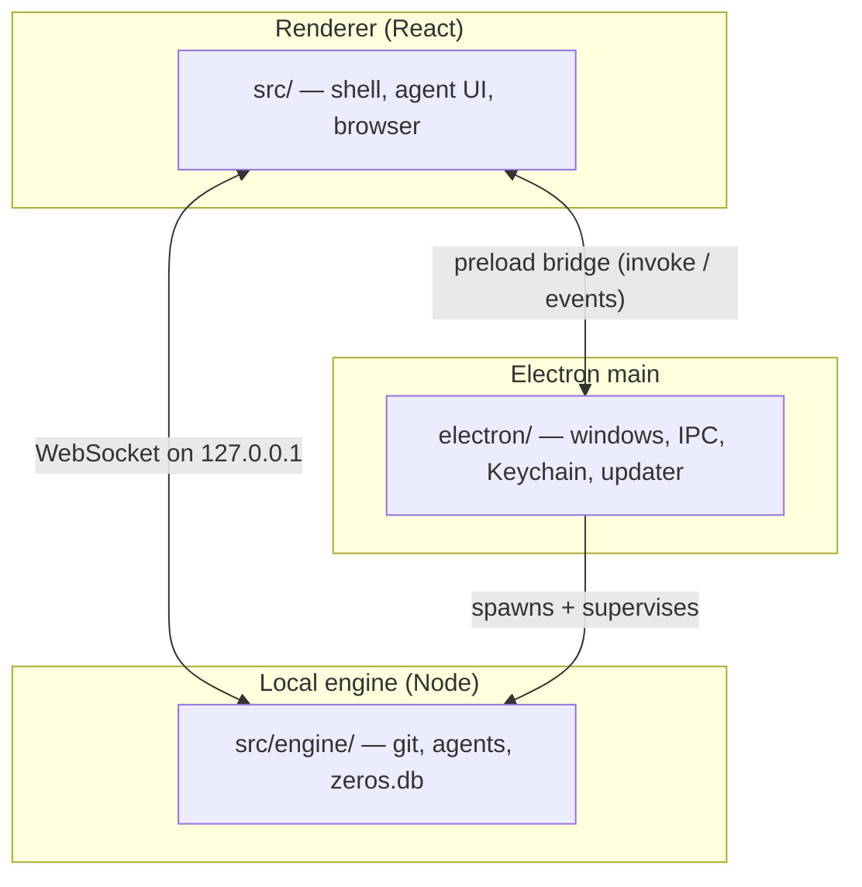

# Zeros

Zeros is a local-first macOS app for agent-led development on real codebases: your repo, your agent CLIs, your machine.

## What it does

- **Parallel workspaces.** Each workspace is a git worktree, so several agents can work on the same repo at once without stepping on each other.
- **Three agents, bring your own CLI.** Claude Code (`@anthropic-ai/claude-agent-sdk`), Codex (`codex app-server`) and Cursor (`@cursor/sdk`). Agent credentials stay on your machine; Zeros never hosts them.
- **Review before you merge.** A Changes / Review / Files / Browser tab row over the workspace, with diff review and pull-request metadata inline.
- **Embedded browser.** Preview the app you are building, pick an element to send it to the agent, and fork variants for side-by-side comparison.
- **Setup, Run and Terminal, docked.** A real `node-pty` terminal and per-workspace setup/run commands sit beneath the tab row.
- **Durable local state.** Chats and workspaces live in one engine-owned SQLite file, `zeros.db`, under the app-data directory (`~/Library/Application Support/com.zeros/`). Settings are TOML at `~/.zeros/settings.toml`. Each release channel gets its own pair.

## Sign-in is required

Zeros will not start without an account. The first screen hands off to a browser
for Auth0 sign-in via `app.zeros.build`, and that gate sits above the engine
bridge — so a fresh clone of this repository **cannot get past the login
screen** without access to the hosted auth tenant. The source is published to be
read, audited and learned from, not to be run standalone.

## Requirements

- macOS on Apple silicon (arm64 is the only shipping target: `dmg` + `zip`).
- Node.js >= 20 and pnpm 10.28.
- [Bun](https://bun.sh) — required by `electron:dev` and `electron:build`, which compile the engine sidecar with it.
- Xcode Command Line Tools, for the `node-gyp` rebuild of `better-sqlite3` against Electron.

## Getting started

```bash
pnpm install
pnpm electron:dev
```

Other commands:

```bash
pnpm electron:build   # package the macOS app with electron-builder
pnpm test:git         # engine git/worktree tests
pnpm lint             # ESLint over src/ and electron/
pnpm typecheck        # app, Electron and package projects
```

## Architecture

Three processes. The renderer draws, Electron main owns the native surface, and a
local Node engine sidecar owns git, SQLite, PTY and agent transport.



Releases ship on three auto-updating channels — alpha, beta and stable — served
from GitHub Releases.

## Telemetry

Zeros sends anonymous, metadata-only product analytics to PostHog — feature
usage, agent success/failure, performance timings. It is **on by default** and
can be turned off under Settings → Profile → Usage data. No code, prompts, file
paths, API keys or account identifiers are ever sent.

## Contributing

Zeros is source-available but **closed to outside contributions**. Pull requests
are closed unmerged. Read [CONTRIBUTING.md](CONTRIBUTING.md) for the reasoning,
and report vulnerabilities through [SECURITY.md](SECURITY.md).

## Licence

MIT — see [LICENSE](LICENSE).
