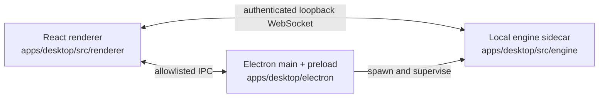

# Zeros

Zeros is an open-source, local-first macOS app for running coding agents against
real repositories. Each workspace is an isolated Git worktree with its own
conversation, terminal, preview, and review surface.

Zeros is licensed under MIT. The public source is suitable for review, learning,
and forks; the maintainer does not currently review external pull requests. See
[CONTRIBUTING.md](CONTRIBUTING.md) for the project policy.

## Capabilities

- **Parallel workspaces:** run independent agent tasks in separate worktrees
  without switching or stashing the primary checkout.
- **Local agent runtimes:** use Claude Code, Codex, or Cursor. Credentials are
  stored locally; prompts, code context, and model traffic go directly to the
  provider selected by the user rather than through Zeros.
- **Integrated review:** inspect all, staged, unstaged, and uncommitted changes,
  repository files, and pull-request metadata in the workbench.
- **Browser and design workflows:** preview a local app, select page context for
  an agent, and compare visual variants.
- **Workspace automation:** keep setup and run commands, terminal sessions, and
  agent conversations attached to each workspace.
- **Durable local state:** store workspaces and conversations in the local
  engine database and preferences in `~/.zeros/settings.toml`.

## Platform status

The shipping desktop target is macOS on Apple silicon (`dmg` and `zip`). Windows,
Linux, iOS, and Android applications are not present in this repository yet;
their app directories will be added when implementation begins.

Development of the desktop login flow depends on the hosted Zeros authentication
service. A clone can build and reach the sign-in surface, but a fully self-hosted
identity setup is not currently documented or supported.

## Requirements

- macOS on Apple silicon
- Node.js 22.18 or newer
- pnpm 10.28
- [Bun](https://bun.sh) for the packaged engine sidecar
- Xcode Command Line Tools for Electron native-module rebuilds

## Getting started

```bash
pnpm install
pnpm electron:dev
```

Useful checks:

```bash
pnpm typecheck       # desktop, Electron, and workspace packages
pnpm lint            # desktop renderer, engine, and Electron main
pnpm test:git        # local engine and renderer test suite
pnpm check:ui        # design-system and UI consistency rules
pnpm electron:build  # signed/notarized only when release credentials exist
```

Copy `.env.example` to `.env` only when a development integration needs an
override. `.env` is ignored. Never place server secrets in a `VITE_*` variable;
Vite values are shipped in the renderer bundle.

## Repository map

| Path                    | Purpose                                                 | Deployment/runtime             |
| ----------------------- | ------------------------------------------------------- | ------------------------------ |
| `apps/desktop/`         | Electron main/preload, local engine, and React renderer | macOS desktop app              |
| `apps/control-plane/`   | Authenticated API and database migrations               | Railway                        |
| `apps/web/`             | Auth handoff, web hub, and edge functions               | Cloudflare Pages               |
| `apps/marketing/`       | Public website source assembled by `apps/web`           | Cloudflare Pages               |
| `apps/feedback-worker/` | Authenticated feedback delivery                         | Cloudflare Workers             |
| `packages/protocol/`    | Shared messages, schemas, validation, and redaction     | Internal workspace package     |
| `catalogs/`             | Versioned provider and model metadata                   | Bundled data                   |
| `scripts/`              | Build, audit, release, and maintenance tooling          | Repository automation          |
| `styles/`               | Design tokens and cross-boundary style entrypoints      | Desktop renderer               |
| `third_party/`          | License texts for copied and adapted source             | Source-distribution compliance |

The root package owns desktop build orchestration and the root lockfile.
`apps/web` intentionally uses npm and an independent lockfile for its Cloudflare
build boundary; `apps/marketing` remains a pnpm workspace package and also keeps
the lockfile consumed by that deployment.

## Desktop architecture

The desktop product has three privilege-separated processes. The renderer owns
presentation, Electron owns native capabilities and the allowlisted preload
bridge, and the local engine owns Git, worktrees, agents, SQLite, and PTY
sessions.



See [REPOSITORY-ARCHITECTURE.md](REPOSITORY-ARCHITECTURE.md) for ownership,
dependency boundaries, deployment roots, and the migration report.

## Data, telemetry, and security

The engine database is stored below the macOS application-support directory;
release channels use isolated data. Agent credentials use their native provider
storage or the macOS credential store and are not hosted by Zeros. Agent inputs
and outputs are still processed under the selected provider's terms and privacy
policy.

Metadata-only product analytics can be disabled in Settings → Profile → Usage
data. The analytics contract excludes code, prompts, file paths, credentials,
and account identifiers. Please report vulnerabilities privately through
[SECURITY.md](SECURITY.md).

## License and third-party software

Zeros is available under the [MIT License](LICENSE). Bundled, generated, and
vendored dependencies retain their own licenses; material notices and provenance
are recorded in [THIRD-PARTY-NOTICES.md](THIRD-PARTY-NOTICES.md), with the full
locked inventory and texts in
[THIRD-PARTY-LICENSES.txt](THIRD-PARTY-LICENSES.txt).
