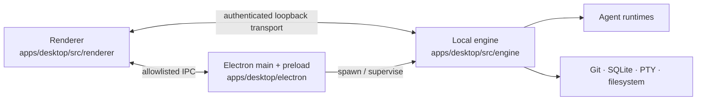

# Zeros repository architecture and migration report

This document describes the repository after the open-source structure audit,
the reasoning behind each boundary, the compatibility rules preserved during
the migration, and the actions a repository owner must complete before treating
the project as ready for public binary distribution.

## Executive summary

The repository is now organized by deployable product first, stable shared
contract second, and implementation layer third:

```text
zeros/
├── apps/
│   ├── desktop/          # Electron main/preload, local engine, React renderer
│   ├── control-plane/    # Railway API and Postgres migrations
│   ├── web/              # Cloudflare Pages hub and edge functions
│   ├── marketing/        # Public website source
│   └── feedback-worker/  # Cloudflare Worker
├── packages/
│   └── protocol/         # Shared transport contracts and redaction
├── catalogs/             # Versioned provider/model data and schemas
├── docs/                 # Durable public engineering guidance
├── scripts/              # Build, release, audit, smoke, and maintenance tools
├── styles/               # Tokens, global style boundary, design artifacts
├── third_party/          # License texts for copied and adapted source
├── build/                # Desktop packaging assets and entitlements
└── .github/              # Community, security, CI, and release automation
```

The migration changes ownership and naming, not product behavior. Desktop
process boundaries, wire values, persistent data, UI geometry, release channel
identity, and deployment boundaries remain intact.

The source tree is organized and documented for public review. Public binary
distribution is not yet release-ready: the bundled Claude and Cursor runtimes
have terms-governed, all-rights-reserved licenses, and one vendor-controlled
production dependency remains blocked on an upstream security update. Written
vendor authorization plus a clean production dependency audit (or removal of
the affected bundled integration) is required before release. See
[THIRD-PARTY-NOTICES.md](THIRD-PARTY-NOTICES.md) and the release blockers below.

## Architecture decisions

### Why `apps/desktop`, not `apps/mac`

Electron main, renderer, and engine code form one desktop product. Calling the
directory `mac` would make the current packaging target look like the product
boundary and force another reorganization when Windows or Linux support lands.
Platform-specific packaging remains in `build/`, Electron configuration, and
runtime branches. A future native iOS or Android product should become
`apps/ios` or `apps/android` only when it has real source, a build manifest, and
an owner.

### Why `apps/control-plane`, not `server` or `backend`

The Railway service is an authenticated product control plane: it owns identity,
teams, invitations, GitHub App coordination, audit records, rate limits, and
database migrations. `control-plane` communicates that responsibility more
precisely than a generic technology label. Its independent package, lockfile,
Dockerfile, migrations, and Railway manifest stay together as one deployment
unit.

### Why deploy configuration is colocated

Railway and Cloudflare configuration belongs beside the application it deploys:

- `apps/control-plane/railway.json` and `Dockerfile`
- `apps/web/functions/` and Cloudflare Pages build scripts
- `apps/feedback-worker/wrangler.jsonc`
- `electron-builder.yml` and `build/` for desktop releases

A top-level `deploy/` directory would add indirection without shared
infrastructure-as-code. Create one later only if multiple deployables genuinely
share Terraform, Pulumi, Helm, or another independently owned deployment layer.

### Why only one shared package exists

`packages/protocol` is shared because independently built renderer, Electron,
and engine process boundaries consume the same messages, schemas, crypto
helpers, system-instruction contracts, and redaction behavior. UI, database,
Git, and provider implementation details stay with the app that owns them.
Extracting hypothetical packages early makes ownership harder to understand and
creates accidental public APIs.

### Research basis

The decision was benchmarked against maintained public monorepos from large
platform teams and focused developer-tool projects. The recurring pattern is
consistent: deployables have explicit roots, shared packages have narrow
contracts, repository tooling stays visible, and future products are not
represented by empty placeholder folders. Competitive research names and
scratch comparisons were intentionally not retained in the public source tree.

## Application boundaries

| Directory              | Owns                                                                 | Build/deployment boundary                                             |
| ---------------------- | -------------------------------------------------------------------- | --------------------------------------------------------------------- |
| `apps/desktop`         | Native shell, local engine, renderer, desktop assets                 | Root pnpm lock, Vite, tsup, Electron Builder, macOS release workflows |
| `apps/control-plane`   | Hosted API, auth/authz, teams, invites, audit, rate limits, Postgres | Independent pnpm lock, Docker/Railway                                 |
| `apps/web`             | Browser auth handoff, launch hub, Cloudflare edge functions          | Independent npm lock, Cloudflare Pages                                |
| `apps/marketing`       | Public site, changelog, legal pages, download surface                | Root workspace for development; standalone lock for Pages             |
| `apps/feedback-worker` | Authenticated feedback forwarding                                    | pnpm workspace, Cloudflare Worker                                     |

Each app has a README describing its local boundary. A new app should be added
only when it can be built, tested, deployed, and owned independently.

## Desktop process model



- `electron/` owns windows, menus, updater, credential store, deep links,
  preload IPC, native integration, and engine supervision.
- `src/engine/` owns headless Git/worktree behavior, local workspace lifecycle,
  SQLite, PTY sessions, agent execution, settings, and transport.
- `src/renderer/` owns presentation and client state. It has no direct Node
  authority.

This separation is a security boundary, not only a directory preference.

## Renderer organization

```text
apps/desktop/src/renderer/
├── config/              # Build/runtime configuration
├── features/            # Product capabilities
│   ├── agent/           # Coding-agent sessions, composer, turns, renderers
│   ├── agent-extensions/# MCP and agent customization surfaces
│   ├── auth/
│   ├── browser/
│   ├── dashboard/
│   ├── design-workspace/# Design canvas, layers, lint, feature-owned state
│   ├── feedback/
│   ├── repositories/
│   ├── settings/
│   ├── team/
│   └── update/
├── harnesses/           # Non-production real-browser/visual test entries
├── platform/            # Bridge, browser APIs, observability adapters
├── shared/              # Feature-neutral UI, theme, and utilities
├── shell/               # Window chrome and cross-feature composition
│   ├── conversation/    # Conversation pane, chat/terminal decks
│   ├── dialogs/
│   ├── dispatcher/
│   ├── pr/
│   ├── terminal/
│   └── workbench/       # Files, changes, review, browser, run tabs
└── state/               # Cross-feature stores and persistence
```

Feature code primarily depends on `shared`, `platform`, and stable state
contracts. State also coordinates cross-feature lifecycle operations, while a
small number of feature views call narrow shell orchestration helpers. A static
import-graph audit found no cross-layer runtime cycles, so those integration
seams were preserved instead of being riskily redesigned during a
behavior-preserving move. Shared primitives must not import a product feature
or shell; a repository layout test enforces that rule, with one documented
code-textarea/editor exception awaiting a neutral editor extraction and focused
UI regression pass.

The large agent feature remains cohesive but uses semantic filenames and
dedicated `composer-editor/`, `renderers/`, and `__tests__/` subtrees. Further
subdivision should follow runtime ownership boundaries and be performed in a
separate behavior-tested change; arbitrary folder depth would not improve the
public API.

## Agent and design ownership

Engine agent code is explicit and provider-oriented:

```text
apps/desktop/src/engine/agents/
├── adapters/
│   ├── claude-sdk/
│   ├── claude/
│   ├── codex/
│   ├── cursor-sdk/
│   └── shared/
├── gateway/
├── registry.ts
└── runtime/probe/session helpers
```

The gateway owns the provider-neutral execution contract. Each adapter owns its
provider translation, process/runtime resolution, and tests. Generated Codex
protocol files have their own pinned provenance, LICENSE, NOTICE, and generation
check.

Design workspaces are separate at both relevant layers:

- `renderer/features/design-workspace/` owns design UI and feature state.
- `engine/design/` owns headless design services and tests.

They may reuse the provider-neutral agent session contract; design-specific UI
does not live in the coding workbench folder.

## Cloud workspaces and future clients

Cloud workspaces are not a shipping deployable in this snapshot. The current
non-production provider-validation harness remains isolated in
`scripts/cloud-workspace-validation/`; it is not imported by an app or included
in release packages. Its bridge probe imports the current shared protocol
version, image construction fails closed through native SQLite rebuilding, and
bearer-bearing state is owner-only and removed with successful sandbox cleanup.
The current product contract, target architecture, security model, and phased
delivery checklist live in `docs/cloud-workspace/`; the prior dated competitive
research pack is not authoritative.

When the product is implemented, use existing boundaries before creating new
ones:

- External workspace-control APIs belong in `apps/control-plane`.
- A browser management surface can grow in `apps/web` while it shares that
  deployment; split it only if it becomes independently built/deployed.
- Desktop remote transport remains in `apps/desktop/src/engine/transport` while
  it is desktop-owned.
- A separately deployed remote execution service should become a new app with
  its own manifest and deployment contract, not a miscellaneous `services/`
  bucket.
- Native mobile clients become `apps/ios` and `apps/android` when source exists.

This avoids both premature empty folders and a future migration caused by
calling the cross-platform desktop product `mac`.

## Integration ownership

GitHub is currently a vertical capability spanning the surfaces that actually
use it: Electron OAuth/native handling, engine Git operations, control-plane App
coordination, web callbacks, and renderer repository/settings UI. Those pieces
remain app-owned because their security and runtime contracts differ.

When GitLab, Bitbucket, Linear, Slack, or another integration is implemented:

1. Put provider implementation beside the app boundary that invokes it.
2. Put user-facing configuration under a semantic `features/integrations/`
   surface once more than one integration shares the UI.
3. Extract `packages/integration-contracts` only when at least two deployables
   consume the same stable schemas.
4. Never place server credentials or webhook verification in renderer/shared
   code.

## Migration map

| Previous location/name                      | Current location/name                                              | Reason                                               |
| ------------------------------------------- | ------------------------------------------------------------------ | ---------------------------------------------------- |
| `backend/`                                  | `apps/control-plane/`                                              | Precise deployable ownership                         |
| `website/web-app/`                          | `apps/web/`                                                        | Cloudflare Pages application boundary                |
| `website/marketing/`                        | `apps/marketing/`                                                  | Independent public-site source                       |
| `packages/feedback-intercom-webhook/`       | `apps/feedback-worker/`                                            | Deployable Worker, not a shared library              |
| `packages/core/`                            | `packages/protocol/`                                               | Describes the actual stable shared contract          |
| `electron/`                                 | `apps/desktop/electron/`                                           | Native code belongs to the desktop app               |
| `src/engine/`                               | `apps/desktop/src/engine/`                                         | Local sidecar belongs to the desktop app             |
| `src/zeros/` and renderer `src/shell/`      | `apps/desktop/src/renderer/{features,shell,state,platform,shared}` | Replaces brand/implementation buckets with ownership |
| root `harness-*.html`                       | `apps/desktop/src/renderer/harnesses/`                             | Test entries live beside harness source              |
| `check-backend-migrations` / `test:backend` | `check:control-plane-migrations` / `test:control-plane`            | Commands match the deployable name                   |

Coordinate-era source names were replaced with semantics. Examples include:

- `column2-workspace.tsx` → `conversation/conversation-pane.tsx`
- `column2-topbar.tsx` → `conversation/conversation-header.tsx`
- `column2-ratio.ts` → `conversation/pane-sizing.ts`
- `column3.tsx` → `workbench/workbench-pane.tsx`
- `column3-tab-manager.ts` → `workbench/tab-model.ts`
- `column3-tabs.tsx` → `workbench/tab-content.tsx`
- `changes-row1-tab.tsx` → `changes-surface.tsx`
- `context-row1-tab.tsx` → `context-surface.tsx`
- `review-row1-tab.tsx` → `review-surface.tsx`
- `row1-editor-state.ts` → `editor-state.ts`
- `customize-helpers.ts` → `customize-model.ts`
- `mcp-panel-helpers.ts` → `mcp-server-model.ts`
- `github-section-helpers.ts` → `github-connection-model.ts`
- `top-bar-helpers.ts` → `workspace-tabs.ts`
- `data-column3-tab` → `data-workbench-tab` (non-persisted DOM marker)
- web `util.ts` → `handoff-security.ts`

Tests moved with the code they specify. Import paths, tsconfig aliases, Vite and
tsup entries, Electron build paths, scripts, schemas, workflows, CODEOWNERS,
deployment scripts, and documentation were updated together. A repository
layout regression test guards the retired roots, development harness paths,
Vite watcher scope, and release environment boundaries.

The marketing app's four static routes no longer carry a general-purpose router
dependency. A small typed resolver plus `popstate` subscription preserves direct
loads, browser navigation, trailing slashes, modifier-click behavior, and the
existing not-found experience; focused route tests pin that contract.

The protocol-version guard recognizes the one-time package move without hiding
real wire changes. It compares comment-free parsed TypeScript syntax rather than
raw formatting; regression tests cover package-path normalization, comment edits
around template literals, and an actual optional-to-required field change.

## Compatibility deliberately retained

The following coordinate-era values are persisted state, DOM hooks, or CSS
contracts and therefore were not renamed cosmetically:

```text
--zeros-column-2-ratio
zeros.column2.ratio
zeros.column2.width
--zeros-design-column-2-ratio
zeros.design.column2.ratio
column-3-collapsed
column3-tabs-by-scope-v1
column3-tabs
column3-active-tab-id
data-zeros-column-3
```

Changing these would reset user layout/tabs or break selectors. New source
constants surrounding them use semantic names and tests document the legacy
wire value. The functional `.conductor` path and external-worktree detection
strings are also retained because they are interoperability contracts, not
provenance comments.

Released control-plane migrations also retain historical comments that name
the former `backend/` path and retired internal documents. The forward-only
guard requires released SQL files to remain byte-identical, including comments;
those strings are immutable history, not active source or documentation paths.

## Styling decision

The original `styles/globals.css` mixed every global concern in one 1,067-line
file. It is now a documented 22-line ordered entrypoint for focused modules:

```text
styles/global/
├── platform.css         # Electron/window/platform boundaries
├── animations.css       # Shared keyframes and reduced-motion behavior
├── runtime-content.css  # Generated Markdown/diff/terminal/vendor markup
├── document.css         # Document defaults and accessibility behavior
└── scrollbars.css       # Cross-surface scrollbar contract
```

The complete global boundary is 871 lines after dead selectors were removed.
The Settings type-scale override now lives beside its owner in
`renderer/features/settings/settings-page.css`. Component-owned styling remains
colocated through Tailwind utilities and focused local CSS (for example the
composer editor). A blind conversion to CSS modules would break selectors for
portals, runtime-generated HTML, Electron drag regions, CodeMirror/xterm, and
shared keyframes; those are valid global boundaries. New feature styling must
stay component-owned.

## Public repository, security, and legal audit

### Implemented safeguards

- Simplified `AGENTS.md` and `RULES.md` now define architecture, compatibility,
  UI, security, public-repository, and test invariants without depending on
  dated internal plans.
- `docs/` contains curated durable engineering contracts plus explicitly
  retained, actively owned agent and cloud-workspace roadmaps. Completed dated
  audits, private operational plans, and competitive research were removed.
- The tracked-file secret checker no longer embeds reversible maintainer or
  product identities and no longer blanket-exempts lockfiles, examples, or
  tool configuration. Gitleaks remains the commit-history CI scanner.
- `THIRD-PARTY-LICENSES.txt` deterministically inventories the locked root pnpm
  workspace, independent control-plane graph, exact standalone marketing graph,
  and Electron. The check hydrates both independent pnpm lockfiles first, so a
  convenient workspace resolution cannot mask different Cloudflare deployment
  bytes. Optional native packages are normalized to the macOS arm64 release
  target so Linux preflight and macOS release jobs generate identical contents.
  `check:licenses` fails on drift, missing packaged runtimes, new web
  dependencies that are not yet inventoried, and unreviewed license references.
- Exact Codex `LICENSE` and `NOTICE` files live beside generated protocol code
  and are preserved by regeneration.
- Adapted shadcn/ui and AI Elements source plus desktop and marketing agent-mark
  provenance are recorded in `THIRD-PARTY-NOTICES.md`; exact upstream license
  terms live under `third_party/`, and modified Apache-licensed files carry
  provenance headers. Marketing fallbacks use neutral text rather than
  duplicating undocumented vendor artwork.
- Repository and third-party license files are copied into every desktop binary
  release through Electron Builder and into the assembled Cloudflare Pages
  artifact.
- Release jobs use `alpha`, `beta`, and `production` environments. Alpha/Beta
  cannot be manually dispatched from arbitrary refs.
- Package manifests for the control plane, web hub, marketing site, worker, and
  protocol declare their license.
- Community files now include README, CONTRIBUTING, SUPPORT, SECURITY, a code of
  conduct, issue routing, PR guidance, CODEOWNERS, and an MIT license.
- Workflow action references are immutable-SHA pinned and checked by actionlint.

### Dependency security result

Compatible dependency updates and removal of an unnecessary marketing router
reduced the root production audit from 76 findings (10 low, 44 moderate, 22
high) to 12 findings (2 low, 7 moderate, 3 high). The independently resolved
production graphs for `apps/control-plane`, `apps/marketing`, and `apps/web`
now report no known vulnerabilities.

The remaining findings originate from one transitive networking dependency
pinned by a bundled agent SDK. No supported compatible upgrade is currently
available, and forcing an undeclared transitive major or patching a compiled
vendor bundle would create an untestable compatibility risk. Neither workaround
was applied. The exact advisory and reachability analysis belongs in the
project's private security process; `pnpm audit --prod` remains the reproducible
source of record. Treat the affected adapter as a binary-release blocker until
the vendor publishes a patched SDK, supplies a supported remediation, or the
adapter is excluded from distribution.

### Public metadata that cannot be fixed from a source-tree refactor

A read-only public GitHub API sweep on 2026-08-05 covered all 49 pull requests,
50 issue records, 46 default-branch commit records, 10 releases, 10 tags, 3
branches, 7 workflows, 379 workflow runs, 140 issue comments, 627 review
comments, 33 deployments, and the one visible deployment environment. The 65
commits reachable from every local ref were audited separately. No live token,
key, JWT, private key, credential, or local developer path was found in those
surfaces. The only credential-URL pattern match was a literal placeholder in an
automated security-review example, not an exposed secret.

All 10 releases are public and carry downloadable artifacts: eight stable
releases plus the mutable alpha and beta channels. Range-only ZIP directory
inspection verified that all eight stable ZIPs and the newest alpha/beta ZIPs
contain the Cursor SDK while omitting the repository `LICENSE.txt`,
`THIRD-PARTY-NOTICES.md`, and generated license bundle. Older channel artifacts
and DMG contents still require inspection. Existing downloads therefore need
the same runtime-license and trademark review as the next release; this
migration does not retroactively grant distribution rights.

Historical hosted metadata still names a development tool in PRs 3, 5, 8, 23,
40, 42, 43, and 44, the generated notes for release `v0.1.3`, six review
comments, and two deployment-bot comments. Most describe the real
`.conductor/` interoperability contract that remains in the product. Thirty-one
existing PR bodies also carry an agent-generation attribution badge: 1, 2, 3,
5, 6, 7, 8, 10, 11, 12, 13, 14, 15, 17, 18, 20, 21, 22, 23, 32, 36, 37, 38,
39, 41, 42, 45, 46, 47, 48, and 49; 469 review comments identify their review
automation provider. Those records are hosted GitHub metadata, not repository
files. Edit or delete them manually only if the public policy prohibits even
accurate interoperability and bot-attribution history.

The same historical terms exist in commit messages and deleted historical
files. Removing them requires a coordinated history rewrite of every public
branch/tag and invalidates existing clones, PR commit links, release provenance,
and signatures. The reachable commits identified by the audit are `3cc58a8`,
`716fd59`, `73029f4`, `7831119`, `c25991e`, and `c9f4b11`; no rewrite was
performed. Tag names themselves are neutral. The visible author address is the
project's `withso.com` address; configure a GitHub noreply address for future
commits if that is not intended to remain public.

The unauthenticated configuration view reports no repository rulesets. The
existing `zeros-control-plane / production` deployment environment has 33
recorded deployments, no protection rules, and no deployment-branch policy.
Branch protection, Actions permissions, security alerts, secret scanning, and
Pages settings require authenticated repository authority and could not be
verified. GitHub's community-profile score for the current `origin/main` is 87%;
the staged code of conduct, issue routing, and other migration files will not be
reflected there until this commit reaches the default branch.

## Owner actions before public release

These actions require account authority, vendor coordination, or legal choices
and therefore cannot be completed safely by a source-tree change.

### 1. Resolve the vendor SDK security blocker

- Do not waive a failing root `pnpm audit --prod --audit-level high`. Keep the
  advisory and reachability details in the private security process.
- Ask the affected SDK publisher for a fully patched release or a supported
  remediation that can be regression-tested.
- If no patched release is available before public distribution, exclude the
  Cursor adapter/runtime from the binary rather than forcing incompatible
  transitive majors or suppressing the advisories.
- Once the chain is resolved, make `pnpm audit --prod --audit-level high` a
  required preflight check. Do not add a blanket audit ignore merely to turn CI
  green.

### 2. Resolve binary redistribution and authentication terms

- Audit every currently downloadable stable, alpha, and beta binary. If an
  artifact contains a runtime whose redistribution has not been authorized,
  pause that download pending counsel/vendor guidance or replace it with a
  compliant build. Do not assume an older public artifact is covered by the new
  notice bundle.
- Obtain written permission from Anthropic for the shipped SDK/platform runtime.
  Anthropic's current [authentication guidance](https://code.claude.com/docs/en/legal-and-compliance)
  says third-party products using the Agent SDK should use API keys and may not
  offer Claude.ai subscription login on users' behalf. Remove that flow or
  obtain explicit written authorization before release.
- Obtain written permission from Anysphere for the Cursor SDK/platform runtime
  and intended authentication flow, or stop bundling it. Cursor's current
  [service terms](https://cursor.com/terms-of-service) grant only limited use
  rights and state that no implied licenses are granted.
- Have qualified counsel review `THIRD-PARTY-NOTICES.md`, the generated bundle,
  font/assets, trademarks, and the final DMG contents.
- Confirm that marketing use of each integration mark complies with the current
  vendor brand rules documented in `apps/marketing/public/agents/README.md`, or
  replace the mark with plain product text.
- Replace `Copyright (c) 2026 Zeros` in `LICENSE` with the correct legal person
  or entity if “Zeros” is not the rights-holding entity.
- Complete a counsel review of marketing Terms and Privacy content: legal entity,
  controller/contact, jurisdiction, retention, subprocessors, user rights,
  transfer mechanism, and effective dates.

### 3. Configure GitHub protected environments

Create environments named exactly `alpha`, `beta`, and `production`:

- Restrict `alpha` deployments to `main`.
- Restrict `beta` deployments to `release/**`.
- Restrict `production` to `main` and `release/**`, with required reviewers.
- Move `CSC_LINK`, `CSC_KEY_PASSWORD`, Apple notarization credentials, production
  `VITE_*` values, and any release-only credentials into the narrowest applicable
  environment. Delete repository-level duplicates after a successful dry run.
- Protect `main`, `release/**`, and version tags; require preflight checks,
  review/CODEOWNERS as appropriate, and prevent force pushes/deletions.
- The public API currently reports zero repository rulesets. Create and test
  the rulesets above rather than assuming legacy branch protection covers them.
- Reconcile the existing `zeros-control-plane / production` environment with
  Railway before changing or removing it. It currently has no protection rules
  or branch policy; preserve its 33-deployment audit trail and do not delete it
  until the moved control-plane deployment is verified.
- Refresh required-check rules after merge so they reference the renamed
  `control plane` preflight job rather than the former backend label.
- Set the default Actions token to read-only and require approval for all first-
  time/external contributors. Leave “Allow GitHub Actions to create and approve
  pull requests” disabled.

### 4. Finish repository administration

- Create the `@withso/zeros-maintainers` team used by CODEOWNERS, or replace it
  with the actual owner/team.
- Enable the dependency graph, Dependabot security alerts, secret scanning,
  push protection, and CodeQL default/setup visibility for the public repo;
  install/authorize Renovate so the checked-in allowlist and SHA-pinned Actions
  policy actually run.
- Enable GitHub Private Vulnerability Reporting and verify the URL in
  `SECURITY.md` from a logged-out browser.
- Decide whether to edit the historical PR/release metadata listed above. Do not
  rewrite Git history merely for wording; do it only under an explicit migration
  plan with contributor and release coordination.
- Delete the public `cursor/setup-dev-environment` branch if it is obsolete.
  Cursor is a real integration, but an abandoned automation branch adds noise;
  confirm that no active deployment or PR consumes it first.
- Confirm the unified Cloudflare Pages project root is `apps/web`, the feedback
  Worker is deployed from `apps/feedback-worker`, and the Railway service root
  is `apps/control-plane` before the first deployment from this tree. The Pages
  build installs `apps/marketing` as an input; it is not a second Pages root.
- Authenticate the GitHub CLI and provide `CLOUDFLARE_ACCOUNT_ID` plus a valid
  `CLOUDFLARE_API_TOKEN`, then run `pnpm check:web-deploy` until both the build
  and live commit signals verify the expected `origin/main` SHA.

### 5. Platform verification

- On Apple silicon macOS, run the signed Alpha/Beta packaging path,
  `pnpm smoke:engine`, and `pnpm smoke:packaged-pty`.
- Inspect the produced `.app`/DMG for `LICENSE.txt`,
  `THIRD-PARTY-NOTICES.md`, and `THIRD-PARTY-LICENSES.txt`.
- Exercise login for each authorized provider, workspace create/archive/restore,
  Git changes/review, terminal PTY, browser/design workspace, update feed, and
  deep links on an existing user profile as well as a fresh profile.
- Confirm the Railway and Cloudflare dashboards use the moved application roots
  and rebuild successfully before deleting any legacy deployment configuration.

## Post-migration documentation correction

Repository-owner review on 2026-08-05 identified one deleted document that was
still an active product backlog rather than completed historical research. The
agent-capability roadmap was restored under its original filename, updated to
the current `apps/desktop` and `packages/protocol` paths, indexed from
`docs/README.md`, and protected by the repository-layout regression test.

The former cloud-workspace research pack was not restored verbatim. Its durable
requirements were rewritten as current product, architecture, data, security,
operations, enterprise, roadmap, and engineering-reference documents under
`docs/cloud-workspace/`. The dated vendor comparisons, generated HTML copies,
reverse-engineering notes, and obsolete repository paths remain historical and
non-authoritative.

Existing worktrees that installed dependencies before `packages/core` moved to
`packages/protocol` must rerun `pnpm install --frozen-lockfile`; otherwise their
stale `node_modules/@zeros/core` link cannot resolve the new protocol imports.
The shared workspace setup script already performs that install for new
workspaces.

## Verification record

The final Linux verification pass produced the following results:

| Verification                                                                                                                                                                      | Result                                                                                                                                            |
| --------------------------------------------------------------------------------------------------------------------------------------------------------------------------------- | ------------------------------------------------------------------------------------------------------------------------------------------------- |
| Root TypeScript, ESLint, and UI consistency                                                                                                                                       | Passed; zero lint errors and zero warnings                                                                                                        |
| Desktop/unit/integration suite (`pnpm test:git`)                                                                                                                                  | Passed: 453 files, 5,044 tests                                                                                                                    |
| Real-browser interaction smoke                                                                                                                                                    | Passed: every composer, design, diff, editor, tree, focus, and GitHub interaction assertion                                                       |
| Adapter fixture suite                                                                                                                                                             | Passed                                                                                                                                            |
| Desktop renderer production build                                                                                                                                                 | Passed; 3,305 modules transformed                                                                                                                 |
| Control-plane tests against ephemeral PostgreSQL 16 + `citext`                                                                                                                    | Passed: 7 files, 83 tests; no skips                                                                                                               |
| Control-plane typecheck and production build                                                                                                                                      | Passed                                                                                                                                            |
| Marketing route tests                                                                                                                                                             | Passed: 9 tests; also included in the root suite                                                                                                  |
| Marketing typecheck and production build                                                                                                                                          | Passed                                                                                                                                            |
| Web hub tests, typecheck, and assembled production build                                                                                                                          | Passed: 23 tests across 9 suites; all three legal files matched the repository sources byte-for-byte                                              |
| Feedback Worker typecheck                                                                                                                                                         | Passed                                                                                                                                            |
| Preload, Cursor ASAR, desktop migrations, control-plane migrations, protocol, Vite env, Electron hardening, runtime pin, packaging, deep-link, workflow, and model-catalog guards | Passed; runtime pin check emitted one documented Claude wrapper/CLI freshness warning                                                             |
| Third-party license determinism                                                                                                                                                   | Passed: 580 package/version records across root, control-plane, standalone marketing, and target-native graphs; 259 unique documents              |
| Repository-specific secret scan                                                                                                                                                   | Passed: all 2,617 intended tracked files                                                                                                          |
| Gitleaks pre-migration history scan                                                                                                                                               | Passed: 65 reachable commits, approximately 443.62 MB                                                                                             |
| Gitleaks staged migration scan                                                                                                                                                    | Passed: the complete proposed migration diff, approximately 1.47 MB                                                                               |
| Standalone production dependency audits                                                                                                                                           | Control plane, marketing, and web: no known vulnerabilities                                                                                       |
| Root production dependency audit                                                                                                                                                  | Blocked: the 12-finding vendor SDK chain described above                                                                                          |
| Clean-room reconstruction and frozen installs                                                                                                                                     | Passed: 2,617 intended files matched by path and SHA-256; root, control-plane, marketing, and web installs produced no source drift               |
| Filesystem portability and local Markdown links                                                                                                                                   | Passed: no case-fold, Unicode-normalization, Windows-name, overlong-path, or broken-link findings                                                 |
| `git diff --check` and generated settings schemas                                                                                                                                 | Passed; generated schemas were byte-identical                                                                                                     |
| Public GitHub metadata audit                                                                                                                                                      | Passed read-only content sweep; no credential exposure found. Zero rulesets and an unprotected legacy deployment environment require owner action |
| Live GitHub/Cloudflare deployment verification                                                                                                                                    | Unverified: GitHub CLI API output was unusable and `CLOUDFLARE_ACCOUNT_ID` was unavailable in the sandbox                                         |
| Signed/notarized desktop package, engine smoke, packaged PTY smoke                                                                                                                | Not run: requires Apple silicon macOS and release credentials                                                                                     |

Build-size and dynamic/static import messages from Vite remain advisory; no
build failed. A failed, skipped, platform-bound, credential-bound, or
vendor-blocked command is not represented here as a pass.

The documentation correction separately passed 32 focused layout, remote
transport, and validation-harness tests; the complete 453-file, 5,046-test
baseline; TypeScript; ESLint; UI consistency; Prettier; a 12-file local-link
check; `git diff --check`; and a secret scan of the resulting 2,627 tracked
files.
