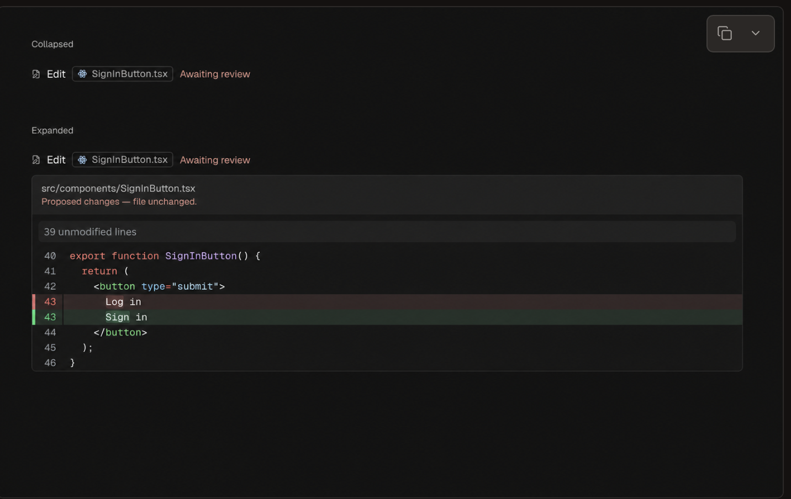

# Todo

1. [ ] **Preserve Claude's native held edits.** When an Edit/Write result reports
   `staged: true`, retain the proposed diff and show **“Proposed changes — not
   applied”** in the existing tool card. The file is unchanged; exclude the
   proposal from applied-edit counts and file baselines. Preserve Claude's native
   tool choices and approval flow. Deferred for later implementation.

   Reference mockup supplied for this task; its earlier “Awaiting review” label
   should use the wording above unless Claude provides an actionable review
   request. This is not Git staging.

   
