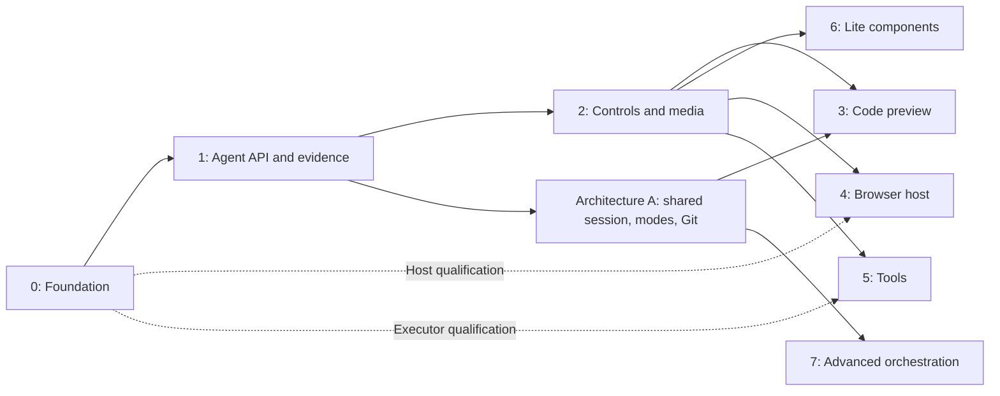

# Design mode: status report and roadmap

**Status:** Active engineering roadmap. Initial audit 2026-09-15 against
base `96eef7f`; architecture revised 2026-09-17 for one shared Code/Design
agent session. This revision changes the architecture through the core agent
workflow, not the scope of Phase 2, Phase 3, or later feature phases.

**Implemented foundation:** Phase 0 ownership seams and host experiments, plus
Phase 1 native-session semantic tools, compact review, durable receipts,
source-bound results, and desktop/cloud capture are in the working tree.
Autosave is silent; Cmd/Ctrl+S saves/validates; Stage and Commit are explicit.
The [Phase 0–1 report](design-phase-0-1-report.md) records historical evidence;
a real deployed-cloud qualification remains open. No merge or release is implied.

**Accepted v1:** one conversation and provider execution, composer Code/Design
modes, and a Design workbench tab. Code can inspect Design; only Design mode
receives Design API editing authority. User-selected or explicitly authorized
agent switches inject instructions before the next continuation. There is no
Code-write restriction, specialist session, or mode-selected execution sandbox.
Both modes may run authorized managed Git operations over Code and Design.
Design mode uses normal provider Read/Write/Edit/patch/shell tools for HTML, CSS,
assets and `canvas.json`; Design API inspection and semantic edits are optional.
`design.toml` v2 registers the directory; `canvas.json` v1 owns the single-page
scene. This is an HTML/CSS v1 enhancement, not Phase 3 implementation. See the
[native authoring contract](design-native-authoring.md).

**Cleanup status:** the unused private authored backend and its publication,
reconciliation, integration, recovery UI, and separate-session admission have
been removed. Keep checkout-backed `DesignDraftStore`, CAS/journals, review,
capture, and scoped tools. Experimental private-store ownership markers remain
protected for recovery; no user data is automatically migrated or deleted.
The [shared-session v1 plan](design-v1-implementation-plan.md) replaces the
A0–A9 private-store plan. The Design tab, shared conversation layout, directory
lifecycle, mixed managed Git, read-only frame-context contract, and conflict
pause/retry/cancel are implemented. Minimal composer mode, mode-gated writes,
ordinary Design tool rows and direct canvas editing are implemented. Frame/node
context delivery, new proposal review, additional mixed Git integration and
semantic conflict resolution are deferred after v1.

> **Retention:** Keep this document until every phase below is shipped,
> rejected, or moved to another owned roadmap. Update phase status and code
> anchors whenever the implementation changes. `docs/design-workspace.md`
> remains the compatibility contract for what is implemented; this document
> describes what is not yet implemented and the order in which it will be.

## 0. Audit verdict and priorities

Build a workspace where a person or agent can inspect a product, propose a
bounded change, test it, and preserve the result with its source and evidence.
That remains useful across model vendors and agent frameworks. More canvas
features alone do not establish that workflow.

| Priority               | Finding and evidence                                                                                                                                                                                          | Required change                                                                                                                               |
| ---------------------- | ------------------------------------------------------------------------------------------------------------------------------------------------------------------------------------------------------------- | --------------------------------------------------------------------------------------------------------------------------------------------- |
| Before new formats     | `document-storage.ts:readCanvas` accepts only `frame`/`text` and HTML frame references; Foundation migration rejects versions above 1. Extension preservation does not make old clients understand new kinds. | Separate document, Foundation, transport, and runtime versions; add upgrade/downgrade fixtures and a tested unsupported-document path (§2.3). |
| Before web frames      | `use-iframe-webview.ts` mounts a DOM iframe; `iframe-headers.ts` operates on the owning window's session. A DOM iframe has no independent Electron `partition`.                                               | Qualify a browser host before promising session isolation, arbitrary URLs, or desktop/web parity (§2.2).                                      |
| Before agent writes    | `history.ts:undo` checks the top entry's actor; capability instances keep their own API/history state. This is not selective undo across interleaved actors.                                                  | Preserve current tip-only semantics; review proposals at an exact revision and use checked compensating transactions for older edits (§2.6).  |
| Before script tools    | An iframe sandbox controls authority; it does not provide a CPU quota. A host animation scheduler cannot preempt an arbitrary module or GPU workload.                                                         | Start with restricted, host-driven tools; qualify an independently stoppable execution boundary before general scripts (§2.2, §2.5).          |
| Before cloud claims    | Cloud dev servers deliver JavaScript that still executes in the client's browser. The cloud architecture also describes product and platform qualification still to do.                                       | Account for local script/layout/GPU cost and remote build/render cost separately; make cloud completion an explicit gate (§2.4).              |
| Before scale claims    | Runtime counts omit decoded media, GPU resources, incoming frame buffers, remote queues, and byte copies. The old mixed fixture needs 25 weighted slots against a ceiling of 12.                              | Specify admission, aggregate budgets, saturation behavior, and measured acceptance criteria (§2.5).                                           |
| Before autonomous runs | The original API had bounded in-memory receipts. Phase 1 now adds a bounded durable request ledger; replicated cloud history still needs qualification.                                                       | Define retry/restart semantics, authority fencing, cancellation, and bounded job admission (§2.6).                                            |
| Product priority       | Controls and source-backed evidence were late; all detected frameworks and lossless-looking snapshot conversion were implied too early.                                                                       | Ship an existing-frame agent loop first, then controls and one code adapter; record conversion limits and capability support (§3–§4).         |

The highest-value missing features are reviewable proposals, reproducible
scenarios, cheap semantic inspection, and reliable resume/cancel behavior.
Advanced visual effects follow those foundations. Keep lite authored
components for reuse without a running application; use code components as
the canonical production implementation when one exists.

## 1. Where Design mode stands

### 1.1 Implemented

| Layer              | Anchor                                                                      | Size                                                                       | Provides                                                                                                                                                                                                                                                                                                                                                                                  |
| ------------------ | --------------------------------------------------------------------------- | -------------------------------------------------------------------------- | ----------------------------------------------------------------------------------------------------------------------------------------------------------------------------------------------------------------------------------------------------------------------------------------------------------------------------------------------------------------------------------------- |
| Foundation core    | `packages/design-core`                                                      | ~2.9k lines                                                                | Schema v1: stable node IDs, 28 typed operations, transactions with exact-revision CAS, bounded history, geometry, and the parameter / variant / component schemas                                                                                                                                                                                                                         |
| Web source adapter | `packages/design-web`                                                       | ~7.9k lines                                                                | HTML/CSS mutation with provenance, 96-bit revision, `DesignApi` (open, read source/foundation/projection/provenance, apply, undo, redo, render, local history), headless Playwright renderer                                                                                                                                                                                              |
| Runtime protocol   | `packages/protocol/src/design-runtime.ts`                                   | ~3.6k lines                                                                | Sandboxed iframe protocol v2: 18 methods (snapshot, hit test, node details, matched styles, style/layout/geometry/text/motion previews, commit, restore generation, capture), source-pinned, cancellable, typed errors                                                                                                                                                                    |
| Engine             | `apps/desktop/src/engine/design`                                            | Source, storage, transaction, lifecycle, render and review owners          | Directory discovery and `design.toml`, transaction journal and crash recovery, `DesignDraftStore`, frame lifecycle, raster asset insertion, screenshot registry, lint and runtime audits, `zd-*` component expansion, Design-scoped review and mixed workspace Git lanes, scoped agent capability / MCP transport; retired separate-session requests rejected                                                                                            |
| Engine routes      | `apps/desktop/src/engine/design/routes.ts`                                  | Focused dispatcher behind workspace policy                                 | Bridge routes for every Design read and mutation                                                                                                                                                                                                                                                                                                                                          |
| Renderer           | `apps/desktop/src/renderer/features/design-workspace`                       | Canvas, overlays, frame hosting, camera, text, inspector and review owners | Camera, frames as sandboxed iframes over `zeros-design://`, single and multi selection, resize / rotate / origin handles, constraint guides, measurements, inline text, virtualized Layers, Assets, style inspector, auto layout, layout drag and cross-frame transfer, theme and token editor, motion timeline, lint summary, deep-zoom tiles, bounded live frames, background work lane |
| Electron           | `apps/desktop/electron/design-protocol.ts`, `ipc/commands/design-export.ts` | —                                                                          | Capability-scoped custom protocol, PNG export                                                                                                                                                                                                                                                                                                                                             |
| Verification       | Design unit suites and `scripts/ui-smoke-design-*.mjs`                      | —                                                                          | Prior survey reported 8 files / 102 core/web tests and 68 files / 630 renderer/engine/protocol tests passing. These are selected-suite results, not full-baseline, browser, cloud, or performance qualification; see §5 for this audit's evidence.                                                                                                                                        |

### 1.2 In progress on this branch (uncommitted)

Auto layout controls, layout drag gesture (sibling reorder and reparent),
`design.node.transfer` between frames, history preview, and the background
work lane are present in the supplied dirty tree. File counts and line totals
in the original survey are approximate snapshots. The implementation pass saved
a baseline of that work and extracted small ownership seams while preserving it.
The combined working tree still needs review and landing; no unrelated layout
changes were staged or committed by the implementation pass.

### 1.3 Not implemented

- **Surface kinds.** `DesignFrameSummary.kind` is `"frame" | "text"`
  (`engine/design/document-model.ts`). There is no media, live web, code, or tool
  surface.
- **Media.** Assets accept raster png, jpg/jpeg, gif, webp, and avif. No SVG, video, audio,
  or font import; no OS drag-and-drop, paste, or download interception.
- **Live web on the Design canvas.** The workbench Browser tab already has an
  iframe browser (`features/browser/use-iframe-webview.ts`), frame-header
  stripping (`electron/iframe-headers.ts`), a main-world element picker
  (`electron/iframe-picker-script.ts`), and static forks of page regions on a
  zoomable strip (`features/browser/variant-*.ts`). None of it is connected to
  the Design document.
- **Code components and pages.** `engine/framework-detector.ts`,
  `engine/run/run-manager.ts`, and localhost / cloud preview forwarding exist;
  there is no preview runtime protocol and no code surface.
- **Hosted Design qualification.** Native Code-session MCP, human proposal
  review, result bundles, and desktop/cloud capture implementations now exist.
  A deployed cloud engine must still demonstrate authenticated admission,
  disconnect/reconnect, and durable state retention. Repository MCP generation
  remains disabled. Separate Design-agent sessions are retired; composer mode and Design write
  gating are implemented. Context pills and automatic conflict resolution are deferred.
  The shared Design tab and managed Git foundation are implemented.
- **Parameters / controls UI.** The schema already models typed parameters
  with bounds, steps, units, options, visibility rules, and seven binding kinds
  (`css-custom-property`, `css-declaration`, `component-prop`,
  `svg-attribute`, `shader-uniform`, `material-input`, `transform`). No panel
  renders them. `design-web/adapter.ts:applyParameterBindings` already executes
  CSS variables, inline/rule declarations, component props, and SVG attributes
  as source mutations. Other bindings/scopes can reject as unsupported. A
  general live Controls preview path is still missing.
- **Components UI.** Definitions, instances, props, slots, and `zd-*`
  expansion exist; there is no management surface.
- **Tools, shaders, scripts.** None. The frame sandbox contract blocks
  authored scripts by design.

### 1.4 Structural risks

1. The original `design-workspace.tsx` was 11.5k lines. Concrete owners are now
   extracted, but `DesignCanvas` remains substantial. New surface kinds should
   meet the documented lifecycle/host boundary rather than add canvas branches.
2. `engine/design/document.ts` now delegates storage, transactions, lifecycle,
   assets and render preparation while preserving its exports. Keep that facade
   from accumulating unrelated host and persistence responsibilities again.
3. Design dispatch now lives in `engine/design/routes.ts`; workspace lifecycle,
   cloud policy and directory leases remain outside it in the workspace service.
4. Foundation v1, Design API v1, and runtime protocol v2 are frozen. New kinds
   and bindings need an explicit additive versioning rule before any new
   persisted field appears.

## 2. Target architecture

### 2.1 One canvas, several surface kinds, one kernel

```text
Authoritative engine: source + transactions + revisions + history + artifacts
                                  │
                   validated surface descriptors
                                  │
Client: canvas + selection + host-owned adapter registry + resource admission
           │        │        │        │        │        │
         frame     text     media     web      code     tool
         styles    text     fit/play  browser  props    controls
```

Every surface shares stable identity, geometry, z-order, selection, lifecycle,
and resource admission. A component definition/instance is a reuse relationship
inside authored content or a code reference, not a seventh top-level surface
kind. Only authored content accepts supported `node.*` operations. Instance
editing respects provenance and existing override limits. The host validates
capabilities on every mutation; hiding an inspector is not authorization.

A surface adapter implements mount, dispose, suspend, resume, measure, and
optional capture, hit testing, and parameter preview. It declares whether it is
editable, interactive, capturable, checkpointable, or deterministically
renderable. A host-owned registry supplies adapters; document data cannot
import arbitrary host code. Establish this seam using frame/text first.

Model lifecycle explicitly: poster → starting → live → suspending → poster,
with failed and disposed states. Coalesce wake requests, cancel obsolete work,
and discard late mount/capture results after deletion, navigation, or generation
changes. Disposal releases ports, observers, decoders, blob URLs, workers, and
contexts. Missing/stale posters show their status and cannot impersonate current
renders. Hidden surfaces follow the repository's inert-surface rules.

### 2.2 Trust classes and platform feasibility

| Class            | Kinds                           | Code and network                                                            | Execution                                                      |
| ---------------- | ------------------------------- | --------------------------------------------------------------------------- | -------------------------------------------------------------- |
| Authored         | frame, text, authored instances | Only the injected runtime; no network                                       | Local sandboxed iframe over the existing resource transport    |
| Media            | media                           | No authored script; scoped asset reads                                      | Local image/video decoder or poster                            |
| Live web         | web                             | Page scripts and browsing network; no Design authority                      | Qualified browser host, local initially                        |
| Workspace code   | code                            | Application scripts; admitted preview origin and declared application needs | Build/server beside worktree; client JS, layout, and GPU local |
| Generated visual | tool                            | Restricted tool program initially; no network, scoped assets                | Host-controlled rendering with a separately stoppable executor |

A web frame never sees a `zeros-design://` capability or preload. A code preview
never receives the Design bearer. A tool receives only its declared asset
handles and parameter messages. Bind private ports to the exact owner and
runtime generation, validate all payloads, and revoke them on navigation.
Imported HTML, page content, and tool output are untrusted data for agents too;
they cannot grant themselves tools, credentials, or broader scope.

**Browser feasibility gate.** The existing DOM iframe helps reuse navigation
state and selected development previews. Independent Electron sessions are
configured on `webContents` through `webPreferences`, not on a DOM iframe.
Separately hosted contents introduce clipping, pan/zoom, overlays, input,
accessibility, capture, and teardown work. Do not assume Chromium creates one
independently killable process per iframe. A session partition isolates session
state; it is not a CPU or memory quota.
[Electron session settings](https://www.electronjs.org/docs/latest/api/structures/web-preferences),
[WebContentsView](https://www.electronjs.org/docs/latest/api/web-contents-view).

Phase 0 compares a bounded separate browser host (with posters or a focused
interaction view) against a deliberately narrower embedded-preview feature.
Record the session owner, storage lifetime, cookie clearing, popup/permission
behavior, download attribution, crash recovery, and resource cost. Scope any
framing-header override to the admitted preview; do not broaden the current
policy as a shortcut. The existing picker accepts loopback and explicitly
trusted preview origins; arbitrary-site extraction is new work.

Web clients cannot use Electron header overrides or session APIs. Sites can
refuse embedding, login can fail under third-party storage restrictions, and
cross-origin extraction/capture may be unavailable. Provide supported-embed,
snapshot, or external-browser behavior. A remote browser is a separately
budgeted future backend. [HTML iframe contract](https://html.spec.whatwg.org/multipage/iframe-embed-object.html).

**Tool availability gate.** Sandbox/CSP restrictions do not guarantee CPU,
memory, or GPU isolation. Start with host-owned rendering and a restricted tool
contract; CPU work that can block belongs in a terminable worker or qualified
process. Do not run arbitrary tool modules on the host UI thread. A worker
does not itself impose a hard heap quota. Use bounded program/data models or
qualified process limits as appropriate, plus asset/network restrictions; a
long GPU command is not preempted by a JavaScript timeout. General DOM-script tools need
separate crash/watchdog qualification and can remain deferred.
[HTML execution model](https://html.spec.whatwg.org/multipage/webappapis.html).

### 2.3 Persistence and compatibility

- Version Foundation v1, Design API v1, DOM runtime v2, registration v2 and
  authored canvas.json v1 independently; internal/legacy canvas v3 remains readable. Choose a new canvas version before persisting non-HTML
  surfaces. Negotiate versions and capabilities in engine and client; a new
  IPC schema alone is insufficient.
- Decide the surface envelope in Phase 0: stable surface ID, kind, source
  reference, geometry, and a versioned kind-specific descriptor. Preserve
  existing file-keyed identity with an explicit mapping; do not cosmetically
  rename `frame:<file>`, persisted keys, or resource routes. Include surface
  metadata, parameter state, and relevant source dependencies in revision
  checks and crash-safe transactions.
- `document-storage.ts:readCanvas` currently rejects unknown kinds and non-HTML frame
  keys. It preserves some extensions; that does not provide future
  compatibility. A new reader may show an inert unknown-kind poster only after
  validating a known envelope. Existing readers may reject the entire newer
  document. Show an upgrade/read-only outcome and never rewrite it as HTML.
- Foundation migration currently accepts 0/1, not a future v2. Add explicit
  migration and recovery fixtures with the first new binding. Keep tools in
  the surface descriptor unless a demonstrated need requires a Foundation
  collection. Schema support is distinct from executing a binding.
- Public source includes declared tool source/dependencies under the Design
  root, media under `assets/`, and stable code references relative to a
  registered repository/package root. Private session state includes cookies,
  absolute paths, preview tokens, signed URLs, and temporary captures. It
  does not belong in committed surface descriptors.
- Reads never migrate. Explicit Design API upgrades journal affected files,
  preserve supported extensions, retain recovery information, and keep
  `design.toml`, `canvas.json` and `rules.md` in the normal Design Git lane. Test clone,
  directory rename, branch switch, newer-file/older-client, and interrupted
  migration paths. Unsupported tools/dependencies open inertly.

### 2.4 Where things run: local Mac and cloud sandbox

- The transaction kernel and `DesignDraftStore` run in the engine owning the
  worktree. Source authority stays next to Git; a cloud workspace does not
  gain a second writable document store on the Mac.
- The client owns camera, overlays, live runtimes, and interactive previews.
  It does not need direct worktree filesystem access. Build/server code runs
  beside the worktree; downloaded application JS, layout, animation, video
  decoding, and GPU work run on the client.
- Code agents and headless jobs execute in the workspace environment. The
  Design MCP endpoint lives there too. Track local rendering cost, remote
  compute, and asset/preview transfer separately; cloud placement does not
  make a complex browser preview cheap.
- Bind commands, events, caches, and captures to workspace ID, Design directory
  ID, authority epoch/execution generation, surface ID, and relevant source
  revision. Navigation/hot reload also changes the runtime generation. Reject
  retired-engine responses; reconnect with a bounded event cursor or an
  authoritative snapshot when the cursor expired.
- Share dev servers by workspace/package/configuration with reference-counted
  consumers. Hibernating one surface cannot kill a server used by a terminal
  or sibling preview. Startup, restart, logs, watchers, idle shutdown, and
  headless queues each need caps and cancellation.
- Existing bridge and preview brokers are foundations, not completed cloud
  product qualification. Each adapter needs local/cloud end-to-end evidence
  for sleep, reconnect, grant renewal, and execution replacement. Keep native
  browser/download/capture functions behind a platform boundary; reuse core
  schemas and semantic commands in the future web client.
- A receive-only replica cannot support offline writes to the cloud workspace.
  Retain confirmed views while disconnected; resume authoritative editing on
  reconnect or create an explicitly independent local fork. Offline proposal
  storage needs its own future conflict contract.

Inherit single authority, fencing, and idempotency requirements from
[cloud data and sync](cloud-workspace/data-and-sync.md), including its
[Design behavior](cloud-workspace/data-and-sync.md#design-workspace-behavior).

### 2.5 Resource admission and performance evidence

The ceilings in [Design workspace](design-workspace.md#performance-and-safety-ceilings)
remain authoritative. The following are proposed admission rules and benchmark
targets, not measured results or permission to raise existing limits.

**Account for resources globally.** Keep the 12-live-frame ceiling and initially
use at most 12 weighted runtime units across active/retained Design canvases:
frame/text 1, code/tool 2, web 3. These weights are initial scheduling estimates,
not memory estimates. Media uses separate nonzero decoded-byte and decoder
budgets. Hard caps start at 3 live web hosts, 4 active tool loops, and 2 playing
videos, all also subject to the aggregate resource budget. Track incoming and
outgoing replacement runtimes; reserve transition capacity before mounting.
Active/pinned keys cannot bypass admission indefinitely.

Track source/projection caches, encoded and decoded posters, video frame
buffers, render targets/textures, device-pixel ratio, browser RSS, workers,
headless pages, transport bytes, and pending work. Count shared assets once
per shared allocation and copies where they actually exist. JS heap alone
misses most of a video/browser/GPU workload. Bound disk caches and cloud storage
as well as RAM. Exact per-process/GPU attribution may be unavailable; enforce
allocation caps and record total-process measurements with that limitation.
[Electron process metrics](https://www.electronjs.org/docs/latest/api/app#appgetappmetrics).

**Admission and degradation.** Prioritize focused editing, explicit playback,
visible surfaces, then bounded intent warming. Add viewport overscan and
hysteresis to prevent repeated wake/unmount while panning. Lower poster/DPR
resolution, pause optional animation, then show posters when capacity runs out.
Pinning an interactive surface consumes budget; it does not bypass it. Never
silently discard a focused form or unsaved runtime state. Unsupported state
restoration requires a visible restart outcome; passwords and cookies are not
portable checkpoints. Keep unchanged references and invalidate only consumers
of changed source, tokens, assets, or component definitions.

**Scheduling.** No continuous timer/rAF loop for static content. One host
scheduler grants ticks to cooperative tool runtimes; each transport allows one
request in flight plus the latest pending input. Bound payloads, queues, and
response deadlines. Parameter previews stay local; one semantic transaction
commits on release. Typed values follow Enter/blur commit and Escape restore.
Pause optional captures/audits during gestures, but keep the direct manipulation
preview running. Cancellation must reach the worker/page/job, not just suppress
its result. Suspended surfaces release live execution; merely hiding DOM or
pausing a host rAF does not stop page timers, media, workers, or service workers.

**Measure before claiming scale.** Phase 0 records a frame/text baseline, then
each real adapter adds a mixed fixture. The original 12-frame + 3-web + 2-tool
fixture costs 25 weighted units; use it as an oversubscription test proving
posters and admission, not as a 12-slot live baseline. Sweep 10/100/1,000
surface descriptors and documents toward existing file/node/source limits;
loading and browsing the index must not hydrate every document.

| Measurement      | Proposed acceptance and evidence                                                                                                                                                                                                                 |
| ---------------- | ------------------------------------------------------------------------------------------------------------------------------------------------------------------------------------------------------------------------------------------------ |
| Warm interaction | At 60 Hz, target p95 input-to-paint within 16.7 ms; record p99 and dropped frames. No per-frame canvas-wide React commit or gesture-path I/O. Separate cold-start/wake latency.                                                                  |
| Idle/hidden work | After quiescence, zero Design-owned preview/capture/poll jobs for inactive canvases; target less than 1% of one CPU core incremental Design activity averaged over 60 s on the reference Mac. This is not a literal zero-process-CPU promise.    |
| Memory plateau   | After warm-up, 100 A → B → A and wake/suspend cycles release all owned resources, remain within configured byte budgets, and target no more than 5% retained-memory growth over the warm plateau. Report allocator/GC noise and per-process RSS. |
| Saturation       | Flood visible/hidden surfaces, captures, imports, and agent jobs. Queue lengths/bytes stay bounded; interactive work wins; excess work receives a typed capacity result or a poster.                                                             |
| Cloud latency    | Exercise 50/150/300 ms RTT, disconnect mid-write, missed events, and replaced engines. Local dragging remains independent of RTT and commit status stays honest.                                                                                 |
| Recovery         | Exercise memory pressure, GPU context loss, script hang, decoder failure, render timeout, and failed suspend. Preserve authored state and recover without an automatic reload loop.                                                              |

Record commit/tree identity, OS/hardware/RAM, Electron/Chromium version, viewport,
DPR, fixture assets, warm-up, sampling method, and repeated-run variation.
Set concrete aggregate memory/decoded-pixel/transfer ceilings from the Phase 0
reference-hardware baseline before admitting new kinds. If a target is missed,
reduce live capacity or defer that backend; document the measured tradeoff.
A Linux harness does not establish macOS energy, GPU, or native browser results.

### 2.6 Design API, concurrent actors, and autonomous jobs

**One session, two composer modes.** Phase 1 currently gives admitted native
sessions normal file authoring in Design mode plus optional scoped Design API
writes, within the same provider conversation. Code mode may
inspect Code and Design context; authored Design changes require Design mode.
The user switches modes, or explicitly authorizes the agent to switch for the
requested work. Merely selecting a frame or viewing the Design tab never grants
editing authority. See the [v1 plan](design-v1-implementation-plan.md).

- Persist mode per conversation/workspace with a generation. Confirm a switch
  in the composer and inject instructions before the next model continuation,
  including same-turn continuations. Resume/reconnect/compaction restore it.
- Design mode does not sandbox Code writes. Native tools, context, provider,
  and conversation remain shared. No Code Restriction toggle or designer-only workspace in v1.
- Reuse semantic schemas, scoped MCP, session tools, operation allowlists,
  cancellation, and receipts. Bind write authority to execution, workspace,
  directory/document, mode generation, and revision. Check on admission and
  immediately before mutation, including stale tool calls. Revoke or drain
  correctly on switches without interrupting an already-admitted atomic write.
- Keep Code inspection available without a write grant. A frame pill carries
  exact owner/document/node identity and revision, not embedded instructions.
  Refresh stale context and fail explicitly when the source identity is gone.
- Keep source operations independent of the visible tab and usable headlessly.
  UI and agents share the engine mutation authority and change events. The
  legacy workspace view selection is not the new agent permission state.
- Native HTML/CSS/assets/canvas.json authoring is the primary Design-mode path.
  Only registration (`design.toml`) and generated rules remain engine-owned.
  Approved managed Git operations may stage/commit/integrate Design; Git-as-editor
  cannot bypass authoring instructions. Native writes are ordinary file edits,
  not API receipts or semantic undo entries. Renderer/browser isolation and
  qualified cloud policies remain independent boundaries.

**Conflicts, retries, and history.** Keep exact-revision CAS and the existing
workspace write lane first; semantic multiplayer/CRDT work remains deferred.
Return actual revision plus bounded affected identities on conflicts. Agents
re-read and re-plan with capped attempts; they never force-write or endlessly
retry. Edits arriving during a human gesture invalidate or reconcile its exact
baseline without overwriting the draft silently.

`DesignHistory` already deduplicates transaction IDs with signatures in bounded
memory. Do not replace it with a second in-memory deduper. Autonomous/cloud
jobs additionally need a durable operation ID/status/receipt contract covering
lost acknowledgements, engine restart, receipt eviction, and unchanged-revision
no-ops. Reusing an ID with a different body must fail. Define a bounded retry
retention period; outside it return an explicit expired/unknown outcome and
require reconciliation instead of replay. Source updates and durable receipts
must share crash recovery semantics. Use content hashes for integrity rather
than treating the current 96-bit revision as a cryptographic security digest.

Current undo is top-of-stack and optionally actor-checked; separate capability
APIs do not provide global per-actor lanes. Preserve that rule. If another
actor has since edited, an older reversal is a new compensating transaction
with checked preconditions or a reviewed proposal. Test human A → agent B →
human C: undoing B cannot remove C. An actor label in the history UI does not
change undo semantics.

**Proposals and jobs.** Ship exact-base dry-run/diff and review with the first
agent capability. A proposal records operations, source/dependency revisions,
expected impact, and evidence. Accept revalidates the exact base and authority;
rejecting an uncommitted proposal changes no source. Direct bounded edits can
run under an existing user policy; selective review does not require approving
every slider or low-impact operation. Never equate accept with Git publish.

Long render/import/build tasks return a job ID and bounded progress/artifact
handles. Persist queued/running/succeeded/failed/cancelled status as needed for
restart reconciliation. Deduplicate equivalent render work, cap concurrency
per workspace and across owners, prevent one agent starving human work, and
budget elapsed time, output bytes, iterations, and remote compute. Stop jobs
on cancellation/revocation and reconcile already-committed results. Document
status retention and cleanup so personal agents can resume without leaving
unbounded processes, subscriptions, or artifacts.

### 2.7 Assets, capture, and portable storage

- Import uses a bounded staging handle or byte stream issued by the trusted
  host, not an arbitrary agent-provided filesystem path. For cloud workspaces,
  upload to the authoritative engine, verify content, then atomically link the
  asset and surface through the Design API. Do not put large videos/base64
  payloads into the 4 MiB transaction or screenshot envelope.
- Validate actual media type, dimensions/pixels, duration, frame rate, decode
  time, and total bytes. Sanitize SVG scripts, external references, embedded
  HTML, and pathological geometry; rasterize or reject unsupported cases.
  Keep animated images, SVG filters, and video decoding within nonzero budgets.
  Stream video/range reads; cancellation cleans staged bytes and pending jobs.
- Content-address stored assets within their owner, keep provenance and usage
  rights metadata, and define source/derivative relationships. Retain files
  referenced by source, bounded history, pending proposals, or exports. Garbage
  collection cannot delete user source or history-pinned media. Large-media
  Git strategy (bounded in-repo files versus an explicit LFS/external-blob
  contract) is a Phase 2 gate, not a silent dependency on a local cache.
- Browser downloads identify their initiating workspace/directory/surface and
  generation before starting. Navigation or a workspace switch cannot reroute
  the import to the newly selected canvas. Decide behavior for deletion,
  partial downloads, duplicate names, redirects, and expired cloud grants.
- Capture identity includes source and runtime generations, viewport/DPR,
  props/parameters, theme/fonts, and tool seed/time where applicable. Captures
  exclude host overlays and unrelated surfaces. Live-page captures record
  observation time and are not reproducible golden evidence. Private pages
  and signed asset URLs never become committed posters implicitly.
- Export declares dimensions, scale, color space/profile, transparency,
  animation timing, font dependencies, and encoder support. Prefer on-demand
  crops/posters for agents; keep bulk artifacts out of repeated model context.

### 2.8 Code, controls, and evidence for builders and agents

**Code preview is an adapter contract.** Detection of a framework does not
supply a component harness. Ship generic page routes plus one opt-in React
adapter first; other frameworks qualify independently. Identify the package,
entry/export or route, server/config fingerprint, props/fixture schema, and
source revision. Share one build/watch process. Use bounded serializable props;
functions, providers, router/auth context, async data, CSS assets, and portals
need explicit harness support. Runtime-reported schemas are untrusted input.
HMR readiness and late messages are generation-pinned.

**Preview and source writeback are separate.** A Controls adjustment can change
preview props without changing repository code. Offer explicit apply-to-source
through ordinary Code tools, followed by tests and a source revision receipt.
Authored Controls persist via Design transactions. A promoted frame or captured
code page retains provenance and a declared fidelity level: pixels, sanitized
DOM, or semantic component binding. Snapshot extraction is best-effort and
cannot recover application behavior, accessibility semantics, responsive
intent, canvas/WebGL, closed shadow trees, or source ownership reliably. No
automatic bidirectional synchronization or lossless round-trip promise.

**Parameters are typed product interfaces.** Render the supported existing
bindings first. Controls need keyboard/focus support, reset/default semantics,
units, validation, presets, and clear ownership. Distinguish durable values
from actions such as replay/export; actions need explicit commands, not fake
parameter mutations. Bound groups and dependency/visibility graphs. Compound
spring/easing controls and asset inputs require versioned representations.
[DialKit control reference](https://joshpuckett.me/dialkit) is a useful UX
reference, not the persisted schema or a required host dependency.

**Make outputs reviewable without a desktop.** A headless workflow should open
an exact revision, inspect a bounded semantic projection, propose a change,
render selected regions, and return a machine-readable result. Use semantic
node IDs/provenance before screenshots when they answer the question. Cache
unchanged evidence and charge only new renders to the job budget. The current
Playwright renderer handles sanitized authored HTML; code, web, and tool
backends require their own supported capture/evaluation paths.

Define named scenarios: viewport, theme, locale, fixture data, interaction
steps, expected layout/behavior, and accessibility assertions. Test keyboard,
focus order, overflow, long/RTL text, missing assets, reduced motion, and loading/
error states. Screenshots alone cannot prove an implementation correct. Pin
browser/fonts/source/dependencies, seed and clock for deterministic fixtures;
otherwise label evidence observational. One result bundle links proposal,
source diff, scenario outcomes, captures, and diagnostics. Publishing code,
Design commits, or hosted assets remains an explicit existing action.

## 3. Decisions

- **D1 Components.** Keep frame/text plus auto layout as authored primitives.
  Ship lite definitions/instances, props, slots, detach, and edit-main. A code
  component is the production source of truth when available; lite authored
  components also serve designers and prototypes without a dev server. Full
  variant matrices and nested overrides remain deferred. Conversion preserves
  provenance and reports losses; it is not automatic round-trip synchronization.
- **D2 Inspectors.** Complete authored editing correctness and accessibility.
  Route inspectors by capabilities; code previews get props/scenarios, media
  gets asset/playback controls, tools get parameters, and web gets browser
  chrome. Basic Controls need not wait for executable tools or new bindings.
- **D3 Browser hosting.** Reuse the Browser feature's useful contracts, then
  qualify the host/session/composition boundary in Phase 0. Remove the prior
  unconditional “no new native view path” decision; its compatibility with
  isolated arbitrary-site browsing was unproven.
- **D4 Code previews.** Start with one opt-in React harness and generic page
  routes. “Any language” means a browser-renderable output, not automatic
  component introspection in every language. Detection is not adapter support.
- **D5 Tools.** Start with host-driven, restricted programs and typed controls.
  General authored JS, complex shaders, video encoding, and data connectors
  each earn admission through their own resource and authority contracts.
- **D6 Order.** Harden → existing-surface agent API → controls and bounded
  media → one code preview. Browser/tool hosts follow their qualification;
  lite components may ship after Phase 2 without waiting for those hosts.
  Review and evidence start with the first API, before broader autonomous work.
- **D7 Complexity.** Preserve one authoritative sequencer and current CAS
  boundaries. Add bounded dependency indexes where measurements justify
  them; defer CRDTs, a general plugin marketplace, a new microservice mesh,
  and a custom render engine. File extraction alone does not improve runtime
  cost; benchmark the behaviors it is intended to protect.

## 4. Phases and dependency gates

The original 2–6 week estimates per phase were not validated delivery estimates.
Keep relative sizes for scope discussion; re-estimate after Phase 0 prototypes
and measured baselines. The phase numbers identify work packages. Dependencies,
not numeric order alone, determine what can ship.



The shared agent workflow starts in Architecture A with qualified authored
operations; code/tool tasks require their respective adapters. Phase 2 remains
a separate work package and continues using the checkout-backed transaction
repository. Phase 8 depends on its adapter and product evidence. Independent
work packages do not require simultaneous implementation or additional agents.

**First useful milestone:** the agent inspects an attached frame in Code mode,
switches to Design mode for a user-authorized layout change, produces exact-source
evidence, and returns to Code work in the same conversation. The user can also
start in Design mode. Measure time to accepted change, conflict/rollback rate,
render count, and local/remote resource cost before broad framework coverage.

### Phase 0: Land, measure, and establish boundaries (M)

**Working-tree status:** concrete renderer and engine ownership seams are
extracted with compatible exports, IPC, serialized formats and behavior. The
compatibility/lifecycle matrix, inert adapter experiment, real browser/tool host
probes, Mac native-host restrictions, and measured reference fixtures are
recorded in [surface contracts](design-surface-contracts.md). The combined layout
work remains uncommitted for review; no arbitrary new surface framework ships.

- Land the in-progress layout work with its tests/smokes. Record frame/text
  interaction and memory baselines before structural changes.
- Extract ownership seams incrementally from `design-workspace.tsx`: canvas
  transform/camera, frame/text hosting, overlays, gestures, and inspector
  routing. Split `document.ts` source/transaction, frame lifecycle, assets,
  and render preparation; move Design route dispatch behind a focused module
  with existing IPC names unchanged. No arbitrary file-size target or flag-day
  rewrite. Avoid adding a generic abstraction without a concrete caller.
- Decide surface identity, document compatibility/migration, and the adapter
  lifecycle. Use inert synthetic adapters to test unknown kinds, cancellation,
  owner deletion, late readiness, and replacement-slot admission.
- Run bounded browser-host and tool-executor prototypes: test session ownership,
  transforms/overlays/focus/capture, hangs, and teardown. Record accepted
  restrictions and desktop/web fallback before production implementation.
- Define reference hardware, fixture matrix, resource counters, aggregate
  budgets, and measurable regression thresholds from §2.5.

Exit gates: existing Design suites and relevant smoke scripts pass; no baseline
interaction regression; the compatibility matrix and host decisions are
recorded. No new surface format ships without version/recovery fixtures.
Native hosting decisions need macOS evidence, not only a Linux mock.

### Phase 1: Design API for Code agents and review evidence (L)

**Working-tree status:** native Code tools, durable requests/proposals,
trusted human review, separate Design Git checkpoints, immutable result bundles,
and on-demand desktop/cloud capture are implemented. Capture does not hold the
source write lane. Mac native qualification and a Linux worker fixture pass;
**deployed cloud qualification remains open** until a configured workspace is
available. Existing local retry semantics do not imply replicated cloud jobs.
The Review dialog is now compact (640 × 480, responsive), without background
dimming; focus and scroll isolation remain. Cmd/Ctrl+S saves/validates, **not**
stages. Shared Design navigation, mixed managed Git and PR creation without
auto-commit are implemented. Code Changes ownership/action handoff and a PR
comparison pinned to published commits remain follow-ups; the current PR tab
compares committed branch HEAD and can include unpushed commits. The private-store
prototypes were removed. Minimal composer modes are implemented; temporary Design conflict resolution
is deferred after v1; existing guards and the pause/retry/cancel surface
keep unsupported conflicts out of the live canvas.

- Register the existing capability/MCP path into the shared native session. Resolve exact workspace/directory authority
  independently of the visible tab. Test local and cloud admission separately.
- Expose list/open, bounded source/foundation/projection/provenance reads,
  semantic apply/dry-run, current undo/redo, frame lifecycle, lint, and bounded
  authored render/capture. Expose only implemented operations via capability
  discovery; import and other kinds arrive with their adapters.
- Build proposal review and source-bound result bundles. Agent edits emit
  ordinary change events and actor attribution. Highlight/select is an
  optional attached-client request; it cannot steal focus or be required for
  a headless mutation to succeed.
- Specify durable request status/retry retention, cancellation, job/resource
  limits, and revocation from §2.6 before unattended or reconnecting runs.

Exit gates: a scripted MCP client completes the first useful milestone's API
steps with no renderer attached, then a human reviews the result. Lost reply,
restart, stale grant, concurrent human edit, and actor-interleaved undo are
covered. Code agents can write only through sanctioned Design operations in
Zeros-owned handlers; no stronger same-user shell containment claim is made.

### Architecture gate A: Shared session and minimal Design mode (L)

**Status: foundation and minimal v1 integration implemented; qualification must
match the advertised host/provider. Required before Phase 3.**
Follow the [v1 implementation plan](design-v1-implementation-plan.md) and the
[current execution contract](design-agent-execution-plan.md). The previous
private-store rollout and larger UI proposal are superseded. Phase numbers
below retain their original feature packages.

- One shared conversation and Design tab; + → Design adds a removable tag.
- Conversation-owned persisted mode and generation, Design API write checks,
  refreshed instructions and user-authorized agent transitions. Ordinary Code
  tools remain available; provider permissions remain independent.
- Stable native MCP registration, ordinary expandable Design tool rows, direct
  canvas edits, directory creation without a new conversation, and existing
  transaction/receipt/undo/recovery guarantees.
- Existing checkout storage, silent autosave, explicit stage/commit, mixed managed
  Git foundations and conflict pause remain. No new proposal-review, mixed Git
  workflow or Design conflict-resolution UI in v1.

Exit flow: select Design, create/edit HTML and canvas.json with native tools,
optionally inspect/validate/capture through the API, see the existing canvas
update, remove the tag or authorize a return to Code in the same conversation.
Verify restart, concurrent edits, stale mode calls, stopped work, duplicate
receipts and separate-conversation ownership. Qualify native/cloud hosts before
advertising them; local fixtures are not deployed-host evidence.

After v1: frame/node composer context, rich semantic/evidence presentation,
optional proposal review, agent-accessible managed Git, Changes ownership
handoff, published-PR comparisons and semantic conflict resolution. These
follow-ups no longer all block Phase 2. Phase 2 retains its own exit gates;
Phase 2–8 feature scope below is unchanged.

### Phase 2: Basic Controls and bounded media (M–L)

- **2A Controls:** render existing number/boolean/color/string/enum parameters
  and executable CSS/prop bindings. Add reset, presets, grouping, keyboard
  interaction, unit validation, and exact-generation live preview. Actions
  such as replay/export remain commands. Ship without a script runtime.
- **2B Media:** introduce the versioned media descriptor and staged/streaming
  import API for OS drag/paste and future browser downloads. Start with raster
  formats, sanitized SVG, and explicitly supported video formats/codecs;
  fonts and audio need their own subsequent import support.
- Implement fit/replace/opacity/playback controls, bounded decoder admission,
  posters, duplicate handling, and cancellation. Define portable large-asset
  storage before enabling large video imports; retain existing `asset.insert`
  into authored frames.

Exit gates: a human tunes ten parameters with one commit per gesture and no
preview backlog; an agent can perform the equivalent semantic change. Import
works locally and streams to a cloud owner without crossing text-envelope
limits. Decode/dimension bombs, unsupported codecs, corrupt SVG, cancelled
uploads, interrupted asset+surface commits, and history-pinned deletion have
fixtures. Offscreen media stops decoding/playing after suspension.

### Phase 3: Code components, pages, and scenarios (XL)

**Prerequisites:** Architecture gate A and the relevant Phase 2 controls/media
contracts are qualified. Code previews must name both their Design revision and
actual Code/build identity, including dirty Code and historical evidence.

- Add a separately versioned preview protocol: handshake/capabilities,
  describe, mount, set props/fixtures, readiness, measure, optional capture,
  diagnostics, reload, and dispose. Bind ports to source/runtime generation.
- Ship generic page routes and one opt-in React adapter, sharing the workspace
  dev server. Discovery is lazy and bounded in monorepos. Framework-specific
  providers/router/auth and prop schemas are harness concerns, never assumed
  from `framework-detector.ts` alone.
- Code surfaces store stable source references and scenario inputs; runtime
  endpoints and credentials stay private. Controls preview props; applying
  changes to code is explicit, tested source work through Code tools.
- Add named viewport/theme/locale/data scenarios and source-bound results.
  Support agent promotion and snapshot extraction with explicit fidelity
  limits and provenance. Add other framework adapters only after this slice
  works locally and with authenticated cloud previews.

Exit gates: one real component and one server-rendered page work locally and
in cloud. HMR, dependency failure, missing export, expired preview, branch
switch, and rename never attach stale results. One shared server serves several
surfaces and stays alive for other owners. Scenario assertions cover behavior,
accessibility, and responsive layouts as well as pixels; budgets hold.

### Phase 4: Browser frames and capture/import workflows (L, conditional)

- Implement the browser host selected in Phase 0. Support URL/navigation and
  viewport chrome with explicit session lifetime. Persist sanitized navigation
  references, not cookie/auth/session state or signed preview URLs.
- Integrate downloads through the initiating host's trusted download handler,
  bounded staging, and the Phase 2 import API. A download follows its original
  workspace/surface generation through navigation and cloud upload.
- Reuse picker/fork extraction on supported origins, sanitize the result, and
  offer a static image when editable extraction is unsupported. Do not promise
  arbitrary-site DOM copying from the current loopback picker.
- Capture through a supported host API and exclude overlays/other surfaces.
  Agent observation can expose URL/title/capture under its own scope. Creating
  or loading a URL is an active network action; background observation does
  not grant navigation, authenticated browsing, or unrestricted downloads.
- Web-client fallback follows §2.2; no assumption that Electron behavior ports
  unchanged to an ordinary browser.

Exit gates: login/storage isolation, redirects, popups, denied permissions,
blocked embedding, deleted download owners, failed capture, and host crashes
are tested. The mixed saturation fixture proves admission and teardown. The
native implementation has macOS evidence and a documented web fallback.

### Phase 5: Prompt-built tools and export (XL, conditional)

- Define tool source, declared assets/dependencies, typed input schema, seed,
  and runtime/renderer version. All authored Design source enters through the
  Design API. Bundle dependencies through a bounded workspace build job;
  tool execution never installs arbitrary packages on the client.
- Start with a static/image-generating host-driven program, then qualified
  worker/procedural/shader backends. Share a Controls schema and the resource
  governor. General DOM scripts wait for the independent stop/crash boundary.
- Add output capture and bounded PNG export first. Video export adds explicit
  codec/fps/duration budgets, cancellation, and deterministic timeline stepping
  where supported. Export once from the authoritative parameter snapshot.
- Keep tools offline. Future live-data connectors fetch through an explicitly
  authorized broker, validate and bound data, and pass a snapshot into the
  tool; they do not give scripts network credentials.

Exit gates: a prompt-built ten-parameter tool can be adjusted, reproduced from
its seed, exported, suspended, and resumed. Infinite CPU work, oversize messages,
allocation pressure, context loss, export timeout, and cancellation preserve
host responsiveness. Hidden execution stops after suspension; idle CPU and
memory plateau targets are measured. Unsupported general-script/GPU cases
remain unavailable until qualification.

### Phase 6: Lite design components (M; available after Phase 2)

- Expose existing definition/instance operations: create from selection, insert
  from a Components list, edit supported props/slots, detach, edit main, and
  find instances. Frame-only reuse may begin before code previews are complete.
- Define stable instance identity, scoped styles/token dependencies, slot
  ownership, missing-definition behavior, and schema updates for existing
  instances. Do not claim component/instance CSS binding scopes execute merely
  because the schema accepts them.
- Preserve shared assets/source in create/detach operations; update only
  affected instances and invalidate their exact projections/posters. Bound
  expansion/cycles and provide searchable, virtualized catalogs.

Exit gates: create/detach/undo preserve IDs, source, slots, and asset references;
main edits update only dependent instances; missing definitions and cycles are
recoverable diagnostics. Agent API parity and expansion budgets hold. Variant
matrices and nested override trees remain outside scope.

### Phase 7: Advanced Design-agent orchestration (L)

Core session reuse, mode grants, bounded tasks, and resume/cancel are owned by
Architecture A. Phase 7 extends that qualified shared-session workflow.

- Add multi-step checkpoints and coordination across qualified adapters,
  explicit dependencies, fairness, and shared compute budgets.
- Extend human handoff and conflict escalation while preserving task scope,
  mode authorization, exact revisions, and credential isolation. Optional
  future multi-agent work must earn its own admission and host qualification;
  a mandatory Code-parent/Design-child topology is not a v1 prerequisite.
- Reuse source-bound reviews/results and durable tasks. Compare accepted-output
  quality and cost against the single-session workflow before increasing
  concurrency or autonomous scope.

Exit gates: multi-step work pauses/resumes across conflicts, resource limits,
and disconnects without duplicate edits, leaked authority, or orphan processes.
No requirement to build an entire software-factory orchestration product in the
Design kernel.

### Phase 8: Advanced canvas and extension coverage (ongoing)

Each extension needs a named owner and an acceptance fixture. The external
[reference roadmap](https://paper.design/roadmap) includes additional families
that the original plan did not assign: code/style interchange, live data,
asset hosting, richer embeds, organization/search, and sharing. Its public
statuses are not Zeros commitments; review individual features when scheduled.

| Feature family                               | Owner or prerequisite                                                                            |
| -------------------------------------------- | ------------------------------------------------------------------------------------------------ |
| Code/style import and export, token exchange | Phase 3 adapters; define supported syntax and fidelity independently of screenshot extraction    |
| Remix and generated image/video assets       | Phase 1 jobs + Phase 2 provenance/import + explicit compute budget                               |
| Data-connected prototypes                    | Authorized data broker and reproducible fixture snapshots; tools remain offline                  |
| Lottie/Rive and other interactive embeds     | Qualified code/tool adapters, decoder/runtime budgets, licensed assets                           |
| Hosted assets and share links                | Separate cloud delivery, permission, revocation, retention, and billing contract                 |
| Search, tags, folders, reusable kits         | Bounded metadata index/catalog; no canvas hydration or embedding model required for basic search |
| Shaders, particles, image filters, 3D        | Qualified Phase 5 backends and export contracts                                                  |
| Pen/vector and boolean editing               | Separate editable source/geometry contract; sanitized SVG import does not implement an editor    |
| Review annotations and collaboration         | Revision-bound review first; shared editing follows cloud authority/conflict work                |

The generative-tool example in the supplied attachment is treated as a desired
workflow, not a verified technical dependency: its live page was unavailable
during this audit. No external designs, code, or assets were copied.

## 5. Verification

Results for the 2026-09-17 architecture cleanup are recorded in the
[shared-session v1 plan](design-v1-implementation-plan.md#cleanup-verification-2026-09-17).

Every phase runs the repository baseline (`pnpm typecheck`, `pnpm lint`,
`pnpm check:ui`, `pnpm test:git`, `pnpm check:secrets`) and the Design gates in
`docs/design-workspace.md` (`pnpm build:ui`, `pnpm test:ui-smoke`,
`pnpm check:protocol`, `pnpm check:preload`, `pnpm check:design-containment`,
`pnpm check:zsr:contracts`, `pnpm check:packaging-paths`, `pnpm check:licenses`
where applicable). Each phase adds:

- a focused regression or extension to the relevant
  `scripts/ui-smoke-design-*.mjs` harness for its primary interaction;
- exact-key, race, and bounded-eviction tests for every new cache or store;
- a harness fixture and a recorded budget measurement for every new surface
  kind;
- a security review entry for every new trust class.

### Required failure matrix

| Boundary               | Release-blocking scenarios                                                                                                                                                                  |
| ---------------------- | ------------------------------------------------------------------------------------------------------------------------------------------------------------------------------------------- |
| Identity and lifecycle | Delete or switch directory during mount/import/capture; stale navigation/HMR handshake; duplicate wake; suspend while work is in flight; unknown surface kind                               |
| Transactions           | Crash before/after source commit and receipt persistence; lost acknowledgement; expired retry record; duplicate ID with different body; human/agent interleaving; stale proposal acceptance |
| Shared source          | Cross-frame move, shared component/token/asset updates, rename, deleted definition/export, branch change, interrupted migration, older reader                                               |
| Cloud                  | Missing event cursor, disconnect mid-write, expired/rotated grant, authority replacement, multiple clients, receive-only replica offline                                                    |
| Resource limits        | Many visible surfaces, repeated A → B → A, incoming/outgoing buffers, decoder/GPU exhaustion, capture flood, render timeout, agent-job starvation                                           |
| Browser/tool boundary  | Blocked embed/login, popup/permission denial, download after owner deletion, worker hang, context loss, malicious messages, unsupported capture                                             |
| Product correctness    | Focus/keyboard escape from embedded content, reduced motion, responsive/RTL/long text, missing font/assets, loading/error state, capture fidelity and source-writeback limits               |

### Initial documentation audit evidence (historical)

The table below records the initial documentation-only audit before implementation.
Current Phase 0/1 code, UI, Mac and Linux-worker results are in the
[qualification report](design-phase-0-1-report.md).

| Check                           | Result                                                                                                             |
| ------------------------------- | ------------------------------------------------------------------------------------------------------------------ |
| `pnpm typecheck`                | Passed                                                                                                             |
| `pnpm lint`                     | Passed with one existing `react-hooks/exhaustive-deps` warning in `design-workspace.tsx` for `view.selectedNodeId` |
| `pnpm check:ui`                 | Passed                                                                                                             |
| `pnpm test:git`                 | 849 files passed, 1 skipped; 9,121 tests passed, 29 skipped                                                        |
| `pnpm check:secrets`            | Passed; the script scans tracked repository files                                                                  |
| `pnpm check:design-containment` | 21 files / 541 tests passed                                                                                        |
| Markdown validation             | Prettier, local linked-file checks, and whitespace checks passed                                                   |

That initial documentation audit changed no runtime code, schema, dependency, or asset. Build/UI smoke, native
macOS engine/browser checks, cloud end-to-end qualification, and the proposed
CPU/memory/GPU benchmarks were not run by this documentation audit. Passing
unit suites does not establish those performance or platform claims.

## 6. Non-goals for this roadmap

Multiplayer editing/CRDTs, offline multi-writer editing, mobile authoring,
vector pen and boolean operations,
lossless design/code round trips, a component marketplace, arbitrary local
script execution, public asset hosting, and native platform previews. The
extension table names their prerequisites without committing them to a phase.

## 7. Audit changes and iteration rationale

1. **Checked claims against implementation.** Corrected parameter-binding
   coverage, unknown-kind/version behavior, actor identity, tip-only undo,
   and the distinction between bounded in-memory receipts and durable retry
   status. Existing compatibility contracts remain authoritative.
2. **Resolved architectural assumptions.** Replaced the iframe-partition
   promise with a host qualification gate; corrected client/cloud execution
   placement; separated reusable components from runtime kinds; added stable
   identity, asset ownership, lifecycle, and source/evidence boundaries.
3. **Reworked delivery and acceptance.** Moved the existing-frame API, review,
   and basic Controls forward; limited the first code adapter; freed lite
   components from browser/tool dependencies. Replaced unvalidated dates and
   literal zero-CPU language with dependency gates and measured targets.
4. **Added omitted workflows and failure cases.** Covered resumable autonomous
   jobs, bounded context/render cost, scenario-based behavior/accessibility
   evidence, portable media, source writeback, blocked browser features, and
   the missing extension families. Verified the repository baseline and
   recorded the platform/performance work still required.

5. **Simplified the core agent architecture (2026-09-17).** Retired private
   authored storage and separate Design sessions. Added shared composer modes,
   an independent Design tab, scoped API gating, checkout-backed draft/Git
   semantics, metadata ownership, and mixed-conflict acceptance cases. Kept
   Phase 2–6 and 8 feature packages and Phase 7's advanced orchestration intent.
