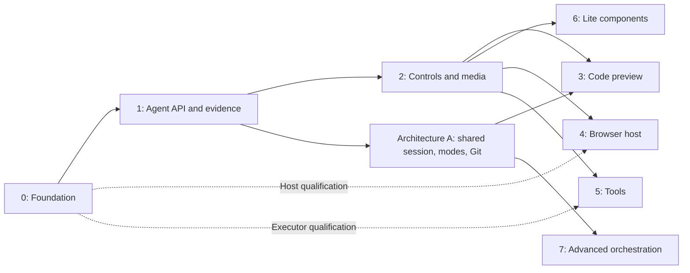

# Design mode: architecture, implementation, and roadmap

**Status: shared-session HTML/CSS v1 implemented; later feature phases remain
planned. Consolidated 2026-09-18.** This is the single Design engineering
reference: current product behavior, source formats, ownership, compatibility,
resource limits, qualification, and the remaining roadmap. Code, schemas, and
tests are authoritative when prose and behavior disagree. Implementation is not
proof that a feature is released or qualified on every provider and host.

Keep current contracts here after v1 ships. Update the relevant section when its
code changes; retire completed roadmap tasks into those sections. Other guides
link here for Design-specific behavior instead of maintaining a second plan.

- [Status and architecture decisions](#0-status-and-architecture-decisions)
- [Implemented behavior and code owners](#1-implemented-design-mode)
- [Future architecture and host requirements](#2-target-architecture)
- [Product decisions](#3-decisions)
- [Phases and dependency gates](#4-phases-and-dependency-gates)
- [Verification and qualification](#5-verification-and-qualification)
- [Non-goals](#6-non-goals-for-this-roadmap)

## 0. Status and architecture decisions

Use one workspace, branch, index, conversation, provider binding, and context
for Code and Design. Composer mode expresses authoring intent; opening a tab
never changes it. The **+ → Design** menu adds a removable tag. The Design tab
hosts the existing canvas and offers **Create design directory** when empty.
User-selected or user-authorized agent switches preserve the session and inject
fresh instructions. There is no Code Restriction toggle, designer-only workspace,
separate Design provider, or mode-selected sandbox in v1.

Local Design mode authors HTML, CSS, assets and `canvas.json` with ordinary
provider Read/Write/Edit/patch/shell tools. No API apply/import/publish step is
required. Optional API inspection and semantic editing, and human visual edits,
operate on those same files. Cloud worker execution policy is separate: its
Design authoring uses the API and cannot fall back to native Design writes.

`design.toml` v2 registers the folder and stable directory ID; `canvas.json` v1
owns the single-page scene and stable frame IDs. Registration and generated
`rules.md` remain lifecycle-managed. Explicit Design authoring migrates legacy
storage recoverably; inspection does not rewrite the branch. Native edits are
ordinary file saves, not semantic transaction receipts or automatic Git commits.

The private authored-store/publication system and separate Design-session
admission were removed. Keep checkout-backed `DesignDraftStore`: it supplies
checked transactions for visual/API edits, not another authored copy. Private
journals, retry receipts and immutable evidence remain useful local state.
Experimental private-store ownership markers remain protected for recovery;
never delete them to bypass admission or silently discard unpublished work.

| Area                                                                                 | Current status                                                            |
| ------------------------------------------------------------------------------------ | ------------------------------------------------------------------------- |
| Shared workbench, directory lifecycle, selection and bounded retained canvases       | Implemented                                                               |
| Composer tag, persisted mode/revision, continuation instructions and API mode checks | Implemented                                                               |
| Local native HTML/CSS authoring, `canvas.json`, migration and watcher refresh        | Implemented                                                               |
| Foundation, visual editing, semantic transactions, history and sandboxed previews    | Implemented                                                               |
| Scoped inspection, semantic helpers, request receipts and optional capture           | Implemented; capture requires a qualified host                            |
| Existing Design review, explicit checkpoints and mixed managed Git                   | Implemented; no new v1 Git/proposal workflow                              |
| Proposal/result storage and existing human review compatibility                      | Retained internally; not exposed through the v1 conversation tool catalog |
| Read-only frame-context routes                                                       | Implemented; composer delivery deferred                                   |
| Conflict detection, paused canvas, Retry/Cancel                                      | Implemented; semantic Design conflict resolution deferred                 |
| Deployed-cloud Design continuity                                                     | Qualification open; local worker fixtures do not qualify deployment       |
| Controls/media, code/web/tool surfaces, lite components and advanced orchestration   | Phases 2–8; not implemented by the native-authoring enhancement           |

Do not infer delivery from old branch notes or test counts. The current source
supports authored HTML/text frames. It does not execute TSX or authored scripts,
provide framework adapters, implement a general surface plugin system, or promise
that every generated design completes within a particular time.

## 1. Implemented Design mode

Current contracts: [source and registration](#source-metadata-and-personal-state),
[migration](#migration-and-git), [canvas format](#canvas-format),
[composer and sessions](#composer-and-shared-agent-lifecycle),
[authoring and tools](#native-authoring-and-optional-tools),
[visual editor](#renderer-and-editor-contract),
[receipts and evidence](#review-receipts-and-evidence),
[limits](#performance-and-safety-ceilings), [Git](#git-and-concurrency),
and [compatibility](#identity-and-compatibility-reference).

### Code ownership

| Owner                                                                            | Responsibility                                                                                     |
| -------------------------------------------------------------------------------- | -------------------------------------------------------------------------------------------------- |
| `packages/protocol/src/composer-mode.ts`                                         | Authoring policy and native/API instruction variants                                               |
| `engine/db/chats.ts`, `design/conversation-mode.ts`                              | Persisted conversation mode and revision                                                           |
| `engine/agents/session-tools.ts`, `agents/gateway.ts`                            | Product tool admission/disposal and prompt/steer preparation in the existing execution             |
| `engine/design/code-tool-admission.ts`, `conversation-tools.ts`, `code-tools.ts` | Workspace/directory ownership, mode checks, native context and scoped API tools                    |
| `engine/design/manifest.ts`, `canvas-file.ts`, `metadata.ts`, `directory.ts`     | Registration, scene formats, discovery and recoverable migration                                   |
| `packages/design-core`, `packages/design-web`                                    | Foundation schemas/history and HTML/CSS parsing, provenance, semantic edits and headless rendering |
| `engine/design/document.ts` and its storage/transaction/lifecycle/render modules | Compatible public facade over checkout-backed source and transactions                              |
| `engine/design/routes.ts`, `workspace/service.ts`                                | Design routes behind workspace policy, directory leases and mutation coordination                  |
| `renderer/features/design-workspace/`                                            | Workbench, canvas, camera, frames, Layers, inspector, review and exact-owner caches                |
| `packages/protocol/src/design-runtime.ts`                                        | Versioned private iframe messages and source generations                                           |
| `electron/design-protocol.ts`, Design capture/export modules                     | Scoped native resources, bounded capture and PNG export                                            |

Paths beginning `engine/` or `renderer/` above are relative to
`apps/desktop/src/`; `electron/` is relative to `apps/desktop/`. Preserve public
exports, IPC names, serialized keys and compatibility aliases when moving code.
The canvas remains substantial: extend existing owners rather than accumulating
new hosts, storage and provider policy in its interaction component.

### Product and workspace model

A Zeros workspace has one managed Git worktree, one checked-out branch, and one
Git index. Code and Design are concurrent views of that checkout; they are not
separate worktrees, branches, copies, projections, or execution backends.

```text
Shared native agent + Design mode ─► HTML/CSS/assets/canvas.json in the checkout
                                               ▲
Human canvas + optional Design API ─► DesignDraftStore (checked transactions)
                                               │
                                  workspace watcher → canvas refresh
```

The active Design directory comes from the private `[design] directory_id`
selection and the `design.toml` manifests in this checkout. Legacy `[design]
directory` paths remain readable. `Zeros Design/` is the unconfigured pointer
default; the explicit Create Design directory action creates `<repo name> -
Design/` when no Design folder exists. Opening the tab alone does not create
files. A single discovered folder is reused. The Design directory menu selects
a workspace-local stable ID; Settings manages repository defaults and rename.
Source remains materialized and readable from both surfaces.

#### Shared workbench navigation

The permanent Design tab sits beside Files, Changes, Review and Context in the
existing workbench. The same conversation column stays present. Its directory
header, Layers and Inspector belong inside Design; Layers/Inspector visibility
is adjustable for narrow layouts. Selecting a tab changes no agent mode.

`workspace.kind`/`viewMode` and `workspace.setMode` remain serialized legacy
contracts, including existing creation flows. On first use, a legacy Design
selection opens Design once; subsequent choices survive reload without forcing
Design again. These fields do not authorize human Design editing. The implemented
composer modes and provider tool gating use separate conversation-owned state.

Frame/node selection, camera, layer disclosure and panel visibility are keyed
by workspace. A stable directory ID survives rename; replacing it resets the
old document selection/camera and runtime foundations. Switching back to an
older directory starts a fresh document view; it does not restore a second
per-directory editor history. Existing app-wide panel width preferences remain.
At most two visited Design canvases are retained. Inactive tabs/owners and a
collapsed workbench are inert, hidden and inactive, with stable iframe DOM order.

`design.initialize` is an explicit managed-workspace operation. It creates
or adopts metadata without changing workspace kind, HEAD or the index. Directory
selection waits for pending edits, changes only the workspace-local pointer and
invalidates exact-owner reads. Mutations carrying an old directory ID are
rejected, and queued local edits retain the directory identity they started in.
Missing, ambiguous, conflicted or unsupported manifests show recovery
feedback instead of silently creating a replacement document. Repository Settings
rename remains an explicit main-checkout rename commit: live checkouts keep their
own paths through a compatible stable ID; legacy/incompatible pointers block it.

An admitted cloud actor uses the same lifecycle and document API against the
opaque primary checkout ID. Read, edit and directory-management roles are
checked separately. The deployed cloud worker resolves the checkout; remote
paths and repository-root substitution cannot select another owner. Cloud
snapshots contain no host-local `zeros-design:` capability. Desktop relay
restrictions and ordinary remote file/credential filtering remain independent.

#### Source, metadata and personal state

```text
<repo>/
  Product - Design/
    design.toml         engine-managed registration and stable directory ID
    canvas.json         editable scene, frame IDs, sources and geometry
    rules.md            short native-authoring and compatibility instructions
    home.html           authored frames
    tokens.css          shared tokens
    components/         shared components
    assets/             images and other assets
  .zeros/               ignored private settings and local state
```

Code mode may inspect Design files. User-authorized Design mode uses normal
provider file tools to author HTML, CSS, assets and `canvas.json`. The Design
surface and optional API edit the same files. Generic app file-editor and
discard routes keep their existing Design guard; managed Git may stage, commit
and integrate authorized Code and Design changes. Mode instructions do not
provide a hostile-process filesystem boundary.

Commit the folder, `design.toml`, `canvas.json`, `rules.md` and referenced source
together. Uncommitted work is local to the checkout. Registration and generated
rules are managed by Zeros lifecycle operations.

Repository Settings → Design → Directory scans the main checkout, including
untracked Zeros manifests, without requiring any worktrees. Its folder list
supports inline rename (double-click or the pencil; Enter/blur saves and Escape
cancels) and choosing an existing folder. Rename preserves the selected directory
when another row is renamed.

The trash action is **Remove Design registration**, with an explicit confirmation.
It preserves the directory and all authored source/assets, removes only its
manifest, legacy registry entry/document metadata, and unmodified generated rules,
and forgets this checkout's remembered registration. Custom rules are preserved.
The preserved source becomes ordinary Code, including a folder named `Zeros
Design`; the legacy default read path alone does not establish Design ownership.
Tracked metadata removal is committed separately from staged source changes so
HEAD/index discovery cannot immediately restore the removed registration. All
open workspaces for this repository must be archived before removal; every
workspace may now be editing Design, regardless of its legacy kind. The operation is local-only
and uses the engine's Design-owner handoff and workspace mutation lane. Other
worktrees retain their own committed copies until updated through normal Git.
Choosing the folder again preserves `canvas.json`; old metadata can also be
recovered from Git. Source-only rebuilding is the explicit fallback.

The current manifest is registration-only:

```toml
format = "zeros-design"
version = 2
id = "design_example"
canvas = "canvas.json"
```

`canvas.json` v1 contains stable frame IDs, a single page, flat HTML source paths,
geometry, titles and Foundation metadata. It contains no node tree or duplicate
HTML. Unknown supported extensions survive engine writes; camera state, grants,
journals and caches remain private. The scene example and bounds follow below. Legacy v1 manifests with inline document v3
and null-pointer encoding remain readable and migrate on explicit authoring.

Discovery validates `format = "zeros-design"`; a file named `design.toml` alone
does not make a folder Design territory. Working-tree discovery is bounded,
skips private storage, dependencies and nested repositories, and refreshes on
Design entry, Settings listing and watcher recognition changes. Exact Git index
and HEAD manifests also preserve ownership of old paths during moves. A moved
folder retains its ID. Duplicated IDs, overlapping folders, unsafe paths,
symlinks, hard links, malformed metadata and competing copies pause writes.

The Files tab receives validated Design roots alongside its file listing through
both the native and engine bridge paths. Root-level Design folders appear in the
separate **Design files** section, including uncommitted portable manifests and
legacy registrations. Nested folders keep their existing place in the tree.
The listing and ownership share one cached snapshot per checkout, so refreshing
metadata without changing filenames still updates the split. An unrelated
`design.toml` never establishes ownership. Older engines that omit the ownership
field retain the legacy canvas-marker fallback.

Repository Settings → Design → Directory → **Use existing folder** explicitly adopts a source folder
inside the repository. The preview first uses existing metadata, then looks for
saved metadata in the index and HEAD (including older formats). Without saved
metadata it rebuilds frame information from source, leaving authored files
untouched. Canvas positions and other metadata-only values cannot be recovered
from source alone. The preview identifies that case before confirmation and is
checked again before writing. If selecting it would invalidate a live worktree,
the folder is registered while existing selections stay active. Commit it and
update those worktrees before using the normal folder selector. Deleting
`.zeros/` loses private preferences but
leaves per-folder identity and shared metadata intact; folders are rediscovered
without a central registry.

#### Migration and Git

Read-only access remains compatible with `.zeros/design-dir.toml`,
`.zeros/design/design-dir.toml`, `.zeros/design/design.toml`, each central
`<id>/document.json` or `metadata.json`, and source `.zeros-canvas.json` markers.
On explicit Design prompt entry or a Design write, every entry in a central registry migrates into its source
folder before the old storage becomes private. IDs, geometry, Foundation data
and extensions are preserved. Recoverable transactions write canvas files and registration manifests
before removing predecessor files. Legacy canvas markers and inline frame
metadata migrate through the Design API. Interrupted older transactions remain
recoverable. Reading an older branch does not rewrite it.

Design Stage, Unstage and Commit include the selected source folder and its
manifest. During migration, projection of shared legacy registry entries keeps
other folders' staged and committed states independent. Directory renaming moves
source and manifest together in one scoped commit; the private selection retains
the same ID. Shared workspace Git can include recognized Design roots and legacy
metadata; generic file-editor and discard routes retain their Design guard.
Archives finish recoverable writes before capturing source and metadata.

Design writes maintain an idempotent block in the root `.gitignore`: ignore
`/.zeros/` and keep Design manifests and rules visible. The previous
`.zeros/design/` exception is removed. Existing exclusions for other files,
including private files inside a chosen folder, are preserved.
A higher-priority ignore rule that still hides Design metadata pauses the write
and identifies the conflicting paths. This changes ordinary working files;
it does not stage, commit or push. Review and commit the `.gitignore` change as
repository configuration. Files already tracked under `.zeros` remain tracked
until their migration deletions are committed; Git ignore rules cannot untrack
existing commits.

Surfaces that can enter Design ask the engine first (`design.listDirectories`
returns the entry `target` and whether it exists). The empty Design tab offers
"Create design directory". The composer Design tag changes authoring intent;
it does not create a directory or change the selected workbench tab.

Legacy `workspaces.view_mode` selects the initial surface. `kind` remains a synchronized
compatibility mirror for older clients. Switching views does not run checkout,
stash, sparse-checkout, stage, commit, merge, rebase, pull, or process migration.
The retained legacy workspace mode endpoint publishes the row and initial
Design snapshot together; a refused transition keeps the original selection.
It is separate from the current composer tag and workbench tab selection.

The legacy workspace transition may initialize a missing foundation as ordinary
uncommitted files. Exiting leaves the working tree and index unchanged. A durable transition
marker lets startup finish an interrupted database/surface transition without
rewriting the checkout. The generic Working Directories feature may use
user-selected sparse-checkout, but it is unrelated to Design containment and is
unavailable while the Design surface is active so it cannot hide an open
document.

The existing conversation is shared by Code and Design. The composer + menu
adds a removable Design tag; the separate Design tab does not change mode.
`agentRole: "design"` session requests remain rejected before provider admission.
Provider permission/Plan modes are independent of composer authoring intent.

#### Canvas format

A minimal canvas index is:

```json
{
  "version": 1,
  "id": "main",
  "title": "Product",
  "pages": [{ "id": "main", "title": "Screens", "frames": ["home"] }],
  "frames": {
    "home": {
      "kind": "html",
      "source": "home.html",
      "title": "Home",
      "x": 0,
      "y": 0,
      "width": 1440,
      "height": 900
    }
  }
}
```

Frame IDs identify canvas entries independently of source filenames. Rename the
source and change its `source` reference while preserving the ID. Add/remove
the corresponding page membership when adding/removing a frame. IDs start with
a letter, contain letters/digits/underscores/hyphens, and are at most 128
characters. The supported kinds are `html` and the existing canvas `text`
frame. Source references are flat relative `.html` filenames, unique under
portable case folding. Unregistered HTML remains source, not an implicit frame.
The format admits one page, at most 256 frames, dimensions 1–16384 and positions
within ±1,000,000. Unsupported versions/kinds, duplicate references, unsafe
paths and missing referenced sources produce errors instead of being rewritten.

Canvas/page titles and existing Foundation metadata are portable authored
content. Page membership normally determines stacking order; optional `z`
preserves historical absolute ordering. Unknown supported extension fields
survive engine writes. Legacy geometry extensions use `geometryMetadata` to
avoid colliding with frame extensions. Camera, credentials, grants, recovery
journals, captures and caches do not belong in this file. No DOM/node tree or
copy of the HTML is stored here.

### Actor and execution contract

| Actor                    | Code/repository authority              | Design authority                                                      | Execution                          |
| ------------------------ | -------------------------------------- | --------------------------------------------------------------------- | ---------------------------------- |
| Human Code workflow      | Normal native files and Git            | Readable; Zeros Code routes reject Design writes                      | Native host                        |
| Shared Code/Design agent | Normal provider tools and permissions  | Code inspects; Design authors with native file tools and optional API | Native host process lifecycle      |
| Human Design surface     | Read-only Code context                 | Semantic Design API transactions                                      | Trusted application process        |
| Cloud worker agent       | Worker-owned provider and cloud policy | Design API in Design mode; native Design writes unavailable           | Qualified cloud execution boundary |
| External terminal/editor | Normal same-user authority             | Normal same-user authority                                            | Outside the Zeros actor guarantee  |

Native Code deliberately has no ZSR, VM, OrbStack machine, local container,
Zeros ACL, Design sparse shape, alternate checkout, or Code-to-sandbox fallback.
`HostExecutionBoundary` adds owned process-group lifecycle, bounded identity,
graceful/forced teardown, and stale-process recovery while preserving normal
provider and host behavior.

Agents receive recognized roots and mode instructions: Code may inspect;
Design may author with native file tools. Generic app file writes/discard remain
guarded, while authorized managed Git includes Design. These
workflow guards do not change the
native permissions of the Code process or external same-user tools and are not
a hostile-process filesystem security claim.

View identity never selects execution posture. Local Design directory changes
suspend and revoke document grants while preserving the provider and MCP
connection; fresh capability discovery binds the current directory. Composer
mode does not select a sandbox or make Code files read-only.

### Composer and shared agent lifecycle

One workspace, branch, conversation, and provider binding handle Code and
Design. The existing Design tab stays beside the other workbench tabs. Without
a directory, its primary action is **Create design directory**.

In the composer's **+** menu, **Design — Create and edit designs** selects
Design mode. A removable Design tag appears beside +, before the other composer
controls. Removing it selects Code. Authorized agent switches update the same
conversation state and tag. Selecting a tab, inspecting Design, or reading
repository instructions never grants permission to edit it.

There are no frame/node context pills, mode-switch progress indicators, special
streaming cards, new proposal review, new mixed Git workflow, or new conflict
resolver. Existing errors, editor controls, Git operations and conflict guards
remain. Mode selection does not change provider Plan/permission settings or
make Code files read-only.

#### Runtime ownership

- `chats.composer_mode` and `composer_mode_revision` are engine-owned SQLite
  fields (migration 39). Legacy chats default to Code. Ordinary sidebar upserts
  cannot overwrite them. Trusted cloud restore/fork preserves them explicitly.
- `chats.setComposerMode` owns manual selection. It validates conversation/folder
  identity and remote visibility. A never-persisted chat can be seeded from its
  current sidebar metadata; a deleted chat cannot be resurrected by this route.
- `design_mode_set` owns agent selection. Its required `expectedRevision` comes
  from the current prompt or `design_capabilities`; a late switch cannot overwrite a newer manual
  selection, including an away-and-back transition.
- User intent is instruction policy. Only switch for user-authorized Design or
  Code work. A mixed request can authorize both; repeated approval is not needed.
  Neither a tool schema nor a model assertion proves natural-language consent.
- User selections are serialized per conversation. Prompt and steer submission
  wait for pending selections. Engine mode instructions precede each submitted
  prompt/steer; an agent switch returns the new instructions in its tool result
  before the next model continuation. No second provider session is created.
- The native MCP registration retains the compatible `design-draft` name and
  `ZEROS_DESIGN_AGENT_CAPABILITY` credential channel. Its schema catalog stays
  stable across mode changes, including within a native turn. Tool-name
  discovery is not write authority: Code can discover signatures and inspect,
  but every API Design write requires the current Design mode and generation.
  Native file tools follow the mode instructions and provider permissions; they
  are not intercepted or protected by an OS sandbox.
  This avoids refreshing a shared Cursor executor or relying on provider-specific
  mid-turn tool-catalog reloads.
- `ConversationDesignTools` lazily binds the active registered directory. A
  missing directory can be created and then used through the same MCP connection.
  Local directory transitions suspend and revoke document grants, then permit
  a fresh capability read; they preserve the provider and MCP endpoint. Existing
  cloud execution-boundary transitions retain their separate lifecycle policy.
- API writes retain the existing owner/directory checks, document CAS,
  durable request receipts, journal recovery, and actor-local undo. Code mode
  cannot apply a cached or queued write. Already-admitted journals finish or
  recover consistently even if Stop or a mode change arrives during commit.
- Stop cancels pending Design work. A subsequent prompt starts a new tool turn;
  late prompt preparation and steering cannot clear Stop. Session disposal
  revokes the endpoint, including an admission still in flight.
- A first Code prompt may precede sidebar persistence; it remains read-only for
  Design until its conversation exists. Deleted/archived owners are rejected.
  Invalid workspace ownership blocks Design prompts. At the 16-execution MCP
  capacity limit, local native file authoring remains usable with validated directory
  context; optional helpers require a free connection. Cloud Design prompts
  require the API connection and stop if it is unavailable or saturated. No credential or provider
  permission is broadened.

Cloud workers retain their sandbox policy, which prevents native Design file
writes. Their prompts and mode-switch replies use the Design API authoring
instructions: discover capabilities, create frames and apply semantic edits at
an exact revision. If the API connection is unavailable or at capacity, Design
prompts stop until it is restored; they cannot fall back to native writes.

The engine supplies the active directory, its workspace and mode revision with
each prompt/steer. Agent switches use that revision, return fresh instructions,
and preserve the conversation/provider. Missing or ambiguous directories require
Create design directory or an explicit selection; the agent must not guess.
Optional MCP helper capacity does not gate native file authoring in a valid
local workspace. Design discovery failures, including unresolved manifest index
conflicts, leave Code prompts available to help repair the workspace. Malformed
registration and legacy recovery blockers still stop dependent Design work;
ownership changes and cancellation always stop the affected execution.

### Native authoring and optional tools

In local workspaces, the provider uses its normal Read/Write/Edit/patch/shell tools to author files
in the selected Design directory. Saves are ordinary branch changes and refresh
the existing canvas through the workspace watcher. No API save/publish step or
per-node creation sequence is needed. Native tool rows keep their provider's
normal presentation. No permanent private authored store is involved.

Optional MCP helpers use the checkout-backed Design API. `DesignDraftStore`
remains the journaled transaction repository for those helpers and visual edits.
These calls retain the existing compact Design icon and labels:

| API operation                                                                                                    | Ordinary transcript label         |
| ---------------------------------------------------------------------------------------------------------------- | --------------------------------- |
| `design_capabilities`                                                                                            | Inspect                           |
| `design_document_list`, `design_request_list`                                                                    | List                              |
| `design_document_open`, `design_source_read`, `design_projection_read`, `design_render`, `design_request_status` | Inspect                           |
| `design_foundation_read`, `design_provenance_read`                                                               | Inspect Styles                    |
| `design_transaction_apply`                                                                                       | Edit                              |
| `design_frame_create`, `design_frame_rename`, `design_frame_duplicate`, `design_frame_delete`                    | Create, Rename, Duplicate, Delete |
| `design_lint`                                                                                                    | Validate                          |
| `design_capture`                                                                                                 | Capture                           |
| `design_history_undo`, `design_history_redo`                                                                     | Undo, Redo                        |
| `design_mode_set`                                                                                                | Switch mode                       |

These use the existing compact expandable tool row with the Design pen icon.
Expanded details use the normal source/text/JSON surface. Native MCP identity,
not a Design-looking unqualified name, selects this presentation. Ordinary Code
and third-party MCP tools keep their existing rendering. Capture uses native
MCP image content plus metadata, rather than dumping base64 into code details;
only hosts with a configured capture renderer advertise it.

Proposal and result-bundle tools are not advertised or callable through this v1
conversation endpoint. Existing internal proposal/evidence data and human
review compatibility remain; direct edits need no proposal.

A local task runs as follows:

1. Select Design, or make a request authorizing the agent to switch. A switch
   uses the revision supplied in the current prompt. Provider permissions apply.
2. Prompt preparation resolves the selected directory and migrates legacy
   metadata if necessary. If absent, use Create design directory in Design.
3. Read `rules.md` and `canvas.json`, then only the relevant source files.
4. Write a complete HTML frame and add its stable ID/source/bounds to the canvas
   index, or patch an existing file. No required capabilities/apply/save call.
5. Saved files appear in the existing canvas. Inspect/validate/capture only as
   needed. Visual changes edit those same files; stale edits must re-read.
6. Continue authorized Code work in the same conversation. Git operations retain
   their existing requested scope; saving does not stage or commit.

Native changes are not semantic API transactions or durable API receipts.
External edits invalidate semantic undo; native undo uses provider edit history
or authorized Git workflows. API lost replies still require checking the
original receipt before replay. On a stale revision, re-read and prepare a new
edit. `design.toml` and generated `rules.md` stay under engine lifecycle ownership.
The source formats and migration rules above apply to all authoring paths.

#### Native edit and refresh behavior

Read rules and canvas metadata once, then relevant source. For a new frame,
write a complete HTML document and its canvas entry; for a revision, patch the
existing files. Ordinary worktree events invalidate the exact workspace cache.
The renderer retains its last confirmed canvas while revalidating, including
through temporary invalid JSON or missing files during a multi-file save. The
next valid save recovers through the same event path. Native multi-file saves
are not atomic Design API transactions.

Preview and inspection derive selection IDs for plain HTML without rewriting
it. A visual or semantic edit persists the needed IDs as part of that explicit
edit. Source offsets still reference original bytes. Render generations include
raw source, rendered dependencies and viewport size; outdated visual requests
must refresh. Engine visual writes compare original source and metadata before
their journaled commit. Native tools follow their normal concurrency behavior:
re-read changes and avoid blind whole-file replacement. There is no cross-process
locking promise for arbitrary shells or external editors.

Optional API List/Inspect/Inspect Styles/Validate/Capture calls and existing
semantic edits remain available. Native edits invalidate incompatible semantic
undo history; they do not gain API receipts merely because a watcher saw them.
Semantic undo remains exact-revision, session-local and tip-only. Native undo
uses normal provider history or explicitly authorized Git operations.

New `tokens.css` defaults preserve normal inline and flex behavior and never
select every `data-oid` to change its layout. Existing authored stylesheets are
not replaced. A legacy folder can therefore retain its old broad layout reset
after metadata migration. Read shared styles before importing them into a new
frame; use scoped overrides or independent styles instead of rewriting shared
CSS that existing frames rely on. Manually adding `data-oid` to every new element
is unnecessary; the preview derives selection identities for ordinary HTML.
Rendering retains its sandbox, sanitization, local-asset policy
and byte/runtime limits. JavaScript/TSX execution, framework builds and new
surface kinds are not implemented here.

### Canonical Design foundation

Web frames remain portable HTML and CSS in the Git worktree. The browser DOM is
a sandboxed render, measurement, and hit-test projection; it is not a second
persisted document model. Derived trees and snapshots may be cached only as
bounded, exact-version projections.

```text
Authored HTML/CSS
      │
      ▼
source adapter ── identity, spans, diagnostics, provenance
      │
      ▼
transaction kernel ── revision, validation, inverse, history, receipt
      │
      ▼
versioned Design API
      ├── desktop workbench
      ├── headless/CI callers
      └── scoped shared-session tools
      │
      ▼
renderer adapters ── sandboxed DOM iframe first
```

The shared Foundation core is pure TypeScript. It cannot import React,
Electron, Node filesystem APIs, or browser globals. Filesystem authorization,
atomic writes, render preparation, and sandbox lifecycle stay in their engine
or renderer owners.

#### Stable identity and source

- Selectable authored elements use stable `DesignNodeId` values, currently
  serialized as `data-oid`. Identity never depends on DOM `id`, CSS classes,
  source offsets, array position, iframe lifetime, or instance order.
- Plain HTML inspection derives missing/duplicate markers without writing source.
  An explicit visual or semantic edit persists required identity repairs with
  minimal source changes. A source offset is location metadata, never identity.
- Component internals use definition-local identity. A nested instance address
  combines its root instance with a bounded ordered path of component and
  definition-node IDs.
- The source adapter parses HTML with source locations and CSS with source
  nodes. Normal edits preserve unrelated bytes, comments, declaration order,
  quoting, and reasonable local formatting; full-document serialization is not
  the normal mutation path.
- Authored, matched, computed, inherited, preview, token-bound, component,
  responsive, and state-specific values remain distinguishable. The inspector
  must not present a computed value as authored source or invent cascade
  certainty.
- Base responsive/default interaction state is the only generally authorable
  context in Foundation v1. Breakpoint and pseudo-state writes fail closed
  until an adapter can identify their exact at-rule and selector target.

#### Transactions, revisions, and history

Visual/API source, style, text, geometry, component, parameter, variant, and
keyframe edits use validated, versioned semantic transactions. Native provider
file edits do not enter that transaction history. Temporary previews and
frame-catalog lifecycle commands are not document transactions.

A transaction includes a schema version, stable transaction and document IDs,
an exact base revision, actor identity and kind, intent, typed operations, and
optional coalescing metadata. A batch is atomic to its caller. Reusing an
idempotency key with identical canonical content returns the prior receipt;
reusing it for different content fails.

The authored revision is a deterministic, locale-independent 96-bit SHA-256
prefix over textual document files, the Foundation manifest, and frame
geometry. It is a conflict key, not the render generation. Fully composed
output and binary assets are covered by the separate `sourceVersion` used by
iframe, screenshot, and cache protocols.

An exact-base mismatch is a conflict, never permission to overwrite a newer
draft. External edits publish a new revision, reconcile identities that still
survive, clear unsafe redo state, and retain the last valid render when the new
source is invalid.

Undo and redo send inverse/original semantic operations through the same source
adapter. Pointer gestures coalesce to one history entry; rendered documents and
screenshots are never copied into each entry. History is bounded and belongs to
the opened document session. A shared-resource edit remains undoable only from
the frame session that initiated it until a future workspace transaction can
represent multi-frame history atomically.

Frame create, rename, duplicate, and delete are atomic workspace lifecycle
commands outside document undo. Subtree duplication assigns fresh stable IDs;
subtree deletion targets one authored subtree; `keyframes.set` surgically
creates or replaces one named animation. All document operations retain CAS,
receipt, and byte-exact inverse guarantees.

Components, parameters, bindings, and variants have stable schemas even where
the complete management UI is deferred. Parameters have typed values, bounds,
options, units, bindings, and visibility metadata. An executable v1 parameter
is unbound or bound to one document; binding creation atomically synchronizes
its value into source. Variants store validated deltas instead of document
copies.

#### Durable store and Design API

`DesignDraftStore` adapts the journaled document implementation for both the
trusted human surface and scoped callers. It provides:

- exact-revision compare-and-swap;
- atomic filesystem commits and crash recovery;
- idempotent receipts and bounded session-local, tip-only, actor-checked undo/redo;
- bounded source, projection, foundation, provenance, and diagnostic reads;
- immediate publication of the confirmed draft revision.

The active draft is durable repository content, but durability is not a Git
commit. `design.save` validates the live draft only. Stage and commit remain
separate, explicit actions.

Confirmed edits are written to `<workspace>/<selected Design folder>` by the
engine; agents may also author files directly in Design mode. HTML, CSS, assets,
`canvas.json`, `design.toml`, and `rules.md` are ordinary
versioned source. A gesture previews locally until release; typed fields publish
on their editor's commit boundary (usually Enter/blur). An unsubmitted field is
not yet a durable edit. Cmd/Ctrl+S publishes the focused field and waits behind
pending edits before validating the draft; it does **not** stage any files.
Private journals, view state, review receipts and result bundles live under
`<Zeros app data>/design-storage/<workspace-path hash>/`; quarantined recovery
records use the adjacent `design-transaction-recovery/` directory. The stable
macOS app-data default is `~/Library/Application Support/com.zeros/`, with
separate beta/dev/instance directories and a `ZEROS_DATA_DIR` override for cloud
and tests. Repository `.zeros/` holds private settings and compatibility state;
it is not the authored autosave store. Undo/redo history is bounded in memory.
For a cloud workspace, the workspace engine writes the cloud worktree and its
own configured app-data directory.

Stage Design snapshots the selected folder into Git's index, including its
manifest and rules. It does not stage Code or other Design folders. Later edits
continue autosaving to the worktree and can leave the same file both staged and
unstaged. Commit staged Design records only the staged version; push subsequently
publishes the branch's commits. A proposal awaiting acceptance has not changed
authored source; its request/evidence records are private.

Desktop, headless, CI, and shared-session tools use the same Design API
schemas. MCP is a transport adapter, not the core model. A headless caller can
open an exact revision, query bounded projections/provenance, apply or dry-run
transactions, render frames, capture artifacts, and receive diagnostics without
Electron or React.

### Renderer and editor contract

The DOM renderer runs in an opaque `allow-scripts` sandbox. Authored scripts,
active URLs, forms, nested frames, workers, and network access remain blocked.
Zeros injects the only runtime and connects through a private `MessagePort`.
Protocol messages carry an explicit version and exact source generation, use
bounded arguments/results, support cancellation and timeouts, and reject
pending work while teardown stops observers and timers.

Pointer handling uses Pointer Events and capture. High-frequency input is
sampled at animation-frame cadence; layout reads are batched before writes.
One pointer gesture publishes one semantic transaction on release. Cancel or
Escape restores the exact baseline.

#### Interaction rules

- **Selection:** selection outlines follow the element's untransformed border
  box plus accumulated rotation. Handles, strokes, labels, constraint guides,
  and hit regions retain screen size at every supported zoom. Normal click
  first selects the outer frame from its body, including empty space. Once a
  child is selected, normal clicks preserve useful nesting depth. Double-click
  descends once, the platform modifier deep-selects, and Enter/Escape traverse
  the same visible child/parent hierarchy as Layers. Document wrappers and the
  explicit frame root share the outer frame's identity; unmarked authored roots
  remain real children, even when they fill the viewport. Frame bodies and labels
  use the ordinary selection cursor; label dragging and resize handles retain
  their gestures. Clicking a restored root-layer overlay also selects its frame.
  Modifier-clicks pass through padding and gap controls to deep-select beneath
  them; spacing drags retain their editing behavior. Outside-canvas clicks
  deselect. Fallback descent starts from the frame owner when the deepest hit
  is absent from a bounded tree. Text editing starts from confirmed local
  selection without waiting for engine selection persistence. Body hit tests
  share the selection generation with Layers and labels so delayed reads cannot
  replace a newer selection or apply another frame's nesting depth.
- **Multi-selection:** Shift-click and marquee publish a bounded primary-first
  group. Ancestor/descendant overlap reduces to top-level owners before
  transform or delete so no subtree is mutated twice.
- **Camera:** pinch follows Chromium's synthesized pinch scale, Cmd-wheel uses
  the flatter scroll curve, ordinary wheel pans, and every zoom preserves its
  focal point. Imperative camera state updates the world transform and inverse
  scale together, then settles one bounded store update.
- **Creation:** `F`/`A` creates frames and `T` creates text from one inverse
  pan/zoom transform. Click uses the documented default geometry; drag uses the
  exact world-space rectangle. A host-side draft paints synchronously and one
  transaction commits the result. Drawing inside a frame creates a child in
  its nearest containing frame; drawing on the canvas creates a new document.
  New children start with None and participate in their parent's Stack/Grid
  when enabled. Runtime child coordinate maps account for transformed ancestors,
  reflections, borders, and scroll. Parent positioning and insertion share one
  undoable transaction.
- **Inline text:** one uncontrolled plaintext editor owns caret, selection,
  composition, and the draft. Latest-wins runtime previews mutate the exact
  text node without broad React publication. Paste strips markup but preserves
  line breaks; blur or Cmd/Ctrl+Enter commits once; Escape restores the exact
  text. Blur during IME composition waits for `compositionend`.
- **Layers:** frames fold independently in one virtualized row list. Keyboard,
  visibility, hover, and selection are frame-keyed. Uncached hover reads
  coalesce to active plus latest instead of forming a queue.
  Only a sole direct child explicitly marked `data-zeros-frame-root` by frame
  creation shares the canvas row. Existing unmarked `main`/`div` roots remain
  real child layers, even when they fill the viewport or have no descendants.
  Their canvas frame targets `body` independently. The document-scoped API ID
  `::zeros-document-body` supports body styles and appending top-level content;
  it is never added as a `data-oid`, selectable layer, or source identity. Generic
  delete/replace/text operations do not accept that document target. Missing
  body tags are materialized only by an explicit mutation. Original trees and
  authored IDs remain intact; viewing existing sources adds no root markers.
  Automatic body style edits stay local to that frame; editing a shared body
  stylesheet declaration requires explicit rule scope.
- **Style inspector:** typed values remain local drafts until Enter/blur;
  Escape restores the focus-time value. Scrubs, sliders, and color gestures
  preview live and commit once. Authored-versus-computed state, shorthands,
  logical properties, priority, and source target remain explicit.
- **Layout:** padding, gap, grid, constraints, and distance tooling use
  browser-rendered child geometry. Guides paint synchronously, remain
  screen-sized, and perform bounded readback once per gesture rather than per
  raw pointer event.
- **Theme:** the Base/named-mode token editor is persistent, draggable, and
  non-modal. It neither traps focus nor blocks canvas, Layers, or inspector.
  Theme state belongs to the workspace, not an element.
- **Layout inspector:** the fixed Layout section presents whole-pixel parent-local
  positions and border-box dimensions, clockwise quarter turns, independent flips,
  alignment, constraint pins, and Clip content. Viewing or cancelling a rounded
  value never rewrites authored CSS. New frames start with normal block flow,
  an opaque white fill, and explicit dimensions. Opacity is displayed as a
  percentage. Text layers keep text semantics: Fill edits `color`, and the
  inspector does not offer conversion into a layout container or a background.
  The CSS editor continues to accept the full supported CSS vocabulary.
  Layout exposes None, vertical/horizontal flex, and Grid. Padding, gap, and
  the child-alignment pad appear only on automatic layouts. Free-layout
  containers retain their arrangement and constraint controls. Margins and raw
  flex factors belong in CSS, not the designer controls.
  Automatic layouts and their in-flow children expose per-axis Fixed, Hug
  contents, and optional min/max fields. Only in-flow children of flex/grid
  parents expose Fill container. Hug uses intrinsic CSS sizing; Fill uses flex
  growth on the parent's main axis and self-alignment stretch on its cross axis
  or a grid cell. Switching to Fixed releases growth and preserves the measured
  border box. Switching parent flow preserves child resizing intent. Enabling
  layout brings drawn children into flow; removing it freezes their measured
  positions and dimensions in the same undoable transaction.
  Paired horizontal/vertical padding can expand to independent sides. Grid
  track counts author equal fractional tracks only on an explicit edit; custom
  authored tracks remain untouched when viewing the inspector.
  Optional `layout.widthValue`, `heightValue`, and parent alignment/direction
  fields retain sizing intent in the exact node snapshot before computed
  geometry resolves it to pixels. Older runtimes can omit these fields.
  Layout edits that change an explicitly Hug-sized canvas root update its
  viewport bounds in the same transaction. Ordinary styles, flow, resizing,
  and history share the inspector's ordered lane; geometry preparation waits
  for runtime adoption, while immediate previews stay responsive.
  Sizing-menu drafts are scoped to workspace, frame, and selected node IDs.
  Geometry uses three columns at normal widths and reflows to two columns in
  narrow inspectors, keeping dimension values and resizing menus readable.
  Pins author standard insets (including `calc()` for center offsets); the directly
  authored `--zeros-layout-x` / `--zeros-layout-y` custom properties retain the
  start/center/end/stretch intent for the editor and canvas gestures. These names
  are serialized compatibility contracts. Optional runtime `layout` context is
  measured with node details and validated at the frame bridge, so the inspector
  does not infer parent coordinates from a transformed screen rectangle.
  Free-layout alignment and constraints appear only for containers with direct
  authored children, including top-level canvas frames. They arrange visible direct
  children; hidden layers and grandchildren are left alone. The optional,
  validated `childrenLayout` aggregate supplies presence, eligible child IDs,
  and shared or mixed pin intent in the existing exact-key runtime readback.
  Distribution equalizes gaps between at least three children. Resize to fit
  encloses visible child bounds with the container's padding; resize to fill
  stretches a nested frame inside its parent. Canvas-frame fitting commits
  viewport geometry and styles together. Preparing a containing block and
  freezing a flow container's measured dimensions happen in the same bounded
  transaction as child edits, preventing collapsed frames or partial history.
  A ready runtime can precede its Foundation projection. Layout actions,
  multi-layer styles, and keyboard nudges preview immediately and resolve the
  exact workspace/frame/source metadata inside the existing mutation lane.
  A cold read is shared with the inspector, keeps the captured edit targets,
  and cannot be overtaken by later writes or Undo. Document read failures and
  transaction conflicts retain their normal error and recovery handling.
- **Motion:** node-local keyframe tracks, preview, playback, and paths exist only
  in explicit Motion mode. Draft identity is workspace + frame + node, not
  source revision. Playback updates a small scalar owner store rather than the
  full canvas at 60 Hz.

#### Continuous rendering and state

An authored value change is not a loading transition. Visual-only writes patch
the mounted runtime and advance its exact generation atomically. Structural and
text commits prepare one incoming live iframe while the displayed iframe keeps
painting, then swap after runtime handshake, fonts/layout, theme, selected-node
readback, and compositor frames are ready. Rapid A → B → C replaces only the
unpainted incoming buffer.

Native frame resources, snapshot reads, and Design mutations resolve the same
active directory in an operation-scoped lease. They do not depend on an earlier
mode switch priming the legacy directory name. Human reads and mutations are
independent of workspace presentation. Shared-session API writes separately enforce the conversation mode.
Capability, path, symlink and
source-generation checks remain in force on native resource reads.

Only a successful private runtime handshake publishes a connection for canvas
interaction. An incoming buffer keeps the outgoing ready connection until it
connects. A changed engine capability starts a new frame session using the
current semantic generation, including after an in-place style adoption. A
failed native handshake revalidates the workspace and hydrates that frame through
the bounded, exact-version, sanitized bridge cache. Persistent failures offer
an inline Retry frame action. Recovery timers stop for inactive surfaces and
retired sessions; mutations are never automatically replayed.

Runtime snapshots and hot collection references remain stable. Style writes
retain the existing tree reference where structure permits; display/visibility
or structural changes take the full-tree path. Speculative values are keyed by
workspace, frame, node, and property so settling one operation cannot erase a
newer or sibling preview.

Local authored writes serialize per workspace. A queued operation may rebase a
stale request only across a bounded descendant chain produced by that same
renderer; unrelated external edits still fail CAS. Watcher echoes wait until
the local queue has adopted its final generation.

The two most recently used Design surfaces may remain mounted. An inactive
surface is hidden, `inert`, and passed `surfaceActive=false`; it performs no
polling, capture, shortcut, focus, measurement, or hot effect. See
[UI interaction and performance](ui-interaction-performance.md) for the
repository-wide server-state and retained-surface rules.

At deep zoom, the authoritative iframe stays mounted while a bounded visible
crop is rerasterized for device fidelity. Captures are exact-camera-keyed,
decoded before publication, serialized per frame, latest-wins, and memory-only.
A prior decoded crop may stay geometrically pinned until its replacement is
ready; the editor must not flash a blank or stale-position layer.

#### Layout interaction and visual history

The Layout inspector offers content-aware sizing: Hug requires child layers;
Fill requires an in-flow child of flex/grid. Padding, gap and dimensions present
whole pixels, and Shift scrubbing uses ten-pixel steps. Advisory lint stays in
the diagnostics data rather than the inspector chrome.

A single layer dragged inside flex/grid changes authored sibling order with an
insertion marker. Crossing a container boundary changes its parent and resets
positional pins; a free container uses its local coordinate space. Moving out
of the document creates a canvas frame, and moving a frame into another transfers
its subtree. `node.move` preserves exact source spans and stable identities.
`design.node.transfer` performs the two-document change through the engine's
Design metadata journal, including geometry and exact structural history.
Transfers retain local stylesheet dependencies within the Design directory.
Trusted in-process API history checkpoints preserve edits before and after a
transfer. They reattach only to the exact restored document revision and count
toward the workspace history's 16 MiB bound; they are never transport inputs.
Numeric fields retain their DOM identity when reparenting changes sizing
eligibility, so an arriving layout snapshot cannot discard a focused draft.
Each numeric commit paints immediately and advances its local baseline before
saving. Escape in a new draft leaves the preceding committed preview intact;
unit-menu close and blur cannot register the same edit twice.

`previewLayout` applies a bounded batch before measuring, avoiding a reflow and
round trip for every child. Drag targets are measured once, with a bounded lean
style catalog; pointer handlers use those frozen bounds and one preview in
flight. Inspector previews and committed generations preserve newer pending
values rather than letting an older save repaint them.

Moving a layer out of an iframe retains available exact-generation captured
pixels in one canvas overlay until the destination's displayed document is ready.
The source paint is suppressed without changing authored CSS. A failed or
cancelled transfer restores it; a confirmed transfer never restores the old
position first. Destination selection waits for the new document before reading
the transferred node, and does not replace a selection made during saving.
Whole-frame gestures retain their visible geometry through overlapping save
replies, including React renders triggered by those replies.

Layout preparation and durable writes have separate queues. A second sizing
choice or undo can paint while the first write is saving; persistence remains
ordered. Style-only commits, positional moves with unchanged sibling order, and
their history inverses reuse the retained tree and element index. Clicks racing
an in-place source adoption retry the exact live frame, with a bounded retry.
The runtime port holds subsequent commands through its local version handoff,
so a concurrent layout preview carries the accepted generation. Rejected
adoptions release that lane and cancelled commands remain unsent.

For larger documents, target collection starts only after drag intent, includes
the selected ancestry, treats SVG drawings as atomic layout items, and bounds
context scanning. Sibling order and ancestor membership are indexed once per
gesture. Geometry requests bound inspected children as well as returned children,
so thousands of hidden elements cannot turn an inline-gap drag into a full scan.
The browser tests cover 4,000 SVG paths and 6,000 hidden children.

Optional audits, thumbnails, and high-resolution captures share one background
lane, with at most 32 pending owners and only the latest request for each owner.
Active layout gestures pause that lane; other direct manipulation defers it until
input is quiet. Queued work rechecks the retained surface's active state before
reading or capturing its document. Raster capture carries the generation at
capture start. Cached screenshots have a global 24 MiB budget, accounting for encoded
strings and decoded pixels, while geometry and layer trees remain retained.
The 12-frame live-runtime ceiling is a maximum: unused slots do not load distant
documents. Explicit selection and open Layers trees retain priority.

A runtime retains up to 64 reversible layout generations, capped at 4 MiB of
style history. The renderer predicts known layout undo/redo against exact
workspace snapshot identities, while the engine remains authoritative. Unknown
or externally changed history falls back to the confirmed document. The browser
regression harness deliberately delays history replies by 500 ms and verifies
that layout inverses paint first without replacing the iframe or element.
It also delays frame movement and transfer by 700 ms, and style saves by
1,500 ms, checking repeated sizing, rapid undo/redo, transfer handoff, rollback,
and consecutive whole-frame drags independently of persistence latency. These
are browser regression bounds, not a hardware-independent speedup claim.

### Review, receipts, and evidence

Existing review and evidence support visual/API edits and compatibility.
The minimal v1 conversation workflow does not require proposals or expose
proposal/result tools to the model.

The **Review Design changes** dialog lives inside the Design tab. It is a compact
640 × 480 dialog, bounded by the window, with an undimmed background. It retains
modal focus/scroll isolation, explicit close/Escape, and protection against
accidental outside dismissal; the background canvas does not become interactive
while review is open. Narrow windows hide the canvas sidebar and keep the
comparison, scrollable changes, and checkpoint controls available. Its left side
shows the current canvas until pages exist; its right side provides independent
All, Uncommitted, Staged, Unstaged and Agent proposals comparisons, source diffs,
and saved before/after images. Accept/Reject records trusted human review
separately from the originating agent receipt. Accept applies an exact-revision
proposal; it does not stage it. Stage, Unstage and Commit staged Design are
separate actions. Commit pins the reviewed index fingerprint and refuses changed
staging. Its Design-only commit scope preserves staged Code; workspace Git
commit can deliberately include the shared staged snapshot.

Results preserve source, composed HTML, hashes, revisions, viewport and renderer
identity. Retention is bounded to 16 bundles / 64 MiB per workspace, at most 32
MiB per bundle and seven days. Capture has one browser slot per engine, two
aggregate evidence-preparation/read slots, and a 20-second host deadline. Slow
browser work releases the document write lane; later source edits do not rewrite
saved evidence. The review dialog has bounded exact-key caches and no closed
polling. Evidence is displayed as PNG, never executable authored HTML.

The existing `ZEROS_DESIGN_AGENT_CAPABILITY` environment-header contract carries
the private bearer. Each grant expires after 24 hours and is revoked on execution
retirement, shutdown, or authority change. Reopening/resuming the Code session
mints a new bearer. Authorization is checked again at the journal admission
boundary; a transaction already durably admitted finishes recovery. Cancellation
therefore requires status reconciliation when it races a commit.

Request/proposal records live in engine-private Design storage, bounded to 512
records and 4 MiB per directory. Resolved receipts are retained for **up to** seven
days within those limits; a persisted timestamp cutoff prevents replay of evicted
requests. Started/indeterminate records are not automatically evicted or replayed.
The store fails closed if unresolved records fill its budget. This is a bounded
local retry contract, not replicated cloud job persistence. Tool discovery
reports the clock, expiry, supported operations, and budgets. The retry and resource contracts below bound these records.

#### Retry and recovery

Every scoped API mutation has a bounded request ID and timestamp; native file
edits do not produce these records. Transactions carry these
as `transactionId`/`createdAt`; frame/history requests use
`requestId`/`createdAt`. Use the clock returned by discovery for new requests.
IDs are scoped to the admitted actor and directory; reusing a retained ID with a
different body is rejected. Clients must preserve both the ID and timestamp on
retry and must never recycle retired IDs with a new timestamp.

Before source mutation, the engine persists `started`. After success, it stores
the receipt. A lost reply can return that receipt after restart, even if a human
has subsequently edited the document. A crash or failed receipt write between
those steps yields **indeterminate**, which must be inspected and reconciled.
The engine never guesses success from matching current content or repeats that
mutation automatically. A known pre-application revision conflict is rejected;
other uncertain errors remain indeterminate.

Resolved receipts have a rolling count/byte budget and maximum age. Eviction
persists a timestamp cutoff; requests at or before that cutoff cannot become
fresh mutations after restart or an A → B → A content change. This also means an
old, delayed request may need a new ID and a freshly read revision. It is not a
guaranteed seven-day deduplication window.

Started/indeterminate entries never automatically expire. Proposals expire after
seven days and can be explicitly rejected before then. When unresolved records
consume the full budget, new mutations fail closed. An operator reconciliation
workflow for accumulated indeterminate entries is still a product follow-up;
deleting the private ledger is not a safe retry strategy.

#### Cancellation and revocation

Pending admission belongs to the execution before any await. Stop/dispose revokes
authority immediately and cleans up a listener that becomes ready late. Grants
also fail after directory replacement, registered-owner changes, archival,
settings changes, or expiry. Expiry/failed authority checks latch revocation.

MCP upload slots and active tool slots are separate. A long-lived connection or
saturated tool lane cannot consume every slot needed to receive cancellation.
An abort is checked again at the synchronous journal admission boundary. Once a
journal is durably admitted, recovery finishes the transaction; cancellation is
not rollback. Engine shutdown revokes product tools before slow cloud/provider
cleanup. No cancellation polling loop was added.

This follows the protocol's cooperative cancellation model, including races
with completion. [MCP cancellation specification](https://modelcontextprotocol.io/specification/2025-11-25/basic/utilities/cancellation)

#### Capture hosts and artifact integrity

Desktop capture runs in a dedicated hidden Electron window with a private,
nonpersistent session, sandbox/context isolation, no Node integration, denied
network/permissions/downloads, sanitization, and a leading script-blocking CSP.
Host readiness waits for fonts, images, and two animation frames. Native Mac
qualification found that disabling JavaScript also disabled the host readiness
evaluation; the final host allows its own evaluation while CSP/sanitization
continue to block authored scripts. Pixel and network regressions verify this.
Theme and reduced-motion media emulation is scoped to that disposable page,
using Electron's private host debugger transport; it does not expose a debugging
port or change the application theme. [Electron debugger API](https://www.electronjs.org/docs/latest/api/debugger),
[Chromium media emulation](https://chromedevtools.github.io/devtools-protocol/tot/Emulation/#method-setEmulatedMedia).

Cloud capture runs a pinned Playwright/Chromium install from immutable image
paths as dedicated UID 10002 with an allowlisted environment containing no
provider/capture credentials. Chromium sandboxing is explicitly enabled. The
coordinator owns admission until the process closes, terminates the process
group on cancellation, and escalates to a kill after one second. There is no
unsandboxed fallback. Failed preflight omits capture while source tools remain
usable. [Playwright launch options](https://playwright.dev/docs/api/class-browsertype#browser-type-launch).

A result snapshots source, tokens and component inputs inside a short mutation
lane, then renders the frozen composition outside that lane. Human editing can
continue during capture. Finalization reloads the current request ledger rather
than overwriting intervening proposals. Artifact inventory, lengths, hashes,
and canonical base64 are checked on write and read. Directory authority is
rechecked before private persistence; raw captured HTML never executes in the
review dialog.

These are local durable artifacts. They do not create a replicated job database,
a process-wide disk quota across all workspaces, or a guarantee that a deleted
cloud workspace can be recovered. Source parsing remains engine work; the
admission limits are not OS CPU/RSS/GPU quotas.

### Performance and safety ceilings

The following Foundation limits are compatibility and denial-of-service
boundaries, not targets to relax casually:

- textual state: 1,024 files, 2 MiB per file, 16 MiB total;
- transactions: 256 operations and a 4 MiB aggregate input envelope;
- default history: 100 entries/1 MiB operations and 512 receipts/4 MiB;
- recovery journal: 32 MiB with validated paths, revisions, source limits, and
  symlink-safe write parents;
- component composition: 1,024 reachable definitions, 512 KiB each, 16 MiB
  total definition source, depth 8, and 2 MiB expanded output;
- render preparation: 128 linked stylesheets, 12 MiB inline raster assets,
  15 MiB sanitized output, and 16 MiB runtime-enabled output;
- live projection: 20,000 nodes across at most 32 emitted nesting levels and
  5,000 audited elements, with explicit truncation advisories;
- headless rendering: two concurrent pages by default (four maximum), a
  15-second default deadline (60 seconds maximum), 16,777,216 output pixels,
  and 16 MiB artifacts;
- active canvas: at most 12 live frame runtimes by default;
- retained desktop state: source-free aggregate reads, at most 16 hydrated
  documents/64 MiB, 32 MiB Foundation projection cache, and a 32 MiB
  per-workspace desktop Design API budget;
- generic Design API: 32 sessions/64 MiB by default; desktop retains at most
  eight workspace API owners.

Exact-key caches may exceed a budget only while their keys are active or
pending, then evict inactive least-recently-used entries. Screenshots bound
dimensions, pixels, bytes, and execution time. Deterministic headless evidence
pins browser, fonts, viewport, scale, locale, timezone, color settings, and
reduced motion; unpinned host pixels are never treated as a stable baseline.

#### Scoped tools and evidence limits

| Resource               | Bound and behavior                                                                                                                                                            |
| ---------------------- | ----------------------------------------------------------------------------------------------------------------------------------------------------------------------------- |
| Product tool sessions  | 16 admitted or starting executions per engine. Further local sessions retain native authoring with validated context; cloud Design requires API admission.                    |
| Per endpoint           | 8 MCP sessions, 32 connections, 4 concurrent request-body reads, 4 active tools.                                                                                              |
| Requests               | 4 MiB HTTP body, 16 KiB headers, 512 KiB semantic tool input; excess work is rejected.                                                                                        |
| Replies                | 2 MiB serialized tool result; source/projection callers use pages.                                                                                                            |
| Retained API documents | 2 documents / 16 MiB estimated retained state per execution. This is not a process-RSS limit.                                                                                 |
| Request/proposal store | 512 entries / 4 MiB per directory, resolved receipt age up to seven days. Atomic private writes; no background sweeper.                                                       |
| Source pages           | Default 16,384 / maximum 32,768 UTF-16 units; never split a surrogate pair.                                                                                                   |
| Capture                | One active capture per host; 20-second deadline, 2048 × 2048 maximum, DPR 1, 16 MiB HTML, 1 MiB PNG. No waiting browser queue; each browser/window is disposed after capture. |
| Evidence work          | Two admitted composition/read jobs per engine, including direct capture. Reject saturation before claiming a new mutation receipt or allocating another result.               |
| Result store           | 16 results / 64 MiB per workspace, 32 MiB maximum bundle, seven-day retention. Atomic private files, bounded index and orphan scan; no idle sweeper.                          |
| Review reads           | At most 128 rows per page; 512 KiB detail patch; each of the eight Git metadata streams is limited to 1 MiB.                                                                  |
| Renderer review caches | Snapshots: 32 entries / 4 MiB; details: 8 entries / 4 MiB; image evidence: 2 entries / 6 MiB.                                                                                 |
| Asset discovery        | 4,096 examined entries, depth 4, 128 images; unsupported entries count toward work. Existing per-file and preview byte budgets remain.                                        |

Large directories are truncated during iteration before sorting the collected
entries. Ordering below the scan limit remains the existing sorted order; an
oversized directory does not promise a globally alphabetical first page.

Scoped tool/evidence storage adds no idle polling, animation loop, or always-on
browser. Native source refresh uses the ordinary workspace watcher. Cloud startup performs one sandboxed render canary before
advertising capture; ordinary captures launch only on request. Source edits now join chunks once instead of repeatedly copying the
whole document. Tool schemas are prepared once rather than rebuilt per discovery.

These are admission and retained-data bounds, not a hard CPU/RSS/GPU quota. HTML
parsing and existing metadata fsync still run in the engine. The private receipt
file is rewritten atomically per state transition; it is not a high-throughput
replicated job database. Large-document latency and native aggregate memory need
their own qualification before increasing these limits.

### Git and concurrency

Design editing and Git publication are separate:

1. A native file save or semantic transaction updates the uncommitted source.
2. `design.save` validates only; it changes neither index nor `HEAD`.
3. `design.stage` stages exactly the active Design root.
4. `design.commit` commits the already-staged, Design-only lane and accepts no
   arbitrary pathspec or implicit amend.

The managed `git.stage` and `git.unstage` routes accept literal Code and Design
paths. `git.commit` uses workspace authority, capturing the exact staged lane
(or explicit selected files) in a private index before updating HEAD with CAS.
Internal callers with Code-only authority still refuse Design content; Design
review retains its narrower lane. Boundary-crossing Design-only renames remain
rejected. No action silently stages missing metadata companions. A touched
portable Design folder must include regular `design.toml` and `rules.md` files;
v2 registrations also require valid staged `canvas.json` and its frame sources
in that captured index; full-folder deletion and recognized legacy metadata
remain supported. Validation does not read a newer unstaged draft to decide
whether an earlier staged checkpoint is valid.

Pull, merge, rebase, checkout, reset, cherry-pick, revert, and push are
branch-wide operations performed once against the shared checkout. An open
Design surface refreshes from the resulting files; there is no Design-only pull
or hidden convergence branch. A live dirty draft is protected from rewrites,
and independently committed changes to the same Design path are refused before
Git materializes conflict markers that the Design editor cannot reconcile.

Zeros-owned checkout/index/ref mutations share a re-entrant FIFO lane for the
physical worktree and a repository-global ref/stash lane across linked
worktrees. They revalidate the latest branch tip. Ordinary Code editing,
building, testing, and Design transactions stay concurrent. Raw Git launched by
an unrestricted Code process is outside this coordinator and relies on Git's
own lock files; callers must surface those conflicts instead of redirecting the
command through another backend.

Paths are normalized as repository-relative POSIX paths and validated against
traversal, case aliases, symlinks, hard links, and Git pathspec ambiguity before
Zeros publishes authority. Generic file/discard/restore/clean and destructive
reset paths still refuse Design targets. Managed integration is deliberately
separate from authored editing; it is not an unrestricted native-shell sandbox.

Files provides a Design section and read-only source. Workspace Changes and
Design Review observe the same index. Direct Create PR publishes existing branch
commits, preserving staged, unstaged and untracked Code and Design; if no branch
commits exist it asks the user to review and commit first. The agent PR brief
uses the same publication scope and no longer instructs commit-all. Push/pull
also do not implicitly commit local changes. The current Review Changes tab
compares the branch's committed HEAD with its base; it can include unpushed
commits and is not yet a comparison pinned to the published remote PR head.
Richer Design ownership badges/action handoff and remote visual evidence remain
follow-ups listed under [After v1](#after-v1).

#### Conflict status and read-only context

`design.status` reads unmerged paths and the current merge/rebase/cherry-pick/
revert without parsing authored metadata. Any unmerged path pauses the Design
canvas conservatively, including Code-only conflicts. Read/mutation admission
checks this before resolving a potentially conflicted manifest. Retry rechecks
the checkout; Cancel integration explicitly confirms and invokes managed
`git.abort`. A conflict with no abortable operation offers Retry only. Existing
managed integration may refuse overlapping Design changes before creating any
conflict at all. This is pause/recovery, not automatic conflict resolution.

`design.context.create` and `design.context.inspect` are local, read-only routes.
The version-1 reference contains workspace ID, stable directory ID, portable
HTML frame, optional node ID and exact semantic revision. Inspection returns
`ready` with source/geometry, `stale` with the current revision, `missing`, or
`wrong-directory`; it rejects a mismatched outer workspace. Reads never heal or
write metadata, and an external source race cannot return newer bytes as the
referenced revision. The renderer bridge exposes this contract; composer frame
context pills remain deferred. Conversation mode transitions and Design API
write gating are implemented independently of this context delivery.

### Scoped API compatibility

The serialized `agentRole: "design"` value remains parseable, but the engine
rejects it before workspace resolution, provider startup, or capability minting.
The test-only activation seam, separate gateway constructor, admission renewal,
and session retirement maps have been removed. There is no alternate Design
provider lifecycle to enable.

`design-agent-capability.ts` and `design-agent-mcp.ts` retain their internal
names as tested API/transport primitives. A scoped grant binds workspace,
document, run identity, revision, action/operation allowlists, and expiry.
Loopback MCP validates Host, Origin, bearer, route, schemas, bounds, and tool
names. Credentials stay out of argv, source, logs, and persisted MCP config.
These primitives do not establish an OS boundary or a second agent session.

The shared-session tool registry is the production integration. The v1
mode gate uses its revocation/write-authority checks; Code-mode API calls cannot
author Design source. Opening Design view
starts neither a provider nor a sandbox.

Experimental private-store ownership markers remain recognized in metadata
recovery. They block checkout writes with a recovery message; this version
cannot activate, publish, or export that retired store. Preserve its app data
and recover through the experimental build before deliberately importing into
the checkout. Never remove the marker to bypass the error. Ordinary workspaces
continue using the checkout-backed store without migration.

### Identity and compatibility reference

| Layer             | Current contract                                                                        | Change rule                                                                                             |
| ----------------- | --------------------------------------------------------------------------------------- | ------------------------------------------------------------------------------------------------------- |
| Directory         | Committed `design.toml` v2 ID; private active `directory_id`                            | Replacement IDs revoke grants and old selections; names do not grant authority                          |
| Scene             | `canvas.json` v1, one page, stable frame IDs, `html`/`text` source references           | Native source rename preserves frame ID and updates its reference; new kinds need a versioned migration |
| Internal document | Directory ID + `frame:<portable HTML filename>`; internal canvas v3 maps `frame`/`text` | Preserve bridge/document addresses and explicit mapping to scene IDs                                    |
| Foundation        | Schema v1; compatible legacy migration                                                  | Version independently from registration, scene and transport                                            |
| Semantic revision | 96-bit conflict key over source/Foundation/geometry                                     | External edits invalidate apply/undo expectations                                                       |
| Render            | Composed source generation, dependencies, viewport and mounted runtime generation       | Source equality never authorizes a replaced runtime                                                     |
| Iframe protocol   | Runtime v2 over a private port                                                          | Validate version, generation, bounds and cancellation                                                   |
| Context reference | v1 workspace/directory/frame/optional-node/revision                                     | Read-only ready/stale/missing/wrong-directory; composer delivery deferred                               |
| Legacy storage    | Inline manifests, central registry/JSON and `.zeros-canvas.json`                        | Read without migration; explicit authoring journals the upgrade                                         |

Unsupported kinds and versions fail closed. They must never be rewritten into
an older shape. Future inert unknown-kind posters require a validated common
envelope before rendering. Credentials, processes, absolute host paths and
preview endpoints never become portable scene metadata.

### Cloud, packaging, and compatibility

Cloud execution is a separate qualified deployment boundary. A cloud image may
force every actor through its worker policy and may provide a root-owned,
generation-private container service. That source/cloud-image helper is not a
desktop VM path and must not be staged into desktop resources.

Desktop packages retain only active execution assets: the native host process
supervisor plus the pinned ZSR supervisor/runtime tools and process-domain
helpers still used by supported contained execution paths. Composer Design
mode does not select those assets or make them a new release dependency. They must not include the
retired local container worker, OrbStack relay/host, cloud-init asset,
controller, machine bundle, or sidecar variables that locate them.

Older builds wrote Design ACLs, Design sparse shapes, local projection state,
Cursor overlays, and local OrbStack/container recovery descriptors. Startup may
recognize, recover, or remove those exact artifacts so upgrades do not strand
user state or permissions. Persisted `ZSR` names, backend/status enum values,
session roots, and old OrbStack cleanup filenames remain compatibility
contracts where externally observable. An ambient OrbStack Docker socket may
remain on a ZSR denylist solely as an escape endpoint; it is not runtime
discovery or an active dependency.

Do not rename serialized compatibility identifiers merely to make the source
look current. Do remove unreferenced local VM/container implementation code and
package inputs; release checks enforce their absence.

The authoritative engine owns Design source and Git. In cloud workspaces the
Mac canvas uses the cloud Design API, and a receive-only replica follows that
engine's file stream. It never becomes a second write authority. Local native
file authoring does not weaken the cloud worker boundary. See
[cloud data and sync](cloud-workspace/data-and-sync.md#design-workspace-behavior)
for replication and [cloud security](cloud-workspace/security.md) for deployment
gates. A worker fixture does not establish deployed reconnect or retention.

### After v1

These are deferred enhancements, not prerequisites for Phase 2:

1. Frame/node context delivery through composer references, including stale,
   missing and wrong-directory handling.
2. Rich semantic tool results, property diffs, before/after previews, source-bound
   evidence navigation and richer capture presentation.
3. Optional proposal review with Apply/Reject; preserve direct editing.
4. Additional agent-accessible managed Git integration, Code/Design ownership
   handoff in Changes, and PR comparisons pinned to published remote base/head.
5. Semantic Design conflict resolution in a temporary integration context with
   exact branch/index/source preconditions and a dedicated review/apply surface.
6. Richer recovery, readiness and availability interfaces where needed.
7. Additional provider/host qualification, deployed-cloud continuity and
   background-job guarantees beyond the tested v1 paths.
8. Existing roadmap phases: controls/media (2), Code components/pages/scenarios
   (3), browser frames/capture/import (4), prompt-built tools/export (5), lightweight
   Design components (6), advanced orchestration (7), and canvas/extensions (8).

Code Restriction and designer-only workspaces remain separate deferred product
work. A permanent private authored store and separate specialist sessions are
not reintroduced by these follow-ups.

## 2. Target architecture

### 2.1 One canvas, several surface kinds, one kernel

```text
Authoritative engine: source + transactions + revisions + history + artifacts
                                  │
                   validated surface descriptors
                                  │
Client: canvas + selection + host-owned adapter registry + resource admission
           │        │        │        │        │        │
         frame     text     media     web      code     tool
         styles    text     fit/play  browser  props    controls
```

Every surface shares stable identity, geometry, z-order, selection, lifecycle,
and resource admission. A component definition/instance is a reuse relationship
inside authored content or a code reference, not a seventh top-level surface
kind. Only authored content accepts supported `node.*` operations. Instance
editing respects provenance and existing override limits. The host validates
capabilities on every mutation; hiding an inspector is not authorization.

A surface adapter implements mount, dispose, suspend, resume, measure, and
optional capture, hit testing, and parameter preview. It declares whether it is
editable, interactive, capturable, checkpointable, or deterministically
renderable. A host-owned registry supplies adapters; document data cannot
import arbitrary host code. Establish this seam using frame/text first.

Model lifecycle explicitly: poster → starting → live → suspending → poster,
with failed and disposed states. Coalesce wake requests, cancel obsolete work,
and discard late mount/capture results after deletion, navigation, or generation
changes. Disposal releases ports, observers, decoders, blob URLs, workers, and
contexts. Missing/stale posters show their status and cannot impersonate current
renders. Hidden surfaces follow the repository's inert-surface rules.

### 2.2 Trust classes and platform feasibility

| Class            | Kinds                           | Code and network                                                            | Execution                                                      |
| ---------------- | ------------------------------- | --------------------------------------------------------------------------- | -------------------------------------------------------------- |
| Authored         | frame, text, authored instances | Only the injected runtime; no network                                       | Local sandboxed iframe over the existing resource transport    |
| Media            | media                           | No authored script; scoped asset reads                                      | Local image/video decoder or poster                            |
| Live web         | web                             | Page scripts and browsing network; no Design authority                      | Qualified browser host, local initially                        |
| Workspace code   | code                            | Application scripts; admitted preview origin and declared application needs | Build/server beside worktree; client JS, layout, and GPU local |
| Generated visual | tool                            | Restricted tool program initially; no network, scoped assets                | Host-controlled rendering with a separately stoppable executor |

A web frame never sees a `zeros-design://` capability or preload. A code preview
never receives the Design bearer. A tool receives only its declared asset
handles and parameter messages. Bind private ports to the exact owner and
runtime generation, validate all payloads, and revoke them on navigation.
Imported HTML, page content, and tool output are untrusted data for agents too;
they cannot grant themselves tools, credentials, or broader scope.

**Browser feasibility gate.** The existing DOM iframe helps reuse navigation
state and selected development previews. Independent Electron sessions are
configured on `webContents` through `webPreferences`, not on a DOM iframe.
Separately hosted contents introduce clipping, pan/zoom, overlays, input,
accessibility, capture, and teardown work. Do not assume Chromium creates one
independently killable process per iframe. A session partition isolates session
state; it is not a CPU or memory quota.
[Electron session settings](https://www.electronjs.org/docs/latest/api/structures/web-preferences),
[WebContentsView](https://www.electronjs.org/docs/latest/api/web-contents-view).

Phase 0 compares a bounded separate browser host (with posters or a focused
interaction view) against a deliberately narrower embedded-preview feature.
Record the session owner, storage lifetime, cookie clearing, popup/permission
behavior, download attribution, crash recovery, and resource cost. Scope any
framing-header override to the admitted preview; do not broaden the current
policy as a shortcut. The existing picker accepts loopback and explicitly
trusted preview origins; arbitrary-site extraction is new work.

Web clients cannot use Electron header overrides or session APIs. Sites can
refuse embedding, login can fail under third-party storage restrictions, and
cross-origin extraction/capture may be unavailable. Provide supported-embed,
snapshot, or external-browser behavior. A remote browser is a separately
budgeted future backend. [HTML iframe contract](https://html.spec.whatwg.org/multipage/iframe-embed-object.html).

**Tool availability gate.** Sandbox/CSP restrictions do not guarantee CPU,
memory, or GPU isolation. Start with host-owned rendering and a restricted tool
contract; CPU work that can block belongs in a terminable worker or qualified
process. Do not run arbitrary tool modules on the host UI thread. A worker
does not itself impose a hard heap quota. Use bounded program/data models or
qualified process limits as appropriate, plus asset/network restrictions; a
long GPU command is not preempted by a JavaScript timeout. General DOM-script tools need
separate crash/watchdog qualification and can remain deferred.
[HTML execution model](https://html.spec.whatwg.org/multipage/webappapis.html).

### 2.3 Persistence and compatibility

- Version Foundation v1, Design API v1, DOM runtime v2, registration v2 and
  authored canvas.json v1 independently; internal/legacy canvas v3 remains readable. Choose a new canvas version before persisting non-HTML
  surfaces. Negotiate versions and capabilities in engine and client; a new
  IPC schema alone is insufficient.
- The current canvas index already carries stable frame IDs, kind, source
  references and geometry. Extend it with a versioned kind-specific descriptor
  when a real new surface ships. Preserve the internal file-keyed mapping; do not cosmetically
  rename `frame:<file>`, persisted keys, or resource routes. Include surface
  metadata, parameter state, and relevant source dependencies in revision
  checks and crash-safe transactions.
- `document-storage.ts:readCanvas` currently rejects unknown kinds and non-HTML frame
  keys. It preserves some extensions; that does not provide future
  compatibility. A new reader may show an inert unknown-kind poster only after
  validating a known envelope. Existing readers may reject the entire newer
  document. Show an upgrade/read-only outcome and never rewrite it as HTML.
- Foundation migration currently accepts 0/1, not a future v2. Add explicit
  migration and recovery fixtures with the first new binding. Keep tools in
  the surface descriptor unless a demonstrated need requires a Foundation
  collection. Schema support is distinct from executing a binding.
- Public source includes declared tool source/dependencies under the Design
  root, media under `assets/`, and stable code references relative to a
  registered repository/package root. Private session state includes cookies,
  absolute paths, preview tokens, signed URLs, and temporary captures. It
  does not belong in committed surface descriptors.
- Reads never migrate. Explicit Design entry/lifecycle upgrades journal affected files,
  preserve supported extensions, retain recovery information, and keep
  `design.toml`, `canvas.json` and `rules.md` in the normal Design Git lane. Test clone,
  directory rename, branch switch, newer-file/older-client, and interrupted
  migration paths. Unsupported tools/dependencies open inertly.

### 2.4 Where things run: local Mac and cloud sandbox

- The transaction kernel and `DesignDraftStore` run in the engine owning the
  worktree. Source authority stays next to Git; a cloud workspace does not
  gain a second writable document store on the Mac.
- The client owns camera, overlays, live runtimes, and interactive previews.
  It does not need direct worktree filesystem access. Build/server code runs
  beside the worktree; downloaded application JS, layout, animation, video
  decoding, and GPU work run on the client.
- Code agents and headless jobs execute in the workspace environment. The
  Design MCP endpoint lives there too. Track local rendering cost, remote
  compute, and asset/preview transfer separately; cloud placement does not
  make a complex browser preview cheap.
- Bind commands, events, caches, and captures to workspace ID, Design directory
  ID, authority epoch/execution generation, surface ID, and relevant source
  revision. Navigation/hot reload also changes the runtime generation. Reject
  retired-engine responses; reconnect with a bounded event cursor or an
  authoritative snapshot when the cursor expired.
- Share dev servers by workspace/package/configuration with reference-counted
  consumers. Hibernating one surface cannot kill a server used by a terminal
  or sibling preview. Startup, restart, logs, watchers, idle shutdown, and
  headless queues each need caps and cancellation.
- Existing bridge and preview brokers are foundations, not completed cloud
  product qualification. Each adapter needs local/cloud end-to-end evidence
  for sleep, reconnect, grant renewal, and execution replacement. Keep native
  browser/download/capture functions behind a platform boundary; reuse core
  schemas and semantic commands in the future web client.
- A receive-only replica cannot support offline writes to the cloud workspace.
  Retain confirmed views while disconnected; resume authoritative editing on
  reconnect or create an explicitly independent local fork. Offline proposal
  storage needs its own future conflict contract.

Inherit single authority, fencing, and idempotency requirements from
[cloud data and sync](cloud-workspace/data-and-sync.md), including its
[Design behavior](cloud-workspace/data-and-sync.md#design-workspace-behavior).

### 2.5 Resource admission and performance evidence

The [current ceilings](#performance-and-safety-ceilings) remain authoritative. The following are proposed admission rules and benchmark
targets, not measured results or permission to raise existing limits.

**Account for resources globally.** Keep the 12-live-frame ceiling and initially
use at most 12 weighted runtime units across active/retained Design canvases:
frame/text 1, code/tool 2, web 3. These weights are initial scheduling estimates,
not memory estimates. Media uses separate nonzero decoded-byte and decoder
budgets. Hard caps start at 3 live web hosts, 4 active tool loops, and 2 playing
videos, all also subject to the aggregate resource budget. Track incoming and
outgoing replacement runtimes; reserve transition capacity before mounting.
Active/pinned keys cannot bypass admission indefinitely.

Track source/projection caches, encoded and decoded posters, video frame
buffers, render targets/textures, device-pixel ratio, browser RSS, workers,
headless pages, transport bytes, and pending work. Count shared assets once
per shared allocation and copies where they actually exist. JS heap alone
misses most of a video/browser/GPU workload. Bound disk caches and cloud storage
as well as RAM. Exact per-process/GPU attribution may be unavailable; enforce
allocation caps and record total-process measurements with that limitation.
[Electron process metrics](https://www.electronjs.org/docs/latest/api/app#appgetappmetrics).

**Admission and degradation.** Prioritize focused editing, explicit playback,
visible surfaces, then bounded intent warming. Add viewport overscan and
hysteresis to prevent repeated wake/unmount while panning. Lower poster/DPR
resolution, pause optional animation, then show posters when capacity runs out.
Pinning an interactive surface consumes budget; it does not bypass it. Never
silently discard a focused form or unsaved runtime state. Unsupported state
restoration requires a visible restart outcome; passwords and cookies are not
portable checkpoints. Keep unchanged references and invalidate only consumers
of changed source, tokens, assets, or component definitions.

**Scheduling.** No continuous timer/rAF loop for static content. One host
scheduler grants ticks to cooperative tool runtimes; each transport allows one
request in flight plus the latest pending input. Bound payloads, queues, and
response deadlines. Parameter previews stay local; one semantic transaction
commits on release. Typed values follow Enter/blur commit and Escape restore.
Pause optional captures/audits during gestures, but keep the direct manipulation
preview running. Cancellation must reach the worker/page/job, not just suppress
its result. Suspended surfaces release live execution; merely hiding DOM or
pausing a host rAF does not stop page timers, media, workers, or service workers.

**Measure before claiming scale.** Phase 0 records a frame/text baseline, then
each real adapter adds a mixed fixture. The original 12-frame + 3-web + 2-tool
fixture costs 25 weighted units; use it as an oversubscription test proving
posters and admission, not as a 12-slot live baseline. Sweep 10/100/1,000
surface descriptors and documents toward existing file/node/source limits;
loading and browsing the index must not hydrate every document.

| Measurement      | Proposed acceptance and evidence                                                                                                                                                                                                                 |
| ---------------- | ------------------------------------------------------------------------------------------------------------------------------------------------------------------------------------------------------------------------------------------------ |
| Warm interaction | At 60 Hz, target p95 input-to-paint within 16.7 ms; record p99 and dropped frames. No per-frame canvas-wide React commit or gesture-path I/O. Separate cold-start/wake latency.                                                                  |
| Idle/hidden work | After quiescence, zero Design-owned preview/capture/poll jobs for inactive canvases; target less than 1% of one CPU core incremental Design activity averaged over 60 s on the reference Mac. This is not a literal zero-process-CPU promise.    |
| Memory plateau   | After warm-up, 100 A → B → A and wake/suspend cycles release all owned resources, remain within configured byte budgets, and target no more than 5% retained-memory growth over the warm plateau. Report allocator/GC noise and per-process RSS. |
| Saturation       | Flood visible/hidden surfaces, captures, imports, and agent jobs. Queue lengths/bytes stay bounded; interactive work wins; excess work receives a typed capacity result or a poster.                                                             |
| Cloud latency    | Exercise 50/150/300 ms RTT, disconnect mid-write, missed events, and replaced engines. Local dragging remains independent of RTT and commit status stays honest.                                                                                 |
| Recovery         | Exercise memory pressure, GPU context loss, script hang, decoder failure, render timeout, and failed suspend. Preserve authored state and recover without an automatic reload loop.                                                              |

Record commit/tree identity, OS/hardware/RAM, Electron/Chromium version, viewport,
DPR, fixture assets, warm-up, sampling method, and repeated-run variation.
Set concrete aggregate memory/decoded-pixel/transfer ceilings from the Phase 0
reference-hardware baseline before admitting new kinds. If a target is missed,
reduce live capacity or defer that backend; document the measured tradeoff.
A Linux harness does not establish macOS energy, GPU, or native browser results.

### 2.6 Design API, concurrent actors, and autonomous jobs

**One session, two composer modes.** Local native sessions use normal file
authoring in Design mode plus optional scoped Design API writes. Cloud workers
use API authoring under their existing execution policy. Both reuse the same
provider conversation. Code mode may
inspect Code and Design context; authored Design changes require Design mode.
The user switches modes, or explicitly authorizes the agent to switch for the
requested work. Merely selecting a frame or viewing the Design tab never grants
editing authority. See [Composer and shared agent lifecycle](#composer-and-shared-agent-lifecycle).

- Persist mode per conversation/workspace with a generation. Confirm a switch
  in the composer and inject instructions before the next model continuation,
  including same-turn continuations. Resume/reconnect/compaction restore it.
- Design mode does not sandbox Code writes. Native tools, context, provider,
  and conversation remain shared. No Code Restriction toggle or designer-only workspace in v1.
- Reuse semantic schemas, scoped MCP, session tools, operation allowlists,
  cancellation, and receipts. Bind write authority to execution, workspace,
  directory/document, mode generation, and revision. Check on admission and
  immediately before mutation, including stale tool calls. Revoke or drain
  correctly on switches without interrupting an already-admitted atomic write.
- Keep Code inspection available without a write grant. Future frame-pill delivery must carry
  exact owner/document/node identity and revision, not embedded instructions.
  Refresh stale context and fail explicitly when the source identity is gone.
- Keep source operations independent of the visible tab and usable headlessly.
  UI and agents share the engine mutation authority and change events. The
  legacy workspace view selection is not the new agent permission state.
- Native HTML/CSS/assets/canvas.json authoring is the primary Design-mode path.
  Only registration (`design.toml`) and generated rules remain engine-owned.
  Approved managed Git operations may stage/commit/integrate Design; Git-as-editor
  cannot bypass authoring instructions. Native writes are ordinary file edits,
  not API receipts or semantic undo entries. Renderer/browser isolation and
  qualified cloud policies remain independent boundaries.

**Conflicts, retries, and history.** Keep exact-revision CAS and the existing
workspace write lane first; semantic multiplayer/CRDT work remains deferred.
Return actual revision plus bounded affected identities on conflicts. Agents
re-read and re-plan with capped attempts; they never force-write or endlessly
retry. Edits arriving during a human gesture invalidate or reconcile its exact
baseline without overwriting the draft silently.

`DesignHistory` already deduplicates transaction IDs with signatures in bounded
memory. Do not replace it with a second in-memory deduper. Current scoped tools add a durable operation ID/status/receipt contract covering
lost acknowledgements, engine restart, receipt eviction, and unchanged-revision
no-ops. Reusing an ID with a different body must fail. Define a bounded retry
retention period; outside it return an explicit expired/unknown outcome and
require reconciliation instead of replay. Source updates and durable receipts
must share crash recovery semantics. Use content hashes for integrity rather
than treating the current 96-bit revision as a cryptographic security digest.

Current undo is top-of-stack and optionally actor-checked; separate capability
APIs do not provide global per-actor lanes. Preserve that rule. If another
actor has since edited, an older reversal is a new compensating transaction
with checked preconditions or a reviewed proposal. Test human A → agent B →
human C: undoing B cannot remove C. An actor label in the history UI does not
change undo semantics.

**Proposals and jobs (beyond the minimal conversation workflow).** Existing
exact-base dry-run/diff, proposal storage and human review remain internal.
Expose optional proposal tools only with the deferred product integration. A proposal records operations, source/dependency revisions,
expected impact, and evidence. Accept revalidates the exact base and authority;
rejecting an uncommitted proposal changes no source. Direct bounded edits can
run under an existing user policy; selective review does not require approving
every slider or low-impact operation. Never equate accept with Git publish.

Long render/import/build tasks return a job ID and bounded progress/artifact
handles. Persist queued/running/succeeded/failed/cancelled status as needed for
restart reconciliation. Deduplicate equivalent render work, cap concurrency
per workspace and across owners, prevent one agent starving human work, and
budget elapsed time, output bytes, iterations, and remote compute. Stop jobs
on cancellation/revocation and reconcile already-committed results. Document
status retention and cleanup so personal agents can resume without leaving
unbounded processes, subscriptions, or artifacts.

### 2.7 Assets, capture, and portable storage

- Import uses a bounded staging handle or byte stream issued by the trusted
  host, not an arbitrary agent-provided filesystem path. For cloud workspaces,
  upload to the authoritative engine, verify content, then atomically link the
  asset and surface through the Design API. Do not put large videos/base64
  payloads into the 4 MiB transaction or screenshot envelope.
- Validate actual media type, dimensions/pixels, duration, frame rate, decode
  time, and total bytes. Sanitize SVG scripts, external references, embedded
  HTML, and pathological geometry; rasterize or reject unsupported cases.
  Keep animated images, SVG filters, and video decoding within nonzero budgets.
  Stream video/range reads; cancellation cleans staged bytes and pending jobs.
- Content-address stored assets within their owner, keep provenance and usage
  rights metadata, and define source/derivative relationships. Retain files
  referenced by source, bounded history, pending proposals, or exports. Garbage
  collection cannot delete user source or history-pinned media. Large-media
  Git strategy (bounded in-repo files versus an explicit LFS/external-blob
  contract) is a Phase 2 gate, not a silent dependency on a local cache.
- Browser downloads identify their initiating workspace/directory/surface and
  generation before starting. Navigation or a workspace switch cannot reroute
  the import to the newly selected canvas. Decide behavior for deletion,
  partial downloads, duplicate names, redirects, and expired cloud grants.
- Capture identity includes source and runtime generations, viewport/DPR,
  props/parameters, theme/fonts, and tool seed/time where applicable. Captures
  exclude host overlays and unrelated surfaces. Live-page captures record
  observation time and are not reproducible golden evidence. Private pages
  and signed asset URLs never become committed posters implicitly.
- Export declares dimensions, scale, color space/profile, transparency,
  animation timing, font dependencies, and encoder support. Prefer on-demand
  crops/posters for agents; keep bulk artifacts out of repeated model context.

### 2.8 Code, controls, and evidence for builders and agents

**Code preview is an adapter contract.** Detection of a framework does not
supply a component harness. Ship generic page routes plus one opt-in React
adapter first; other frameworks qualify independently. Identify the package,
entry/export or route, server/config fingerprint, props/fixture schema, and
source revision. Share one build/watch process. Use bounded serializable props;
functions, providers, router/auth context, async data, CSS assets, and portals
need explicit harness support. Runtime-reported schemas are untrusted input.
HMR readiness and late messages are generation-pinned.

**Preview and source writeback are separate.** A Controls adjustment can change
preview props without changing repository code. Offer explicit apply-to-source
through ordinary Code tools, followed by tests and a source revision receipt.
Authored Controls persist via Design transactions. A promoted frame or captured
code page retains provenance and a declared fidelity level: pixels, sanitized
DOM, or semantic component binding. Snapshot extraction is best-effort and
cannot recover application behavior, accessibility semantics, responsive
intent, canvas/WebGL, closed shadow trees, or source ownership reliably. No
automatic bidirectional synchronization or lossless round-trip promise.

**Parameters are typed product interfaces.** Render the supported existing
bindings first. Controls need keyboard/focus support, reset/default semantics,
units, validation, presets, and clear ownership. Distinguish durable values
from actions such as replay/export; actions need explicit commands, not fake
parameter mutations. Bound groups and dependency/visibility graphs. Compound
spring/easing controls and asset inputs require versioned representations.
[DialKit control reference](https://joshpuckett.me/dialkit) is a useful UX
reference, not the persisted schema or a required host dependency.

**Make outputs reviewable without a desktop.** A headless workflow should open
an exact revision, inspect a bounded semantic projection, propose a change,
render selected regions, and return a machine-readable result. Use semantic
node IDs/provenance before screenshots when they answer the question. Cache
unchanged evidence and charge only new renders to the job budget. The current
Playwright renderer handles sanitized authored HTML; code, web, and tool
backends require their own supported capture/evaluation paths.

Define named scenarios: viewport, theme, locale, fixture data, interaction
steps, expected layout/behavior, and accessibility assertions. Test keyboard,
focus order, overflow, long/RTL text, missing assets, reduced motion, and loading/
error states. Screenshots alone cannot prove an implementation correct. Pin
browser/fonts/source/dependencies, seed and clock for deterministic fixtures;
otherwise label evidence observational. One result bundle links proposal,
source diff, scenario outcomes, captures, and diagnostics. Publishing code,
Design commits, or hosted assets remains an explicit existing action.

## 3. Decisions

- **D1 Components.** Keep frame/text plus auto layout as authored primitives.
  Ship lite definitions/instances, props, slots, detach, and edit-main. A code
  component is the production source of truth when available; lite authored
  components also serve designers and prototypes without a dev server. Full
  variant matrices and nested overrides remain deferred. Conversion preserves
  provenance and reports losses; it is not automatic round-trip synchronization.
- **D2 Inspectors.** Complete authored editing correctness and accessibility.
  Route inspectors by capabilities; code previews get props/scenarios, media
  gets asset/playback controls, tools get parameters, and web gets browser
  chrome. Basic Controls need not wait for executable tools or new bindings.
- **D3 Browser hosting.** Reuse the Browser feature's useful contracts, then
  qualify the host/session/composition boundary in Phase 0. Remove the prior
  unconditional “no new native view path” decision; its compatibility with
  isolated arbitrary-site browsing was unproven.
- **D4 Code previews.** Start with one opt-in React harness and generic page
  routes. “Any language” means a browser-renderable output, not automatic
  component introspection in every language. Detection is not adapter support.
- **D5 Tools.** Start with host-driven, restricted programs and typed controls.
  General authored JS, complex shaders, video encoding, and data connectors
  each earn admission through their own resource and authority contracts.
- **D6 Order.** Harden → existing-surface agent API → controls and bounded
  media → one code preview. Browser/tool hosts follow their qualification;
  lite components may ship after Phase 2 without waiting for those hosts.
  Internal review and evidence exist; expanded agent proposal UI is deferred.
  Qualify it before broader autonomous work.
- **D7 Complexity.** Preserve one authoritative sequencer and current CAS
  boundaries. Add bounded dependency indexes where measurements justify
  them; defer CRDTs, a general plugin marketplace, a new microservice mesh,
  and a custom render engine. File extraction alone does not improve runtime
  cost; benchmark the behaviors it is intended to protect.

## 4. Phases and dependency gates

The original 2–6 week estimates per phase were not validated delivery estimates.
Keep relative sizes for scope discussion; re-estimate after Phase 0 prototypes
and measured baselines. The phase numbers identify work packages. Dependencies,
not numeric order alone, determine what can ship.



The shared agent workflow starts in Architecture A with qualified authored
operations; code/tool tasks require their respective adapters. Phase 2 remains
a separate work package and continues using the checkout-backed transaction
repository. Phase 8 depends on its adapter and product evidence. Independent
work packages do not require simultaneous implementation or additional agents.

**First useful milestone:** the agent reads an existing frame in Code mode,
switches to Design mode for a user-authorized layout change, saves it and can
optionally capture exact-source evidence, then returns to Code work in the same
conversation. Composer frame attachment delivery remains deferred. The user can also
start in Design mode. Measure time to accepted change, conflict/rollback rate,
render count, and local/remote resource cost before broad framework coverage.

### Phase 0: Land, measure, and establish boundaries (M)

**Implemented foundation:** renderer and engine ownership seams, compatible
exports/IPC, lifecycle and host experiments, and frame/text regression fixtures.
Historical host evidence is recorded under [Verification](#5-verification-and-qualification).
No arbitrary new surface framework is enabled. Maintain these contracts and
requalify them when adding formats or hosts:

- Preserve the implemented layout work and its tests/smokes. Refresh frame/text
  interaction and memory baselines before further structural changes.
- Keep canvas transform/camera, frame/text hosting, overlays, gestures and
  inspector routing within their renderer owners. The `document.ts` facade
  delegates source/transactions, frame lifecycle, assets and render preparation;
  Design routes have a focused dispatcher with existing IPC names. Extend those
  seams incrementally, without an arbitrary file-size target or flag-day rewrite.
  Avoid adding a generic abstraction without a concrete caller.
- Decide surface identity, document compatibility/migration, and the adapter
  lifecycle. Use inert synthetic adapters to test unknown kinds, cancellation,
  owner deletion, late readiness, and replacement-slot admission.
- Run bounded browser-host and tool-executor prototypes: test session ownership,
  transforms/overlays/focus/capture, hangs, and teardown. Record accepted
  restrictions and desktop/web fallback before production implementation.
- Define reference hardware, fixture matrix, resource counters, aggregate
  budgets, and measurable regression thresholds from §2.5.

Exit gates: existing Design suites and relevant smoke scripts pass; no baseline
interaction regression; the compatibility matrix and host decisions are
recorded. No new surface format ships without version/recovery fixtures.
Native hosting decisions need macOS evidence, not only a Linux mock.

### Phase 1: Design API for Code agents and review evidence (L)

**Implemented foundation:** scoped shared-session tools, durable requests,
internal proposals and human review, Design checkpoints, immutable result bundles,
and on-demand desktop/cloud capture. Capture releases the source write lane.
Local/native and Linux-worker fixtures exist; **deployed cloud qualification
remains open**. Review is compact and undimmed; save does not stage. Mixed
managed Git and PR creation preserve uncommitted work. Published-PR comparisons,
expanded proposal UI and semantic Design conflict resolution remain follow-ups.
The original Phase 1 requirements below describe the foundation, not extra v1
composer UI or automatic access to proposal/result tools:

The portable cloud backend also exposes the human `design.capture` operation.
It holds an exact workspace/revision read lease, uses the qualified sandboxed
capture worker and returns a bounded PNG without host paths. Dimensions are
limited to 2048 × 2048 and the inline PNG to 1 MiB; capture times out after
20 seconds. It uses the same source authority as agent capture. These backend
contracts do not establish desktop UI or deployed-image qualification. Cloud
recovery preserves private Design storage, transaction recovery, the selected
directory and legacy metadata through the
[native checkpoint format](cloud-workspace/checkpoint-native-format.md).

- Register the existing capability/MCP path into the shared native session. Resolve exact workspace/directory authority
  independently of the visible tab. Test local and cloud admission separately.
- Expose list/open, bounded source/foundation/projection/provenance reads,
  semantic apply/dry-run, current undo/redo, frame lifecycle, lint, and bounded
  authored render/capture. Expose only implemented operations via capability
  discovery; import and other kinds arrive with their adapters.
- Build proposal review and source-bound result bundles. Agent edits emit
  ordinary change events and actor attribution. Highlight/select is an
  optional attached-client request; it cannot steal focus or be required for
  a headless mutation to succeed.
- Specify durable request status/retry retention, cancellation, job/resource
  limits, and revocation from §2.6 before unattended or reconnecting runs.

Exit gates: a scripted MCP client completes the first useful milestone's API
steps with no renderer attached, then a human reviews the result. Lost reply,
restart, stale grant, concurrent human edit, and actor-interleaved undo are
covered. Code-mode API calls remain read-only; Design mode authoring follows its host
contract. No stronger same-user shell containment claim is made.

### Architecture gate A: Shared session and minimal Design mode (L)

**Status: foundation and minimal v1 integration implemented; qualification must
match the advertised host/provider. Required before Phase 3.**
The [implemented contracts](#1-implemented-design-mode) define this gate. The previous
private-store rollout and larger UI proposal are superseded. Phase numbers
below retain their original feature packages.

- One shared conversation and Design tab; + → Design adds a removable tag.
- Conversation-owned persisted mode and generation, Design API write checks,
  refreshed instructions and user-authorized agent transitions. Ordinary Code
  tools remain available; provider permissions remain independent.
- Stable native MCP registration, ordinary expandable Design tool rows, direct
  canvas edits, directory creation without a new conversation, and existing
  transaction/receipt/undo/recovery guarantees.
- Existing checkout storage, silent autosave, explicit stage/commit, mixed managed
  Git foundations and conflict pause remain. No new proposal-review, mixed Git
  workflow or Design conflict-resolution UI in v1.

Exit flow: select Design, create/edit HTML and canvas.json with native tools,
optionally inspect/validate/capture through the API, see the existing canvas
update, remove the tag or authorize a return to Code in the same conversation.
Verify restart, concurrent edits, stale mode calls, stopped work, duplicate
receipts and separate-conversation ownership. Qualify native/cloud hosts before
advertising them; local fixtures are not deployed-host evidence.

After v1: frame/node composer context, rich semantic/evidence presentation,
optional proposal review, agent-accessible managed Git, Changes ownership
handoff, published-PR comparisons and semantic conflict resolution. These
follow-ups no longer all block Phase 2. Phase 2 retains its own exit gates;
Phase 2–8 feature scope below is unchanged.

### Phase 2: Basic Controls and bounded media (M–L)

- **2A Controls:** render existing number/boolean/color/string/enum parameters
  and executable CSS/prop bindings. Add reset, presets, grouping, keyboard
  interaction, unit validation, and exact-generation live preview. Actions
  such as replay/export remain commands. Ship without a script runtime.
- **2B Media:** introduce the versioned media descriptor and staged/streaming
  import API for OS drag/paste and future browser downloads. Start with raster
  formats, sanitized SVG, and explicitly supported video formats/codecs;
  fonts and audio need their own subsequent import support.
- Implement fit/replace/opacity/playback controls, bounded decoder admission,
  posters, duplicate handling, and cancellation. Define portable large-asset
  storage before enabling large video imports; retain existing `asset.insert`
  into authored frames.

Exit gates: a human tunes ten parameters with one commit per gesture and no
preview backlog; an agent can perform the equivalent semantic change. Import
works locally and streams to a cloud owner without crossing text-envelope
limits. Decode/dimension bombs, unsupported codecs, corrupt SVG, cancelled
uploads, interrupted asset+surface commits, and history-pinned deletion have
fixtures. Offscreen media stops decoding/playing after suspension.

### Phase 3: Code components, pages, and scenarios (XL)

**Prerequisites:** Architecture gate A and the relevant Phase 2 controls/media
contracts are qualified. Code previews must name both their Design revision and
actual Code/build identity, including dirty Code and historical evidence.

- Add a separately versioned preview protocol: handshake/capabilities,
  describe, mount, set props/fixtures, readiness, measure, optional capture,
  diagnostics, reload, and dispose. Bind ports to source/runtime generation.
- Ship generic page routes and one opt-in React adapter, sharing the workspace
  dev server. Discovery is lazy and bounded in monorepos. Framework-specific
  providers/router/auth and prop schemas are harness concerns, never assumed
  from `framework-detector.ts` alone.
- Code surfaces store stable source references and scenario inputs; runtime
  endpoints and credentials stay private. Controls preview props; applying
  changes to code is explicit, tested source work through Code tools.
- Add named viewport/theme/locale/data scenarios and source-bound results.
  Support agent promotion and snapshot extraction with explicit fidelity
  limits and provenance. Add other framework adapters only after this slice
  works locally and with authenticated cloud previews.

Exit gates: one real component and one server-rendered page work locally and
in cloud. HMR, dependency failure, missing export, expired preview, branch
switch, and rename never attach stale results. One shared server serves several
surfaces and stays alive for other owners. Scenario assertions cover behavior,
accessibility, and responsive layouts as well as pixels; budgets hold.

### Phase 4: Browser frames and capture/import workflows (L, conditional)

- Implement the browser host selected in Phase 0. Support URL/navigation and
  viewport chrome with explicit session lifetime. Persist sanitized navigation
  references, not cookie/auth/session state or signed preview URLs.
- Integrate downloads through the initiating host's trusted download handler,
  bounded staging, and the Phase 2 import API. A download follows its original
  workspace/surface generation through navigation and cloud upload.
- Reuse picker/fork extraction on supported origins, sanitize the result, and
  offer a static image when editable extraction is unsupported. Do not promise
  arbitrary-site DOM copying from the current loopback picker.
- Capture through a supported host API and exclude overlays/other surfaces.
  Agent observation can expose URL/title/capture under its own scope. Creating
  or loading a URL is an active network action; background observation does
  not grant navigation, authenticated browsing, or unrestricted downloads.
- Web-client fallback follows §2.2; no assumption that Electron behavior ports
  unchanged to an ordinary browser.

Exit gates: login/storage isolation, redirects, popups, denied permissions,
blocked embedding, deleted download owners, failed capture, and host crashes
are tested. The mixed saturation fixture proves admission and teardown. The
native implementation has macOS evidence and a documented web fallback.

### Phase 5: Prompt-built tools and export (XL, conditional)

- Define tool source, declared assets/dependencies, typed input schema, seed,
  and runtime/renderer version. Use the shared-session authoring policy for
  source; runtime admission and semantic edits remain engine-owned. Bundle
  dependencies through a bounded workspace build job;
  tool execution never installs arbitrary packages on the client.
- Start with a static/image-generating host-driven program, then qualified
  worker/procedural/shader backends. Share a Controls schema and the resource
  governor. General DOM scripts wait for the independent stop/crash boundary.
- Add output capture and bounded PNG export first. Video export adds explicit
  codec/fps/duration budgets, cancellation, and deterministic timeline stepping
  where supported. Export once from the authoritative parameter snapshot.
- Keep tools offline. Future live-data connectors fetch through an explicitly
  authorized broker, validate and bound data, and pass a snapshot into the
  tool; they do not give scripts network credentials.

Exit gates: a prompt-built ten-parameter tool can be adjusted, reproduced from
its seed, exported, suspended, and resumed. Infinite CPU work, oversize messages,
allocation pressure, context loss, export timeout, and cancellation preserve
host responsiveness. Hidden execution stops after suspension; idle CPU and
memory plateau targets are measured. Unsupported general-script/GPU cases
remain unavailable until qualification.

### Phase 6: Lite design components (M; available after Phase 2)

- Expose existing definition/instance operations: create from selection, insert
  from a Components list, edit supported props/slots, detach, edit main, and
  find instances. Frame-only reuse may begin before code previews are complete.
- Define stable instance identity, scoped styles/token dependencies, slot
  ownership, missing-definition behavior, and schema updates for existing
  instances. Do not claim component/instance CSS binding scopes execute merely
  because the schema accepts them.
- Preserve shared assets/source in create/detach operations; update only
  affected instances and invalidate their exact projections/posters. Bound
  expansion/cycles and provide searchable, virtualized catalogs.

Exit gates: create/detach/undo preserve IDs, source, slots, and asset references;
main edits update only dependent instances; missing definitions and cycles are
recoverable diagnostics. Agent API parity and expansion budgets hold. Variant
matrices and nested override trees remain outside scope.

### Phase 7: Advanced Design-agent orchestration (L)

Core session reuse, mode grants, bounded tasks, and resume/cancel are owned by
Architecture A. Phase 7 extends that qualified shared-session workflow.

- Add multi-step checkpoints and coordination across qualified adapters,
  explicit dependencies, fairness, and shared compute budgets.
- Extend human handoff and conflict escalation while preserving task scope,
  mode authorization, exact revisions, and credential isolation. Optional
  future multi-agent work must earn its own admission and host qualification;
  a mandatory Code-parent/Design-child topology is not a v1 prerequisite.
- Reuse source-bound reviews/results and durable tasks. Compare accepted-output
  quality and cost against the single-session workflow before increasing
  concurrency or autonomous scope.

Exit gates: multi-step work pauses/resumes across conflicts, resource limits,
and disconnects without duplicate edits, leaked authority, or orphan processes.
No requirement to build an entire software-factory orchestration product in the
Design kernel.

### Phase 8: Advanced canvas and extension coverage (ongoing)

Each extension needs a named owner and an acceptance fixture. The external
[reference roadmap](https://paper.design/roadmap) includes additional families
that the original plan did not assign: code/style interchange, live data,
asset hosting, richer embeds, organization/search, and sharing. Its public
statuses are not Zeros commitments; review individual features when scheduled.

| Feature family                               | Owner or prerequisite                                                                            |
| -------------------------------------------- | ------------------------------------------------------------------------------------------------ |
| Code/style import and export, token exchange | Phase 3 adapters; define supported syntax and fidelity independently of screenshot extraction    |
| Remix and generated image/video assets       | Phase 1 jobs + Phase 2 provenance/import + explicit compute budget                               |
| Data-connected prototypes                    | Authorized data broker and reproducible fixture snapshots; tools remain offline                  |
| Lottie/Rive and other interactive embeds     | Qualified code/tool adapters, decoder/runtime budgets, licensed assets                           |
| Hosted assets and share links                | Separate cloud delivery, permission, revocation, retention, and billing contract                 |
| Search, tags, folders, reusable kits         | Bounded metadata index/catalog; no canvas hydration or embedding model required for basic search |
| Shaders, particles, image filters, 3D        | Qualified Phase 5 backends and export contracts                                                  |
| Pen/vector and boolean editing               | Separate editable source/geometry contract; sanitized SVG import does not implement an editor    |
| Review annotations and collaboration         | Revision-bound review first; shared editing follows cloud authority/conflict work                |

External product references inform scope only; they do not add runtime
dependencies or qualify a Zeros implementation.

## 5. Verification and qualification

Every Design change follows the repository checks in `AGENTS.md` and
`RULES.md`. At minimum run:

```sh
pnpm typecheck
pnpm lint
pnpm check:ui
pnpm test:git
pnpm check:secrets
```

For Design, execution-boundary, protocol, or packaged-runtime changes, also run
the applicable checks:

```sh
pnpm build:ui
pnpm test:ui-smoke
pnpm check:protocol
pnpm check:preload
pnpm check:design-containment
pnpm check:zsr:contracts
pnpm check:zsr:runtime
pnpm check:packaging-paths
pnpm check:licenses
```

`pnpm smoke:engine` is macOS-only. `check:zsr:runtime` requires a host where the
real kernel sandbox can initialize. A namespace- or Seatbelt-incompatible host
is an unqualified/fail-closed result, not substitute evidence.

A release report records the source commit and dirty state, OS/architecture,
source versus packaged build, pinned Sandbox Runtime provenance and licenses,
all commands/outcomes, platform-only checks not run, latency samples, and cloud
image/deployment identity when applicable. Source tests do not qualify a
packaged app, one architecture does not qualify another, and Design API tests
do not substitute for a live kernel-boundary test.

Acceptance must prove, independently:

- native Code always remains native and retains provider parity;
- view changes preserve branch, index, checkout, and running sessions;
- Design transactions preserve CAS, idempotency, undo, crash recovery, and
  exact bounded authority without changing Git automatically;
- Design-scoped checkpoints preserve staged Code, shared workspace Git can
  include Design, and branch-wide rewrites protect live drafts;
- scoped Design tools reject stale identity/revision/authority and are revoked
  when their owning execution or document identity is retired;
- contained cloud admission has no native fallback; native and contained
  execution teardown retain their respective process-lifecycle guarantees;
- desktop packaging includes active native/ZSR assets and excludes every
  retired local VM/OrbStack/container asset.

Every new interaction extends the relevant `scripts/ui-smoke-design-*.mjs`
fixture. New caches require exact-key, race and bounded-eviction tests. A new
surface kind also needs a resource fixture, measured host baseline, teardown
coverage and review of its trust boundary. The historical name
`check:design-containment` does not make composer mode a filesystem sandbox.

### Required failure matrix

| Boundary               | Release-blocking scenarios                                                                                                                                                                  |
| ---------------------- | ------------------------------------------------------------------------------------------------------------------------------------------------------------------------------------------- |
| Identity and lifecycle | Delete or switch directory during mount/import/capture; stale navigation/HMR handshake; duplicate wake; suspend while work is in flight; unknown surface kind                               |
| Transactions           | Crash before/after source commit and receipt persistence; lost acknowledgement; expired retry record; duplicate ID with different body; human/agent interleaving; stale proposal acceptance |
| Shared source          | Cross-frame move, shared component/token/asset updates, rename, deleted definition/export, branch change, interrupted migration, older reader                                               |
| Cloud                  | Missing event cursor, disconnect mid-write, expired/rotated grant, authority replacement, multiple clients, receive-only replica offline                                                    |
| Resource limits        | Many visible surfaces, repeated A → B → A, incoming/outgoing buffers, decoder/GPU exhaustion, capture flood, render timeout, agent-job starvation                                           |
| Browser/tool boundary  | Blocked embed/login, popup/permission denial, download after owner deletion, worker hang, context loss, malicious messages, unsupported capture                                             |
| Product correctness    | Focus/keyboard escape from embedded content, reduced motion, responsive/RTL/long text, missing font/assets, loading/error state, capture fidelity and source-writeback limits               |

For native HTML/CSS and mode changes, additionally cover: Code inspection without
migration; Design entry migration; optional MCP failure in a local workspace;
mandatory API availability in a cloud worker; Code repair when Design discovery
fails; missing frame source, temporary invalid canvas and recovery; source rename
with stable IDs; external edits during visual gestures; stale/away-and-back mode
revisions; Stop during prompt preparation; staged D1 with unstaged D2; and old
private-store markers that must not be bypassed. Preview reads must preserve
source bytes and normal inline/flex layout.

### Host and adapter qualification

| Work                            | Accepted host                                                          | Restrictions                                                                                                                                                                                      |
| ------------------------------- | ---------------------------------------------------------------------- | ------------------------------------------------------------------------------------------------------------------------------------------------------------------------------------------------- |
| Authored frame/text editing     | Existing sandboxed iframe runtime                                      | Keep bounded live frames, exact generation messages and active-only work.                                                                                                                         |
| Desktop authored evidence       | On-demand hidden Electron capture window                               | Private nonpersistent session, sandbox/context isolation, no Node, denied permissions/downloads/network, sanitized source and CSP preventing authored scripts. Destroy the window after each job. |
| Cloud authored evidence         | Disposable Chromium worker under dedicated UID 10002                   | Chromium sandbox required. No provider or capture credentials in the worker environment. One admitted capture per engine; retire the process group on cancellation.                               |
| Future live browser surface     | Separately owned native session/view, subject to product qualification | A DOM iframe shares its owning session. Native rectangles need explicit overlay/focus handling and cannot promise arbitrary CSS transforms or web parity.                                         |
| Future general executable tools | Independently stoppable worker/process                                 | A responsive host timer is not an OS CPU/GPU quota. DOM/WebGL workloads need their own host qualification.                                                                                        |

The Mac experiment confirmed storage partition separation, rectangle updates,
visibility, DOM focus, and hung-renderer retirement. **A fully hidden
`WebContentsView` did not reliably capture.** Use the dedicated authored capture
window for current evidence. Future live web surfaces need a poster/focused-view
fallback; they cannot borrow an authenticated app/browser session implicitly.
[Electron session model](https://www.electronjs.org/docs/latest/api/session),
[WebContentsView](https://www.electronjs.org/docs/latest/api/web-contents-view),
[capturePage](https://www.electronjs.org/docs/latest/api/web-contents#contentscapturepagerect-opts).

The Linux image installs the browser revision matching pinned Playwright Core.
The coordinator starts capture only in its attested cloud execution posture and
after a sandboxed render canary. Missing/failed capture leaves source tools
available and omits PNG capture from discovery. Playwright defaults sandboxing
off, so the worker explicitly enables it.
[Playwright launch options](https://playwright.dev/docs/api/class-browsertype#browser-type-launch).

#### Lifecycle conformance

Every runtime belongs to one workspace/directory/surface and one generation.
Admission counts pending mounts, displayed instances, replacement buffers, and
cleanup still in flight. An abort request alone does not release a slot.

A replacement keeps the confirmed visible generation until it is ready. Only
the current owner/generation can publish readiness. Deleting/recreating an
owner cannot resurrect an old async completion. Hidden retained content has no
active polling, shortcuts, focus, measurements, or capture loop. Suspension
must stop active work; eviction must also destroy the owned resource.

`node scripts/design-adapter-prototype.mjs` exercises this contract with inert
adapters: unknown kinds, replacement-slot exhaustion, cancellation, late
readiness, deletion/recreation, independent owners, and complete teardown. It
is a conformance model, not evidence that an arbitrary adapter is safe to run.
The production authored iframe lifecycle retains its existing generation and
buffer tests and browser smoke coverage. The shared workbench retains at most two
workspace canvases in stable DOM order. Tab/owner switches and collapsed columns
make hidden surfaces inert and inactive. Stable directory IDs preserve rename
identity; a replacement clears old selection and runtime foundations. Git
conflicts are read before manifest parsing and pause the live canvas.

#### Measurement fixtures and thresholds

Reference fixtures: default two-frame/48-layer editor at 1440 × 900; existing
10,000-layer interaction smoke; proposal capture at 320 × 240 and review at
1024 × 768; maximum API capture 2048 × 2048, DPR 1.

Reference hosts: Linux x64 VM, seven available vCPUs, approximately 16.25 GiB
RAM, Chromium 147; Mac16,13 arm64, 16 GiB RAM, Electron 43.2 / Chromium 150.
The dated measurements below describe those hosts only.

For the default closed-review fixture, investigate any recurring script/layout
work, growth across idle windows, median task time above 2 ms per three-second
window, or post-GC heap growth above 1 MiB from the recorded pre-review fixture.
These are initial regression thresholds for that fixture, not universal device
budgets. Captures must leave zero owned windows/worker processes after teardown;
resource saturation must reject before allocating another source bundle/browser.

Record engine/renderer CPU separately, main/guest RSS, GPU process metrics,
decoded media bytes, outgoing/incoming buffers, and remote execution cost.
The native probe measures a 60-second closed state. Its main-process CPU and
process memory snapshots do not certify OS energy impact or GPU allocation.
No additional surface kind is qualified by these Phase 0 measurements.

#### Historical measured baseline (Phase 0/1, 2026-09-16)

Linux reference: x64, Chromium 147.0.7727.15, seven available Xeon 2.90 GHz
vCPUs, approximately 16.25 GiB host RAM, viewport 1440 × 900. The default fixture
has two frames and 48 generated layers; browser interaction smokes also use a
10,000-layer fixture.

The baseline uses a fresh context, two-second settle, forced GC, then three
three-second idle windows. Heap is JavaScript heap, not process RSS.

| Default fixture with review closed        | Before ownership extraction | Final review implementation |
| ----------------------------------------- | --------------------------: | --------------------------: |
| Median task time per three seconds        |                    0.327 ms |                    0.267 ms |
| Script time / layouts in each idle window |                       0 / 0 |                       0 / 0 |
| Post-GC JavaScript heap                   |            37,194,072 bytes |            37,470,576 bytes |
| Growth within each idle window            |                     0 bytes |                     0 bytes |
| Documents / DOM nodes                     |                   7 / 1,879 |                   7 / 1,881 |

The additional retained heap is approximately 270 KiB. These few measurements
show no recurring idle script/layout work in this fixture; they do not establish
a speedup, worst-case latency, native memory cost, or large-document scalability.

Native reference: Mac16,13 arm64, 16 GiB, Electron 43.2.0 / Chromium 150. An
isolated checkout of the Phase 0/1 implementation passed the native engine lifecycle
smoke. The native host probe passed **16 checks** covering exact Retina PNG
size, blocked scripts/network, global admission, cancellation/recovery, separate
storage partitions, rectangle updates, visibility, DOM focus, hung guest
retirement, and zero owned windows after 60 seconds closed.

Main-process CPU consumed 0.090971 seconds over 60.003 seconds closed, about
0.152% of one core. Final process snapshots were approximately 118 MiB Browser,
61.5 MiB GPU, and 40.8 MiB Utility, with no owned guest renderer. These are
runtime-process snapshots, not the incremental memory cost of capture. The
probe does not certify product OS-keyboard integration, energy impact, GPU
allocation, arbitrary transforms, or web-client parity.

**Native restriction:** a fully hidden `WebContentsView` could not reliably
capture on this Mac. Current authored evidence uses the separately qualified
hidden capture window. Future live browser surfaces need the restrictions and
fallback described in the host table above.

The browser-context/tool-worker experiment passed five checks; its 100 ms host
timer completed in 100.25 ms and a non-yielding worker terminated in 1.57 ms.
The inert adapter experiment passed seven lifecycle/admission checks. Neither
experiment enables arbitrary executable surface kinds or proves an OS quota.

#### Historical cloud capture fixture (2026-09-16)

The production worker implementation ran on the reference Linux VM under its dedicated nonroot UID,
with sandboxing enabled and the pinned browser. Eight checks passed: exact PNG
dimensions, denied network, no surviving worker/browser, single admission,
cancellation cleanup, recovery, and headless proposal/result evidence with
verified source hashes. The complete fixture took approximately 2.34 seconds.
This is **not a deployed Daytona qualification**. Hosted authentication,
worker-owned admission, disconnect/reconnect and retention through the real
cloud lifecycle remain release gates; no deployment was performed by this fixture.

### Reproduction tools and implementation qualification

Reproduction tools (outputs stay under gitignored/private test storage):

| Tool                                                       | Evidence and limit                                                                         |
| ---------------------------------------------------------- | ------------------------------------------------------------------------------------------ |
| `scripts/design-baseline.mjs`                              | Focused Design browser smokes and idle samples; `--measure-only` does not run smoke checks |
| `scripts/design-adapter-prototype.mjs`                     | Inert lifecycle/admission conformance, not a production adapter                            |
| `scripts/design-host-prototype.mjs`                        | Browser-context and interruptible worker experiments, not OS quotas                        |
| `scripts/design-native-qualification.ts`                   | Real Electron capture/isolation/teardown; requires macOS                                   |
| `scripts/design-cloud-capture-qualification.ts`            | Dedicated Linux capture worker; not deployed cloud continuity                              |
| `scripts/ui-smoke-design-mode.mjs`                         | Production menu/tag/tool rows with synthetic transport                                     |
| `engine/design/__tests__/native-authoring-browser.test.ts` | Real Chromium layout/refresh and observational source preservation                         |
| `scripts/smoke-engine.mjs`                                 | macOS packaged health plus workspace create/archive/restore                                |

Historical implementation qualification, not a substitute for running checks on
new changes:

- Native-authoring v1 (2026-09-17): 965 test files / 10,553 tests; 946 browser UI
  checks; 27 files / 720 Design gate tests. Typecheck, lint, builds and applicable
  schema, packaging, runtime, secrets and license gates passed. Existing hook
  and bundle-size warnings remained. Offline provider startup passed; this was
  not live-provider generation evidence.
- Mac follow-up (2026-09-18): Design prompt entry upgraded a legacy registration
  and canvas; a live provider authored HTML/canvas metadata using ordinary tools.
  Zeros preview preparation rendered the saved frame at its declared size with
  no page errors or source changes. Four native/migration/browser suites passed
  on the Mac (29 tests). This does not benchmark generation speed or qualify all
  providers/models.
- Restart audit (2026-09-18): 969 files / 10,573 tests passed, 29 skipped;
  typecheck, lint and applicable checks passed. An isolated real Electron app
  deferred restart while busy and quit cleanly; the rebuilt macOS engine passed
  its lifecycle smoke. See [Development restarts](development-restarts.md) for
  current restart/recovery behavior. Never replay an unfinished tool write
  automatically; inspect source or its API receipt before continuing.

Open gates: deployed-cloud admission/reconnect/retention, advertised-provider
coverage, new-kind hardware budgets and every phase-specific exit criterion.
Local receipts are not replicated cloud jobs. Historical successful fixtures do
not authorize a deployment or prove production readiness.

## 6. Non-goals for this roadmap

Multiplayer editing/CRDTs, offline multi-writer editing, mobile authoring,
vector pen and boolean operations,
lossless design/code round trips, a component marketplace, arbitrary local
script execution, public asset hosting, and native platform previews. The
extension table names their prerequisites without committing them to a phase.
