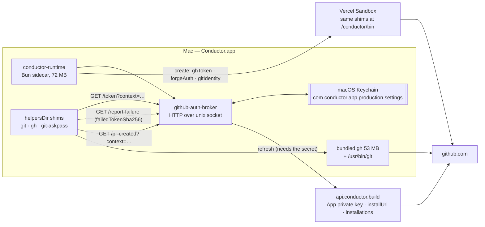
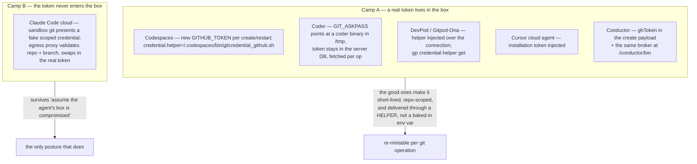

# How Others Do It — Conductor, Cursor, Claude, Codex, Devin, Vercel

*Part 02 of the Zeros GitHub Integration Report · July 2026*

This is the competitive teardown. It leads with Conductor because Conductor is the product the
founder is asking Zeros to match, and because we have something no amount of web research can
buy: a **first-hand, read-only inspection of the live Conductor 0.77.5 install on the founder's
Mac, 2026-07-29** (`.context/conductor-teardown-2026-07-29.md`). Where that teardown and the
public record disagree, the teardown wins and the disagreement is stated.

Everything external is tagged **verified** (primary source or direct observation),
**likely** (strong but single-source or inference), or **unverified** (no source found —
stated so you do not build on it). Code is cited as `path:line` and every citation in this
document was opened before being asserted. Where the evidence pushes back on
`.context/architecture-decision.md`, it is flagged inline and collected in
[§13](#13-where-this-evidence-pushes-back-on-the-spec) for part 10.

Provenance of the claim base: 8 web-research agents produced 207 claims about competitors;
220 independent verifier agents then tried to refute or fact-check each one. 188 survived, and
many survivors carry a `correction` that materially tightens them — those corrections, not the
original claims, are what this document quotes. 19 claims were killed outright; the
instructive ones are in [§12](#12-claims-we-rejected-and-what-that-cost-us). The design panel
and report critics were cut for time, so nothing here has been through a panel.

## The short version

- **Conductor persists the auth method with the credential.** Its on-disk credential is a zod
  **discriminated union** — `{authMethod:"pat", token}` | `{authMethod:"conductor-app", appClientId, token, expiresAt?}` — and `gh CLI` is deliberately absent from the union because under that method nothing is stored. Zeros has one token slot and a non-durable `viaCli` boolean; that shape cannot represent the picker the founder wants.
- **The single most important finding is a mechanism Zeros does not have at all: a git-credential broker.** Conductor runs a local HTTP server on a unix socket (`github-auth-broker`) and injects PATH shims for `git`, `gh` and `GIT_ASKPASS` into every child process, with `GIT_TERMINAL_PROMPT=0`. It refreshes proactively at T−60 s and reactively when a shim reports a 401. The identical mechanism runs **inside the cloud sandbox** at `/conductor/bin`.
- **Conductor bundles the real 53 MB `gh` binary**, so "GitHub CLI not found" is a state their product never enters. Zeros' `detectGhCli()` treats `ENOENT` as a dead end (`src/engine/git/github.ts:243`).
- **`conductor-build` renders as a *private* GitHub App** (**verified**), which per GitHub's own docs can only be installed on the owning account. That is irreconcilable with a multi-tenant install base, so the customer-facing slug is probably a different, still-unknown app — an inference the spec's "theirs is private, ours must be public" argument should not lean on, even though its conclusion is right.
- **The GitHub App exists because of a public flogging.** Conductor launched GitHub support on an OAuth App with `repo` scope on 2025-07-19; three days later, after HN comment 44628912 ("Full read-write access required to all your Github account's repos. Not just code. Settings, deploy keys."), 0.0.21 shipped fine-grained App permissions *plus* the gh-CLI escape hatch. Zeros' current device flow requests `["repo","read:org"]` — the same exposure that earned that comment.
- **Nobody else ships a three-way picker.** The closest shipped analogue is Claude Code on the web's **two** named methods in a `Method / How it works / Best for` table. Desktop IDEs ship two (OAuth + paste-a-token); web platforms ship one (their GitHub App). Conductor's three-row radio with a RECOMMENDED badge, an identity row, a ⟳ Refresh and a repo-access summary is ahead of all of them — and is publicly undocumented, so there is no external validation that it works.
- **Two industry lessons invalidate the naive "GitHub App ⇒ per-repo scoping + green tick" story.** Anthropic states outright that App installation "is not a session-level access control"; Cursor's sandbox receives an installation token minted *narrower* than the app's grants, so `git push` works while `POST /issues` returns 403 — a documented, still-unfixed, 6-month-old bug class. A health readout derived from declared permissions lies.
- **The frontier is a credential proxy, not a better token.** Claude Code cloud keeps GitHub credentials outside the VM entirely and validates the git request (repo + branch) before attaching the real token. Cursor, the one product that injects a token, is precisely where the permission bugs live.
- **Contra the brief: several vendors *do* publish their App permission set** — Cursor (8 groups, each with a user-facing reason), Devin (9 read-only + 8 read/write), Vercel (a full table), Anthropic (3 active + 4 requested). **Conductor** is the one that does not. Publishing ours is a cheap, real differentiator.

## 1. Conductor — the inside view

### 1.1 The persisted credential is a discriminated union on auth method

From zod schemas embedded in `bin/.internal/conductor-runtime` (the 72 MB Bun-compiled
sidecar; **verified by observation**):

```js
f.union([
  f.object({ authMethod: f.literal("pat"),           token: f.string() }),
  f.object({ authMethod: f.literal("conductor-app"), appClientId: f.string(),
             token: f.string(), expiresAt: f.string().optional() }),
])
```

Three things this settles:

1. **The method is stored with the credential, not inferred.** This is the exact structural fix
   the Zeros spec calls for. Today Zeros derives "which method" per session and loses it on
   restart (confirmed finding `no-persisted-auth-method`, `src/zeros/panels/github-section.tsx:93`;
   the transient flag lives at `src/zeros/store/read-caches.ts:19`).
2. **`gh CLI` is absent from the union by design** — under that method Conductor stores nothing
   and reads from `gh` on demand. So "three methods" does not mean "three token slots"; it means
   two stored credentials plus one delegation. That is a cheaper schema than the spec's
   three-slot model and worth considering.
3. **The App credential on the Mac is a user-to-server token with an `expiresAt`** — not a raw
   installation token and certainly not the App private key. The private key is server-side.

Supporting schemas in the same region of the binary (**verified by observation**):

| Schema | What it tells us |
|---|---|
| `{ accessToken, accessTokenExpiresAt, refreshToken }` | a real refresh-token flow, not paste-and-pray |
| `{ minRemainingMs, forceRefresh, allowRefresh, validationMode }`, `validationMode: "background"\|"blocking"\|"none"` | validation is a **mode**, chosen per call site — a settings-open blocking check is a different call than a background revalidate |
| `{ failedTokenSha256, minRemainingMs }` | failures are reported by **token fingerprint**, so a stale retry is distinguishable from a fresh failure |
| `{ key, label, clientId, appSlug }`, `{ variants: [...] }` | **multiple GitHub App variants at once** — github.com plus GHE as config rows |
| `{ installUrl }` | the **server** builds the install URL; the client does not construct it |
| `{ installationId, accountLogin, accountType, targetType, suspendedAt, createdAt, repositoryCount, repositoryNames[] }` | the *installation* is modelled, not just the token |
| `{ installationId } -> { linked: true }`, `{ disconnected: true }` | link-install-to-org and disconnect are first-class operations |

`repositoryCount` + `repositoryNames[]` is the data behind the screenshot's
"All repositories accessible." line, and is what would let the same row render
"3 of 12 repositories". `suspendedAt` means the suspended-installation state — one of the
403-producing states that would durably sign a Zeros user out today via
`isAuthError()` at `src/engine/git/github.ts:390` — is explicitly handled.

### 1.2 Enterprise and SSO are modelled as fields, not error strings

A protobuf message in the bundle carries `installations[]`, `github_connected`,
`team_has_bugbot_repos`, `github_usernames`, `ghe_hostname`, `ghe_app_slug`,
`sso_required_orgs[]`, `sso_required_org_display_names[]`.

`team_has_bugbot_repos` is a **Cursor** field, so this specific message is most likely Cursor's
GitHub-connection API riding along inside the bundled `cursor-sdk-store` — **inference, not
verified as Conductor's own**. It is still a useful reference shape, and the durable point holds
either way: a serious integration carries `ghe_hostname` / `ghe_app_slug` and
`sso_required_orgs` as typed fields. Zeros today has neither, and its SAML failure mode is a
403 that deletes the credential.

Conductor's own GHE support is independently **verified** from the changelog: 0.22.4
(2025-11-18) "Expand Terminal, Env Vars, and GitHub Enterprise"
([changelog](https://www.conductor.build/changelog)). That is the sequencing lesson — their host
abstraction had to absorb GHES *before* anyone asks about GitLab, and a GitHub App installed on
github.com is worthless against a GHES host. Credential records must be keyed by
`(providerId, hostOrigin, method)`, which is also why `repoSlugFromOriginUrl` deliberately
dropping the host (`src/engine/git/repo.ts:27-29`) has to be fixed before a second forge exists.

### 1.3 The git-credential broker — the finding that matters most

Conductor does **not** rely on the user's git credential helper. It runs a local HTTP server on
a unix socket (logger tag `github-auth-broker`) and shims every git/gh child process.

Environment injected into every git/gh child (**verified by observation**):

```js
envForContext(contextId, base) {
  return {
    CONDUCTOR_GIT_AUTH_CONTEXT: contextId,
    CONDUCTOR_GIT_AUTH_SOCKET:  socketPath,
    CONDUCTOR_REAL_GH_PATH:     realGhPath,
    CONDUCTOR_REAL_GIT_PATH:    "/usr/bin/git",
    GIT_ASKPASS:                askpassShimPath,
    GIT_TERMINAL_PROMPT:        "0",
    PATH:                       `${helpersDir}:${basePATH}`,
  };
}
```

Three shims are written into `helpersDir`: `["git-askpass", …], ["gh", …], ["git", …]`.
`git` and `gh` are shimmed **on PATH**, not merely via `GIT_ASKPASS` — so when the *agent*
types `gh pr create` or `git push` in a terminal, it hits the broker too.
`CONDUCTOR_REAL_GH_PATH` / `CONDUCTOR_REAL_GIT_PATH` are how the shims delegate onward without
recursing.

Broker HTTP API over the socket (`GET` only; anything else, including any non-`GET` method, 404s):

| Route | Purpose |
|---|---|
| `GET /token?context=<id>` | hand a fresh token to a shim |
| `GET /report-failure?context=<id>&failedTokenSha256=<sha>` | shim saw a 401 → force refresh, return the new token |
| `GET /pr-created?context=<id>` | the `gh` shim reports a successful `gh pr create` |

Per-context token entry: `{ token, expiresAtMs, refreshUserId, tokenSha256, validity:"unknown"|"invalid", lastRefreshAttemptAtMs, lastRefreshCompletedAtMs }`.

Observed constants and behaviour:

- `Ktr = 60_000` — refresh **proactively** when under 60 s of life remains.
- `Nxt = 21_600_000` (6 h), `Xtr = 60_000`, `Qtr = 5_000` — other broker timers.
- `Vtr = "/conductor/bin"` — the in-sandbox helpers directory, i.e. **the same shim mechanism
  runs inside the rented cloud sandbox**.
- `P1t = "__conductor_workspace_owner__"` — a sentinel refresh-user id for "the workspace
  owner", used when the sandbox itself needs a token.
- If refresh fails, it **serves the stale token anyway** and logs `"Serving existing GitHub
  token after refresh failed; downstream git/gh may see 401"`. Degrade, never delete — the
  opposite of Zeros' current behaviour and of Coder's (see §10).
- Telemetry: `token_set`, `token_updated`, `token_cleared`, `token_failure_reported`,
  `token_refreshed_after_failure`, `token_served_after_refresh_failed`. Six events, all about
  credential lifecycle. Zeros has **zero** telemetry on any GitHub flow (confirmed finding
  `no-github-telemetry`).



**Why this is the highest-leverage thing in the document.** One mechanism closes four Zeros
defects at once:

| Zeros defect today | Where | What the broker does about it |
|---|---|---|
| The persisted token reaches Octokit only; every network git op uses the user's ambient credential helper | `src/engine/git/github.ts:898` ("The push relies on the user's git credential helper (gh)"), `src/engine/git/github.ts:1076`, `src/engine/git/ops.ts:126` | the helper *is* Zeros, per operation, per host |
| Short-lived App tokens are unusable because nothing refreshes mid-run | — | T−60 s proactive + 401-reported reactive refresh |
| The agent's own `gh pr create` / `git push` in the PTY is a fourth, unguarded path (`agent-driven-push-is-a-fourth-uncontrolled-path`) | `src/shell/pr/pr-instructions.ts:78`, `src/shell/pr/create-pr-button.tsx` | PATH-shimming `git` and `gh` covers the PTY without rewriting the agent flow |
| A cloud sandbox has no `gh` login and no keychain | — | identical code path, different socket, helpers at `/conductor/bin` |

One collision to design around, and it is real: **`GIT_ASKPASS` is already on the Zeros
dangerous-env denylist** — `src/engine/settings/env-names.ts:70`, with the comment at `:69`
reading "git runs GIT_ASKPASS on any HTTPS fetch/push/clone". That denylist exists to stop
repo- and relay-supplied env from becoming an arbitrary-exec credential vector. The broker's
env must therefore be set by *trusted engine spawn code*, and whoever implements this must not
"fix" the denylist to make it work.

### 1.4 Cloud sandbox credential delivery

The sandbox-creation payload (**verified by observation**):

```js
{
  clientId, organizationId?, repoId?, repoUrl, repoDefaultBranch?,
  branchInfo: { baseBranch, newBranchName },
  ghToken?: string,
  forgeAuth?: union({ gitForge: "github", hostname?: string, token?: string },
                    { gitForge: "local-git" }),
  extraEnv?: { GH_TOKEN?: string },
  gitIdentity?: { name?, email? },
  gitPullConfig?: { pullRebase?, pullFf? },
  sshPublicKey?: string,
  filesToSync?: [{ path, content }],
  resolvedSetupConfig?, personalSetupConfig?, homeSetupConfig?,
  provider?: "vercel",
  machine?: { machineId, repositoryId },
}
```

Four observations:

- The provider seam is named **`gitForge`**, values `"github" | "local-git"`, with `hostname`
  already present for GHE. That is a better name than anything in the Zeros tree and a good
  precedent for the GitLab/Bitbucket work.
- A token **is** passed in (`ghToken` / `extraEnv.GH_TOKEN` / `forgeAuth.token`) — so Conductor
  is in Camp A of §10, not Anthropic's Camp B. But `Vtr = "/conductor/bin"` shows the broker
  also runs in-sandbox, so the injected token is a bootstrap, not the only path.
- `gitIdentity: { name, email }` is an explicit input: **commit attribution is configured, not
  an accident of whichever token pushed.**
- `provider: "vercel"` corroborates Vercel Sandbox as the compute provider, matching
  `docs/cloud-workspace/02-how-conductor-does-it.md`.

The public docs say something stronger than the payload does. Conductor's cloud docs state
verbatim (**verified**): *"git and gh are already authenticated inside the sandbox. Do not copy
GitHub tokens into cloud environment variables."*
([cloud env vars](https://www.conductor.build/docs/cloud-beta/environment-variables)) A verifier
killed the claim that this proves "sandboxes are credentialed by the control plane, never by the
user" — the quote is real, the architectural conclusion was overreach. The payload's `ghToken`
field is why. **Read the doc line as a user instruction, not as an architecture statement.**

### 1.5 Where the credential actually lives

- **macOS Keychain**, service `com.conductor.app.production.settings` — note the `production`
  channel qualifier, the same per-channel split Zeros uses for `secrets.json`. Independently
  corroborated by changelog 0.69.0 (2026-06-23), "Improved secure storage for local auth and API
  key settings by moving them to macOS Keychain-backed storage" (**verified**).
- **Not** in `conductor.db` (2.98 GB SQLite on the inspected machine). The only git-related
  table is `repos` (`id, remote_url, name, default_branch, root_path, setup_script, remote,
  conductor_config, custom_prompt_create_pr, …`) — repo *config*, no credentials, no
  installation rows. Installation state is server-side and fetched on demand. Their privacy docs
  agree: the Fly-hosted Postgres stores "Your account data (such as your email address, and if
  you integrate with GitHub, installation data)" (**verified**).
- PR state is a **durable keyed cache on disk**, not a DB table:
  `local-storage.entries/git-service-pr-v1/` with 244 entries shaped
  `{ repositoryId, localBranch, prInfo }`, plus `git-service-workspace-changes-v1` and
  `file-diff-cache`. Same idea as Zeros' `useCachedRead`, but keyed by repo+branch and durable
  across restarts — where Zeros' `ghAuthStatusCache` is in-memory and keyed by the literal
  string `"auth"` (`src/zeros/panels/github-section.tsx:89`).
- **Log redaction** replaces matches with `[REDACTED_GITHUB_TOKEN]`, `cond_[REDACTED]`,
  `sk-[REDACTED]`.

### 1.6 What Conductor's public record adds

**The App is a response to a public failure (verified, precisely dated).** Show HN was
2025-07-17 ([item 44594584](https://news.ycombinator.com/item?id=44594584)) with *no* GitHub
integration. GitHub support shipped two days later in 0.0.17 (2025-07-19) on a GitHub **OAuth
App**. On 2025-07-20 at 20:16 UTC, `itsalotoffun` posted
([44628912](https://news.ycombinator.com/item?id=44628912)): *"Full read-write access required
to all your Github account's repos. Not just code. Settings, deploy keys. The works. Full access
to your organisation settings. Not a privacy policy in sight."* — and separately documented the
`repo` scope's surface ([44632926](https://news.ycombinator.com/item?id=44632926)): Code,
Issues, PRs, Wikis, Settings, Webhooks, Deploy keys, Collaboration invites, plus org projects,
invitations, team memberships and webhooks. `lachances`
([44627021](https://news.ycombinator.com/item?id=44627021)) had asked the same day for a way to
avoid full write access. Founder Charlie Holtz replied to both at ~21:24 UTC
([44629428](https://news.ycombinator.com/item?id=44629428),
[44629433](https://news.ycombinator.com/item?id=44629433)) that OAuth "unfortunately doesn't
allow for fine-grained permissions" and "We're switching our sign-in to a GitHub App so we can
make the permissions fine-grained." On 2025-07-22 at 22:22 UTC:
[*"Fixed! You can now give Conductor fine-grained GitHub repository access. Or, skip the
integration and use your local GitHub CLI auth."*](https://news.ycombinator.com/item?id=44653668)
Changelog 0.0.21, ["Fine-grained GitHub
permissions"](https://www.conductor.build/changelog/0.0.21-fine-grained-github-permissions), is
dated 2025-07-22. **The OAuth App was live for about three days.**

Two things Zeros should read off that timeline. First, the escape hatch shipped *in the same
release as the App* — the gh-CLI row is not a legacy accommodation, it is what made the App
palatable. Second, Zeros' current device flow requests `["repo","read:org"]` against a baked-in
OAuth App: the same all-or-nothing surface, the same headline available to anyone who looks.

**`conductor-build` is a private GitHub App (verified, and the implication is unresolved).**
`github.com/apps/conductor-build` renders the literal string *"Conductor.build is a private
GitHub App."* and omits the description/Developer/Website block that public app pages render;
`api.github.com/apps/conductor-build` 404s; `github.com/marketplace/conductor-build` 404s. A
sibling private app exists at `github.com/apps/conductor-dev` ("Conductor (dev)"). The verifier
explicitly killed a weaker signal: the absence of an Install button is *not* evidence, because
the button is auth-gated and the public `/apps/cursor` page has none either.

Per [GitHub's docs](https://docs.github.com/en/apps/using-github-apps/installing-a-github-app-from-a-third-party),
a private GitHub App **can only be installed on the account that owns it**. That cannot describe
the app Conductor's customers install. The most economical reading — **inference, not verified** —
is that `conductor-build` and `conductor-dev` are Melty Labs' internal apps, and the
customer-facing app has a slug we never found. The teardown supports this: `appSlug` exists as a
schema field but its *values* are server-supplied, and no `github.com/apps/<slug>` URL appears
in plaintext in either binary. The `{ key, label, clientId, appSlug }[]` variant list makes
multiple app registrations the expected shape rather than a surprise.

Consequence for the spec: `.context/architecture-decision.md` argues Zeros' App must be public
because "Conductor's `conductor-build` is a *private* GitHub App, which per GitHub's docs can
only be installed on the account that owns it". The **conclusion is right** — a public app gets
permissions transparency and any-org installability — but the premise is shakier than stated.
Make the argument on its own merits.

**The 0.65.2 changelog block is the best public description of the machinery behind the
screenshot (verified; June 2026, not July).** Published under the 0.65.0 entry (pubDate
2026-06-12; 0.65.2 landed ~2026-06-13–16, before 0.66.0 on 2026-06-16), verbatim:

> "Improved GitHub access setup to prefer the GitHub app path and preserve reusable personal access tokens."
> "Conductor now warns before creating a workspace when your GitHub access does not include the selected repository."
> "Fixed an issue where a GitHub access warning could send you to the wrong GitHub permission flow."
> "Fixed GitHub access refresh so it rechecks repository access without creating a new token."
> "Fixed an issue where GitHub token metadata could be stored incorrectly."

([changelog](https://www.conductor.build/changelog); the RSS feed at
`https://www.conductor.build/changelog/rss.xml` carries the full patch-section text, which the
HTML index does not — use it.) Four design instructions fall straight out:

1. "Prefer the GitHub app path" **and** "preserve reusable personal access tokens" is the
   RECOMMENDED badge plus the separate-slots requirement, shipped as one line.
2. A **pre-flight** warning before workspace creation when the selected repo is outside your
   access. Not an error after the clone fails.
3. **Refresh must re-check access without minting a new token.** The naive ⟳ mints on every
   click, churns tokens, burns rate limit, and can mask a genuinely revoked installation.
   Conductor shipped this as a *bug fix*, which tells you which way the naive implementation goes.
4. A warning that "could send you to the wrong GitHub permission flow" means there are at least
   two distinct remedies — authorize-the-app vs add-this-repo-to-the-installation — and routing
   between them is a thing you can get wrong.

**The rest of the changelog trail** (all **verified** against
[conductor.build/changelog](https://www.conductor.build/changelog)): 0.25.4 / 0.25.11 (Dec 2025)
two-way PR comment sync; 0.32.0 (2026-01-22) workspaces from GitHub issues; 0.33.2
(2026-01-28) ["View GitHub Actions in
Conductor"](https://www.conductor.build/changelog/0.33.2-view-github-actions-in-conductor);
0.74.0 (2026-07-09) — you can now **disconnect** the Conductor GitHub app from the **Local and
Cloud** GitHub settings (two panes, each with its own connect/disconnect), the clone dialog
"suggests SSH or HTTPS URLs based on your GitHub CLI setup and explains git authentication
failures", and "Git commands now automatically fall back to HTTPS when the network blocks SSH,
so you can create workspaces and push/pull on plane or hotel wifi"; 0.76.0 (2026-07-16) plus a
trailing "New in 0.76.1" note — "GitHub App installation tokens in the new JWT format are now
fully redacted from logs"; 0.77.0 (2026-07-23) — "Cloud workspaces now honor the GitHub
credential selected in Settings" and "Fixed cloud onboarding links opening Home instead of setup
and repositories remaining hidden after connecting GitHub".

Read those two 0.7x lines carefully. The log-redaction note is evidence that installation tokens
**leaked into their logs** — and it dates their handling of GitHub's new
`ghs_APPID_JWT` format, announced [2026-04-24](https://github.blog/changelog/2026-04-24-notice-about-upcoming-new-format-for-github-app-installation-tokens/)
with rollout from 2026-04-27 and a per-request opt-in header documented
[2026-05-15](https://github.blog/changelog/2026-05-15-github-app-installation-tokens-per-request-override-header/):
the `ghs_` prefix is retained, the token is **~520 characters of variable length containing
dots**, the embedded JWT is signed by a GitHub-internal issuer and must not be validated by
clients, and it applies to GHEC and Data Residency but not GHES. Every storage column, wire
type and `ghs_[A-Za-z0-9]{36}` regex in Zeros must be checked against that.

The 0.77.0 line is the more damning one: "Cloud workspaces now honor the GitHub credential
selected in Settings" shipped as a **fix**, a year after the App landed. A stored selection is
only real if every consumer obeys it. Zeros has the same hazard pre-built: `detectGhCli()` writes
the token store as a side effect of the Settings *read* path (`src/engine/git/github.ts:249`,
confirmed finding `detectghcli-persists-during-a-read`), and Sign Out immediately re-adopts the
`gh` token so a gh-CLI user cannot disconnect at all
(`src/zeros/panels/github-section.tsx:164`). Add an explicit picker on top of that and you get
silent method switching.

**Public complaints exist, contra an earlier claim.** A verifier pulled
`meltylabs/conductor-releases` twice (REST API and HTML search) and found at least three open
GitHub-auth issues — the earliest observed is #20, opened 2026-06-11. Support is otherwise
routed to `support@conductor.build`, so the visible sample is small, not empty.

### 1.7 What could not be established about Conductor

- **The App slug and its requested permission set.** The Tauri webview assets are compressed
  inside the Rust binary; no `github.com/apps/<slug>` URL appears in plaintext. `appSlug` values
  are server-supplied. On the public side the permissions are *sign-in-gated* rather than
  genuinely secret — any signed-in user who starts the install flow sees the full read-vs-write
  breakdown on the authorize screen — but nobody has published it, and HN user `kernelbugs` asked
  for exactly this ([44789594](https://news.ycombinator.com/item?id=44789594), 2025-08-04:
  the permission list, token storage, and server-side components) and got **zero replies**, a
  year ago.
- **The settings-screen copy.** "All repositories accessible.", "Conductor GitHub app",
  "gh CLI auth", "Personal Access Token" — same compressed-bundle reason. The founder's
  screenshot remains the only evidence, and no Conductor docs page documents the GitHub settings
  pane at all (the docs sitemap has no GitHub page;
  [security-and-permissions](https://www.conductor.build/docs/reference/security-and-permissions)
  covers only local execution, tool approvals, macOS prompts and network egress). **Treat the
  screenshot as the spec, but not as a validated pattern.**
- **Whether the OAuth callback returns via `conductor://` or a loopback port.** The scheme is
  registered (`CFBundleURLSchemes = [conductor]`), which is suggestive, not proof. Every
  *documented* deep link is workspace-oriented (`conductor://prompt=`, `conductor://linear_id=`,
  `conductor://async?repo=`); no auth/callback link is documented
  ([deep links](https://www.conductor.build/docs/reference/deep-links)). The backend hands back
  an `installUrl` and the redirect target is configured GitHub-side, invisible from the client.
  We found **no evidence of a loopback HTTP server and no evidence of a `state` param**. Balance
  of evidence favours browser → GitHub → a `conductor.build` web callback → deep-link hand-back,
  but this is **unverified**.
- **The `api.conductor.build` endpoint paths.** Only the bare origin appears in plaintext.

## 2. Anthropic — Claude Code

Anthropic ships the closest thing to the founder's picker, and the strongest cloud-credential
architecture in the field.

### 2.1 `/install-github-app` — the in-CLI install entry point

`/install-github-app` installs the Claude GitHub App on a selected repository and *then asks*
whether to continue with GitHub Actions setup; since v2.1.187 (2026-06-23) the user can choose
"Skip for now" and end with only the App installed, re-running later to add the workflow and
secret (**verified**;
[docs](https://code.claude.com/docs/en/github-actions)). Current docs wording: "The command
installs the Claude GitHub App on your repository and then walks you through adding the GitHub
Actions workflows and the API key secret." Also verbatim: **"You must be a repository admin to
install the GitHub app and add secrets."** The quickstart is Claude-API-only — Bedrock and Google
Cloud users must do manual setup.

Two lessons: the install entry point belongs in the **agent CLI surface**, not only in Settings
(Factory shipped the same command — see §8); and **"you lack admin rights on `<org>`" is a
distinct state** the health readout must render, not a generic failure.

### 2.2 Claude Code on the web — two named methods in a table

The single best IA reference for the Zeros picker (**verified**;
[claude-code-on-the-web](https://code.claude.com/docs/en/claude-code-on-the-web), section
"GitHub authentication options", corroborated by
[web-quickstart](https://code.claude.com/docs/en/web-quickstart)). A `Method / How it works /
Best for` table:

| Method | How it works | Best for |
|---|---|---|
| GitHub App | "Authorize the Claude GitHub App during web onboarding" | "Browser onboarding; teams that want Auto-fix" |
| `/web-setup` | "Run `/web-setup` in your terminal to sync your local `gh` CLI token to your Claude account" | "Individual developers who already use `gh`" |

Docs say "Either method works." Four qualifiers the same section attaches, all **verified**:

1. The App is **required for Auto-fix**, which relies on the App's PR webhooks. "Either method
   works" covers clone/push, not Auto-fix. This is the honest form of the per-row capability
   disclosure Zeros needs.
2. **Neither method is per-repository access control** — see §2.3.
3. `/web-setup` is not universally available: Team/Enterprise Owners can disable it via the
   "Quick web setup" toggle at `claude.ai/admin-settings/claude-code`; it is hidden for
   Zero-Data-Retention orgs, when Claude Code on the web is disabled org-wide, or when the CLI
   is authenticated by API key. **An admin-disableable method is a state the picker must render.**
4. Only GitHub is supported for cloning and PR creation (GHES on Team/Enterprise). GitLab and
   Bitbucket reach a cloud session only as a local bundle, and such sessions **cannot push back**.

Note what Anthropic did *not* do: they collapsed "gh CLI" and "device flow" into one method by
syncing the `gh` token server-side. Two rows, not three. Zeros elevating PAT to a peer row is a
deliberate departure that needs justifying in the row copy (§9).

### 2.3 "App installation is not a session-level access control"

Verbatim from the same page (**verified**):

> "With either method, a cloud session can access any repository the connecting GitHub account
> can see, not just the repositories the Claude GitHub App is installed on. App installation
> enables PR webhooks for Auto-fix; it is not a session-level access control. To restrict which
> repositories your team can reach from cloud sessions, restrict access on GitHub itself, for
> example by limiting team or repository membership for the connected GitHub accounts."

Reinforced twice more: the "Session creation failed" troubleshooting entry says "Installing the
App on the repository isn't required"; web-quickstart repeats it. One caveat in the other
direction: closed-as-not-planned issue
[anthropics/claude-code#57641](https://github.com/anthropics/claude-code/issues/57641) (May 2026)
reports that in practice a public repo you neither own nor have the App installed on cannot be
targeted, so real reach may be narrower than the prose. And on **GHES** the statement does not
carry over — there, session git credentials are "scoped to the session's repositories".

**This is the most quotable warning in the document.** If the Zeros settings screen puts
"All repositories accessible." next to a GitHub App radio, that line must be computed from a
credential that is genuinely installation-scoped for every operation — clone, push, and API. Any
silent fallback to a user access token makes the scoping claim false, and Zeros would have
shipped Anthropic's caveat without Anthropic's honesty about it.

### 2.4 The GitHub proxy — credentials never in the sandbox

**Verified**, from [cloud-environments § GitHub
proxy](https://code.claude.com/docs/en/cloud-environments) and
[claude-code-on-the-web](https://code.claude.com/docs/en/claude-code-on-the-web) ("Security and
isolation"), with the "custom-built scoped credential" phrasing originating in
[Anthropic's sandboxing post](https://www.anthropic.com/engineering/claude-code-sandboxing)
(2025-10-20):

- "sensitive credentials such as git credentials or signing keys are never inside the sandbox
  with Claude Code. Authentication is handled through a secure proxy using scoped credentials."
- "All GitHub operations go through a dedicated proxy that keeps your real GitHub credentials
  outside the session's VM." The git client "uses a scoped credential, which the proxy verifies
  and swaps for your actual GitHub token."
- **Push protection**: "`git push` works only against the session's current working branch."
  Clone, fetch and PR operations work normally.
- **Repository scope**: GitHub API and release-asset requests reach only repositories attached to
  the session; unattached repos return 403.
- The proxy operates independently of the environment's network access level
  (None/Trusted/Full/Custom).

Three caveats the verifier added, and they matter:

1. The guarantee covers **proxy-managed GitHub credentials, not every credential**. Cloud
   environments have no secrets store; other secrets go into plaintext env vars copied into the
   VM, readable by anyone using the environment.
2. If the user sets `GH_TOKEN` or `GITHUB_TOKEN` themselves, it "passes through to the container
   unchanged" — a real token then does live in the sandbox. Left unset, both read as the literal
   placeholder `"proxy-injected"`.
3. **The proxy is GitHub-only.** It does not generalise to GitLab or Bitbucket.

So `.context/architecture-decision.md`'s summary — "Claude Code's cloud sessions go further and
keep GitHub credentials out of the sandbox entirely" — is right in substance and slightly
over-absolute in wording. The branch-scoping is the cheap part worth copying in phase 1 even
without a proxy: mint the sandbox credential for one repository and enforce one ref.

### 2.5 The Managed Agents API — the only public model of mid-session token rotation

A separate product from the cloud sessions above, and the only one in the field that publicly
models the fix for expiry-mid-run (**verified**;
[managed-agents/github](https://platform.claude.com/docs/en/managed-agents/github)). A repo is
mounted as a session resource: `{ type: "github_repository", url, mount_path, authorization_token }`
— `type`, `url`, `authorization_token` required; `mount_path` defaults to
`/workspace/<repo-name>`; an optional `checkout` takes `{type:"branch",name}` or
`{type:"commit",sha}`. "The `resources[].authorization_token` authenticates the repository clone
operation and is not echoed in API responses." A live session's token is rotated via
`sessions.resources.update` with a new `authorization_token`, but "Repositories are attached for
the lifetime of the session; to change which repositories are mounted, create a new session."

Two details the verifier surfaced: the token is **never placed inside the container** — git and
REST calls route through an Anthropic-side git proxy that injects it after the request leaves the
sandbox; and a `github_repository` mount grants filesystem + git access only, with PR opening
requiring the GitHub MCP server whose credentials live in a vault (`vault_ids`), not in
`authorization_token`. The docs recommend fine-grained PATs with minimum permissions, while the
adjacent scope table is written in classic-OAuth terms — a small internal inconsistency worth
knowing before you copy their table.

**Design instruction for Zeros:** put a token-refresh message in the engine↔sandbox control
channel from day one. A 1-hour installation token across a 6-hour agent run needs re-minting five
times; retrofitting that channel is the expensive version.

### 2.6 The Claude GitHub App's permission set — published, and small

**Verified**, from
[claude-code-action/docs/security.md](https://raw.githubusercontent.com/anthropics/claude-code-action/main/docs/security.md)
and [github-actions](https://code.claude.com/docs/en/github-actions): **actively used** —
Contents (Read & Write), Pull requests (Read & Write), Issues (Read & Write). Additionally
*requested but not yet actively used* per `security.md`: Discussions (R/W), Actions (Read),
Checks (Read), Workflows (R/W). The custom-equivalent-app minimum is Contents R/W, Issues R/W,
Pull requests R/W, **no account permissions**.

That "not yet used" list is stale: on 2026-02-27 the app pushed a permission-upgrade notice
raising Checks from read-only to Read & Write
([claude-code-action#1041](https://github.com/anthropics/claude-code-action/issues/1041), still
open with no maintainer explanation), and the request to add `actions:read` for claude.ai/code
([#1014](https://github.com/anthropics/claude-code-action/issues/1014)) closed as completed on
2026-04-16.

Also **verified**: `claude-code-action` receives "a short-lived token scoped specifically to the
repository it's operating in" with "no cross-repository access". For custom apps the minting
recipe is `actions/create-github-app-token` with hyphenated `app-id` / `private-key` inputs
(the underscore forms in some docs are secret *names*, not action inputs) — and while Anthropic's
docs pin `@v1`, the current upstream major as of July 2026 is **v3** (latest v3.2.0). One honesty
note: "no cross-repository access" describes the default path only. On the custom-app path
`create-github-app-token`'s `owner` / `repositories` inputs can mint a multi-repo token, and
`claude-code-action`'s `additional_permissions` widens scope. **Single-repo scoping is a
configuration default, not an enforced guarantee** — the same trap as §2.3, one layer down.

### 2.7 Auto-fix acts as the user — and documents the hazard

**Verified**: "These replies are posted using your GitHub account, so they appear under your
username, but each reply is labeled as coming from Claude Code, so reviewers know it was written
by the agent and not by you directly." And the Warning:

> "If your repository uses comment-triggered automation such as Atlantis, Terraform Cloud, or
> custom GitHub Actions that run on `issue_comment` events, be aware that Claude can reply on
> your behalf, which can trigger those workflows. Review your repository's automation before
> enabling auto-fix, and consider disabling auto-fix for repositories where a PR comment can
> deploy infrastructure or run privileged operations."

Auto-fix still requires the App installed (for webhooks) even though replies post as the user.
This is distinct from `claude-code-action`, which posts as `claude[bot]`.

**Identity is a product fork, not a detail.** Acting as the user (what Zeros does today) keeps
attribution honest and dodges bot-author ruleset fights, but can trip comment-triggered CI.
Acting as a bot (Copilot, Devin, Factory) is cleaner but collides with branch protection (§7).
Whichever Zeros picks, say it in the Settings card, because it changes what lands on the user's
contribution graph.

### 2.8 The non-GitHub fallback: a one-way bundle

**Verified**: "When you run `claude --cloud` from a repository that isn't connected to GitHub,
Claude Code bundles your local repository and uploads it directly to the cloud session" — full
history across all branches plus uncommitted changes to **tracked** files (untracked files are
not included), requires at least one commit, forced with `CCR_FORCE_BUNDLE=1` (`--remote` is a
deprecated alias). The 100 MB figure is a **soft** limit: "Larger repositories fall back to
bundling only the current branch, then to a single squashed snapshot of the working tree, and
fail only if the snapshot is still too large." "Sessions created from a bundle can't push back to
a remote unless you also have GitHub authentication configured." Bundle upload is CLI-only —
there is no bundle path in the `claude.ai/code` web UI.

The default Trusted network allowlist already includes `gitlab.com`, `registry.gitlab.com`,
`bitbucket.org` and `api.bitbucket.org`, so this is a product-support limitation rather than a
network block — a token in env vars could technically push. They chose not to support it.

**Anthropic, with vastly more resources, has not natively integrated GitLab or Bitbucket for
cloud execution.** That is the realistic staging plan: GitHub App plus cloud push first;
GitLab/Bitbucket cloud workspaces read/execute-only behind the existing
`resolveReviewProvider` seam (`src/shell/pr/review-provider.ts:78` — which today ignores its
`_originHost` argument entirely).

## 3. OpenAI — Codex

**The integration is a GitHub App named "ChatGPT Codex Connector"**, published by `@openai`,
described as "Bring ChatGPT and Codex to your GitHub repositories"
([app page](https://github.com/apps/chatgpt-codex-connector)). Its reported configuration is
"Read and write access to actions, code, issues, pull requests, and workflows" — but that line is
only the *write* half; the full grant also includes read-only access to checks, commit statuses
and repository metadata (**likely** — the app page does not render a permission list publicly, so
the grant string is second-hand). Still current as of July 2026: the July 2026 consolidation of
the Codex desktop app into the ChatGPT desktop app did not rename, re-scope or deprecate it. It
is distinct from the separate read-only ChatGPT "GitHub connector" (May 2025) used for deep
research and code search.

**`workflows: write` is the friction scope.** It is the permission most likely to trigger extra
org-admin approval, because it lets the holder modify CI. This is a direct tension with the Zeros
spec, which mandates Workflows: Write in v1 — see [§13](#13-where-this-evidence-pushes-back-on-the-spec).

**Repo access is picked at connect time and constrained by admins.** "Connect your GitHub account
when prompted, then choose the repositories that Codex can access"
([learn.chatgpt.com/docs/cloud](https://learn.chatgpt.com/docs/cloud), live July 2026), editable
later via the App installation settings. In Business/Enterprise workspaces the admin guide
directs admins to "Limit repository access in the source system to the repositories each audience
needs", and states "Codex cloud respects the repository permissions and protections exposed by
the connected source system" and "Workspace access doesn't bypass those controls"
([admin-setup](https://learn.chatgpt.com/docs/enterprise/admin-setup); **verified** verbatim —
though a verifier found the surrounding claim about the admin toggle path partly misattributed,
see §12).

**Container lifecycle, corrected.** Current docs say "Codex creates a container and checks out
your repo at the selected branch or commit SHA" — but containers are **not** freshly created and
cloned per task as the October 2025 blog said: "Codex caches container state for up to 12 hours
to speed up new chats and follow-ups", and on resume it checks out the chat's branch and runs an
optional maintenance script rather than re-cloning. Agent-phase internet access is off by
default; setup scripts do get internet. PR creation is user-initiated: "When the agent finishes,
it shows its answer and a diff of any files it changed. You can open a PR or ask follow-up
questions."

**Codex is GitHub-only.** Native Bitbucket support is an open feature request
([openai/codex#15618](https://github.com/openai/codex/issues/15618), opened 2026-03-24); GitLab
is reachable only via the GitLab MCP server and Bitbucket via Atlassian's Agentic Pipelines.

### 3.1 Codex is the field's best evidence that "Connected" is a broken affordance

Two distinct failure modes, which should **not** be collapsed into one (**likely**, with the
verifier's separation):

1. **The strong case.** ["GitHub connector 'Connected' but unusable for private repos — OAuth
   token scope never
   applies"](https://community.openai.com/t/github-connector-connected-but-unusable-for-private-repos-oauth-token-scope-never-applies/1365065)
   (2025-11-04): the OP states the connector status "is green and authenticated" while ChatGPT
   cannot list, search or open any private repo file. At least 7 users confirmed; OpenAI support
   called it a known issue under active review; **no fix has been posted and the same symptom is
   still reported in threads dated 2026-06-08 and 2026-07-19.**
2. **A different mode.** ["Agent unable to write to GitHub (e.g., make a PR) through Codex
   Connector"](https://community.openai.com/t/agent-unable-to-write-to-github-e-g-make-a-pr-through-codex-connector/1355223)
   (2025-08-29): reads succeed, the connector displays write permissions, PR creation fails — a
   *displayed-scope* mismatch rather than a status-indicator lie. At least one participant's case
   resolved as a local cause (repo inside a OneDrive-synced folder).

The defensible lesson from #1: **connection state must be derived from a real scoped capability
probe against a private repo, not from handshake completion or from displayed scopes.** Zeros
already has this exact bug class — "Connected to GitHub" only proves the token can call `/user`
(confirmed finding `capability-not-verified`, `src/engine/git/github.ts:206`) while push falls
through to a credential helper that may not exist (`src/engine/git/github.ts:898`).

## 4. Cursor — best permission copy, worst token bug

**The permission table is the best in the field** (**verified**;
[cursor.com/docs/integrations/github](https://cursor.com/docs/integrations/github)). Eight
permission groups, each with a user-facing *reason*:

| Permission group | Cursor's stated reason |
|---|---|
| Repository access | "Clone your code and create working branches" |
| Pull requests | "Create PRs and leave review comments" |
| Issues | "Track bugs and tasks discovered during reviews" |
| Checks and statuses | "Report on code quality and test results" |
| Actions and workflows | "Monitor CI/CD pipelines and trigger CI re-runs from pull requests" |
| Administration | "Read branch protection and required check rules to determine PR mergeability" |
| Custom repository roles | "Determine user access levels so the correct merge and review options appear" |
| Organization custom properties | "Surface organization-defined repository metadata in filtering" |

Docs state "All permissions follow the principle of least privilege." Install offers "All
repositories" or "Selected repositories". The documented github.com prerequisite is **both**
"Cursor admin access AND GitHub org admin access". The install is **not** org-only — the GHES
path allows user-account registration, and users report personal-account installs coexisting with
org installs. **Steal this copy pattern**: every scope gets a reason string, and
`Administration: read → mergeability` is directly relevant because Zeros already calls
`getPrChecks` and `mergePr`.

Cursor's docs contain **no connection-health readout** — only weak affordances ("Connect… or
Manage Connections if already connected") plus a reactive Troubleshooting section (**verified**
by a verifier who fetched the raw markdown).

### 4.1 App-level grants ≠ installation-token grants

This is the single most actionable competitor lesson in the document (**likely**, with strong
in-sandbox test evidence). Cursor's cloud/background agent sandbox receives a GitHub App
installation token minted with a **narrower** permission set than the app's granted installation
permissions. Verified in-sandbox results from
[forum thread 163389](https://forum.cursor.com/t/cloud-agent-gh-git-token-missing-issues-write-despite-github-app-being-granted-issues-read-write/163389)
(2026-06-16):

| Operation | Result |
|---|---|
| `GET /repos/{owner}/{repo}` | 200 |
| `git push` of a new branch | success |
| `POST /repos/{owner}/{repo}/issues` | **403 "Resource not accessible by integration"**, `X-Accepted-Github-Permissions: issues=write` |
| `POST /repos/{owner}/{repo}/issues/{n}/comments` | **403** |

…despite the org grant including Issues: Read & write. The gap is not limited to Issues: Cursor
staff (2026-02-28, 2026-05-06) state the sandbox token also lacks `pull_requests` write, so PR
comments and reviews fail identically while clone/branch/push succeed. Staff confirmation
(2026-05-22, [thread 161308](https://forum.cursor.com/t/cursor-github-app-does-not-have-issue-view-or-create-permissions/161308)):
the app "requests broad permissions at the app level (which users see in installation settings),
but the token actually minted for the sandbox is scoped more narrowly", and on 2026-06-16 they
called it "a known limitation we are working on resolving". **Status 2026-07-29: still unfixed** —
user reports on 2026-07-17 and 2026-07-27, no changelog fix, and the docs still list Issues as a
requested permission without disclosing the narrower sandbox token. The staff workaround is to
set `GH_TOKEN` to a classic PAT with `repo` scope. There is a parallel thread of users hitting
["Repository not accessible to the installation" / "Resource not accessible by integration"
errors despite multiple app
reinstalls](https://forum.cursor.com/t/persistent-repository-not-accessible-to-the-installation-resource-not-accessible-by-integration-errors-on-github-pr-fetch-create-despite-multiple-app-reinstalls-organization-repo/154079).

Two rules for Zeros, both non-negotiable:

1. **Narrowing the sandbox token is right** — mint `contents:write` for push and nothing more.
   Cursor is doing the correct thing.
2. **The health readout must reflect the *minted token's* permissions, not the app's declared
   ones.** `POST /app/installations/{id}/access_tokens` returns a `permissions` object; surface
   that, or probe. Otherwise Zeros reproduces "GitHub says granted, runtime says 403" — and it
   would do so on a settings screen that explicitly promises "All repositories accessible."

### 4.2 Cursor is also the security worked example

**Likely**, with the verifier's important downgrade from "exploited" to "demonstrated":
OWASP's [Top 10 for Agentic Applications 2026](https://genai.owasp.org/) (published 2025-12-09)
ranks **ASI01 "Agent Goal Hijack" first**. **CVE-2026-22708** in Cursor (reported 2025-08-11,
fixed in Cursor 2.3 in January 2026) let prompt injection abuse implicitly-trusted shell built-ins
(`export`, `typeset`, `declare`) to poison env vars such as `PAGER` in Auto-Run/Allowlist mode, so
already-allowlisted commands like `git branch` executed attacker-controlled code. And in July 2025
General Analysis published a **proof-of-concept** — not a real-world breach — in which Cursor
driving Claude over the Supabase MCP server with a `service_role` key that bypasses RLS read an
attacker-authored support ticket, queried the private `integration_tokens` table, and wrote the
credentials back into the attacker-visible thread, on a throwaway project with dummy data.

None of the three is confirmed in-the-wild exploitation. All three are sufficient to justify the
one design gesture that gives the three-row picker a reason to exist beyond preference:
**"Personal Access Token" should be visibly marked as not available for cloud workspaces** — a
capability difference per method, not a silent downgrade. Note the irony that the environment
whose CVE anchors this argument is also the one product that injects a long-lived-ish token into
the sandbox.

## 5. Devin — the maximal permission ask, and the installation-as-principal model

**Verified** from [docs.devin.ai/integrations/gh](https://docs.devin.ai/integrations/gh)
(current as of 2026-07-24 release notes):

- "You must be an admin of your GitHub organization to create and manage the Devin integration."
- "Devin uses the permissions granted at the organization level, not the permissions of the
  individual user **running a session**." (The trailing three words are usually truncated when
  this is quoted.)
- Install offers "All repositories or Select repositories"; access is adjustable later via the
  org's Settings → GitHub Apps.
- Org install is documented/recommended but **not the only path** — you can connect "either a
  GitHub Organization or a personal GitHub account". GHES / GHEC-with-Data-Residency uses a
  different flow entirely: a **customer-registered GitHub App on their own instance** (limited
  availability), or a fine-grained PAT on a service account requiring just Contents R/W,
  Issues R/W, Pull requests R/W, Metadata RO.
- "Devin cannot create new repositories in your GitHub account", and "Only users who are members
  of the organization that installed the GitHub integration can use it in their Devin sessions."

**The permission ask is the field's upper bound** (**likely**, enumerated in their docs):
read-only on nine categories — dependabot alerts, actions, deployments, metadata, packages,
pages, repository security advisories, members, webhooks — and read/write on **eight** (not nine):
checks, commit statuses, contents, discussions, issues, pull requests, projects, workflows. That
is ~17 categories against Anthropic's 3 actively used. Large permission asks are the top reason
org admins refuse third-party apps; a slim ask is a selling point worth *showing* in the picker.

**Commit authoring is a first-class, five-way org setting** (**likely**;
`app.devin.ai/settings/profile`): "Devin only", "Devin as author, user as committer",
"Co-authored", "User only", "User as author, Devin as committer". GPG signing is configured via
the org-wide environment config, but only yields Verified commits when Devin is the author — in
user-as-author modes Devin overrides `user.email` per session with each user's own email, which
cannot match one shared GPG key. **If Zeros ever offers signed agent commits, that constraint
arrives with it.**

The durable idea: **"the installation, not the person, is the principal."** That is what makes a
cloud-sandbox credential defensible — it is not "the user's PAT in a VM". It also means the Zeros
backend must key installations by org/account while still recording *who* connected them, which
matches Vercel's separation of Login Connections from repo access (§9.3).

## 6. Google Jules — repo allow-listing, and an explicit manual re-sync

**Verified** from [jules.google/docs/faq](https://jules.google/docs/faq/) and
[github.com/apps/google-labs-jules](https://github.com/apps/google-labs-jules) (publisher
`google-labs-code`). At authorization users choose all repositories or specific ones, and adjust
or revoke later on github.com via profile → Settings → Applications → Installed GitHub Apps →
Google Labs Jules → Configure — **"then refresh Jules and your new repos will appear."**
Verbatim on the sandbox: "Each task runs in a fresh virtual machine where Jules clones your repo,
installs dependencies, and makes changes based on your prompt."

Two corrections to the common description: Jules does **not** auto-open a PR — on completion the
user clicks "Publish branch", and opening the PR is a separate action from the adjacent dropdown
(shipped 2025-08-04); as of the 2026-02-19 changelog Jules then auto-detects and fixes CI failures
on PRs it created. And the gating condition is **not** "permission to open pull requests" — it is
that the repo be explicitly allow-listed in the App installation, which requires the ability to
install/configure a GitHub App on that account or org (repo admin or org owner). Since GitHub's
2025-12-01 GA change, **org owners can block repo admins from installing apps entirely**, so a
plain collaborator with write access may be unable to enrol a repo at all. Jules is GitHub-only;
the docs only say "In the future, Jules will work with more version control systems."

That "then refresh Jules" instruction is the best external evidence that the **⟳ Refresh control
in the Conductor mock is a real need, not decoration**: GitHub App repo-selection changes are not
pushed to integrators promptly, so even Google exposes a manual re-sync.

**How the Jules VM authenticates its clone, what identity its commits carry, and whether there is
any connection-health readout are not documented anywhere we could find (unverified).** Do not
cite Jules as precedent for the sandbox credential mechanism. Only Anthropic (proxy), Cursor
(injected installation token) and Copilot (ephemeral Actions environment) have public detail there.

## 7. GitHub Copilot cloud agent — the bot-identity case study

Note the rename: GitHub now calls it **"Copilot cloud agent"**, not "Copilot coding agent"; the
2025-11-13 changelog still carries the old name in its title and URL.

**Identity and signing** (**verified**, verbatim from
[responsible-use/copilot-cloud-agent](https://docs.github.com/en/copilot/responsible-use/copilot-cloud-agent)):
"The cloud agent's commits are authored by Copilot, with the human who started the task marked as
the co-author", and "The cloud agent's commits are signed, so they appear as 'Verified' on
GitHub." Signing is **recent** — it shipped 2026-04-03; before that the agent could not produce
Verified commits and was blocked entirely from repos requiring signed commits. Since 2026-03-20
each agent commit message also carries an `Agent-Logs-Url` trailer linking to the session logs.

**Branch protections can block the agent outright** (**verified**;
[about-cloud-agent](https://docs.github.com/en/copilot/concepts/agents/cloud-agent/about-cloud-agent)):
"If you have configured a ruleset or branch protection rule that isn't compatible with Copilot
cloud agent, access to the agent will be blocked. For example, a rule that only allows specific
commit authors can prevent Copilot cloud agent from creating or updating pull requests." GitHub
shipped [Copilot as a ruleset bypass
actor](https://github.blog/changelog/2025-11-13-configure-copilot-coding-agent-as-a-bypass-actor-for-rulesets/)
in November 2025 — but **only for rulesets, not legacy branch protection rules**, so a repo on
classic branch protection with an incompatible rule has no bypass path at all.

**A bot identity is not free, and GitHub had to build itself an escape hatch that third parties
cannot use.** That is the concrete argument for Zeros defaulting to acting as the user, with bot
identity opt-in — the inverse of Copilot's default. Zeros also gets a nearly-free improvement out
of this that needs no GitHub App at all: a `Co-authored-by` trailer naming the agent, so reviewers
can distinguish agent work in `git log`.

Two adjacent facts to keep straight. **Attribution is fully decoupled from which token pushes**
(**verified**): git separates author from committer, GitHub links a commit to a profile purely by
matching the commit email, and a GitHub App's identity uses
`<APP_USER_ID>+<app-slug>[bot]@users.noreply.github.com` — the same shape as
`41898282+github-actions[bot]@users.noreply.github.com`; an unmatched email renders a grey
default avatar. So **pushing with an installation token does not force bot attribution**; only a
commit created through the REST Contents API is authored by the bot. And the correct noreply
email needs the **bot user id** from `/users/<slug>%5Bbot%5D`, not the App id — using the App id
silently produces commits with no `[bot]` badge, a detail GitHub does not document.

**The silent-co-author cautionary tale** (**likely**, with a resolution the original claim
omitted): VS Code's `git.addAICoAuthor` (`off | chatAndAgent | all`) appends
`Co-authored-by: Copilot <copilot@github.com>`. Introduced in 1.110 defaulting to `off`,
[PR microsoft/vscode#310226](https://github.com/microsoft/vscode/pull/310226) flipped the default
to `all` for 1.117 (2026-04-22) **with no release note**. A change-detection bug attributed
hand-written code to Copilot, and the trailer was appended even when `chat.disableAIFeatures` was
true and even after the user manually replaced the message
([community#194075](https://github.com/orgs/community/discussions/194075), 2026-04-27). After
significant backlash on consent and repo provenance, Microsoft posted status issue
[#314311](https://github.com/microsoft/vscode/issues/314311), an engineer publicly apologised,
the default narrowed to `chatAndAgent` in 1.118 (2026-04-29) and **reverted to `off` in 1.119
(2026-05-06)**, with a commitment to require explicit consent before writing any trailer. If
Zeros adds agent co-author trailers: **default off**, make it a visible per-repo setting, and use
the three-state shape that already exists and is understood.

**One more counter-intuitive constraint** (**likely**, with the verifier's important correction):
GitHub's own Copilot cloud agent / agent-tasks API **rejects GitHub App installation access
tokens** regardless of granted permissions — but it does *not* "specifically require a PAT". Per
[docs.github.com/en/rest/agent-tasks](https://docs.github.com/en/rest/agent-tasks/agent-tasks)
(`X-GitHub-Api-Version: 2026-03-10`, public preview) the endpoint accepts **user-to-server tokens
only**: fine-grained PATs, OAuth app tokens, and GitHub App **user** access tokens, each needing
the "Agent tasks" repository permission; "GitHub App installation access tokens are not supported
for this endpoint." Installation-token support is on the roadmap (2026-05-13 and 2026-06-04
changelogs), not shipped. **GitHub App tokens are not a superset of PATs.** Keep the PAT path
first-class, and make the credential choosable *per operation*, not per session.

## 8. The tail — Factory, Codegen, Amp, OpenHands

**Factory** (**likely**, with three corrections a verifier applied). Factory's documented Droid
Review workflow permission block is exactly `contents: write`, `pull-requests: write`,
`issues: write`, `id-token: write`, `actions: read` — but these are **GitHub Actions workflow
`permissions:`** (GITHUB_TOKEN scopes plus OIDC), *not* the App's installation permissions.
`id-token: write` is not a GitHub App permission at all; it lets the workflow mint an OIDC token
to exchange for a short-lived, repo-scoped installation token that is revoked when the workflow
ends. **Factory does not publish its App's own permission set.** Installation is from
`app.factory.ai/settings/organization`; the reviewing identity is the "Factory Droid" App
(posting as `factory-droid`). `/install-github-app` is real (droid CLI v0.27.1, 2025-11-24) but is
the GitHub-only *secondary* path — the primary command is `/install-code-review`, which also
covers GitLab. Both originally-cited doc URLs now 308-redirect to
[docs.factory.ai/software-factory/code-review-ci](https://docs.factory.ai/software-factory/code-review-ci).

Factory also **does** document a connection-health readout, contra the original claim: a per-repo
**Connected** status in Settings → Integrations ("verify the repo is enabled and displays
Connected in Integrations, then refresh your OAuth token if prompted"), an instruction to "Verify
that the integration status shows as 'Connected'" after authorizing, and an expired/revoked
org-authorization state with a "Reconnect the integration from Settings → Integrations" remedy
plus a token-lifecycle table. Adjacent surfaces expose live status too — MCP servers report
`connected / connecting / needs authentication / failed`, Droid Computers report
`connecting / connected / error`. **This is the closest thing in the field to what Zeros wants
to build, and it is a four-state machine, not a boolean.**

**Codegen** (**likely**): a GitHub App at [github.com/apps/codegen-sh](https://github.com/apps/codegen-sh),
docs card reading "Click here to install the Codegen GitHub App and grant necessary permissions",
with eight permission areas described in prose (not verified scopes): repository contents R/W;
create/manage PRs; write status checks and CI/CD results; issues and comments R/W; read repo
metadata and settings; GitHub Actions workflows R/W; read org projects and members; and **manage
webhooks for real-time updates**. Repo access is managed "granularly through the GitHub App
settings". Bot identity and connection status are undocumented. Sandbox mechanics *are*
documented in depth but not cross-linked from the GitHub page
(`ghcr.io/astral-sh/uv:python3.13-bookworm`, Node 22.14.0 via NVM, git/gh/ripgrep/tmux/nginx
preinstalled, snapshot-initialised after user setup commands, filesystem persisting between
interactions within a context). GitHub is its only VCS integration.

That webhook line is worth isolating: **webhooks come bundled with the App model and are
impossible under PAT or gh-CLI auth.** If Zeros ever wants PR-event-driven features — auto-fix,
review triggers, live PR status without polling — the App is the *only* path. That is an honest,
concrete differentiator line for the picker, and it is stronger than a bare RECOMMENDED badge.

**Sourcegraph Amp** (**likely**, first three clauses verified verbatim against
[ampcode.com/manual](https://ampcode.com/manual)): the Librarian code-search subagent requires a
GitHub connection configured in settings; "If you want the Librarian to be able to see your
private repositories, you need to select them when configuring your GitHub connection", and the
docs defer to GitHub's own "installing and authorizing GitHub apps" page. Amp's remote execution
surfaces do not document GitHub credential handling.

**OpenHands** — a claim we largely killed; see §12. The durable, defensible fragment is that the
project moved *toward* a GitHub App because **PATs cannot open pull requests from forks**. That
is the mirror image of §7's finding, and together they make the point that neither credential
dominates.

**Sweep** — cited by an early researcher and **refuted outright**: as of 2025-09-18 the
`sweepai/sweep` README states they discontinued the GitHub App and pivoted to a JetBrains plugin.
Do not use it as precedent for anything.

## 9. The multi-provider integration UIs — Netlify, Vercel, Linear, and the desktop IDEs

This is where to look for the answer to "how do you model three providers on one surface", and
for the copy Zeros needs. The market splits cleanly: **web platforms ship one path** (their own
GitHub App, with per-repo scoping punted to github.com), **desktop/IDE tools ship two** (browser
OAuth default + paste-a-token fallback, with **no health readout at all**). Conductor's three-row
radio with a badge, an identity row, a ⟳ and a repo-access summary is genuinely ahead of every
one of them.

### 9.1 Netlify — the direct reference for "don't unify the mechanism, unify the outcome"

**Verified** ([repo-permissions-linking](https://docs.netlify.com/build/git-workflows/repo-permissions-linking/),
page last updated 2026-06-09): "When you create a new site from a GitHub repository, Netlify
obtains permission to do this by installing the Netlify GitHub App on your GitHub account", while
"For all sites connected to GitLab or Bitbucket, as well as some existing sites connected to
GitHub, we use the Git provider's OAuth2 authentication to obtain a client token to store in your
browser." Azure DevOps uses Azure OAuth.

The verifier added a **third tier** the claim missed
([self-hosted-git](https://docs.netlify.com/build/git-workflows/self-hosted-git/), same date):
self-hosted instances require **bring-your-own app credentials** — GHES wants you to create your
own GitHub App on your instance and hand Netlify the App ID, Client ID, client secret and a PEM
private key; GitLab self-managed wants an admin-area OAuth application with `api` scope; Bitbucket
Data Center wants an incoming application link with Projects: Admin, Repositories:
Read/Write/Admin, Account: Write. And the Azure DevOps leg is on a deprecation clock Netlify's
docs have not acknowledged: Microsoft closed new Azure DevOps OAuth app registrations on
2025-04-23 with full deprecation slated during 2026 and migration to Microsoft Entra ID OAuth
(which forces user reauthorization).

So: **three tiers, not one abstraction.** GitHub App for cloud GitHub; provider OAuth2 client
token for cloud GitLab/Bitbucket/Azure DevOps and legacy GitHub sites; BYO app credentials for
self-hosted. The Zeros provider seam must therefore expose **capabilities**
(`hasInstallations?`, `canMintScopedToken?`, `supportsWebhooks?`) rather than pretending every
host has the same auth ceremony. Today `resolveReviewProvider(_originHost)` ignores its host
argument (`src/shell/pr/review-provider.ts:78`) and `ReviewMergeMethod = "squash" | "merge" |
"rebase"` (`:33`) is already wrong on two of three hosts.

**Netlify also publishes the exact justification copy the "Zeros GitHub App [RECOMMENDED]" row
needs** (**verified**, same page): scoped repository access ("You can choose to grant access to
all repositories belonging to your GitHub user or organization, or to specific repositories
only"); finer-grained permissions ("This allows Netlify to request only the permissions we need");
no deploy keys or webhooks ("GitHub App installations automatically create outgoing webhooks as
needed, and handle repository access with generated, limited-scope tokens that **expire after one
hour**"); PR comments "can be sent" directly by the App "without the need for a personal user
access token"; and Checks API access for rich summaries. Two precision notes: the PR-comment line
is a *capability*, not unconditional behaviour, and "no deploy keys or webhooks" applies to the
linked repo — private Git **submodules** in ssh format still need a deploy key even under the App.

**And Netlify ships the repair paths Zeros will need** (**verified**): in an empty repository list,
users "select Configure Netlify on GitHub … to install the app for the desired organization and
configure the app's repository access"; existing OAuth sites migrate via an "Install the Netlify
GitHub App" **section** on Site overview whose button is labelled "Install"; a documented third
route is going directly to `github.com/settings/installations`; and unlink/relink is a fallback
for when that section is unavailable, reached via Project configuration → Build & deploy →
Continuous deployment → Repository → Manage repository → Link to a different repository. The
money line: **"If you don't find the repository or organization you need, this is likely because
you have not granted access to it."**

Two direct borrowings: **the empty repo-list state must contain the fix** ("Configure Zeros on
GitHub ↗"), never just "no repositories found"; and ship a **migration affordance** so a
PAT/gh-CLI user switching to the App is one click and loses nothing. Note also the anti-pattern:
Netlify has **no in-product reconnect** — unlink/relink *is* the reconnect. That is precisely what
a ⋮ → "Re-check connection" should avoid.

### 9.2 Vercel — publish the permission table, and name the "repo not visible" state

**Verified** ([vercel-for-github](https://vercel.com/docs/git/vercel-for-github),
[changelog](https://vercel.com/changelog/vercel-github-app-updated-permissions)): Vercel ships
**GitHub App only**, and publishes an explicit permission table — Administration, Checks,
Contents, Deployments, Pull Requests, Issues, Metadata, Web Hooks, Commit Statuses, plus org
Members and user Email addresses. It also dedicates a docs section to
["Missing Git repository"](https://vercel.com/kb/guide/unable-to-find-github-repository) that
explains the failure **by GitHub role**: personal-repo Owner required; org Owner or
Member-with-access; **Outside Collaborators cannot**.

Both are worth copying. The permission table is the single best answer to "why should I trust a
first-party app over my own PAT" — and it is exactly the artefact Conductor has never published.
"Repo not in installation" is a **frequent, distinct state** deserving its own copy and its own
remedy link, not a generic error toast.

For GitLab, Vercel's integration is the counter-example that proves installations do not
generalise: a permissions table with **exactly one row** — `API` read+write, described as "access
to the API—including all groups and projects, the container registry, and the package registry—to
clone repositories and add comments" — and it requires **Maintainer** access on the repo (and
group) so Vercel can configure a webhook
([vercel-for-gitlab](https://vercel.com/docs/git/vercel-for-gitlab), `last_updated` 2025-11-25;
**verified**). One coarse scope covering everything the user can see. There is no consent flow to
drive, no installation object, no per-project grant.

### 9.3 Vercel's Login Connections — separate "who you are" from "what you can reach"

**Verified**, and the quote is verbatim from [vercel.com/docs/git](https://vercel.com/docs/git)
("Deploying private Git repositories" → "Using Pro teams"): "Membership is verified by finding the
Vercel user associated with the commit author through Login Connections." The concept is defined
in [vercel.com/docs/accounts](https://vercel.com/docs/accounts) under "Login methods and
connections", where it covers **all** login methods — GitHub/GitLab/Bitbucket connections,
passkeys, and SAML SSO — so it is broader than a git-identity map. It also gates a specific
subset: commits on private repos (and forks targeting them), only for authors in GitHub orgs,
GitLab groups and non-personal Bitbucket workspaces; it explicitly "does not apply to
collaborators on personal Git accounts". Hobby teams use a different comparison, and there is an
email-matching fallback when no git provider is connected.

The useful separation for the Zeros backend (already Auth0-based): keep **"which git identity is
linked to this Zeros account"** distinct from **"which installation grants repo access"**. One
Zeros user may have several git identities and several installations. A single token slot cannot
represent that — which is the deeper reason the implicit fallback chain has to go, beyond the
picker.

### 9.4 Linear vs LinearB — and the one documented RECOMMENDED-badge precedent

A naming trap worth flagging because the search engines conflate them and the brief may too.

**Linear** (the issue tracker) ships **one** GitHub path, not a chooser (**likely**;
[linear.app/docs/github](https://linear.app/docs/github)): org admins go Settings → Features →
Integrations → GitHub, click Enable, pick a GitHub org, choose "All repositories" or "Only select
repositories", then Install. A *separate* personal link lives under Settings → Connected accounts
with the prompt "Connect your personal GitHub account to link issues with commits, PRs, and
branches." Multiple orgs are added via a "+" under "Connected organizations". **Two lessons:** the
org-level installation and the personal identity are separate concepts with separate UI — Zeros'
App row conflates "who you are" (avatar/@login) with "what the app can reach" (installations) and
should visually separate them; and "All repositories" / "Only select repositories" is GitHub's own
phrasing, echoed verbatim by integrators, so use it rather than inventing wording.

**LinearB** (engineering metrics — a different company) is the clearest documented precedent for
the RECOMMENDED framing (**likely**;
[connect-github](https://linearb.helpdocs.io/article/qlzg38hn0b-connect-github),
[connect with a PAT](https://linearb.helpdocs.io/article/qlzg38hn0b-connect-github-with-a-personal-access-token)):
the GitHub App "is the recommended way to connect GitHub Cloud to LinearB", and a Personal Access
Token "may be required if you do not have the permissions needed to install the GitHub App in your
GitHub organization." **Mirror the reasoning, not just the badge** — the PAT row's description
should say *when* to pick it ("your org blocks third-party App installs"), which is far more
useful than "advanced".

### 9.5 The desktop/IDE camp — explicit method names, no health readout

| Product | Methods exposed | Notable detail |
|---|---|---|
| **JetBrains IDEs** (**verified**, [set-up-a-github-account](https://www.jetbrains.com/help/idea/set-up-a-github-account.html)) | exactly two, explicitly named: "Log In via GitHub" (OAuth 2.0) and "Log In with Token" (Generate helper naming `repo, gist, read:org, workflow, read:user, user:email`) | **N accounts with "Set as Default"**, so the IDE stops asking which account to use when sharing a project, rebasing a fork, creating a PR or a gist |
| **VS Code** (**likely**, [sourcecontrol/github](https://code.visualstudio.com/docs/sourcecontrol/github)) | JIT browser OAuth with automatic redirect back to the editor; documented fallback is copying the authorization token from the browser and pasting it after clicking "Signing in to github.com…" in the Status Bar | **PATs are supported only for GitHub Enterprise Server** — a deliberate demotion |
| **GitKraken Desktop** (**likely**, [github-gitkraken-client](https://help.gitkraken.com/gitkraken-client/github-gitkraken-client/)) | OAuth default from Preferences → Integrations ("Connect to GitHub", browser handoff returning via an "Open GitKraken" prompt); manual token entry as fallback "when your environment requires token-based access or you need tighter control over the credentials you provide" | **no disconnect, refresh, reconnect button or health indicator is documented** |
| **Raycast** (**likely**, [raycast/github](https://www.raycast.com/raycast/github)) | built-in OAuth default; a "GitHub Token" field in extension preferences as the alternative | the PAT is a *preference field*, not a peer row |

Three conclusions. **(a)** JetBrains is the strongest desktop precedent for an explicitly-named
method list rather than an implicit chain — which is exactly the change Zeros is making. **(b)** It
also flags a schema question the spec has not settled: JetBrains models **N accounts with a
default**; Zeros models one token slot and is about to persist a *which-method enum*. Work-vs-
personal GitHub is a common developer need, and retrofitting a connection **list keyed by
identity** after shipping an enum is expensive. Decide before writing the persisted schema.
**(c)** The whole camp lacks a health readout — GitLens even has an open issue that a cloud
integration token expiring mid-session is never refreshed. **Zeros' health readout and expiry
handling are differentiators, not table stakes.**

One accessibility trap this camp does not help with, and which will bite the implementation
immediately. Per [MDN](https://developer.mozilla.org/en-US/docs/Web/Accessibility/ARIA/Reference/Roles/radio_role)
(**verified**, verbatim): "Accessibility APIs do not have a way of representing semantic elements
contained in a radio. To deal with this limitation, browsers automatically apply role presentation
to all descendant elements of any radio element as it is a role that does not support semantic
children." So a ⋮ overflow button or a "Create token ↗" link placed **inside** the `role="radio"`
is not merely a hit-target conflict — the browser strips its name, role and state, and axe-core's
[`nested-interactive`](https://dequeuniversity.com/rules/axe/4.6/nested-interactive?application=axeAPI)
rule ("Interactive control elements must not have focusable descendants") flags it as WCAG 4.1.2
Level A. `stopPropagation()` hides the click symptom while leaving the control invisible to screen
readers — strictly worse. **The fix is structural: the ⋮ and the ↗ must be DOM siblings of the
radio**, laid out as a grid row with the trailing slot outside the radio's box but inside the card
border, taking its own tab stop *after* the group. Even Primer has no published answer for this
([Primer radio-group accessibility](https://primer.style/product/components/radio-group/accessibility/),
**likely**), so it is genuinely under-specified. Note the repo's only existing
`role="radiogroup"` (`src/zeros/panels/providers-panel.tsx:1203`) is already non-conformant —
natively-tabbable `<button role="radio">` children with no roving `tabIndex` and no arrow-key
handler, i.e. three tab stops and dead arrows — and there is no `radio-group` primitive in
`src/zeros/ui/primitives/` to copy instead.

## 10. Sandbox credential delivery — the two camps

Every product that runs an agent in a rented box has to answer one question: does a real GitHub
credential live inside the box? The field has split.



### 10.1 Codespaces is the reference implementation of Camp A done well

**Verified** ([security-in-github-codespaces](https://docs.github.com/en/codespaces/reference/security-in-github-codespaces),
[troubleshooting-authentication](https://docs.github.com/en/codespaces/troubleshooting/troubleshooting-authentication-to-a-repository)):
git authenticates over HTTPS with a `GITHUB_TOKEN` wired through a **credential helper script**,
`credential.helper=/.codespaces/bin/gitcredential_github.sh`, registered in the **system**
gitconfig — which Codespaces places at the nonstandard `/usr/local/etc/gitconfig`, not
`/etc/gitconfig`. (Tooling that reads git config through libgit2/pygit2/dulwich rather than
shelling out to `git` will miss it — a real hazard for a desktop agent inspecting a remote
environment.)

Four refinements that change the design:

1. **A new token on every create and every restart**, with an automatic expiry. Verbatim: "Every
   time a codespace is created or restarted, it's assigned a new GitHub token with an automatic
   expiry period. This period allows you to work in the codespace without needing to
   reauthenticate during a typical working day, but reduces the chance that you will leave a
   connection open when you stop using the codespace." **GitHub deliberately does not publish the
   hours.** Do not conflate this with the one duration they *do* publish on that page: private
   forwarded ports are gated by auth cookies with a **3-hour** expiry.
2. **Scope is the source repo only** — read or read/write depending on your access — widened
   automatically to a fork if you push to a read-only repo, to a new repo when publishing from a
   template, and to repos declared in `devcontainer.json`. "Normally limited to one repository" is
   a documented default, not an invariant.
3. **Post-Clone2Leak semantics.** Since the January 2025 fix (GMO Flatt Security, RyotaK), the
   helper no longer returns the token unconditionally: it compares the requested URL against
   `$GITHUB_SERVER_URL` and only then emits `username=PersonalAccessToken` /
   `password=$GITHUB_TOKEN`. **It silently returns nothing for non-GitHub remotes.** This is the
   host-scoping requirement in the Zeros spec, validated by a real CVE-class bug.
4. The helper does read the env var internally — `GITHUB_TOKEN` is still present in the
   environment, which is why `gh` picks it up. The "helper not env var" distinction is about
   *git's* wiring.

Cross-repo access is **declarative and consent-gated**, which is the best available model for a
"per-repo scoping" UI (**verified**;
[managing-repository-access](https://docs.github.com/en/codespaces/managing-your-codespaces/managing-repository-access-for-your-codespaces)):
`customizations.codespaces.repositories` as `{"org/repo": {"permissions": {...}}}` (or
`"write-all"` / `"read-all"`), the user is prompted to review and authorize at creation, GitHub
**remembers the decision and re-prompts only when the requested permission set changes**, and
changes apply only to newly created codespaces. Grantable: actions, checks, contents, deployments,
discussions, issues, packages (read), pages, pull_requests, repository_projects, statuses,
workflows (write). Constraints: same-account/org only (no arbitrary cross-org); an `my_org/*`
wildcard works for codespaces but **not** for prebuilds; you can only authorize permissions you
already hold; the user can decline via "Continue without authorizing", creating the codespace with
base access only — **so a client must handle the degraded-permission case**. The account-level
"Repository access and security" setting was removed on 2023-12-21, making `devcontainer.json` the
only supported mechanism.

### 10.2 The call-home helper is the mainstream Camp A pattern

**Coder** (**verified**; [admin/external-auth](https://coder.com/docs/admin/external-auth)):
`GIT_ASKPASS` points at a `coder` binary at `/tmp/coder.<random>/coder`, which retrieves and
injects the right external-auth OAuth token when a git operation needs authentication. **The token
lives in Coder's server-side database, not on disk in the workspace**; a workspace can also fetch
it explicitly with `coder external-auth access-token <ID>`. Coder documents a GitHub App
external-auth example with Contents R/W, Pull requests R/W, Workflows R/W, Metadata RO, Members RO
— presented explicitly as illustrative ("You can use more or fewer permissions than are listed
here"), not required.

**DevPod and Gitpod/Ona** do the same thing (**verified**;
[devpod credentials](https://devpod.sh/docs/developing-in-workspaces/credentials),
[ona authentication](https://ona.com/docs/classic/payg/authentication/overview)): DevPod does not
copy tokens into the workspace — for HTTPS it exposes the host's credentials through a credential
helper injected over the connection, for SSH it uses agent-forwarding, and it can be disabled with
`SSH_INJECT_GIT_CREDENTIALS=false`. Gitpod/Ona exposes credentials via `gp credential-helper get`.

**Three independent products converge on "the helper calls home over the existing control
connection."** For Zeros that is the low-risk v1, because the engine already owns a bidirectional
channel to the sandbox — and it comes with a natural kill switch (a per-workspace "allow cloud git
credentials" toggle) that users of these products already expect. Note the collision again:
`GIT_ASKPASS` is on the Zeros denylist at `src/engine/settings/env-names.ts:70`. Set
`credential.helper` from trusted engine code; leave the denylist alone.

### 10.3 Git already solves mid-session expiry — this is the biggest free win

**Verified** against [git-credential](https://git-scm.com/docs/git-credential) and
[gitcredentials](https://git-scm.com/docs/gitcredentials), with a verifier correcting the version
attributions:

- `password_expiry_utc` (Unix seconds UTC) landed in **git 2.40**; `oauth_refresh_token` in
  **2.41**. `git credential fill` **ignores expired passwords** when reading from helpers
  (`credential.c`: `if (c->password_expiry_utc < time(NULL))`), so a helper that declares expiry
  makes git move on and request a fresh credential rather than use a stale one. Git has no other
  special behaviour for `oauth_refresh_token`.
- Helpers are invoked per remote operation with `get`/`store`/`erase`; on a 401 after a credential
  was supplied, git calls `credential_reject()`, which invokes **every** helper with `erase`.
- Since **git 2.46** a helper can instead be re-consulted after a subsequent 401 on an
  already-authenticated request — but that is gated on the helper advertising
  `capability[]=state` and returning `continue=1`, **not** on `capability[]=authtype`.
  `authtype` is a separate 2.46 capability (Bearer/NTLM-style `authtype`/`credential`/`ephemeral`
  values); `wwwauth[]` is an unrelated one-way informational attribute that shipped in 2.41.
  **Adoption caveat:** as of July 2026 Git Credential Manager has not implemented
  `state[]`/`continue` ([git-credential-manager#2057](https://github.com/git-ecosystem/git-credential-manager/issues/2057),
  open since 2025-09-26), so the retry path cannot be assumed available in a user's installed
  helper — only in ours.

**A 1-hour installation token across a 6-hour agent run needs no polling loop, no background
refresher and no "token expired" modal.** It needs a helper that mints on demand and returns
`password_expiry_utc = exp − ~5 min`. Two residual holes to budget for: the helper is consulted at
the **start** of an operation, so a token that expires mid-transfer of a large pack still fails
*that* push (git then calls `erase` and the next attempt succeeds) — hence retry-once-on-401 in
`push()` (`src/engine/git/ops.ts:126`); and git can **hang rather than error** on an expired token,
so `GIT_TERMINAL_PROMPT=0` plus a hard timeout is mandatory or a long run silently wedges.

### 10.4 The raw sandbox vendors — and one myth we killed

**Vercel Sandbox** (the platform Conductor actually runs on) has a first-class story and,
usefully, **vendor guidance that agrees with the Zeros spec** (**verified**;
[sandbox-private-github-repositories](https://vercel.com/kb/guide/sandbox-private-github-repositories),
last updated 2026-05-26): `Sandbox.create({ source: { type: 'git', url, username: 'x-access-token', password: TOKEN } })`,
still present in the 2026-07-07 JS SDK reference alongside optional `depth` and `revision`. Vercel
documents three token types and **explicitly recommends GitHub App installation tokens for
multi-tenant platforms** (1-hour lifetime, installation-scoped, higher rate limits) and
fine-grained PATs for individual developers. Permission detail: `Contents: Read` alone suffices on
the App path; fine-grained PATs need `Contents: Read` **and** `Metadata: Read`. Two caveats: the
mechanism is generic HTTPS basic auth so it works for GitLab/Bitbucket too, but the guide is
GitHub-only; and **nothing in Vercel's docs states whether the token persists in the sandbox's git
remote for later pushes** — verify empirically before relying on push-back. The API covers the
initial clone credential only.

**The myth we killed:** an early claim asserted that Daytona, E2B, Modal and Fly Sprites "provide
no credential-management layer beyond 'pass a token'" and that "none documents a credential proxy
or a mint-on-demand helper." **Refuted** — three of the four document exactly that, most directly
Daytona, whose [secrets docs](https://www.daytona.io/docs/en/secrets/) describe a credential proxy.
The one durable warning from the original claim survives and is worth keeping: **Daytona's optional
persistent credential store writes credentials in plaintext on disk inside the sandbox.** Same
category of mistake: never `git remote set-url` with the token embedded, because it lands in
`.git/config` and in any `git remote -v` the agent runs or pastes into a transcript.

**OIDC is not the answer for the git path** (**likely**). Workload-identity federation is the
standard replacement for long-lived credentials when a CI job talks to a **cloud API** (GitHub
Actions mints a 5-minute id-token with `id-token: write`, exchanged for a short-lived provider
credential). We found **no product that uses OIDC token exchange to obtain *git* credentials for a
sandbox** — git-credential access is universally done via app/installation tokens or an OAuth token
fetched from a control plane. GitHub has no counterparty for it at the git-over-HTTPS layer. The
Zeros equivalent — "sandbox presents a per-workspace secret to the backend, backend mints an
installation token for exactly that installation" — **is** a token exchange, just not an OIDC one.
Calling it OIDC in the design doc would be inaccurate.

### 10.5 Refresh-failure handling: two products, two philosophies

Worth putting side by side, because it is the difference between a bad hour and a dead workspace:

| Product | On refresh failure |
|---|---|
| **Conductor** | serves the **stale token anyway** and logs "Serving existing GitHub token after refresh failed; downstream git/gh may see 401" (**verified by observation**) |
| **Coder** | historically **deleted** the stored external-auth token, leaving the workspace without git access until manual re-auth (coder/coder [#18811](https://github.com/coder/coder/issues/18811), [#17069](https://github.com/coder/coder/issues/17069)) — note a verifier found the surrounding claim partly stale for July 2026, including that [#26036](https://github.com/coder/coder/issues/26036) is **closed**, not open |
| **Zeros today** | any **403** — rate limit, SAML, IP allowlist, missing permission, suspended installation — durably deletes the credential, via two independent routes (`src/engine/git/github.ts:390`, `src/engine/git/engine-token-store.ts`, `electron/ipc/commands/github.ts`) |

Conductor's posture is the correct one and it matches what Zeros' own `RULES.md` already demands:
**keep usable data until a replacement is confirmed.** One more datum that makes this urgent
rather than tidy: **GitHub itself produced ~13 hours of 1–5% installation-token auth failures on
2026-05-23** and intermittent 401s on 2026-02-17. A client that clears credentials on the first
401 mass-signs-out its users during a GitHub incident. Require repeated failures plus a control
request.

## 11. The comparison tables

### Auth surface and credential residence

| Product | Methods the user can pick | Credential the client holds | Cloud/sandbox credential | Per-repo scoping actually enforced? | Health readout |
|---|---|---|---|---|---|
| **Conductor** | **3** — gh CLI / Conductor GitHub app (RECOMMENDED) / PAT, in separate **Local** and **Cloud** panes | discriminated union: `pat{token}` or `conductor-app{appClientId, token, expiresAt?}`; nothing for gh CLI. Keychain, service `…production.settings` | `ghToken` / `extraEnv.GH_TOKEN` / `forgeAuth.token` in the create payload, **plus the same broker at `/conductor/bin`** | installation modelled (`repositoryCount`, `repositoryNames[]`); enforcement not observable from the client | **yes** — repo-access summary + ⟳ that re-checks *without* minting, plus a pre-flight warning before workspace creation |
| **Claude Code (web/cloud)** | **2** — GitHub App / `/web-setup` (syncs your `gh` token server-side); `/web-setup` is admin-disableable | server-side (Anthropic account) | **none in the box** — egress proxy holds the real token, git presents a fake scoped credential; push restricted to the session's working branch | **explicitly no** on github.com ("not a session-level access control"); **yes** on GHES | troubleshooting states, not a status readout |
| **Claude Managed Agents API** | caller supplies the token | n/a (caller's) | `resources[].authorization_token`, **never placed in the container**; proxy injects; **`sessions.resources.update` rotates mid-session** | per-mounted-repo | n/a (API) |
| **Codex** | 1 — connect GitHub App, choose repos | server-side (OpenAI) | container cached up to 12 h; checkout at branch/SHA | selected at install; admins constrain in the source system | **broken** — green "Connected" with unusable private repos, reported since 2025-11, still open |
| **Cursor** | 1 — GitHub App (All / Selected repos); `GH_TOKEN` PAT as the documented workaround | server-side | **installation token injected**, minted narrower than the app's grants | narrower than advertised, in the wrong direction — `POST /issues` 403s | **none documented** |
| **Devin** | 1 — org-level GitHub App (personal account also possible); GHES = BYO app or service-account PAT | server-side | not publicly documented | selected at install; **the installation is the principal, not the user** | not documented |
| **Jules** | 1 — GitHub App, repos allow-listed | server-side | fresh VM per task; **clone auth undocumented** | allow-list at install; requires app-install rights, which org owners can revoke from repo admins | **no** — an explicit "refresh Jules" instruction instead |
| **Copilot cloud agent** | n/a (first-party) | n/a | ephemeral Actions environment; **no access to org/repo Actions secrets** — only the `copilot` environment's | pushes only to the PR branch or a new `copilot/*`; never the default branch | n/a |
| **Factory** | GitHub App + OAuth | server-side | OIDC → short-lived repo-scoped installation token, revoked at workflow end | per-repo enable | **yes — four states** (`Connected` / expired / revoked / reconnect), plus live status on MCP and Computers |
| **Codegen** | 1 — GitHub App | server-side | snapshot-initialised sandbox; credential mechanism undocumented | "granularly through the GitHub App settings" | not documented |
| **Netlify** | GitHub → App; GitLab/Bitbucket/Azure DevOps → provider OAuth2 client token in the browser; self-hosted → BYO app credentials | browser-held token for the OAuth tier | n/a | App tier only | no — but excellent **repair** paths |
| **Vercel** | 1 — GitHub App (GitLab = one coarse `API` r/w scope) | server-side | `Sandbox.create({source:{type:'git',username:'x-access-token',password}})` | App tier only | no — but a docs section naming the failure **by GitHub role** |
| **Linear** | 1 org install + a *separate* personal account link | server-side | n/a | "All repositories" / "Only select repositories" | no |
| **JetBrains** | **2** explicitly named, **N accounts with "Set as Default"** | local | n/a | n/a | no |
| **VS Code** | JIT OAuth + paste-token fallback; **PAT is GHES-only** | local | n/a | n/a | no |
| **GitKraken / Raycast** | OAuth default + token fallback (a preference *field* in Raycast) | local | n/a | n/a | **no** |
| **Zeros today** | **0** — implicit fallback chain into one slot; method not persisted | one token slot + non-durable `viaCli` | none — the cloud path is why this report exists | none | "Connected" from `GET /user` only (`src/engine/git/github.ts:206`) |

### What each vendor asks GitHub for

| Product | Published? | Permission ask |
|---|---|---|
| **Claude GitHub App** | **yes** | **3 active**: Contents R/W, Pull requests R/W, Issues R/W. Requested-not-used: Discussions R/W, Actions R, Checks R, Workflows R/W — and Checks was raised to R/W on 2026-02-27, so that list is stale |
| **Cursor** | **yes, with a reason string per group** | 8 groups: Repository access, Pull requests, Issues, Checks and statuses, Actions and workflows, Administration, Custom repository roles, Organization custom properties |
| **Devin** | **yes** | 9 read-only (dependabot alerts, actions, deployments, metadata, packages, pages, security advisories, members, webhooks) + 8 read/write (checks, commit statuses, contents, discussions, issues, pull requests, projects, workflows) |
| **Codex** | partially (second-hand) | R/W on actions, code, issues, pull requests, workflows; read on checks, commit statuses, metadata |
| **Vercel** | **yes, a table** | Administration, Checks, Contents, Deployments, Pull Requests, Issues, Metadata, Web Hooks, Commit Statuses + org Members + user Email addresses |
| **Coder** (illustrative example) | **yes, labelled as an example** | Contents R/W, Pull requests R/W, Workflows R/W, Metadata RO, Members RO |
| **Codegen** | prose only | 8 areas incl. Actions workflows R/W and **manage webhooks** |
| **Factory** | **no** (what it publishes is a *workflow* `permissions:` block, not App permissions) | — |
| **Conductor** | **no** — asked on HN 2025-08-04, never answered | unknown; sign-in-gated on the authorize screen |
| **Zeros (spec)** | proposed | Contents R/W, Pull requests R/W, Metadata R, Checks R, Commit statuses R, **Workflows W** — see §13 |

**Correction to the brief.** The brief asks this section to be explicit that "no vendor publishes
its GitHub App permission set." That is **not what the evidence shows**: Anthropic, Cursor, Devin,
Vercel and Coder all publish theirs, and Cursor's is the best in class because every group carries
a user-facing reason. The accurate statement is narrower and more useful: **Conductor — the one
product Zeros is being asked to match — does not publish its permission set, and was asked
publicly and never answered.** Publishing ours, with each permission justified against its call
site in `src/engine/git/github.ts`, is cheap and is a real differentiator against them
specifically.

## 12. Claims we rejected, and what that cost us

Calibration matters here because the interesting failures were all the same shape: **a verbatim
quote attached to an over-reaching conclusion, or attached to the wrong version.**

| Killed claim | Why | Lesson |
|---|---|---|
| "Conductor's three methods are an explicit user-selected credential, not an implicit precedence chain" — from two changelog lines | Both quotes verbatim and correctly dated; the **conclusion** is unsupported by them and partly contradicted by Conductor's own docs | The teardown's zod discriminated union *is* direct evidence for a persisted method. The changelog was never going to prove it. Get the evidence type right |
| "PAT is a distinct, persisted, expiry-tracked method", citing a July 2026 line "prefers the GitHub app path and preserves reusable personal access tokens" | The verifier fetched every June–July 2026 entry (0.71.0→0.77.x) and could not find it, so called it fabricated | **It exists — in 0.65.2, mid-June 2026.** A misdated quote reads as an invented one. Anchor every changelog quote to its version, and pull from `changelog/rss.xml`, which carries patch-section text the HTML index omits |
| "Cloud sandboxes are credentialed by the control plane, never by the user" | The verbatim doc line ("git and gh are already authenticated inside the sandbox. Do not copy GitHub tokens into cloud environment variables") is real; the architecture conclusion is overreach, and the version attribution was wrong | The teardown's `ghToken` field settles it: a token *is* passed in. A user-facing instruction is not an architecture statement |
| "No public evidence of Conductor-specific GitHub-auth complaints; their tracker is thin and had none" | **False** — at least three open GitHub-auth issues in `meltylabs/conductor-releases`, earliest observed #20 (2026-06-11) | "I found nothing" needs the same rigour as "I found something" |
| "Cursor's docs document no connection-health readout" | First clause **verified**; the claim was killed on its second half | Even a correct observation dies if it is bundled with a weak one. Split claims |
| "Copilot cloud agent can only push to a `copilot/*` branch; can't access org secrets; workflows need approval" | The quotes are accurate but the cited page is a **stale model card**; two of four assertions were superseded in 2026 (notably commit signing, shipped 2026-04-03) | Prefer `docs.github.com/…/concepts/…` over `…/responsible-use/…`; the latter lags |
| "Daytona/E2B/Modal/Sprites offer nothing beyond 'pass a token'; none documents a proxy or mint-on-demand helper" | **False** — three of four do; Daytona documents a credential proxy outright | Universal negatives about a fast-moving vendor set are almost always wrong |
| OpenHands' PAT scopes / "minimal permissions" wording | Sourced from `openhands-resolver` 0.3.1, frozen 2024-11-13; the load-bearing middle assertion was materially wrong | Check the package's last-publish date before quoting its README as current |
| "Sweep installs as a GitHub App via Marketplace" | The product **no longer exists in that form** — pivoted to a JetBrains plugin (README, 2025-09-18) | — |
| "Vercel presents one repo-import surface across four providers" (first half) | The GitLab half is fully accurate and verbatim; the unified-surface half did not survive independent fetching | — |
| "Codex enterprise setup: admins turn on the connector in Workspace Settings, then 'Allow members to use Codex cloud'" | The three **repository-permission** quotes are verbatim; the admin-toggle path was partly fabricated attribution | Keep the verified fragment, drop the invented navigation |

Two of these are directly relevant to how the rest of this report should be read. First, the
0.65.2 case shows that **a claim killed for being misdated may still be true** — the surviving
version of that claim, with the correct version anchor, is the single most informative public
source about Conductor's picker. Second, three separate kills (Conductor's "control plane never
the user", Copilot's stale page, Coder's stale issues) were **staleness**, not error. Anything in
this space dated before ~2026-04 needs re-checking before it is built on.

## 13. Where this evidence pushes back on the spec

For part 10. None of these are reasons to change direction; all are reasons to change a sentence,
a permission, or a phase boundary.

1. **`Workflows: Write` in v1 is contested by two independent sources.** The spec mandates it
   ("required to push any change under `.github/workflows/` — a coding agent will hit this"). But
   the Codex evidence identifies `workflows` write as "the one that most often triggers additional
   org-level approval friction", and the Devin evidence is explicit that large permission asks are
   the top reason org admins refuse third-party apps — with Anthropic shipping **three** actively
   used permissions as the counter-example. Both recommendations were to *omit* it from v1. The
   spec's technical justification is correct (you cannot push a workflow file without it); the
   product cost is real. **Resolution to decide, not to assume:** either request it and say why in
   the published table, or omit it in v1 and render a specific, named failure state when an agent
   tries to write under `.github/workflows/`. Silently failing that push is the one outcome that is
   clearly wrong.
2. **The spec's premise about Conductor's private App is shakier than its conclusion.** A private
   GitHub App can only be installed on the owning account, which cannot describe Conductor's
   customer install base — so `conductor-build` is probably not the app customers install (§1.6).
   Keep the conclusion (Zeros' App must be public), drop the reliance on the premise.
3. **"Claude Code keeps GitHub credentials out of the sandbox entirely" is slightly
   over-absolute.** It covers proxy-managed GitHub credentials; a user-set `GH_TOKEN`/`GITHUB_TOKEN`
   passes through unchanged, other secrets land in plaintext env vars, and there is no secrets
   store. Worth one qualifying clause where the spec cites it as the phase-3 direction.
4. **The proxy may deserve to outrank "phase 3 candidate".** The spec lists "no credential proxy
   that keeps tokens wholly out of the sandbox" under *what we explicitly do not build*. The
   evidence is that Camp B is the only architecture that survives "assume the agent's box is
   compromised" — the correct threat model given OWASP's 2026 #1 — and that Cursor, the one product
   injecting a token, is exactly where the permission bugs are. Keeping it out of phase 1 is
   defensible; recording it as the intended end-state, with branch-scoping shipped in phase 1 as
   the cheap partial, is better than listing it as a non-goal.
5. **Conductor's credential schema is cheaper than the spec's.** The spec proposes three separate
   slots. Conductor stores **two** and treats gh CLI as pure delegation — which is exactly what the
   spec's own method table implies ("Persisted on the Mac: **nothing**"). Make that explicit in the
   schema so nobody creates an empty `gh-cli` credential row.
6. **The spec does not settle multiple identities.** JetBrains models N accounts with an explicit
   default; the spec persists a single `authMethod` enum in `settings.toml`. Work-vs-personal
   GitHub is a common need and Vercel separates "which git identity" from "which installation" for
   exactly this reason. The enum is a one-way door. Decide before writing the schema, even if the
   decision is "one identity, and here is why".
7. **Two naming borrowings the spec should adopt outright**: `gitForge` (with `hostname`) as the
   provider seam, and `validationMode: "background" | "blocking" | "none"` as the shape of a
   connection check. Both come free from the teardown.

## 14. What Zeros should take, and what it should not

**Take, in this order:**

1. **The broker** — socket + `GIT_ASKPASS` + PATH-shimmed `git`/`gh` + `GIT_TERMINAL_PROMPT=0`,
   host-scoped, engine-owned. It is the only mechanism that fixes the local push gap
   (`src/engine/git/github.ts:898`, `:1076`, `src/engine/git/ops.ts:126`), the agent's own PTY
   `gh pr create` (`src/shell/pr/pr-instructions.ts:78`), and the cloud sandbox with one piece of
   code. Return `password_expiry_utc = exp − 5 min` and let git do the refresh scheduling.
2. **The persisted discriminated union**, plus installation metadata (`installationId`,
   `accountLogin`, `targetType`, `suspendedAt`, `repositoryCount`, `repositoryNames[]`) treated as
   revalidated cache, not truth.
3. **Refresh semantics**: proactive at T−60 s, reactive on a 401 reported **by token fingerprint**,
   and on failure **serve the stale credential and log it** — never delete. Split the 403
   classifier first; per-repo installation scoping *generates* 403s by design.
4. **A health readout derived from the minted token and the git transport** — the `permissions`
   object from `POST /app/installations/{id}/access_tokens`, plus a real `git ls-remote`. Not
   `GET /user`, not the app's declared permissions. Per-capability, per-method, per-context.
5. **The published permission table**, one row per permission, each justified against its call
   site. The one artefact Conductor has never produced and was publicly asked for.
6. **The repair paths**: "Configure Zeros on GitHub ↗" *inside* the empty-repo-list state; a
   named "you lack admin rights on `<org>`" state; a named "this repo is not in your installation"
   state; a one-click migration from PAT/gh-CLI to the App that loses nothing; and a ⟳ that
   re-checks access **without minting**.
7. **Bundling `gh`** — 53 MB buys the deletion of an entire dead-end branch
   (`src/engine/git/github.ts:243`). Or at minimum, stop rendering "GitHub CLI not found" as a
   terminus.

**Do not take:**

- **Conductor's silence on permissions.** It is their one clear unforced error.
- **A green tick computed from token presence.** Codex has shipped that bug for nine months and
  counting; Zeros has it today.
- **A per-row health readout that is identical across rows.** A PAT user with no credential helper
  and a gh-CLI user inside a cloud sandbox are structurally different failures. `isConnected` as a
  single boolean will render green on a screen where the selected method cannot work.
- **A ⋮ menu or a "Create token ↗" link nested inside `role="radio"`**, and `providers-panel.tsx`
  as the template for the radio group.
- **Bot-by-default commit identity.** Copilot needed a first-party ruleset bypass that Zeros can
  never have. Act as the user; make `Co-authored-by` opt-in and default it off, per VS Code's
  1.117→1.119 round trip.
- **A blocking dependency on GitLab/Bitbucket parity.** Anthropic degrades to a one-way bundle with
  no push-back. Ship GitHub App + cloud push; keep the seams host-aware
  (`resolveReviewProvider(_originHost)` at `src/shell/pr/review-provider.ts:78` currently ignores
  its argument, and `repoSlugFromOriginUrl` at `src/engine/git/repo.ts:27-29` deliberately drops the
  host, so same-name repos on two forges collide).
- **The assumption that App tokens dominate PATs.** GitHub's own agent-tasks API refuses
  installation tokens. Keep PAT first-class and make the credential selectable per operation.
