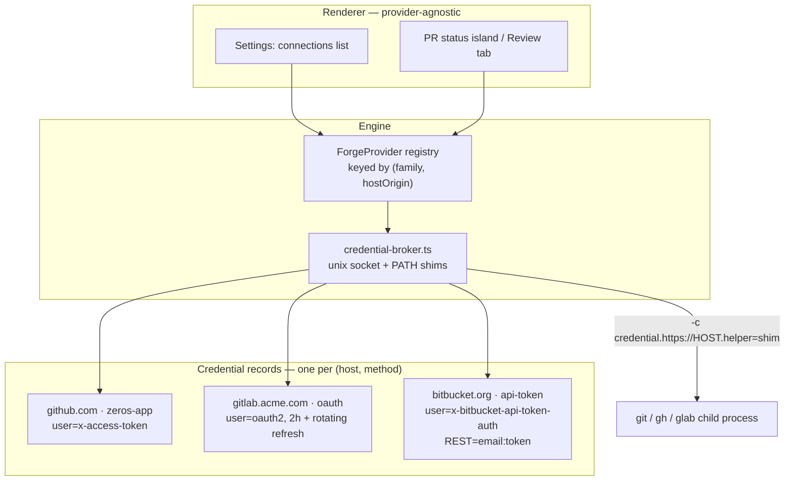

# Multi-Provider — GitLab and Bitbucket

*Part 06 of the Zeros GitHub Integration Report · July 2026*

## The short version

- **The credential broker is the abstraction that generalises; the shared `PR` type is not.** The one thing that genuinely differs at the git layer is the HTTPS *username*, and it differs **per provider *and* per credential kind** — GitHub `x-access-token`, GitLab `oauth2`, Bitbucket API token `x-bitbucket-api-token-auth`, Bitbucket resource token `x-token-auth`. So `gitHttpUsername` must be a stored field on the credential record, never derived from the host.
- **The three-radio-button shape does not survive contact with the other two hosts.** Neither GitLab nor Bitbucket has a GitHub-App analogue: no installation object, no per-project consent, no server-mintable scoped token. Their answer to per-repo scoping is a token an admin creates *out-of-band in the host's own UI* and the user pastes back. "Connect" on GitLab/Bitbucket is a paste-a-token interaction wearing a nicer coat.
- **`backend/` becomes mandatory for Bitbucket, in a way it is not for GitLab.** Bitbucket Cloud OAuth has **no PKCE** and requires `client_id:client_secret` over Basic at the token endpoint, so the exchange cannot happen in the Electron app. GitLab, by contrast, documents PKCE as "most secure" and recommended for client apps — GitLab could be done desktop-only.
- **Bitbucket app passwords were removed on 2026-07-28 — yesterday.** Every Bitbucket tutorial, StackOverflow answer and npm package written before mid-2026 is wrong on arrival, including the `bitbucket` npm package (last published 2024-05-18).
- **Statefulness, not shape, is the schema-breaking constraint.** GitLab OAuth tokens live 2 hours with rotating refresh; GitLab PATs have mandatory expiry (365-day default and cap); Bitbucket has enforced **rotating** refresh tokens since 2026-05-04 where a failure to write back the new refresh token permanently bricks the connection, plus 3-month idle death. A single get/set/clear token slot cannot express any of this.
- **Semantics leak in ways typecheck will not catch:** `ReviewMergeMethod = "squash" | "merge" | "rebase"` (`src/shell/pr/review-provider.ts:33`) is wrong on **both** other hosts — Bitbucket has no rebase at all and GitLab's merge method is a *project setting* the API caller cannot choose. GitLab MR `iid` vs `id` is a silent-wrong-MR trap on `ReviewTarget.prNumber` (`:38`).
- **Library verdict:** `@gitbeaker/rest` for GitLab (dual CJS+ESM exports — no repeat of this repo's ERR_REQUIRE_ESM incident), a hand-written ~200-line typed `fetch` client for Bitbucket, and a hard warning that `@octokit/auth-app` is ESM-only and will reproduce the boot crash documented at `src/engine/git/github.ts:21-27` unless it gets the same lazy-import + `tsup` `external` treatment in **both** tsup configs.
- **Nobody has solved this.** Claude Code, Codex cloud, Jules and Codegen are all GitHub-only for cloud execution; Anthropic degrades non-GitHub repos to a one-way local bundle that "can't push results back to the remote." That is a legitimate, shippable Zeros phase-1 posture for GitLab/Bitbucket, and it is what the biggest lab in the space chose.
- **Six concrete things in today's codebase must change before a second host exists**, all confirmed by audit: 11 of 19 `gh*` methods sit outside `ReviewProvider`, the seam ignores its own `originHost` argument, `repoSlugFromOriginUrl` deliberately drops the host, four UI surfaces lie about a non-GitHub origin, the agent preamble hardcodes `gh pr create` for **every repo**, and the DB has no provider column.

---

## 1. Why the broker, and not the `PR` type, is the durable abstraction

`src/shell/pr/review-provider.ts:12-15` asserts that the wire types are "intentionally provider-neutral already — 'PR' reads as 'merge request' for GitLab without loss." That is the comfortable half of the problem and it is half true. The uncomfortable half is that git-over-HTTPS authentication is **not** uniform, and no amount of neutrality in a TypeScript interface reaches it. The username sent in the Basic credential is load-bearing, and it varies along two axes at once.

| Provider / credential kind | git-over-HTTPS username | REST auth | Evidence |
|---|---|---|---|
| GitHub — any token (PAT, user token, installation token) | `x-access-token` (any non-empty value works; GitHub ignores it) | `Authorization: Bearer` | **verified** — [authenticating as an installation](https://docs.github.com/en/apps/creating-github-apps/authenticating-with-a-github-app/authenticating-as-a-github-app-installation) |
| GitLab — OAuth access token | **`oauth2`** — docs say "You can set the username to any string value. You should use `oauth2`" | `Authorization: Bearer` | **verified** (fetched 2026-07-29) — [GitLab OAuth 2.0 API](https://docs.gitlab.com/api/oauth2/) |
| GitLab — Personal / Project / Group Access Token | any non-empty string; "GitLab does not validate this value" | `PRIVATE-TOKEN: <token>` or Bearer | **verified** (fetched 2026-07-29) — [GitLab PATs](https://docs.gitlab.com/user/profile/personal_access_tokens/) |
| Bitbucket Cloud — Atlassian API token | `x-bitbucket-api-token-auth`, **or** your exact case-sensitive Bitbucket username | Basic `atlassian_account_email:api_token` | **verified** (fetched 2026-07-29) — [Using API tokens](https://support.atlassian.com/bitbucket-cloud/docs/using-api-tokens/) |
| Bitbucket Cloud — Repository / Project / Workspace Access Token | `x-token-auth` | `Authorization: Bearer` | **verified** — [Using access tokens](https://support.atlassian.com/bitbucket-cloud/docs/using-access-tokens/) |
| Bitbucket Data Center — HTTP access token | token as password (user/project/repo-level) | Bearer | **verified** — [HTTP access tokens](https://confluence.atlassian.com/bitbucketserver/http-access-tokens-939515499.html) |

Read that table as a data-model requirement, not trivia. Bitbucket's git identity (`x-bitbucket-api-token-auth`) and its REST identity (the Atlassian *account email*) are **different strings for the same credential** — a fact GitHub alone would never have surfaced, and one that a `{ token: string }` slot cannot hold. The architecture decision's broker interface already has the right shape:

```ts
interface GitCredential { username: string; password: string; expiresAtMs?: number }
```

Two additions make it multi-provider-complete:

```ts
interface GitCredential {
  gitHttpUsername: string;      // x-access-token | oauth2 | x-token-auth | x-bitbucket-api-token-auth
  password: string;             // the token
  restIdentity?: string;        // Bitbucket: the Atlassian account email for Basic
  restScheme: "bearer" | "basic" | "private-token";
  expiresAtMs?: number;
  refreshToken?: string;        // MUST be write-back-on-use (Bitbucket rotates)
}
```

Everything else about provider support — PR listing, checks, merge, labels — is a data-shape problem that a well-designed adapter absorbs. The username is the one thing that, if you get it wrong, produces the exact bug class Zeros already has: a green checkmark in settings and a `git push` that fails with a credential prompt. The credential broker is therefore not merely *convenient* for GitLab and Bitbucket; it is the only component whose existence is *forced* by them.

Conductor reached the same conclusion and has a name for the seam. Its sandbox-creation payload carries (**verified by first-hand teardown of Conductor 0.77.5**, `.context/conductor-teardown-2026-07-29.md` §5):

```js
forgeAuth?: union(
  { gitForge: "github", hostname?: string, token?: string },
  { gitForge: "local-git" }
)
```

`gitForge` + an optional `hostname` is the naming Zeros should copy verbatim, because it makes GitHub Enterprise Server, self-managed GitLab and Bitbucket Data Center the *same shape* as their cloud counterparts rather than three forks of the code. Note also what the teardown found *absent*: no installation rows in Conductor's 2.98 GB local SQLite (only a `repos` config table), i.e. installation state is server-side and revalidated. That posture is provider-agnostic and is what Zeros should adopt.



---

## 2. The hard constraints

### 2.1 GitLab has no GitHub App, and that is the central design fact

**There is no installation object on GitLab.** No per-project consent, no way to restrict an authorized OAuth application to specific groups or projects — an authorized OAuth app can reach everything the authorizing user can reach (**likely**; this is a negative claim, inferred from the absence of any installation concept across GitLab's primary OAuth docs plus two secondary sources — [GitLab OAuth provider docs](https://docs.gitlab.com/integration/oauth_provider/), [Ellipsis: moving a GitHub App to GitLab](https://www.ellipsis.dev/blog/how-to-move-your-github-app-to-gitlab)). Vercel's own GitLab integration is independent corroboration from the consumer side: its permissions table has exactly **one** row — `API` read+write, documented as "access to the API—including all groups and projects, the container registry, and the package registry" (**verified** — [Vercel for GitLab](https://vercel.com/docs/git/vercel-for-gitlab)). All-or-nothing.

The consequence for product copy is immediate: **any "per-repo scoping" promise in the Zeros settings UI must be labelled GitHub-only**, or it becomes false the day GitLab lands.

GitLab's substitute for installation scoping is **Project Access Tokens** (exactly one project) and **Group Access Tokens** (the group's subgroups and projects). Creating one provisions a bot user; those bot users are service accounts and **do not consume a licensed seat** (**verified** — [group access tokens](https://docs.gitlab.com/user/group/settings/group_access_tokens/), [project access tokens](https://docs.gitlab.com/user/project/settings/project_access_tokens/)). This is the right credential to inject into a GitLab cloud workspace: narrow blast radius, revocable independently of the human. But it is created out-of-band by a project maintainer in GitLab's UI — there is no consent flow Zeros can drive.

The rest of the GitLab constraint set:

| Constraint | Detail | Tag |
|---|---|---|
| OAuth PKCE | Documented as "Most secure", recommended for both client and server apps. GitLab **can** be done client-side with no secret. | **verified** ([docs](https://docs.gitlab.com/api/oauth2/)) |
| Device Authorization Grant | Introduced **17.2** behind flag `oauth2_device_grant_flow`, enabled by default **17.3**, generally available **17.9**, flag removed. Structurally a clone of the device flow Zeros already implements in `startDeviceFlow()`. | **verified**, fetched verbatim 2026-07-29 ([docs](https://docs.gitlab.com/api/oauth2/)) — *note: this corrects "17.1" in the authoritative spec, see §8* |
| Access-token lifetime | 7200 s (2 hours). Refresh **rotates**: using a refresh token invalidates both the old `access_token` and the old `refresh_token`. Refresh handling is mandatory day one, not polish. | **verified** ([docs](https://docs.gitlab.com/api/oauth2/)) |
| PAT expiry | Mandatory. "If an expiry date isn't explicitly set during token creation, an expiry date of 365 days from the current date is applied." Max lifetime extended to 400 days in 17.6 behind `buffered_token_expiration_limit`, **disabled by default**. | **verified**, fetched 2026-07-29 ([docs](https://docs.gitlab.com/user/profile/personal_access_tokens/)) |
| CI job tokens | `CI_JOB_TOKEN` can clone but **cannot push** ([gitlab-org/gitlab#389060](https://gitlab.com/gitlab-org/gitlab/-/issues/389060), still open). Cross-project access moved to an explicit allowlist in 18.0, capped at 200 projects. | **verified** ([docs](https://docs.gitlab.com/ci/jobs/ci_job_token.html)) |
| App ownership tiers | User-owned, group-owned, and instance-wide (admin-only, auto-"trusted" so the consent step is skipped). ~24 scopes; `api` is the coarse everything-scope; `write_repository` alone does **not** grant MR API access. | **verified** ([oauth_provider](https://docs.gitlab.com/integration/oauth_provider/)) |
| Self-managed | No central app. Each instance needs its own OAuth application registered by a user or admin. Zeros must ship a bring-your-own-OAuth-app path: instance base URL + client ID (+ secret if the admin made a confidential app), stored **per host**. | **likely** ([oauth_provider](https://docs.gitlab.com/integration/oauth_provider/)) |
| Dynamic Client Registration | `POST /oauth/register` (RFC 7591): experiment in 18.3, beta with flags removed in 18.6 — but dynamically-registered clients are `confidential: false`, PKCE-required, and **scope-restricted to `mcp` / `mcp_orbit`**. Useless for `api` / `write_repository` today. Track it; if GitLab lifts the scope restriction this becomes the best self-managed onboarding path in the industry. | **likely** ([MCP server docs](https://docs.gitlab.com/user/model_context_protocol/mcp_server/)) |
| `glab` CLI adoption | `glab auth login` supports OAuth and PATs, storing in `~/.config/glab-cli/config.yml` or the OS keyring with `--use-keyring`. **No confirmed `glab auth token` equivalent to `gh auth token`.** Config-file scraping is fragile and breaks entirely under `--use-keyring`. | **verified** ([glab auth login](https://github.com/gitlabhq/cli/blob/main/docs/source/auth/login.md)) |

That last row matters for the picker. "Use the CLI's token" is a **GitHub-strong, GitLab-shaky, Bitbucket-nonexistent** capability. It must not be presented as a uniform first radio button across providers.

### 2.2 Bitbucket: the ground moved yesterday

**App passwords were fully removed on 2026-07-28** — one day before this report. The phase-out: announced 2025-06-09 (phase 1); no new app passwords creatable from 2025-09-09 (phase 2); escalating brownouts from 2026-06-09 to 2026-07-27 (15-minute windows escalating to 5 hours); complete removal 2026-07-28 (**verified** — [brownout notice](https://community.atlassian.com/forums/Bitbucket-articles/Deprecation-notice-Bitbucket-Cloud-app-password-brownout/ba-p/3237429), [Atlassian blog](https://www.atlassian.com/blog/bitbucket/bitbucket-cloud-transitions-to-api-tokens-enhancing-security-with-app-password-deprecation)). Anything written against app passwords is dead code before it is written. Note a source discrepancy the evidence base surfaced and one of our own research passes propagated: an older Atlassian blog put phase 3 at 2026-06-09, and one confirmed claim in a different area still says app passwords "were disabled on 2026-06-09". The brownout notice is the more specific and later source; either way, they are gone now.

The replacement stack:

| Credential | What it is | Scoping | Where it comes from |
|---|---|---|---|
| **Atlassian API token** | User-bound, scoped token. Scopes include `read:repository:bitbucket` (clone) and `write:repository:bitbucket` (push). | User's whole access | User creates in Atlassian account settings, pastes into Zeros |
| **Repository / Project / Workspace Access Token** | Bound to the **resource**, not a user; managed by that resource's admins; revocable without touching the user's account. Scopes `repository`, `repository:write`. | Resource-bound — the closest structural analogue to a GitHub App installation token | A repo/project admin creates it in Bitbucket's UI |
| **OAuth consumer** | Authorization-code + client-credentials + a Bitbucket-specific JWT exchange. | User's whole access | Zeros registers a consumer; secret lives in `backend/` |

Both token rows are **verified** ([API tokens](https://support.atlassian.com/bitbucket-cloud/docs/using-api-tokens/), [access tokens](https://support.atlassian.com/bitbucket-cloud/docs/using-access-tokens/), [repo vs project vs workspace keys](https://support.atlassian.com/bitbucket-cloud/kb/difference-between-repository-project-and-workspace-access-keys/)).

The OAuth row carries three hard constraints:

1. **No PKCE.** Bitbucket Cloud supports three RFC 6749 grants plus a JWT exchange; implicit and resource-owner-password are gone; the token exchange requires `client_id:client_secret` via HTTP Basic. This is **likely** rather than verified for a specific and annoying reason: the primary [developer.atlassian.com OAuth 2.0 page](https://developer.atlassian.com/cloud/bitbucket/oauth-2/) truncates on fetch — it did for the original researcher and it did again for us on 2026-07-29. Corroborating community evidence: developers report the token endpoint demanding client credentials even under a PKCE-style flow and no PKCE support being listed ([community thread](https://community.atlassian.com/forums/Bitbucket-questions/Bitbucket-cloud-api-PKCE-Authorization-flow-Client-credentials/qaq-p/2373781)). **Architectural consequence:** a Bitbucket OAuth flow cannot be safely completed inside the Electron app. `backend/` is mandatory for Bitbucket, not a nicety. Re-verify against a rendered copy of the primary page before writing the exchange.
2. **Enforced from 2026-05-04:** consumers must support **rotating** refresh tokens (each use mints a new one); unused refresh tokens expire after **3 months**, requiring re-authorization; the token response returns `scope` (singular) instead of `scopes`; access tokens may no longer be passed via query parameter or POST body — **`Authorization: Bearer` header only**; all token-authenticated requests go to `https://api.bitbucket.org` (**verified** — [Atlassian developer community changelog post](https://community.developer.atlassian.com/t/oauth-2-0-and-api-authentication-changes-for-bitbucket-cloud/99003)). A refresh that fails to atomically persist the *new* refresh token **permanently bricks the connection**. This is the strongest single argument in the whole evidence base for replacing Zeros' single token slot rather than extending it.
3. **Atlassian Connect is retired; Forge is the path.** New Bitbucket Connect apps could no longer be registered or installed from 2026-02-02, addon-linker APIs were removed around 2026-02-05, Connect apps stopped receiving updates after 2026-03-31, full end-of-support Q4 2026 (**likely** — [Bitbucket changelog](https://developer.atlassian.com/cloud/bitbucket/changelog/), [Connect end-of-support](https://www.atlassian.com/blog/development/connect-end-of-support-what-it-means-for-custom-apps-and-how-to-migrate-to-forge)). Forge apps are hosted *by Atlassian* and are UI-extension oriented — they are not a credential-minting installation model. **Conclusion: there is no Bitbucket path to GitHub-App-equivalent installation tokens.** Resource access tokens are the answer, full stop.

**Bitbucket Data Center is a separate provider, not a base-URL knob.** Base path `/rest/api/1.0/` versus Cloud's `https://api.bitbucket.org/2.0/`; HTTP access tokens issuable at user, project or repository level, usable in place of a password for both git-over-HTTPS and REST; DC tokens cannot log into the web UI or act on behalf of a user (**verified** — [HTTP access tokens](https://confluence.atlassian.com/bitbucketserver/http-access-tokens-939515499.html), [Cloud REST intro](https://developer.atlassian.com/cloud/bitbucket/rest/intro/)). Renovate maintains two adapters (`bitbucket` and `bitbucket-server`). Budget for `"bitbucket-cloud" | "bitbucket-server"` in the id union, not `"bitbucket"` — which means `ReviewProvider.id` at `src/shell/pr/review-provider.ts:44` is already too coarse on two counts (it also cannot carry instance identity for `gitlab.acme.com`).

### 2.3 What "recommended" means per provider

| | GitHub | GitLab | Bitbucket Cloud |
|---|---|---|---|
| First-party app with per-repo consent | ✓ GitHub App installation | ✗ does not exist | ✗ does not exist (Connect retired, Forge ≠ installation tokens) |
| Recommended method | **Zeros GitHub App** | **OAuth + PKCE** (client-side capable) | **OAuth via `backend/`** (no PKCE) or Atlassian API token |
| Per-repo scoping story | installation-selected repositories, in-app | Project/Group Access Token — **paste, out-of-band** | Repository/Workspace Access Token — **paste, out-of-band** |
| Server-mintable short-lived token | ✓ 1 h installation token, `repository_ids`-scoped | ✗ | ✗ |
| Cloud-workspace credential | installation token | Project Access Token (bot user, no seat) | Repository Access Token |
| CLI-token adoption | ✓ `gh auth token` | ⚠ no confirmed `glab auth token`; keyring opaque | ✗ no CLI credential story |
| Device flow | ✓ (App: off by default, must be enabled) | ✓ GA 17.9 | ✗ |
| Token expiry model | PAT: optional; user token 8 h + 6 mo refresh; installation 1 h | OAuth 2 h + rotating refresh; PAT mandatory ≤365 d | OAuth + **rotating** refresh, 3-mo idle death; API token per policy |

The honest reading: **the persisted model must be "a list of provider-advertised credential *kinds*, each with capabilities", not a fixed triple.** The GitHub picker ships three rows; the GitLab picker ships different rows; the Bitbucket picker ships different rows again. Netlify — the closest shipped analogue at scale — landed on exactly three tiers: GitHub App for cloud GitHub, provider OAuth2 client token for cloud GitLab/Bitbucket/Azure DevOps, and bring-your-own app credentials for self-hosted (**verified** — [Netlify repo permissions](https://docs.netlify.com/build/git-workflows/repo-permissions-linking/), [self-hosted git](https://docs.netlify.com/build/git-workflows/self-hosted-git/)). Their self-hosted requirements are worth reading as a preview of Zeros' enterprise support surface: GHES wants App ID + client ID + secret + PEM private key; GitLab self-managed wants an admin-area OAuth application with `api` scope; Bitbucket DC wants an incoming application link.

---

## 3. Semantics mapping — where a naive shared type breaks

| Concept | GitHub | GitLab | Bitbucket Cloud | Consequence for Zeros |
|---|---|---|---|---|
| Review unit | Pull request | **Merge request** | Pull request | Per-provider `reviewNoun` used in UI copy *and* in agent prompts |
| Identifier | `number` (repo-scoped) | **`iid`** (project-scoped) *and* `id` (instance-global); API paths take `iid` | `id` (repo-scoped) | `ReviewTarget.prNumber` (`review-provider.ts:38`) must bind to `iid`. Fetching by `id` silently 404s or returns **a different MR**. Rename to a provider-opaque `prRef`, or document hard that it is "the number in the web URL" |
| States | `open`, `closed`, `merged` (via `merged_at`) | `opened`, `closed`, `merged`, **`locked`** | `OPEN`, `MERGED`, `DECLINED`, `SUPERSEDED` | Do **not** force one enum. Renovate deliberately types `state: string`. GitLab's `locked` and Bitbucket's `SUPERSEDED` have no GitHub counterpart |
| Draft | `draft: true` | `draft` (`work_in_progress` deprecated) | Drafts since **early April 2025**, 100% rollout ([BCLOUD-12503](https://jira.atlassian.com/browse/BCLOUD-12503)) | `isDraft` + `markReady()` (`review-provider.ts:58`) is genuinely portable — do **not** model draft as optional. But **Bitbucket hides drafts from the default PR list** behind a "Draft" filter checkbox, so a naive `listPrs()` under-reports on Bitbucket only |
| CI surface | Check runs (flat list) + Commit Statuses (legacy) | **Three** surfaces: pipelines (`head_pipeline`, pipeline→stage→job **tree**), the Commit Status API for external CI (`CI_PIPELINE_SOURCE=external`), and **External Status Checks** (a separate merge-gating API) | Commit statuses / build statuses | `PrChecksResult` (`review-provider.ts:49`) cannot be a thin wrapper over GitHub's shape. Model as a flat `{name, status, conclusion, url, group?}[]` and flatten GitLab jobs into it, consciously losing the stage hierarchy — the trade Renovate makes. External Status Checks are a *fourth* category that gates merge but is not a "check" in any GitHub sense |
| Merge strategies | `merge`, `squash`, `rebase` (caller-selected, repo-allowed) | **Project-level setting**: merge commit / semi-linear / fast-forward. Caller may only toggle `squash`, and only if project policy permits (Do not allow / Allow, off by default / Encourage, on by default) | `merge_commit`, `squash`, `fast_forward` — **no rebase at all** | `ReviewMergeMethod = "squash" \| "merge" \| "rebase"` (`review-provider.ts:33`) is invalid on **2 of 3 hosts**. Replace with a provider-advertised `mergeMethods: string[]` **fetched per repo**, so the dropdown renders only what the host permits |
| Merge extras | — | `should_remove_source_branch`, `merge_when_pipeline_succeeds` (auto-merge) | — | Auto-merge is a GitLab-native concept worth surfacing, not a shared one |
| Assignees | ✓ | ✓ (assignees + reviewers) | **✗ no assignee concept** | Optional capability |
| Labels | ✓ | ✓ | **✗ no labels** | Optional capability |
| Approvals | Reviews with `APPROVED`/`CHANGES_REQUESTED` | Approval rules / required approvers | Default reviewers + approve/unapprove | **unverified** — this evidence base did not research approval-model depth on any host. Treat as unknown and re-research before building an approvals UI |
| Lifecycle limits | reopen closed PRs; rename freely | reopen closed MRs | **cannot rename or reopen `DECLINED` PRs** | Any "reopen" affordance must be capability-gated |
| Compare / new-PR URL | `/<owner>/<repo>/compare/<base>...<head>?expand=1` | `/-/compare/` and `/-/merge_requests/new` | `/<ws>/<repo>/pull-requests/new` | `githubCompareUrl` at `src/shell/pr/github-url.ts:65-67` builds the **GitHub shape against whatever host it parsed**. Our verifier flagged that "it 404s on gitlab.com" is **unverified** — GitLab has historically kept legacy non-`/-/` routes redirecting — but what is certain is that we emit a URL for a host we cannot service |

Two structural lessons fall out of that table.

**Merge method is a capability fetch, not a union.** On GitHub it is a caller choice constrained by repo settings; on GitLab it is a project setting the caller cannot override; on Bitbucket the vocabulary itself differs and one option does not exist. A hardcoded three-option dropdown guarantees runtime failures on non-GitHub hosts. The fix is `capabilities.mergeMethods` resolved per repository, which — usefully — also fixes a latent GitHub bug where Zeros offers "Rebase and merge" on a repo that has it disabled.

**GitLab's check tree is a lossy flatten, and you should choose the loss deliberately.** GitHub gives a flat list of check runs. GitLab gives pipeline → stages → jobs, plus two adjacent APIs. Flattening jobs into `{name, status, conclusion, url, group: stageName}` preserves enough for the PR status island and the failing-check row while discarding stage ordering. Do it on purpose and write the comment; do not discover it three weeks into the GitLab port.

---

## 4. Library choices — and the ESM trap this repo has already paid for

| Need | Choice | Why |
|---|---|---|
| GitLab REST | **`@gitbeaker/rest@43.8.0`** | Ships a **dual exports map** — `{ import: ./dist/index.mjs, require: ./dist/index.js }` — with no top-level `"type": "module"`, so the CJS engine bundle can `require()` it normally: **no lazy-dynamic-import ceremony, no `ERR_REQUIRE_ESM` repeat**. Node ≥ 18.20.0. ~1.98M weekly downloads, 144 versions, published 2025-11-01. Cost: pulls `@gitbeaker/core` at ~1.48 MB unpacked — noise for an app already shipping Chromium; per-resource imports are available if it ever matters. The predecessors `gitlab` and `node-gitlab-api` are both formally deprecated on npm pointing at gitbeaker — do not let anyone reach for them. **verified** ([npm](https://www.npmjs.com/package/@gitbeaker/rest), [registry](https://registry.npmjs.org/@gitbeaker/rest/latest)) |
| Bitbucket REST | **plain `fetch`, ~200 lines, hand-written and typed** | The `bitbucket` npm package is at 2.12.0, **last published 2024-05-18** — before the app-password→API-token transition, before the 2026-05-04 OAuth enforcement, before draft PRs. `main: lib/index.umd.js`, no exports map, and runtime deps on `node-fetch`, `deepmerge`, `is-plain-object`, `before-after-hook`, `url-template`. Its auth model is wrong on arrival. Zeros needs ~10 endpoints (PR get/list/create/update/merge/decline, comments, approve, statuses, user) — well under the cost of adopting and patching a stale dependency. **verified** ([npm](https://www.npmjs.com/package/bitbucket)) |
| Unified abstraction | **none — write the seam** | There is no credible npm "unified git provider" library. `arlac77/repository-provider` has negligible adoption; `drone/go-scm` and `ghorg`'s scm package are Go. This is a mild negative result from a search done specifically to find one. **likely** |

**The trap, stated as a rule.** `src/engine/git/github.ts:21-27` records the incident in the code itself:

> `// ESM-only deps (2026-05-20 fix): @octokit/rest@22 and @octokit/auth-oauth-device@8 are ESM-only packages. The Electron main process bundles as CommonJS, so require() of these modules throws ERR_REQUIRE_ESM.`

The fix is the pair of lazy caches at `src/engine/git/github.ts:41-59` (`loadOctokit()`, `loadDeviceAuth()`) **plus** `external` entries in `tsup.config.ts:30-31` **and** `electron/tsup.config.ts:47-48`. `@octokit/auth-app@8.2.0` — the package the GitHub App work in part 03 needs — declares `"type": "module"` and `engines node >= 20`. It is the same shape. Adding it without both halves of the fix reproduces a **boot crash of the packaged app**, which neither `tsc` nor unit tests will catch (**verified** — [registry](https://registry.npmjs.org/@octokit/auth-app/latest)). `@gitbeaker/rest` is the exception that proves the rule; assume every new Octokit-family dependency is ESM-only until the `exports` map says otherwise.

---

## 5. The adapter shape to borrow: Renovate

Renovate's `Platform` interface (`lib/modules/platform/types.ts`) is the single best template available, for three reasons that map directly onto decisions Zeros has to make (**verified** — [types.ts](https://raw.githubusercontent.com/renovatebot/renovate/main/lib/modules/platform/types.ts), [GitLab adapter](https://github.com/renovatebot/renovate/blob/main/lib/modules/platform/gitlab/index.ts)).

1. **Two-phase init.** `initPlatform(config: PlatformParams): Promise<PlatformResult>` handles credentials, endpoint and identity; `initRepo(config: RepoParams): Promise<RepoResult>` handles per-repo setup and returns `{ defaultBranch, isFork, repoFingerprint }`. That split is *exactly* the "which credential" versus "which repo scope" separation Zeros needs — and `PlatformParams{endpoint, token, username, password}` is literally the generalised credential record from §1.
2. **`state: string`, not a union.** Renovate refused to force GitHub, GitLab and Bitbucket state vocabularies into one enum, and its neutral `Pr` type is deliberately loose: `{ number, state: string, title, sourceBranch, targetBranch?, sha?, isDraft?, labels?, reviewers?, bodyStruct? }`. Compare Zeros' `PR` in `src/engine/git/types.ts`, which carries `authorLogin` (`:157`), `mergeableState: string` holding **raw Octokit `mergeable_state` strings** that `src/shell/pr/pr-status.ts:319` switches on, `mergeCommitSha` (`:170`) and `behindBy` (`:175`). The comment at `review-provider.ts:12-15` claiming provider neutrality is aspirational, not descriptive.
3. **Capability and limit methods live *in* the interface**, alongside data methods: `massageMarkdown(prBody, rebaseLabel?)`, `maxBodyLength()`, `labelCharLimit?()`. Roughly 15 of ~35 methods are optional via `?`. **That optionality is the honest encoding of "Bitbucket has no labels, GitLab has no rebase-merge."**

Backstage contributes one further idea worth stealing without its interface: `ScmIntegrations` / `ScmIntegrationRegistry` is a **host-keyed** registry with *separate entries for Bitbucket Cloud and Bitbucket Server*, configured per host so self-managed instances are first-class (**likely** — [ScmIntegrations.ts](https://github.com/backstage/backstage/blob/master/packages/integration/src/ScmIntegrations.ts)). Independent confirmation of two conclusions above: key by host, and treat Cloud/DC as siblings.

Applied to Zeros, the target shape is:

```ts
type ForgeFamily = "github" | "gitlab" | "bitbucket-cloud" | "bitbucket-server";

interface ForgeCapabilities {
  reviewNoun: "pull request" | "merge request";
  mergeMethods: string[];          // per-repo, fetched — never a hardcoded union
  supportsLabels: boolean;
  supportsAssignees: boolean;
  supportsDraft: boolean;          // true on all three today
  supportsReopen: boolean;         // false for Bitbucket DECLINED
  supportsInstallationScoping: boolean;  // GitHub only
  cliTokenAdoption: "supported" | "unreliable" | "none";
  createPrCommand: string | null;  // "gh pr create --base" | "glab mr create --target-branch" | null
  maxCommentLength: number;
}

interface ForgeProvider {
  family: ForgeFamily;
  hostOrigin: string;              // github.com | gitlab.acme.com | bitbucket.org
  hostLabel: string;
  capabilities: ForgeCapabilities;
  // ...the 19 gh* operations, host-neutral
}
```

Note what this fixes beyond multi-provider: `capabilities.createPrCommand` is the mechanism that lets the agent prompts stop hardcoding `gh`, and `capabilities.supportsInstallationScoping` is what stops the settings UI promising per-repo scoping on a host that has none.

---

## 6. What must change in the current codebase first

None of this is GitLab work. It is the set of confirmed defects and design debts that must be cleared **before** a second host exists, because each one either bakes GitHub into a persistence layer or produces a user-visible lie today. All line numbers below were opened and verified on 2026-07-29.

| # | Where | What is wrong | Fix |
|---|---|---|---|
| P1 | `src/shell/pr/review-provider.ts:78` | `resolveReviewProvider(_originHost?)` **ignores its argument** and returns the hardcoded `githubProvider`; both call sites — `src/shell/column3-tabs/review-tab.tsx:158` and `src/shell/prefetch-workspace-surface.ts:47` — invoke it with **no argument at all**. Nothing in the app has ever asked "which host is this repo on?" | Thread the workspace's origin host to both call sites *first*; the switch is trivial once the argument is real |
| P2 | `src/native/git.ts:975-1232` | **11 of 19 `gh*` methods sit outside the seam.** `ReviewProvider` (`review-provider.ts:61-72`) wraps 8: `authStatus`, `getPr`, `getChecks`, `getCommits`, `getTimeline`, `addComment`, `merge`, `markReady`. Outside: `ghRepositoryOwnerAvatar:983`, `ghAuthSignin:995`, `ghDetectCli:1006`, `ghSetToken:1014`, `ghSignOut:1018`, `ghPrCreate:1022`, `ghListOwners:1034`, `ghCheckRepoName:1039`, `ghPublishRepo:1051`, `ghPrSync:1109`, `ghPrList:1124`. Worse, **5 of the 8 inside are bypassed** in product code — `authStatus` (`github-section.tsx:91`), `getPr`/`getChecks` (`pr-status-island.tsx:384-385`), `markReady` (`:536`), `merge` (`:555`, `dashboard-page.tsx:554`). Only `getCommits`/`getTimeline`/`addComment` are honoured exclusively through the provider | Add a second, wider seam (`ForgeProvider`) covering create/sync/list/publish/owners/avatar/auth; route `pr-status-island.tsx` and `dashboard-page.tsx` through it; add a lint rule banning `gh*` imports outside provider modules |
| P3 | `src/engine/git/repo.ts:27-29` | `repoSlugFromOriginUrl` **deliberately drops the host** ("so worktrees for the same logical project don't fragment if the user re-clones via SSH after HTTPS"). `repo_slug` is the partition key everywhere — `idx_workspaces_repo_slug` and `idx_workspaces_branch ON workspaces(repo_slug, branch)` at `src/engine/db/migrations.ts:370,372`. So `github.com/acme/widgets` and `gitlab.com/acme/widgets` collapse to one slug: merged sidebars, cross-invalidation, and a branch-catalog join that stamps repo A's `prUrl` onto repo B's identically-named branch | **Decide before GitLab lands, because the slug is baked into on-disk worktree paths.** Either add a short host discriminator for non-`github.com` hosts (keeping today's slug for github.com to avoid migrating rows), or stop using `repoSlug` as identity and partition by repo root / repo id. Note the verifier's correction: this is really "repo identity is (owner, name) instead of (host, owner, name)", so it also bites `github.acme.com` and two clones of the same remote |
| P4 | `src/shell/dialogs/open-github-project.tsx:45,80` | A non-GitHub origin is **fully accepted**: `URL_HINT_RE = /^(?:[A-Za-z0-9_-]+@\|https?:\/\/)\S+/` is the only validation, and the engine's clone check is the same shape. A gitlab.com URL clones fine and becomes a project | Keep accepting it — but make the downstream honest (P5) |
| P5 | four sites | **The UI then lies.** (a) `src/shell/pr/pr-status-row.tsx:69-74` renders `CreatePrButton` for **any** workspace, gated only on `nativeReady` and `hasChanges` — no host check. (b) Clicking it sends the agent the `gh pr create` brief (`create-pr-button.tsx:116-127` → `pr-instructions.ts:80`). (c) "Create PR manually" builds the GitHub compare path against whatever host was parsed (`github-url.ts:65-67`), and on parse failure toasts "Can't open GitHub … no recognizable GitHub remote" (`create-pr-button.tsx:171-173`). (d) The Review tab's unauthenticated state says "Sign in under Settings → General → GitHub" via `provider.hostLabel` (`review-tab.tsx:304-305`) — which is always the literal "GitHub" because of P1, i.e. the **wrong** provider for a GitLab repo rather than a dead link. Meanwhile the engine silently no-ops: `workspaceRemote` throws `VALIDATION_FAILED` for a non-github.com host (`github.ts:541-551`) and `syncWorkspacePr` swallows it and returns `null` (`github.ts:812`), so the island never appears | Short term: surface `RepoRemote.isGitHub` — which the branch catalog already computes at `src/engine/git/branch-catalog.ts:34-35,102-109` — up to `PrStatusRow`, and disable Create PR with the reason "Zeros can only open pull requests on GitHub remotes today". Long term, replace the boolean with `forgeHost: "github" \| "gitlab" \| "bitbucket" \| "unknown"` on `RepoRemote`, since the parse already knows the host. **All the host-awareness Zeros needs already exists; it is just silent** |
| P6 | `packages/core/src/system-instructions/templates.ts:44` | The workspace preamble injected into the **first turn of every chat in every repo** says: "Use it for actions like diffing (`git diff {TARGET_BRANCH}...`) and creating PRs (`gh pr create --base <branch>`)". `buildFirstTurnInstructionBody` has no host or provider parameter. `src/shell/pr/pr-instructions.ts:59-61,80` hardcodes `gh pr create [--draft] --base <base>`. `src/shell/pr/pr-action-prompts.ts:90` embeds "`gh pr checks N` … `gh run view --log-failed`" (latent only — it is reachable solely from Review-tab check rows that require a GitHub-sync'd `prNumber`). **This is provider lock-in in prose, invisible to typecheck and to the `ReviewProvider` seam** | Move the PR-creation and check-investigation prose into `templates.ts` as `[SYS-INSTR: action-create-pr]` / `[SYS-INSTR: action-fix-check]` with `{FORGE_CREATE_CMD}` / `{REVIEW_NOUN}` placeholders supplied by the provider. Note the strings are pinned by `pr-instructions.test.ts` and `pr-action-prompts.test.ts`, and that `templates.ts:5-10` already claims to be the one home for hardcoded agent text — two files violate it today |
| P7 | `src/shell/pr/review-provider.ts:33,38,44` | `ReviewMergeMethod` is a three-option union wrong on 2 of 3 hosts; `ReviewTarget.prNumber` is an `iid`/`id` trap; `id: "github" \| "gitlab" \| "bitbucket"` cannot express `bitbucket-cloud` vs `bitbucket-server`, nor instance identity for `gitlab.acme.com` | `capabilities.mergeMethods` per repo; `prRef` or a documented "number in the web URL"; `{ family, hostOrigin }` instead of a flat id |
| P8 | `src/engine/db/migrations.ts:364-366` | `workspaces` carries `pr_number` / `pr_state` / `pr_url` and **no provider column**. `src/engine/git/types.ts:157,164,170,175` carries `authorLogin`, `mergeableState` (raw Octokit strings, switched on at `src/shell/pr/pr-status.ts:319`), `mergeCommitSha`, `behindBy` | Add `forge_family` + `forge_host` to the workspace/PR rows; keep `mergeableState` but treat it as provider-opaque and move the switch behind a provider-supplied normaliser |

Sequencing note: **P1, P3 and P5 are the only ones that are cheaper now than later.** P3 touches on-disk paths, P1 is a two-line change that unblocks every later branch, and P5 is the difference between "not supported yet" and "silently broken" for every GitLab user who tries Zeros today. P2, P6, P7 and P8 are large but can land incrementally alongside the first non-GitHub adapter.

---

## 7. A staging plan that matches what the market actually ships

The competitive evidence is unambiguous and worth leaning on when scoping: **no shipped agent product has natively integrated GitLab or Bitbucket for cloud execution.**

- **Claude Code** (**verified** — [Claude Code on the web](https://code.claude.com/docs/en/claude-code-on-the-web)): only GitHub is supported for cloning and PR creation (GHES on Team/Enterprise plans). GitLab, Bitbucket and other non-GitHub remotes can only be sent to cloud sessions as a **local git bundle** (automatic from `claude --cloud` with no GitHub access, forceable with `CCR_FORCE_BUNDLE=1`, 100 MB limit), and such a session "can't push back to a remote unless you also have GitHub authentication configured."
- **Codex cloud**: GitHub-only natively; Bitbucket is an open feature request ([openai/codex#15618](https://github.com/openai/codex), opened 2026-03-24); GitLab reachable only via the GitLab MCP server (**verified**).
- **Jules**: GitHub-only as of July 2026; the docs only say "In the future, Jules will work with more version control systems" (**verified** — [Jules FAQ](https://jules.google/docs/faq/)).
- **Codegen**: documents no GitLab, Bitbucket or GHES support at all (**likely**).

So the defensible phasing is:

| Phase | Scope | Rationale |
|---|---|---|
| **A — host honesty** | P1, P3, P5 from §6. No adapter. Zeros says "GitLab isn't supported yet" instead of showing a broken Create PR button | Cheap, removes a live lie, and P3 must precede any second host because it is baked into worktree paths |
| **B — GitLab read/review** | `@gitbeaker/rest`, OAuth + PKCE (**desktop-only, no backend needed**), MR read, checks flattening, `iid` binding, `glab`-free. Local workspaces only | GitLab is the strictly easier of the two: PKCE means no secret, and the device grant clones Zeros' existing `startDeviceFlow()` almost verbatim |
| **C — GitLab write + cloud** | MR create/merge with `capabilities.mergeMethods`; cloud workspaces via a pasted **Project Access Token** (bot user, no seat) | The out-of-band paste is the *only* scoping gesture GitLab offers; design the settings panel so "scoped token" is a first-class credential kind, because on 2 of 3 hosts it **is** the scoping story |
| **D — Bitbucket Cloud** | Hand-written fetch client; Atlassian API tokens first (simplest, no secret); OAuth **through `backend/`** second, with rotating-refresh write-back as a hard requirement | Deliberately after GitLab: no PKCE forces backend work, and rotating refresh + 3-month idle expiry is the most failure-prone credential lifecycle of the three |
| **E — self-managed** | GitLab self-managed (bring-your-own OAuth app, per-host storage), Bitbucket Data Center as a **separate** adapter | Both are separate providers, not base-URL flags |
| **Never (unless asked)** | GitLab CI job tokens as the cloud credential | They cannot push. They look like the obvious answer and they are not |

A bundle-style read-only fallback for non-GitHub hosts — Anthropic's posture — is a legitimate way to make phase A less bleak, and cheaper than any adapter.

---

## 8. Divergences from the authoritative spec (for part 10)

Per the brief, evidence against `.context/architecture-decision.md` is flagged rather than quietly absorbed. Four items, all small, all in this section's material:

1. **GitLab's `oauth2` username is "should", not "mandatory".** The spec's multi-provider table says GitLab OAuth token → "**`oauth2`** (mandatory — the real username fails)". GitLab's current API docs, fetched verbatim on 2026-07-29, say: "Use the token as the password. You can set the username to any string value. **You should use `oauth2`**" ([docs.gitlab.com/api/oauth2](https://docs.gitlab.com/api/oauth2/)). The underlying evidence claim was tagged **likely** and sourced from [gitlab-org/gitlab#349461](https://gitlab.com/gitlab-org/gitlab/-/issues/349461) plus a forum thread, which do report real-username failures. Recommended resolution: keep the engineering rule (**always send `oauth2`**) and soften the doc wording from "mandatory" to "required in practice; GitLab documents `oauth2` as the value you should use". The design implication — `gitHttpUsername` on the credential record — is unaffected.
2. **The GitLab device grant landed in 17.2, not 17.1.** The spec says "GitLab supports the Device Authorization Grant (17.1, GA 17.9)"; the docs' own version-history note reads "Introduced in GitLab **17.2** with a feature flag named `oauth2_device_grant_flow`. Enabled by default in **17.3**. Generally available in GitLab **17.9**." The GA date is right; the introduction version is off by one minor.
3. **Bitbucket app-password removal date is internally inconsistent across the evidence base.** The spec (correctly) uses 2026-07-28. A separate confirmed claim in the `desktop-oauth-security` area still says app passwords "were disabled on 2026-06-09", which is the brownout start, and an older Atlassian blog put "phase 3" there. Nothing in the design depends on which is right, but the report should not print both.
4. **The spec's characterisation of the existing seam is slightly generous, and its bypass count is off by one.** It says `src/shell/pr/review-provider.ts` "is real and correctly shaped, but 11 of 19 `gh*` native methods sit outside it and 6 of the 8 inside are bypassed anyway." The 11-of-19 figure is confirmed. The bypass count is **5 of 8**, not 6 (verified per-callsite: `authStatus`, `getPr`, `getChecks`, `markReady`, `merge`). And "correctly shaped" understates the problem: `resolveReviewProvider(_originHost?)` **ignores its argument** and neither call site passes one, so the seam has never carried host information at all. Separately, `ghPrCreate` (`src/native/git.ts:1022`) is a **dead export with zero callers** — PR creation happens through an agent prompt — so the provider abstraction cannot capture PR creation even in principle today. The gap is the prompt path, not an unwrapped IPC method.

One addition rather than a divergence: the spec's constraint list says "GitLab's merge method is a project-level setting" nowhere — it lists only Bitbucket's missing rebase. Both halves matter, because it is the GitLab half that turns "trim the union" into "fetch a capability per repo".

## 9. What we could not establish

- **Approval models on any host.** The evidence base never researched GitHub reviews vs GitLab approval rules vs Bitbucket default reviewers in depth. The row in §3 is **unverified**. Do not design an approvals UI from it.
- **Whether Bitbucket Cloud OAuth truly has no PKCE, from a primary source.** The authoritative page truncates on fetch — twice, ten weeks apart. The conclusion is corroborated by community evidence and is architecturally load-bearing (it is what makes `backend/` mandatory for Bitbucket). Re-verify against a rendered copy before writing the token exchange.
- **Whether GitLab genuinely has no per-project OAuth scoping.** This is a negative claim; no primary GitLab doc asserts an absence. It is corroborated from the consumer side by Vercel's single-row `API` permissions table, which is strong but indirect.
- **Whether the GitHub-shaped compare URL actually 404s on gitlab.com.** GitLab has historically kept legacy non-`/-/` routes redirecting. Certain: we emit a URL for a host we cannot service.
- **Conductor's own multi-provider plans.** The teardown found `gitForge: "github" | "local-git"` with a `hostname` field already present for GitHub Enterprise — evidence they built the seam, no evidence they have built a second forge. Their webview assets are compressed inside the Rust binary, so the settings copy and the App slug remain unrecoverable.

---

*Provenance note: the evidence behind this section came from 17 parallel research and audit agents whose output was then attacked by 220 independent verifier agents — 52 of 109 verified audit findings survived (a 52% kill rate) and 188 of 207 claims survived. The four `provider-abstraction` audit findings cited here all survived refutation, three of them with material verifier corrections that are reflected above. The design panel and report critics were cut for time, so `.context/architecture-decision.md` is one author's synthesis of that evidence rather than a panel consensus — which is why §8 exists.*
