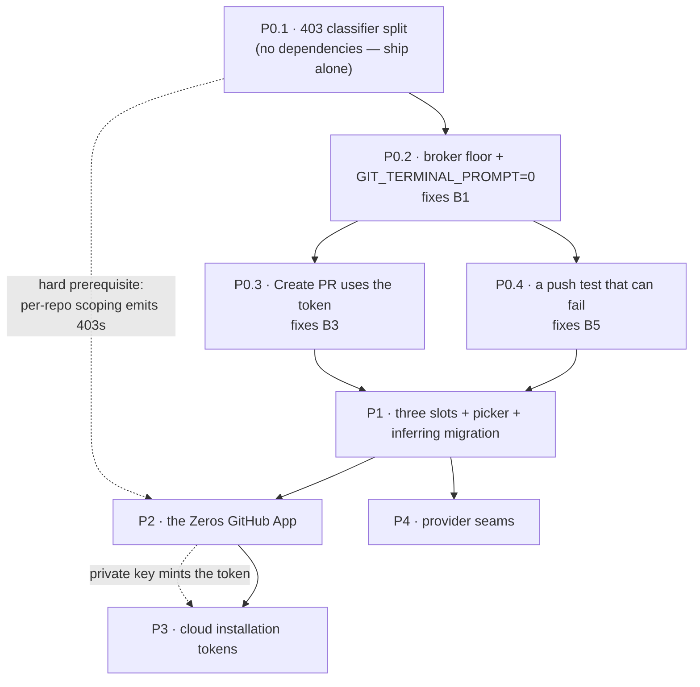

# Implementation Plan

*Part 09 of the Zeros GitHub Integration Report · July 2026*

This is the sequenced build order. It assumes Part 04 (the architecture) for *what* to build and
Part 05 / Part 06 for the cloud and multi-provider constraints; it does not restate them. What it
adds is order, exact file lists, the tests that pin each step, the CI commands that must be green,
and the rollback for each phase. Every `path:line` below was opened and verified in the tree at
`aaed7dd` before it was written down.

## The short version

- **The 403 classifier split ships first, alone, in its own PR.** `isAuthError()` returns
  `status === 401 || status === 403` (`src/engine/git/github.ts:390-393`) and both call sites
  respond by deleting the durable credential (`:209-214`, `:497-501`). Per-repo installation
  scoping *generates* 403s by design, so shipping the GitHub App on today's classifier would sign
  users out on every repo the installation does not cover. This is a hard prerequisite, not a
  cleanup.
- **Six confirmed blockers de-duplicate to four distinct defects.** The 403 bug is reported three
  times under three audit areas (`auth-state-machine`, `github-api-layer`,
  `onboarding-and-repo-flows`) because it is reachable by three routes; B1, B3 and B5 are one
  finding each. Phase 0 is four changes, not six.
- **Phase 0 must contain a minimal broker, because B1 has no cheaper fix.** The spec puts the
  credential broker in Phase 1; but B1 ("the persisted token never reaches git transport") is a
  blocker whose only honest fix *is* a credential helper. So Phase 0 creates
  `src/engine/git/credential-broker.ts` in a floor form — one credential, host-scoped helper,
  `GIT_TERMINAL_PROMPT=0` — and Phase 1 grows the same file. This is a deliberate divergence from
  the spec's phase boundary, flagged for Part 10.
- **Two hardcoded test lists are the single most likely way this plan silently fails.**
  `package.json:77` (`test:workspace-lifecycle`) and the `source-sync (macOS)` job
  (`.github/workflows/preflight.yml:311-326`) name individual test files. A new
  `github-credentials.test.ts` runs on Linux and **silently does not run on macOS** unless it is
  added to both. Touching the workflow then also makes `pnpm check:actions` mandatory.
- **`pnpm check:preload` forbids the natural commit order.** Both a missing *and* an unused
  allowlist entry are hard errors and `ALLOW_UNINVOKED` is empty
  (`scripts/check-preload-allowlist.mjs:33`). So every new `gh_*` IPC command must land in the
  same commit as its renderer call site — you cannot stage main-process work ahead of UI work.
- **The log redactor cannot redact the new installation-token format.** Verified by executing the
  three relevant rules from `packages/core/src/scrub.ts:70-83` against
  `ghs_1234567_eyJ….eyJ….sig`: **unchanged**. The `ghs_[A-Za-z0-9]{16,}` rule dies on the
  underscore after the app id, and the JWT rule's leading `\b` fails because `_` and `e` are both
  word characters. `scripts/check-secrets.mjs:59` likewise knows only `gh[po]_`. Both are Phase 2
  blocking sub-tasks, and neither was reported by the audit.
- **`@octokit/auth-app` never needs to enter the desktop bundle.** Only `backend/` mints
  installation tokens, and `backend/` is plain Node ESM with no bundler. That sidesteps the
  ESM-only boot-crash trap Part 06 §4 warns about — it is avoidable here, not inevitable.
- **Nothing is behind a flag day.** Each phase leaves a shippable app: Phase 0 makes today's
  single credential actually work for push; Phase 1 adds the picker over the same credential;
  Phase 2 adds a fourth way to fill a slot; Phase 3 adds cloud; Phase 4 adds seams with no second
  provider behind them.

---

## 1. The gates, quoted exactly

Every command below is copied verbatim from `package.json`. `AGENTS.md:25` binds the pre-handoff
set: *"`pnpm typecheck`, `pnpm lint`, `pnpm check:ui`, `pnpm test:git`, plus every `check:*` script
your change could affect (preload allowlist for IPC changes, migrations for db changes, secrets
always)."*

| Command | Script | What it actually enforces |
|---|---|---|
| `pnpm typecheck` | `pnpm typecheck:app && pnpm typecheck:electron && pnpm typecheck:packages` | Three separate `tsc --noEmit` passes; CI runs them as three steps so a red one is attributable (`preflight.yml:80-85`) |
| `pnpm typecheck:app` | `tsc --noEmit -p tsconfig.typecheck.json` | renderer + engine |
| `pnpm typecheck:electron` | `tsc --noEmit -p electron/tsconfig.typecheck.json` | main + preload |
| `pnpm typecheck:packages` | `pnpm --filter @zeros/core run typecheck && …` | `packages/core` — where the shared credential types live |
| `pnpm lint` | `eslint src electron` | note: **does not lint `backend/`** |
| `pnpm check:ui` | `node scripts/check-ui-consistency.mjs` | design-token consistency; trips on any new Settings markup |
| `pnpm test:git` | `vitest run --config vitest.config.ts` | the whole suite; picks up new files automatically via the `include` globs (`vitest.config.ts:16-76`) |
| `pnpm test:workspace-lifecycle` | a hand-listed `vitest run …` naming ~45 files (`package.json:77`) | the macOS merge gate — **new files must be added by hand** |
| `pnpm test:backend` | `pnpm --dir backend test` | needs a real Postgres; `AGENTS.md:27` makes a red backend test a release blocker |
| `pnpm check:secrets` | `node scripts/check-secrets.mjs` | tracked-file credential shapes; run on **every** phase |
| `pnpm check:preload` | `node scripts/check-preload-allowlist.mjs` | `ALLOWED_COMMANDS` in `electron/preload.ts:33-56` ↔ the `nativeInvoke()` string literals under `src/` |
| `pnpm check:actions` | `node scripts/check-actions.mjs` | actionlint + shellcheck over `.github/workflows/**`; the **only** local gate that reads workflows |
| `pnpm check:migrations` | `tsx scripts/check-migrations-forward-only.mts` | the engine's SQLite ladder |
| `pnpm check:backend-migrations` | `node scripts/check-backend-migrations.mjs` | `backend/migrations/` — filenames `NNNN_snake.sql`, contiguous from 0001, byte-identical vs `origin/main` |
| `pnpm check:deep-link-schemes` | `node scripts/check-deep-link-schemes.mjs` | `DeepLinkScheme` (`src/engine/runtime.ts:162`) ↔ `SCHEMES` (`website/web-app/lib/schemes.mjs`) |
| `pnpm check:electron-hardening` | `node scripts/check-electron-hardening.mjs` | contextIsolation / sandbox / window-open posture |
| `pnpm test:ui-smoke` | `node scripts/ui-smoke-composer.mjs` | real-browser interaction contract; `AGENTS.md:26` requires it for *popover* changes — the per-row `⋮` menu is one |
| `pnpm smoke:engine` | `node scripts/smoke-engine.mjs` | macOS only; required for `electron/sidecar.ts` spawn/env changes (`AGENTS.md:26`) |

### 1.1 Which phase trips which

| Gate | P0 | P1 | P2 | P3 | P4 |
|---|---|---|---|---|---|
| `typecheck` (all three) | ● | ● | ● | ● | ● |
| `lint` | ● | ● | ● | ● | ● |
| `check:ui` | — | ● | ● | ○ | ○ |
| `test:git` | ● | ● | ● | ● | ● |
| `check:secrets` | ● | ● | ● | ● | ● |
| `check:preload` | — | ● | ● | ○ | — |
| `check:migrations` (SQLite) | — | — | ● | — | ○ |
| `check:backend-migrations` | — | — | ● | ● | — |
| `test:backend` + `cd backend && pnpm typecheck` | — | — | ● | ● | — |
| `check:deep-link-schemes` | — | — | ● | — | — |
| `check:electron-hardening` | — | ○ | ● | — | — |
| `check:actions` | ● | ● | ○ | ○ | ○ |
| `test:ui-smoke` | — | ● | ● | ○ | — |
| `smoke:engine` (macOS) | ● | ● | — | ● | — |
| `test:workspace-lifecycle` list edited | ● | ● | ● | ● | ● |

● = required · ○ = required only if that phase's optional surface is touched · — = not affected

### 1.2 Three ordering traps, stated as rules

1. **A new IPC command and its renderer call site ship in one commit.** `check:preload` treats a
   missing entry *and* an unused entry as `exit 1`, and `ALLOW_UNINVOKED` is
   `new Set([])` (`scripts/check-preload-allowlist.mjs:33`). There is no staging.
2. **A new test file needs three registrations, not one.** The `vitest.config.ts` glob (automatic),
   `package.json:77`, and `preflight.yml`'s `source-sync (macOS)` step. Miss the last two and the
   test never runs on the app's actual platform — which is exactly how B5 survived.
3. **A released `backend/migrations/*.sql` is immutable, comments included.**
   `check:backend-migrations` compares byte-for-byte against `origin/main`, because
   `runMigrations()` records applied files by filename only. Fix text in a *new* migration.

---

## 2. Sequencing



Two edges carry the whole argument. **P0.1 → P2** is a hard prerequisite: an installation scoped
to three of a user's twelve repositories returns 403 `Resource not accessible by integration` on
the other nine (**verified** —
[troubleshooting the REST API](https://docs.github.com/en/rest/using-the-rest-api/troubleshooting-the-rest-api)),
and today every one of those deletes the credential. **P0.2 → P0.4** is why the test comes second:
you cannot write a test that fails for the right reason until there is a mechanism to assert
against.

**P4 does not depend on P2 or P3.** The host-aware seams are pure refactors of code that exists
today, so they can be interleaved with App work by a second person. That is the only parallelism
this plan offers; everything else is a chain.

---

## 3. Phase 0 — the four defects behind six blocker findings

### 3.0 Scope

Make today's single credential work correctly. No new auth methods, no UI change beyond error
copy, no backend. At the end of Phase 0 a user with a `gh` login or a pasted PAT can push, open a
PR through Zeros' own token, and hit a rate limit without being signed out.

The six confirmed blocker findings map as follows.

| Finding id | Area | Distinct defect |
|---|---|---|
| `token-never-reaches-git-transport` | git-transport-credentials | **B1** |
| `403-rate-limit-destroys-credential` | auth-state-machine | **B2** |
| `403-destroys-credential` | github-api-layer | B2 (second route) |
| `403-clears-durable-token` | onboarding-and-repo-flows | B2 (third route) |
| `create-pr-bypasses-engine-auth` | onboarding-and-repo-flows | **B3** |
| `push-credential-helper-untestable-by-construction` | tests-and-gates | **B5** |

### 3.1 P0.1 — split the 403 classifier

**Files modified**

| File | Change |
|---|---|
| `src/engine/git/errors.ts:6-39` | add `GITHUB_RATE_LIMITED`, `GITHUB_SSO_REQUIRED`, `GITHUB_FORBIDDEN_SCOPE`, `GITHUB_REPO_NOT_INSTALLED`, `GITHUB_INSTALLATION_SUSPENDED` to `GitErrorCode` |
| `src/engine/git/github.ts:390-393` | delete `isAuthError`; add `isCredentialInvalid(err)` (401 only, plus 403 whose `response.data.message` matches `/bad credentials\|token.*(expired\|revoked)/i`) and `classifyGithubError(err)` returning the new codes |
| `src/engine/git/github.ts:201-217` | `getAuthStatus` clears **only** on `isCredentialInvalid`; every other failure returns the last-known state plus a non-destructive code |
| `src/engine/git/github.ts:491-504` | `withAuthRetry` does what its doc comment says — one retry on a genuinely invalid credential — and clears only on `isCredentialInvalid` |
| `src/engine/git/github.ts:428-486` | `wrapApiError` carries `X-Accepted-GitHub-Permissions` through to the error's structured fields |
| `src/engine/git/github.ts:363` | replace the engine-speak remediation `"Call gh_auth_signin"` with user copy (it reaches the toast verbatim via `gitErrorDescription`, `src/native/git.ts:1269` → `src/shell/pr/pr-status-island.tsx:485`) |

Both destructive routes are fixed by this one file, because Electron main and the engine import the
*same* `getAuthStatus` from `src/engine/git` (`electron/ipc/commands/github.ts:22-30`) and differ
only in which `TokenStore` was installed — main's `clear()` is `deleteSecret(GITHUB_OAUTH_ACCOUNT)`
(`electron/main.ts:1128-1130`), the engine's is `token = null; onChange?.(null)`
(`src/engine/git/engine-token-store.ts:54-57`) which the renderer relays to `gh_token_clear`
(`src/zeros/bridge/github-token-sync.ts:33-37` → `electron/ipc/commands/github.ts:108`).

**SAML has three shapes, not one.** GitHub's docs say you "may receive a 404 Not Found or a 403
Forbidden error", only the 403 carries `X-GitHub-SSO` with a one-hour authorization URL, and list
endpoints return **200** with `X-GitHub-SSO: partial-results; organizations=…` (**verified**).
`classifyGithubError` must therefore be reachable from the success path too, not only from `catch`.

**Tests required** — `src/engine/git/__tests__/github.test.ts`, using
`setTokenStoreForTesting` + `setOctokitFactoryForTesting` exactly as `:263-268` already does:

| Case | Injected via | Assertion |
|---|---|---|
| 403 + `x-ratelimit-remaining: 0` | `setOctokitFactoryForTesting` throwing a shaped `RequestError` | `store.token` is **unchanged**; code is `GITHUB_RATE_LIMITED` |
| 403 + `x-github-sso: required; …` | same | unchanged; `GITHUB_SSO_REQUIRED`; the authorization URL survives onto the error |
| 200 + `x-github-sso: partial-results; organizations=…` | resolved response | unchanged; a partial-results warning is produced |
| 403 `Resource not accessible by integration` + `X-Accepted-GitHub-Permissions` | same | unchanged; `GITHUB_FORBIDDEN_SCOPE`; the header value is on the error |
| 403 `Bad credentials` | same | **cleared** |
| 401 | same | **cleared** — pins the behaviour `:371-379` tests today |
| 401 then success | `setOctokitFactoryForTesting` + a call counter | `withAuthRetry` invokes `fn` **twice** (it observably invokes it once today) |
| 404 on a repo read | same | not treated as "absent"; `GITHUB_REPO_NOT_INSTALLED` when a credential is present |

The existing fixture at `:265` is `(_token) => mock.octokit` — the token argument is discarded, so
no current test can assert *which* credential built a client. Change it to record the argument now;
Phase 1 depends on that assertion existing.

**Gates:** `typecheck`, `lint`, `test:git`, `check:secrets`. No IPC, no DB, no workflow change → no
`check:preload`, `check:migrations`, `check:actions`.

**Rollback:** revert the commit. The new `GitErrorCode` members are additive and the renderer's
`switch` statements fall through to their default arms, so a revert cannot leave a half-state.
Analytics degrades gracefully too — `gitErrorKind` (`src/zeros/analytics/agent-events.ts:179-189`)
reads `error.code` generically, so the new codes appear in `git_op.error_kind` with no enum edit
and disappear cleanly on revert.

### 3.2 P0.2 — the broker floor, and B1

**Files created**

- `src/engine/git/credential-broker.ts` — a `http.Server` on a unix socket under the engine's
  runtime dir, `GET` only, everything else 404. Floor form serves **one** credential for
  `github.com` from the existing store. Routes: `GET /credential?context&host` and
  `GET /report-failure?context&failedTokenSha256`.
- `src/engine/git/credential-shims.ts` — writes `git-askpass` (mode 755) into a per-run
  `helpersDir`; in the floor form only the askpass shim and the inline host-scoped helper exist.
  PATH-shimming `git`/`gh` is Phase 1.

**Files modified**

| File | Change |
|---|---|
| `src/engine/git/git-exec.ts:271-295` | `runGit` prepends the broker's config args and merges its env; the existing `opts.env ? { env: { ...process.env, ...opts.env } }` seam is the injection point and needs no new plumbing |
| `src/engine/git/ops.ts:116-142` | `push` gains `timeoutMs`; its `mapErrorCode` learns the strings git actually emits — `could not read Username`, `could not read Password`, `terminal prompts disabled`, `Authentication failed`, `Permission denied` — none of which its current `/not authenticated\|authentication failed\|403\|401/i` matches |
| `src/engine/git/init-clone.ts:202-205` | clone goes through the broker; its classifier is already the broader one and becomes the shared helper |
| `src/engine/git/fetch.ts:30`, `default-branch.ts:125,193`, `branch.ts:253`, `cross-tool.ts:494`, `diff.ts:843`, `github.ts:1076` | the remaining network-touching invocations; `diff.ts:843` and `github.ts:1076` also gain the missing `timeoutMs` |
| `src/engine/git/github.ts:1069-1080` | `publishRepoToGithub` stops hardcoding `origin`, classifies its push, and deletes the just-created remote repo on push failure so a failure no longer leaves an orphan |
| `src/engine/settings/env-names.ts:53-92` | add `ZEROS_GIT_AUTH_CONTEXT`, `ZEROS_GIT_AUTH_SOCKET`, `ZEROS_REAL_GIT_PATH`, `ZEROS_REAL_GH_PATH` to the class-1 denylist so a repo-supplied `settings.toml` can never set them. `mergeSpawnEnv` merges settings env **under** `callerEnv` and never filters `callerEnv` (`src/engine/settings/spawn-env.ts:282-291`), which is the sanctioned channel for a Zeros-owned var — but only if the repo layer cannot spoof it |
| `src/engine/git/setup-hooks.ts:144-158` | add the same four names to the 12-name setup-script allowlist |

The three load-bearing details, all verified: `-c credential.helper=` with an **empty value resets
the whole helper list** including system-level and URL-scoped entries (git ≥ 2.9,
`gitcredentials(7)`; verified on git 2.50.1); host-scoping via
`-c credential.https://<host>.helper=<shim>` is a **security requirement**, because an unscoped
helper offers the GitHub credential to an attacker-controlled remote in a malicious repo's
`.gitmodules`; and `GIT_TERMINAL_PROMPT=0` converts a hang into a fast classifiable error — the
audit reproduced all three states in a sandbox (hang with a tty, `No such device or address`
without one, `terminal prompts disabled` with the flag).

**Gates:** `typecheck`, `lint`, `test:git`, `check:secrets`, plus `pnpm smoke:engine` on macOS
because the engine's child-process env changes, and `pnpm check:actions` once the workflow's test
list is edited in P0.4.

**Rollback:** the broker is opt-in at one seam. Ship it behind an internal-features flag
(`src/zeros/settings/internal-features.ts`, storage key `zeros.internalFeatures`) whose `false`
branch is exactly today's `runGit`. Rollback is flipping the flag, not reverting the diff — which
matters because P0.3 and P0.4 build on the code.

### 3.3 P0.3 — Create PR uses Zeros' token (B3)

Today the button sends the *agent* a brief telling it to run `git push` and `gh pr create`
(`src/shell/pr/create-pr-button.tsx:96-102` → `src/shell/pr/pr-instructions.ts:74-80`), so the
product's headline GitHub action never touches the product's credential.

**Files modified**

| File | Change |
|---|---|
| `src/shell/pr/create-pr-button.tsx:96-102` | default path calls the existing engine op `gh.prCreate` (already in the remote-write allowlist, `src/engine/workspace/service.ts:395-404`) — no new IPC, no preload change |
| `src/shell/pr/pr-instructions.ts:59-61,74-80` | retained as the explicit "ask the agent instead" path, not the default |
| `packages/core/src/system-instructions/templates.ts:44` | the `gh pr create --base <branch>` line stays *correct* rather than being removed, because P1's PATH shims mean the agent's own `gh` is brokered; it is genericised in P4 |
| `src/shell/pr/pr-status-row.tsx:67-74` | gate the button on a GitHub origin instead of only `nativeReady + hasChanges` |

**Tests:** `src/engine/git/__tests__/github.test.ts` already exercises `createPr` with
`setPushForTesting` (`:268`, `:424`) and asserts `NOT_AUTHENTICATED` without a token (`:572-577`).
Add: `createPr` with a credential present pushes through the broker (assert the broker served
exactly one credential for `github.com`), and a `src/shell/pr/__tests__/` case that the button's
default path calls the native op rather than composing a prompt.

**Gates:** `typecheck`, `lint`, `check:ui`, `test:git`, `check:secrets`.

**Rollback:** revert `create-pr-button.tsx` alone; `pr-instructions.ts` is untouched by the revert
and the agent path returns.

### 3.4 P0.4 — a push test that can fail (B5)

Both existing push tests push to a **local bare repo**, which requires no credentials
(`src/engine/git/__tests__/publish-github.test.ts:1-4`, `ops.test.ts:104-110`), so the credential
gap is untestable by construction.

**File created:** `src/engine/git/__tests__/github-credentials.test.ts`

The offline-HTTP idiom already in the repo is a local `http.Server` (`backend/src/auth.test.ts`
serves JWKS and signs real RS256 with `jose`); there is no `nock` and no `msw` in `package.json`.
Follow that precedent: a `http.Server` that answers the first request with
`401 WWW-Authenticate: Basic realm="…"`, and on a correct `Authorization: Basic` header proxies to
`git http-backend` as CGI over a temp bare repo.

Assertions:

1. `push` against that server **fails** with `NOT_AUTHENTICATED` when the broker holds no
   credential — and fails *fast*, proving `GIT_TERMINAL_PROMPT=0` is in effect rather than hanging.
2. `push` **succeeds** when the broker holds the right one, and the server observed
   `x-access-token` as the username.
3. With a stale user-level `credential.helper` configured in the test's `HOME`, the push still
   succeeds — pinning that `-c credential.helper=` reset actually wins.
4. `report-failure` with a matching `failedTokenSha256` rotates; with a stale fingerprint it does
   not (idempotence).
5. No credential appears in the child's `environ` or in any log line.

**Registrations (all three, or it does not run on macOS):** the `vitest.config.ts:19` glob covers
it automatically; add the path to `package.json:77`'s `test:workspace-lifecycle`; add it to the
`Changes / Review contracts` step at `.github/workflows/preflight.yml:311-326`.

**Gates:** `typecheck`, `lint`, `test:git`, `check:secrets`, **`check:actions`** (the workflow was
edited), `smoke:engine` on macOS.

**Rollback:** a test-only revert. If the HTTP-CGI harness proves flaky on the macOS runner, keep it
in `test:git` (Linux) and drop it from the `source-sync` list rather than deleting it — a
Linux-only credential test is strictly better than none.

---

## 4. Phase 1 — three slots, the picker, and the inferring migration

### 4.1 Scope

Replace one token slot with three method-addressed slots, persist the method durably, rebuild the
Settings card as an explicit three-radio picker with per-method health and a `⋮` overflow menu, and
grow the broker to its full form (per-context credentials, PATH-shimmed `git`/`gh`, refresh hooks
that no method uses yet). No GitHub App, no backend. `zeros-app` appears in the type union and in
no UI.

### 4.2 Files created

| File | Purpose |
|---|---|
| `packages/core/src/github-auth.ts` | `GITHUB_AUTH_METHODS`, `GithubCredential` (discriminated union), `GithubAppVariant`, `CredentialStore` — shared by renderer, main, engine and later the backend client. Lands in `packages/core` so `typecheck:packages` covers it |
| `electron/github-credential-store.ts` | slot-addressed `CredentialStore` over `safeStorage`; the only writer of `github.pat` / `github.app.*` |
| `electron/github-migration.ts` | the one-shot inferring migration (§4.6) |
| `src/zeros/panels/github-prefs.ts` | synchronous localStorage read cache + fire-and-forget TOML write-through, copied from `src/zeros/panels/provider-prefs.ts:62,73-99` |
| `src/zeros/ui/primitives/radio-group.tsx` | wrapper over `radix-ui`'s `RadioGroup` — already a dependency (`package.json:154`), so no new package. There is no standalone RadioGroup today; the only precedent is the hand-rolled `AuthMethodSegmented` at `src/zeros/panels/providers-panel.tsx:1194-1224` |
| `src/zeros/panels/__tests__/github-section-helpers.test.ts` | pure helpers only — `vitest.config.ts` sets `environment: "node"` and there is no jsdom/happy-dom or `@testing-library/react` in the tree, so the card's *logic* must be extracted to be testable at all |

### 4.3 Files modified

| File | Change |
|---|---|
| `electron/main.ts:1116-1131` | install the slot store instead of the inline single-slot `TokenStore`; run the migration once, before the engine spawns |
| `electron/ipc/commands/github.ts` (whole file, 110 lines) | replace the six commands with the method-addressed set; delete the triple-declared `GITHUB_OAUTH_ACCOUNT` literal (also at `electron/main.ts:1116`, `electron/sidecar.ts:1520`) in favour of one exported constant — the comments say "MUST stay in sync" and no checker enforces it |
| `electron/preload.ts:51-56` | allowlist edits, **in the same commit** as the renderer call sites |
| `electron/keychain-accounts.ts:33` | remove the dead renderer-allowlisted `github-pat` entry; deny `github.pat` and `github.app.*`. Naming the new slot with a dot avoids colliding with the dead hyphenated one |
| `src/native/secrets.ts:73` | remove `SECRET_ACCOUNTS.GITHUB_PAT` — a slot with no reader and no writer anywhere in the tree |
| `electron/secret-store.ts:88-130` | `withSecretsLock` **proceeds unlocked after 5 s** (`:115`, `// proceed unlocked rather than hang`) and then does a whole-file read-modify-write. Safe today because "mutations are rare (login only)" (`:86-87`) — a premise Phase 2's hourly refresh destroys. Serialise credential writes through one queue in main now, while it is cheap |
| `src/engine/git/engine-token-store.ts` (58 lines) | holds a `GithubCredential`, not a bare string; `clear()` clears one slot |
| `src/engine/git/github.ts:101-190` | `TokenStore` → `CredentialStore`; keep `setTokenStoreForTesting` as a thin adapter for one release so `publish-github.test.ts:114`, `github.test.ts:263` and `sync-workspace-pr.test.ts:139` do not all break in one commit; add `setCredentialStoreForTesting` beside it |
| `src/engine/git/index.ts:255-297` | export the new seams |
| `src/engine/index.ts:1109-1119` | `GITHUB_TOKEN_CHANGED` → `GITHUB_CREDENTIAL_CHANGED` carrying **no secret**. Today the non-null path broadcasts the plaintext token to local clients including the renderer, against the H4 invariant stated at `src/zeros/bridge/github-token-sync.ts:10-12` |
| `src/engine/index.ts:1125-1149` | the boot-time `detectGhCli()` adopter fires only when the persisted method is `gh-cli`. This is the fourth uncontrolled writer to the single slot and the reason "Sign out" is a no-op today |
| `src/engine/git/github.ts:235-252` | `detectGhCli` becomes a pure read. It currently **persists as a side effect of a read**, racing every explicit sign-in |
| `src/zeros/bridge/github-token-sync.ts` (42 lines) | handle `GITHUB_CREDENTIAL_CHANGED`, and **invalidate `ghAuthStatusCache`** — no path does today, so Settings shows "Signed in as @x" after the engine threw the credential away. Delete `pushGithubTokenToEngine`, a documented no-op whose five call sites in `github-section.tsx` do nothing |
| `src/zeros/store/read-caches.ts:19-23,46-49` | `GithubConnection` gains `method` + per-method health; the literal `"auth"` key becomes per-method |
| `src/zeros/panels/github-section.tsx` (325 lines, rewritten) | three radios, per-method health rows, `Refresh`, `⋮` per row, `Create token ↗`. Drop the local `CARD_CLS` (`:62`) for `SettingsSection`/`SettingsList`/`SettingsRow` (`src/zeros/settings/settings-ui.tsx:35-170`). Fix `doSignOut`'s missing `catch` (`:164`), the single `busy` flag that locks the card for the 15-minute device-flow window, the missing unmount cleanup for the `gh:device-code` listener, and `const ghAvailable = connection.data?.ghAvailable ?? false` (`:115`), which makes `:225-227` render the fabricated "GitHub CLI not found" on any failed or offline probe |
| `src/engine/settings/schema.ts` | four edits: `GITHUB_AUTH_METHODS` beside `PROVIDER_AUTH_METHODS` (`:23`); `github` in `userSettingsSchema` (`:311-331`); `"github"` in `USER_ONLY_KEYS` (`:359-372`) so a committed repo file cannot redirect a teammate's credential; `github` in `TABLE_SHAPES` (`:522-528`) for per-leaf sanitization |
| `src/engine/pty/shell-setup.ts:174-205` | stop copying `ZEROS_GITHUB_TOKEN` into every local shell and agent subprocess; inject the broker's four vars instead. Note the asymmetry being corrected: setup scripts are already scrubbed of this exact token by name (`src/engine/git/setup-hooks.ts:144-158`) while terminals are not |
| `electron/sidecar.ts:1191-1205` | stop seeding `ZEROS_GITHUB_TOKEN`; courier the credential over the existing fd-3 control channel, which is already documented as "DELIBERATELY not routed to console/log: the line carries plaintext tokens" (`:1200-1205`) |
| `src/engine/git/credential-broker.ts` | grow to per-context entries `{ token, expiresAtMs, tokenSha256, validity, lastRefreshAttemptAtMs, lastRefreshCompletedAtMs }`, `BROKER_REFRESH_LEAD_MS = 60_000`, and `GET /pr-created?context=` |
| `src/engine/git/credential-shims.ts` | add the `git` and `gh` PATH shims that delegate via `ZEROS_REAL_GIT_PATH` / `ZEROS_REAL_GH_PATH`. This is what makes the *agent's* own `gh pr create` and `git push` in the PTY work — the fourth uncontrolled network-git path |

### 4.4 Backend work

None. Phase 1 is deliberately backend-free so that the picker ships before the App does.

### 4.5 Tests required, by seam

| Seam | Where it is used today | What Phase 1 must add |
|---|---|---|
| `setTokenStoreForTesting` (`github.ts:165`) | `publish-github.test.ts:114`, `github.test.ts:263`, `sync-workspace-pr.test.ts:139` | keep green through the adapter; one test asserts the adapter maps the legacy single slot onto `method: "pat"` |
| `setCredentialStoreForTesting` (new) | — | selecting `pat` while a `gh-cli` selection exists **does not** clear the other slot; `clear("pat")` leaves `github.app.*` intact; there is no clear-everything |
| `setOctokitFactoryForTesting` (`:173`) | `github.test.ts:265` discards the token argument | record the argument; assert the client for method *M* was built with *M*'s credential, and that a method switch A→B evicts the cached Octokit — `cachedOctokit` invalidation is tested for sign-out but **not** for a swap (`publish-github.test.ts:205`) |
| `setPushForTesting` (`:733`) | `github.test.ts:268,424`, `sync-workspace-pr.test.ts:148` | keep for API-level tests; add one case with push **not** stubbed so `github-credentials.test.ts` exercises the real broker path |
| `setClientIdForTesting` (`:188`) | `github.test.ts:582,604` — including one test that makes a **live network call to github.com** | replace that live test with a fake device-auth module behind a new `setDeviceAuthForTesting` seam, and generalise to `setAppVariantsForTesting` for Phase 2 |
| new: `setRunFileForTesting` | — | there is **no** seam for `runFile`, which `detectGhCli` uses. Without it, `detectGhCli`, `signOut` and the migration cannot be tested at all — and today they have zero coverage |
| new: `setBrokerForTesting` | — | assert `envForContext` never contains a token value, and that `gitConfigArgsForHost("github.com")` emits the empty-reset **before** the host-scoped helper |

Also add, in `src/engine/git/__tests__/github-auth-methods.test.ts`: sign-out under `gh-cli` does
**not** re-adopt (`github-section.tsx:164-176` re-adopts immediately today, making the button a
no-op); a PAT that 401s does **not** silently re-authenticate as a different identity via `gh`
(`:99`); and an engine-side invalidation invalidates `ghAuthStatusCache`.

### 4.6 The migration — infer, never default

Existing users have a credential and no method. A wrong default signs people out silently.

```
read legacy safeStorage["github_oauth"]
  absent  → write nothing. No method. (A fresh install is indistinguishable, and that is correct.)
  present → t := `gh auth token` (5 s timeout, via the new runFile seam)
              t === legacy  → method = "gh-cli";  DELETE the legacy slot (gh-cli stores nothing)
              otherwise     → copy legacy into "github.pat"; method = "pat"; DELETE legacy
```

Four properties it must have. **Idempotent** — completion is defined by the legacy slot being gone,
not by a marker. **Serialised** — dev worktrees share one `secrets.json` and one keychain key when
`ZEROS_CHANNEL === "dev"` and `ZEROS_ISOLATE !== "1"` (`electron/main.ts:255-257`), so N
concurrently-running worktrees would otherwise race the read-modify-write. **Non-destructive on
failure** — if `gh` times out, choose `pat` (the credential still works either way; only the label
is wrong, and the user can correct it) rather than leaving the slot empty. **Paired with a durable
disconnect marker** — an explicit sign-out must write `[github] disconnected_at`, because an absent
`auth_method` is the *infer* state and would otherwise re-adopt `gh` on the next boot.

Test in `electron/__tests__/github-migration.test.ts` (the `electron/__tests__/**` glob is already
in `vitest.config.ts:29`): all four branches, plus a re-run asserting no second write.

### 4.7 Gates

`typecheck` (all three — `packages/core` is touched), `lint`, `check:ui` (Settings markup),
`test:git`, `check:preload` (IPC), `check:secrets`, **`test:ui-smoke`** (the `⋮` overflow menu is a
Radix popover — `AGENTS.md:26`), `smoke:engine` on macOS (`electron/sidecar.ts` env change), and
`check:actions` if the workflow test list changes. No `check:migrations` — Phase 1 adds no SQLite
migration.

### 4.8 Rollback

The migration is the only irreversible step, and only because it deletes the legacy slot. Make it
reversible: **write the new slots first, verify a read-back, and only then delete `github_oauth`**;
and for one release, have the new store fall back to reading the legacy slot if its own slots are
empty. Then a downgrade to a Phase-0 build still finds a credential — provided the downgrade
happens before the delete. State that in the release notes; do not rely on users reading them.
The picker UI itself sits behind the same internal-features flag as the broker, so a bad
`github-section.tsx` rollback is a flag flip.

---

## 5. Phase 2 — the Zeros GitHub App

### 5.1 Scope

Register the App, build the seven backend endpoints, add `zeros-app` as a third selectable method
with the browser consent flow and the install flow, and model installations. No cloud minting.

### 5.2 Backend work

**Files created**

| File | Contents |
|---|---|
| `backend/src/github.ts` | the seven routes of Part 04 §"Backend endpoints"; OAuth start/callback/exchange/refresh, install-url, installations. The mint route is stubbed to 501 until Phase 3 |
| `backend/migrations/0008_github_installations.sql` | `github_installations` with `owner_user_id` XOR `team_id` (a `CHECK` and **two** RLS policies, not one — the default `team_id IN (SELECT app_user_team_ids())` shape would make every teammate inherit a personal installation), `github_installation_repos`, and `github_oauth_states` (state → PKCE verifier, single-use, 10-minute TTL) |
| `backend/src/github.test.ts` | see §5.5 |

**Files modified:** `backend/src/config.ts:11-30` (the `EnvSchema` — every knob is validated at
boot, so a missing App secret is a startup failure, not a runtime 500); `backend/src/routes.ts:73`
(mount); `backend/src/index.ts:36-64` (the `/webhooks/github` route in 2b sits **outside**
`/v1/*` and therefore inherits none of the CORS / 256 KB body limit / JWT / rate-limit chain —
which is what you want for HMAC-over-raw-body and exactly why it needs its own body cap and
limiter written deliberately); `backend/.env.example`.

Three constraints to settle in this phase, all cheap now and expensive later:

- **`audit_log.team_id` is `NOT NULL`** (`backend/migrations/0001_init.sql:107-115`, renamed by
  `0006:54`) and users may belong to **zero teams** by design
  (`0005_orgs_optional.sql:8-9`). A personal installation's events have nowhere to be recorded.
  The trail is append-only, so retrofitting is a data migration.
- **Never trust a client-supplied `installation_id`.** GitHub's own docs warn the setup-URL
  `installation_id` is spoofable; re-derive it server-side from the user access token via
  `GET /user/installations` (**verified** —
  [sharing your GitHub App](https://docs.github.com/en/apps/sharing-github-apps/sharing-your-github-app)).
- **Nothing credential-adjacent in `team_settings`.** `team_settings.doc` is plaintext `jsonb`
  readable by any member (GET requires membership, PUT requires admin —
  `backend/src/routes.ts:437-471`). Installation metadata gets its own table with its own policy.

### 5.3 Desktop files

| File | Change |
|---|---|
| `src/engine/git/github-app.ts` (new) | the App variant registry `{key,label,clientId,appSlug,hostname,apiBaseUrl}[]` and the user-token refresh client — a plain `fetch` to `backend/`. **No `@octokit/auth-app` in the desktop bundle**: only the backend mints, and the backend is unbundled Node ESM. That avoids the `ERR_REQUIRE_ESM` boot-crash trap recorded in `src/engine/git/github.ts:21-27` and analysed in Part 06 §4 — but only as long as nobody imports it here |
| `src/engine/git/github.ts:132-133,178-179` | `new Octokit({ auth })` gains `baseUrl` from the variant. There is no `baseUrl` anywhere in `src/engine` or `electron` today |
| `src/engine/db/migrations.ts` | append **version 24**, `github_installations` metadata cache. The ladder is append-only and currently ends at 23 (`:814`) |
| `electron/ipc/commands/github.ts` | `gh_app_connect` (opens the system browser), `gh_app_install`, `gh_app_disconnect` |
| `electron/main.ts` | handle `zeros://github/connected?nonce=…`. The scheme is **per channel** — `zeros` / `zeros-alpha` / `zeros-beta` / `zeros-dev` (`src/engine/runtime.ts:162-172`) — so the desktop must pass `?scheme=` and the backend must echo it only if allow-listed, exactly as the invite flow already does (`website/web-app/lib/schemes.mjs`) |
| `website/web-app/lib/schemes.mjs` + `src/engine/runtime.ts` | kept in lockstep by `check:deep-link-schemes` |
| `packages/core/src/scrub.ts:70-83` | **`redactLogSecrets` cannot redact the new installation-token format.** Verified by execution: `ghs_1234567_eyJ….eyJ….sig` passes through **unchanged**, because `(?:ghp\|gho\|ghu\|ghs\|ghr)_[A-Za-z0-9]{16,}` dies on the `_` after the app id and the JWT rule's leading `\b` fails between `_` and `e`. Add a `ghs_\d+_[A-Za-z0-9._-]{40,}` rule and drop the `\b` anchor. (`redactSensitive` at `:34` is fine — its generic 32-char rule catches each segment.) Conductor shipped a fix for exactly this in 0.76.1, which is a free warning that the format broke somebody's redaction in production |
| `scripts/check-secrets.mjs:52-63` | knows only `gh[po]_` and `github_pat_`. Add `ghu_`, `ghr_`, `ghs_`. The PEM rule at `:67` already covers an App private key |
| `src/zeros/panels/github-section.tsx` | the `zeros-app` row: "Connected to jordan-lee", "All repositories accessible.", `Configure repositories ↗`, and the three distinct terminal states below |

**Three terminal states, three copies.** Without a webhook a client discovers deletion because
`POST /app/installations/{id}/access_tokens` returns **404**, and suspension because calls return
**403** with a suspension message (**verified** —
[suspending an installation](https://docs.github.com/en/apps/maintaining-github-apps/suspending-a-github-app-installation)).
Suspension is asymmetric: whoever suspended must unsuspend. "Suspended by your org owner" is
unfixable from inside Zeros and must say so rather than offering a Reconnect button that can never
work. And "authorized but not installed anywhere" is a real fourth state — a user can sign in
successfully and see zero repositories (**verified** —
[user access tokens](https://docs.github.com/en/apps/creating-github-apps/authenticating-with-a-github-app/authenticating-with-a-github-app-on-behalf-of-a-user)).

**Deep links, and the one that is usually wrong:** first install is
`https://github.com/apps/<slug>/installations/new?state=<nonce>`; **re-scoping an existing
install** is `https://github.com/settings/installations/<id>` (or
`/organizations/<org>/settings/installations/<id>`). Using the `new` URL when you already know the
installation id sends the user to a second, duplicate install (**verified** — same source as
above). Build both from one host-aware helper so GHES's different path shape
(`/github-apps/<slug>/installations/new`) is a config row; that mismatch shipped as a 404 bug in
Coolify.

### 5.4 The registration checklist

Field by field, at [github.com/settings/apps/new](https://github.com/settings/apps/new). All option
names verified against
[registering a GitHub App](https://docs.github.com/en/apps/creating-github-apps/registering-a-github-app/registering-a-github-app).

| Field | Value to enter | Why |
|---|---|---|
| GitHub App name | `Zeros` | becomes the slug `zeros` if free; the slug is what `/apps/<slug>/installations/new` needs. Reserve it before writing it into config |
| Description | "Zeros runs coding agents in parallel git worktrees on your Mac. It needs repository access to clone, push branches, and open pull requests on your behalf." | shown on the public app page — the permissions-transparency win Conductor's *private* app cannot have |
| Homepage URL | `https://zeros.build` | required |
| Callback URL | `https://api.zeros.build/v1/github/oauth/callback` | up to 10 are allowed; add a staging URL as a second entry rather than a second App |
| Expire user authorization tokens | **checked** | 8 h access + 6 mo refresh. On by default; unchecking it silently gives you immortal user tokens |
| Request user authorization (OAuth) during installation | **checked** | makes install and sign-in one browser trip. Help text: "…and attribute app activity to the user" |
| Setup URL (optional) | `https://api.zeros.build/v1/github/setup` | where GitHub lands the user after install, carrying `installation_id` + your `state`. **Treat `installation_id` as untrusted** |
| Redirect on update | **checked** | so a repository-selection change comes back through the same path |
| Enable Device Flow | **checked** | the no-backend fallback. **Off by default** — leave it off and the device endpoints return HTTP 400 `device_flow_disabled`, which is the most likely day-one failure (**verified** — [device flow changelog](https://github.blog/changelog/2022-03-16-enable-oauth-device-authentication-flow-for-apps/)) |
| Webhook → Active | **unchecked** in Phase 2; checked in 2b | with `Active` off, Webhook URL / secret / SSL / event subscriptions are all inert |
| Webhook URL (2b) | `https://api.zeros.build/webhooks/github` | outside `/v1/*` on purpose |
| Webhook secret (2b) | 32 random bytes, hex | → `GITHUB_APP_WEBHOOK_SECRET`. HMAC over the **raw** body |
| SSL verification (2b) | Enabled | never disable |
| Repository → **Contents** | Read & write | clone/fetch needs read; **push needs write**. HTTP git access requires this permission |
| Repository → **Pull requests** | Read & write | open / update / merge / comment |
| Repository → **Metadata** | Read | mandatory, auto-selected |
| Repository → **Checks** | Read | the PR status island |
| Repository → **Commit statuses** | Read | the legacy status API many CIs still use |
| Repository → **Workflows** | Write | **required to push any change under `.github/workflows/`** — a coding agent will hit this within a week (**verified** — [choosing permissions](https://docs.github.com/en/apps/creating-github-apps/registering-a-github-app/choosing-permissions-for-a-github-app)) |
| Repository → Administration | **No access** | Cursor requests it to read branch-protection for mergeability. Defer: it is the permission most likely to get an install refused by an org admin |
| Organization → Members | **No access** | not needed; `read:org` in the `gh` path is a different mechanism |
| Account → Email addresses | **No access** | Auth0 already owns identity |
| Where can this be installed? | **Any account** | Conductor's `conductor-build` is a *private* App, installable only on the owning account. Zeros needs any user or org |
| Subscribe to events (2b) | `installation`, `installation_repositories` | plus `github_app_authorization`, which **cannot be unsubscribed from** |

After clicking Create, four values matter, and only the first two are safe to ship: **App ID**
(public), **Client ID** (public — `Iv1.*` / `Ov23*`, and the recommended `iss` for the App JWT),
**Client secret** (generate; backend only), **Private key** (generate `.pem`; backend only, and
GitHub supports multiple keys so rotation is possible without downtime).

Two facts that constrain the whole design and are worth restating here because they are what make
the backend non-optional. GitHub still documents `client_secret` as **Required** on
`POST /login/oauth/access_token` for the authorization-code flow, for GitHub Apps and OAuth Apps
alike, **even with PKCE** — GitHub staff: *"we don't have a 'public client' concept yet, so we treat
all clients the same"* (**verified** —
[PKCE changelog, 2025-07-14](https://github.blog/changelog/2025-07-14-pkce-support-for-oauth-and-github-app-authentication/)).
And minting an installation token requires the **private key** to sign an RS256 JWT (`exp` ≤ 10
minutes), which can never ship in a desktop binary (**verified** —
[generating an installation access token](https://docs.github.com/en/apps/creating-github-apps/authenticating-with-a-github-app/generating-an-installation-access-token-for-a-github-app)).
Send PKCE anyway — S256 only, `code_challenge` is a 43-character hash — but do **not** add PKCE
params to the device flow, which is excluded.

### 5.5 Tests

Backend, in `backend/src/github.test.ts`, following `auth.test.ts`'s idiom (a local `http.Server`
standing in for the remote, real signing, no network): the PKCE verifier is single-use and expires
at 10 minutes; a replayed `state` is rejected; a handoff nonce is single-use and bound to its
`state`; `/oauth/refresh` writes the new refresh token **before** discarding the old (GitHub's
refresh is single-use with no grace period, so a crash mid-refresh otherwise forces a full
re-auth); `/installations` is RLS-scoped — user A cannot see user B's installation, and a personal
installation is not visible to A's teammates; every mutation writes an audit row **in the same
transaction** (`backend/src/audit.ts:6-17`).

Desktop: `setAppVariantsForTesting` + `setOctokitFactoryForTesting` to assert the `github.com`
variant builds `https://api.github.com` and a GHES variant builds `<host>/api/v3`; a 401 on a user
token triggers exactly one refresh through the broker and the retry uses the new token; a refresh
failure serves the stale token and emits `token_served_after_refresh_failed` rather than clearing;
a 403 `REPO_NOT_INSTALLED` leaves the credential intact and surfaces the
`Configure repositories ↗` affordance. Plus a `packages/core/src/__tests__/scrub.test.ts` case
asserting a `ghs_APPID_JWT`-shaped string is redacted — that glob is already covered
(`vitest.config.ts:42`).

### 5.6 Gates

Everything from Phase 1, plus `check:migrations` (SQLite v24), `check:backend-migrations` (0008),
`pnpm test:backend` **and** `cd backend && pnpm typecheck`, `check:deep-link-schemes`, and
`check:electron-hardening` (the deep-link handler touches the window/navigation posture). Note
`pnpm lint` is `eslint src electron` and does **not** cover `backend/` — the backend's only static
gate is its own `tsc`.

### 5.7 Rollback

`zeros-app` is a fourth radio option, so rollback is removing one option: the other two methods are
untouched and a user who had selected the App falls back through the picker rather than into a dead
end. Requirements that make that true: the App slot is cleared but the PAT and gh-CLI slots are
never read-modified by App code; SQLite migration 24 is additive and the ladder is forward-only, so
a downgraded engine simply ignores the table; backend 0008 likewise adds tables and touches no
existing one. **Do not delete the App registration to roll back** — deleting it revokes every
user's authorization irreversibly. Disable the endpoints instead.

---

## 6. Phase 3 — cloud sandbox installation tokens

### 6.1 Scope

Mint 1-hour installation tokens scoped to one repository, deliver them over the existing control
connection, and run the same broker inside the sandbox. Never a PAT, never a refresh token, never
the private key.

### 6.2 Backend work

- `POST /v1/github/installations/:id/token` goes live. Body: `repository_ids` (one) and a
  down-scoped `permissions` object. Both are honoured by GitHub, and a minted token **cannot**
  exceed the App's grant (**verified**). The 500-repository cap is an upper bound, not a guarantee:
  combining a narrow `permissions` object with a subset install can trip a token "complexity" limit
  and return *Too many repositories for installation* well below 500.
- **Authorization is the strict part.** The caller must be a member of the workspace's team; reuse
  `authz.ts` + RLS rather than inventing a check; audit every mint in the same transaction.
- **Swap the rate limiter first.** `backend/src/ratelimit.ts:1-51` is per-user, in-memory,
  fixed-window, and its own header says *"NOT a security boundary"* and *"Swap for a shared store if
  the service ever runs multi-instance."* A credential-issuing route needs a shared store and a
  **per-installation** ceiling as well as a per-user one. This is a prerequisite for the route, not
  a follow-up.
- `backend/migrations/0009_cloud_workspace_installations.sql` — the workspace ↔ installation link
  the mint authorises against.

### 6.3 Desktop and engine

| File | Change |
|---|---|
| `src/engine/index.ts:1781` | `GITHUB_TOKEN_SET` is accepted from `client.kind === "local"` only, and a `CloudTransport` peer is `kind: "cloud"` (`src/engine/transport/cloud.ts:81`). The sandbox engine's host arrives over the cloud connection, so `GITHUB_CREDENTIAL_SET` must be accepted there — gated on `verifyAccountBinding` (`:3405-3427`), not on `kind` alone |
| `src/engine/index.ts:1110` | `broadcastLocal` filters cloud peers out of credential-changed notifications; the sandbox needs them |
| `src/engine/git/credential-broker.ts` | context `sandbox:<id>`, sentinel refresh user `__zeros_workspace_owner__`, in-sandbox `helpersDir` `/zeros/bin` at mode 700 |
| `scripts/cloud-spike/config.ts:109-116` | `AGENT_CRED_ENV_VARS` must **not** gain a GitHub variable. The credential arrives over the control channel and is served per-invocation over a socket, so it is not in `ps`, not in a child's `environ`, and not frozen at spawn |
| `scripts/cloud-spike/provision.ts:76-84` | pass `gitIdentity: { name, email }` explicitly so commits are attributed to the human, not the App's bot identity — a configured input, not a side effect |
| `scripts/cloud-spike/Dockerfile:29-32` | installs no `gh` and no credential helper. Decide (§9, Q5); the broker covers `git` either way |

Expiry mid-run is the **normal** case: a six-hour agent run outlives a one-hour token five times.
Three layers answer it — proactive refresh at T−60 s, force-refresh on a reported 401 keyed by
`tokenSha256` so a stale retry is distinguishable from a fresh failure, and serving the stale token
with a loud log rather than failing closed when refresh itself fails.

### 6.4 Tests

`src/engine/git/__tests__/broker-refresh.test.ts` with a fake clock: a token 59 s from expiry is
refreshed before it is served; a `report-failure` with the *current* fingerprint refreshes exactly
once even under three concurrent shims; with a *stale* fingerprint it is a no-op; when refresh
throws, the stale token is served and the event is emitted. `src/engine/transport/__tests__/`
gains a case that an unauthenticated cloud peer cannot inject a credential. Backend: the mint
route rejects a caller outside the workspace's team, rejects a `repository_ids` wider than the
installation grant, and writes one audit row per mint.

### 6.5 Gates

`typecheck`, `lint`, `test:git`, `check:secrets`, `check:backend-migrations` (0009),
`test:backend` + backend `typecheck`, `smoke:engine` on macOS, `check:preload` if a new command is
added, `check:actions` if the workflow list changes.

### 6.6 Rollback

Cloud workspaces are already gated behind their own phase in `docs/cloud-workspace/`; the mint route
returns 501 when a kill-switch env var is set, and the sandbox falls back to the documented PAT path
with a visible warning. Because the token lives one hour and is never persisted, a rollback needs no
credential cleanup — the blast radius expires on its own. The one thing a rollback cannot undo is an
audit row, which is the intended property.

---

## 7. Phase 4 — provider seams

### 7.1 Scope

Make host a first-class input everywhere, with no second provider behind it. Nothing user-visible
changes; a GitLab or Bitbucket implementation becomes an additive change afterwards.

### 7.2 Files modified

| File | Change |
|---|---|
| `src/shell/pr/review-provider.ts:78-80` | `resolveReviewProvider(_originHost)` ignores its argument and always returns GitHub. Make it route; both call sites (`review-tab.tsx:158`, `prefetch-workspace-surface.ts:47`) currently pass nothing |
| `src/shell/pr/review-provider.ts:33,36-39` | `ReviewMergeMethod = "squash" \| "merge" \| "rebase"` is wrong on both other hosts, and `ReviewTarget = { workspaceId, prNumber }` has no host — the GitLab `iid`-vs-`id` trap |
| `src/native/git.ts:975-1232` | 19 `gh*` methods, 11 outside the seam; `pr-status-island.tsx:384-385,407,536,555` and `dashboard-page.tsx:153,554` bypass it entirely |
| `src/engine/git/github.ts:540-551` | `parseGitHubRemote` hard-rejects any host but `github.com`/`www.`/`ssh.` — and userless scp form (`github.com:o/r.git`), a valid git remote, throws today |
| `src/engine/git/github.ts:673-705` | `workspaceRemote` funnels every provider decision through that GitHub-only parser |
| `packages/core/src/system-instructions/templates.ts:44`, `src/shell/pr/pr-instructions.ts:59-61,80`, `src/shell/pr/pr-action-prompts.ts:90` | `gh`-hardcoded agent text. `templates.ts:5-10` declares itself the one home for hardcoded agent text and the other two contradict it |
| `src/shell/pr/pr-url-match.ts:24` | `parsePrUrl`'s regex is `github\.com/…/pull/(\d+)` |
| `src/shell/pr/pr-status-row.tsx:67-74` | renders `CreatePrButton` for any workspace with no host check (partly fixed in P0.3) |
| credential record | `gitHttpUsername` becomes a **stored field**, never derived from the host: GitHub `x-access-token`, GitLab OAuth **`oauth2`** (mandatory), Bitbucket API token `x-bitbucket-api-token-auth`, Bitbucket resource token `x-token-auth`. It differs per provider *and* per credential kind, which is precisely why the broker is the durable abstraction |

**The expensive one, deliberately deferred:** `repoSlugFromOriginUrl` "intentionally drop[s] the
host" (`src/engine/git/repo.ts:22-30`), so `github.com/a/b` and `gitlab.com/a/b` collide. But
`repo_slug` is the workspace partition key (`idx_workspaces_repo_slug`,
`idx_workspaces_branch(repo_slug, branch)` — `src/engine/db/migrations.ts:370-372`) *and* names the
managed repository directory on disk (`worktree.ts:501,552`). Changing the slug format is a
filesystem migration, not a schema one. See Q2.

### 7.3 Tests

`src/shell/pr/__tests__/review-provider-routing.test.ts` — the first test that asserts
host → provider routing at all; today the only tests touching that module import the *type* and
hand-roll fakes (`pr-cache-forget.test.ts:19`, `review-data-race.test.ts:10`). Plus
`parseGitHubRemote` accepting userless scp form, and a broker test that a `gitlab.com` context
serves username `oauth2` while a `github.com` context serves `x-access-token`.

### 7.4 Gates and rollback

`typecheck`, `lint`, `test:git`, `check:secrets`, `check:ui` if any copy changes,
`check:migrations` only if a column is added. Rollback is a plain revert throughout — Phase 4
introduces no persisted state and no external registration. That is the point of doing it last and
of keeping it independent of Phases 2–3.

---

## 8. Configuration and secrets, per environment

`backend/src/config.ts` validates every knob at boot, so a missing value is a startup failure
rather than a runtime 500. Add these to `EnvSchema` and to `backend/.env.example` (which is excluded
from `check:secrets` as a `*.example` file, so placeholders there are safe).

| Name | Where it lives | dev | staging | production | Notes |
|---|---|---|---|---|---|
| `GITHUB_APP_ID` | backend env | ✓ | ✓ | ✓ | public; distinct App per environment |
| `GITHUB_APP_CLIENT_ID` | backend env **and** desktop config | ✓ | ✓ | ✓ | public identifier; the recommended `iss` for the App JWT |
| `GITHUB_APP_CLIENT_SECRET` | backend platform secret store | ✓ | ✓ | ✓ | **never** in the desktop binary, never in Postgres |
| `GITHUB_APP_PRIVATE_KEY` | backend platform secret store (PEM, base64 to survive env transport) | — | ✓ | ✓ | dev can omit it until Phase 3; GitHub allows multiple keys, so rotate without downtime. The `check:secrets` PEM rule at `scripts/check-secrets.mjs:67` catches a committed key |
| `GITHUB_APP_SLUG` | backend env | ✓ | ✓ | ✓ | for `/apps/<slug>/installations/new` |
| `GITHUB_APP_WEBHOOK_SECRET` | backend platform secret store | — | ✓ | ✓ | Phase 2b only |
| `GITHUB_OAUTH_CALLBACK_URL` | backend env | ✓ | ✓ | ✓ | must be one of the App's ≤10 registered callbacks |
| `GITHUB_API_BASE_URL` | backend env | ✓ | ✓ | ✓ | `https://api.github.com`; the GHES seam |
| `GITHUB_MINT_ENABLED` | backend env | — | ✓ | ✓ | the Phase 3 kill-switch |
| App variant table | `packages/core` source constant, not env | ✓ | ✓ | ✓ | `{key,label,clientId,appSlug,hostname,apiBaseUrl}[]` — all public values |

**Register three separate Apps** (dev / staging / production), not one with three callbacks. A
shared App means a staging bug can mint against production installations, and the private key is the
one credential whose compromise reaches every installation of the App across all users — full
read/write on every repo any user ever granted, independent of any desktop being compromised.

**Two Zeros-specific wrinkles.** `app.getName()` is pinned per channel
(`electron/main.ts:212-222`), which derives the macOS safeStorage key `"<name> Safe Storage"`, and
each channel has its own `<userData>/secrets.json`. So Alpha, Beta and Stable are three separate
credential stores → three separate *user authorizations* for one human. The *installation* is
account-level and shared, so this is tolerable, but the health readout must not claim Stable is
connected because Alpha is. And in dev, all worktrees share one `secrets.json`
(`electron/main.ts:255-257`), whose directory watcher (`electron/secret-store.ts:203-241`) fires on
every write — an hourly refresh would spam it. Filter the forwarded signal by account.

---

## 9. Telemetry

The broker's six event names are taken directly from the Conductor teardown, which found them
emitted under the logger tag `github-auth-broker`. Adopting the same taxonomy is not imitation for
its own sake: these six are exactly the transitions that distinguish "auth is broken" from "auth is
working and refreshing", which is the question support tickets actually ask.

**The plumbing problem, and the fix.** `capture()` is renderer-only — `posthog-js`
(`src/zeros/analytics/posthog.ts:174-178`) — and the broker lives in the engine. So the engine emits
a metadata-only `GITHUB_AUTH_EVENT` wire message and the renderer's bridge handler forwards it to
`capture()`. That keeps one analytics egress point and one consent check
(`src/zeros/analytics/consent.ts`), and it means a cloud sandbox's broker events reach the same
funnel over the same connection. Follow `trackGitOp`'s discipline verbatim
(`src/zeros/analytics/agent-events.ts:138-173`): a fixed enum, an outcome, and a classified
`error_kind` — *never* raw error text, and never a token or a repository name.

| Event | Emitted when | Properties |
|---|---|---|
| `token_set` | a credential first enters a broker context | `method`, `context_kind` (`workspace` \| `sandbox`), `has_expiry` |
| `token_updated` | a proactive T−60 s refresh succeeds | `method`, `lead_ms`, `attempt` |
| `token_cleared` | a slot is cleared | `method`, `reason` (`user_signout` \| `credential_invalid` \| `method_switch`) — **`reason` is the whole point**: it is how you find out whether the 403 regression ever comes back |
| `token_failure_reported` | a shim reports a 401 | `method`, `fingerprint_matched` (bool — distinguishes a fresh failure from a stale retry) |
| `token_refreshed_after_failure` | that report produced a working credential | `method`, `latency_ms` |
| `token_served_after_refresh_failed` | refresh failed and the stale token was served anyway | `method`, `age_ms` — **this is the one to alert on**; it is the leading indicator of a backend outage |

Five product events beside them, to answer "does the picker work":

| Event | Properties |
|---|---|
| `github_method_selected` | `method`, `previous_method`, `had_other_credential` (bool) |
| `github_connect_started` | `method`, `entry_point` (`settings` \| `pr_composer` \| `cloud_create`) |
| `github_connect_completed` | `method`, `outcome`, `error_kind`, `duration_ms` |
| `github_install_opened` | `variant_key`, `kind` (`new` \| `reconfigure`) — separates first install from re-scoping, the deep-link mistake in §5.3 |
| `github_health_refreshed` | `method`, `state` (`connected` \| `not_installed` \| `suspended` \| `sso_required` \| `rate_limited` \| `invalid`), `installation_count`, `repository_count_known` (bool) |

Zeros has **zero** GitHub telemetry today — the `pr_*` members of `trackGitOp`'s enum have no call
sites — so all of this is net-new and all of it is cheap. Three PII rules, from the existing
contract: no login, no repo name, no branch; `installation_count` and `repository_count` are
integers, never lists; and every property must survive
`src/zeros/analytics/__tests__/`'s metadata-only guard, which is already a gate under
`vitest.config.ts:40`.

---

## 10. Manual QA script

Automated tests cannot cover the credential-helper environment, the browser round trip, or the
403 states. This is the human pass. Run it on a machine you are willing to break, per method, per
release channel that ships the change.

### 10.1 The setup that matters most — no credential helper

This is the configuration under which Zeros' push is broken today, and the one no CI job can
reproduce. Do it first.

```
git config --global --unset-all credential.helper
git config --system --list | grep -i credential     # macOS/Xcode often sets osxkeychain HERE
git config --global --list | grep -i credential      # expect no output
gh auth logout --hostname github.com
gh auth status                                       # expect "not logged in"
```

If `--system` shows a helper, **leave it**. That is the realistic case, and
`-c credential.helper=` resetting the entire list — system level included — is exactly the
behaviour under test.

| # | Step | Expected before Phase 0 | Expected after |
|---|---|---|---|
| 1 | Open a workspace with a GitHub origin; Settings shows the connection | green "Connected" | unchanged |
| 2 | Commit a file and press Push | **hangs** (with a tty) or fails as generic `GIT_COMMAND_FAILED` with no remediation | fast, clear failure naming the method and offering Connect |
| 3 | Connect a credential; Push | still fails | succeeds |
| 4 | `ps auxe \| grep -i ghp_` while a push runs; then read the app log via the in-app viewer | n/a | no credential in either; log shows a fingerprint prefix only |
| 5 | In a *terminal tab*, run `git push` then `gh pr create` | fails or uses ambient creds | both work — the PATH shims |

### 10.2 Per method

**`gh CLI`** — `gh auth login`; select the row; expect "GitHub CLI is authenticated and ready" and
the login name. Quit and relaunch: the label must **still** say gh CLI, not "Connected to GitHub"
(the confirmed restart regression). Press Sign out: `gh auth status` must still be logged in
(Zeros disconnects; it does not log you out of `gh`) and Zeros must **not** re-adopt on the next
refresh or the next launch. Then `gh auth logout` while Zeros runs and press Refresh: expect an
unavailable-with-explanation row, never "GitHub CLI not found" if the binary is installed.

**`Personal Access Token`** — paste a fine-grained PAT scoped to **one** repository. Open a
workspace on a *different* repository: expect a `GITHUB_REPO_NOT_INSTALLED`-class message and
**the credential still present** (a zero-permission PAT can call `/user`, so "Connected" alone
proves nothing about repo access). Paste a deliberately malformed token: expect a validation
failure and the *previous* credential intact. Revoke the PAT on GitHub, press Refresh: expect
`invalid` and a cleared PAT slot — and confirm the App and gh-CLI slots are untouched.

**`Zeros GitHub app`** — press Connect: consent must open in the **system browser**, never an
in-app `BrowserWindow`. Complete it; the app returns via `zeros://github/connected?nonce=…`.
Repeat on the Alpha channel and confirm the callback reopens *Alpha*, not Stable — the per-channel
scheme echo. Install on **Selected repositories** with 3 of 12: expect "3 of 12 repositories",
never "All repositories accessible.", and never "0 repositories". Open a workspace on one of the
other nine: expect a non-destructive `Configure repositories ↗` prompt and **no sign-out** — this
is the single most important assertion in the entire script. Press `Configure repositories ↗`:
expect `github.com/settings/installations/<id>`, and confirm you are **not** offered a second
install. Then, from GitHub, **suspend** the installation and press Refresh: expect "Suspended by
the account owner", with no Reconnect button. Unsuspend, **uninstall**, press Refresh: expect
"Not installed", distinct copy from suspended. Finally force expiry — an internal-features flag
(`src/zeros/settings/internal-features.ts`) that back-dates `accessTokenExpiresAt` — and push:
expect a transparent refresh, one `token_updated`, and no user-visible interruption.

**No-backend fallback** — point the app at an unreachable backend and press Connect: the device
flow must appear with a 15-minute countdown, and `access_denied` (user cancelled — offer retry),
`expired_token` (start over) and `device_flow_disabled` (misconfiguration, not a user error) must
read differently. Cancel mid-flow: the card must not stay locked (today one `busy` flag locks it
for the whole window with no cancel).

**Cloud (Phase 3)** — create a cloud workspace on a repo inside the installation. Inside the
sandbox: `git push` works; `env | grep -i -E 'ghs_|ghp_|token'` shows nothing; `/zeros/bin` exists
at mode 700. Let an agent run past the 60-minute mark and confirm push still works and the commit
author is the human's `name`/`email`, not a bot. Then revoke the installation mid-run: expect a
classified failure, not a hang.

### 10.3 Adversarial

Rate limit: hammer a read loop with a token near its budget, or use a fresh token against a
high-cost endpoint, until a 403/429 with `x-ratelimit-remaining: 0` lands. Expect a
"rate limited, retrying" state and **the credential still stored** — this is the exact regression
Phase 0.1 exists to prevent, and it is worth re-running before every release. SAML: if a
SAML-protected org is available, hit it with an unauthorized token and check all three shapes (403
with `X-GitHub-SSO`, 404, and 200 with `partial-results`). Malicious submodule: clone a repo whose
`.gitmodules` points at an attacker-controlled host and confirm no credential is offered to it —
the host-scoping test.

---

## 11. Rollback, consolidated

| Phase | Mechanism | Irreversible residue | Pre-commitment required |
|---|---|---|---|
| P0.1 | plain revert | none | none |
| P0.2 | internal-features flag; `false` branch is today's `runGit` | none | ship the flag *with* the broker, not after |
| P0.3 | revert one file; the agent brief is untouched | none | keep `pr-instructions.ts` intact rather than deleting it |
| P0.4 | test-only; demote from the macOS list if flaky | none | none |
| P1 | flag for the UI; the migration is the risk | the deleted legacy `github_oauth` slot | write-and-verify new slots **before** deleting; read-through fallback for one release |
| P2 | remove one radio option; endpoints disabled by env | audit rows; the App registration itself | **never delete the App to roll back** — that revokes every user's authorization irreversibly |
| P3 | `GITHUB_MINT_ENABLED=0`; sandbox falls back to the warned PAT path | audit rows | the shared-store rate limiter must land *before* the route |
| P4 | plain revert throughout | none — unless the `repoSlug` format changed, which is a filesystem migration | do not change the slug format (Q2) |

---

## 12. Open questions, each with a recommendation

**Q1 — `zeros://` callback or loopback?** The spec chooses the custom scheme with a single-use
nonce; RFC 8252 does not rank loopback above private-use schemes (§7 says apps "MAY use whichever
redirect option suits their needs best"; Appendix B.4 calls private-use schemes "a good redirect
URI choice on macOS"), and Apple documents no deterministic tie-break when two apps claim one
scheme. Zeros already ships four per-channel schemes and a lockstep checker, which is more
protection than most apps have. **Recommendation: ship `zeros://` with the per-channel echo, carry
only a nonce, and implement loopback (`http://127.0.0.1:<ephemeral>/callback`, IP literal, never
`localhost`) behind an internal flag so a scheme collision is a support-answerable config change
rather than a release.**

**Q2 — rewrite `repoSlug` to include the host, or add a column?** Rewriting changes the workspace
partition key *and* the managed repository directory name on disk. **Recommendation: do not rewrite.
Add an `origin_host` column and make provider routing read that. Revisit only when a second
provider actually ships, and then as its own migration with its own QA pass.**

**Q3 — where does a personal installation's audit row go, given `audit_log.team_id NOT NULL` and
zero-team users?** **Recommendation: make the column nullable with a matching partial RLS policy,
in migration 0008, before the first mint.** A sentinel "personal team" row is tempting and wrong —
it pollutes every team query forever. This must be decided before Phase 3, because the trail is
append-only.

**Q4 — one App or one per channel?** The *installation* is account-level and shared; only the user
authorization is per-channel, because each channel has its own safeStorage key.
**Recommendation: one App per *environment* (dev/staging/prod), shared across release channels;
make the health row name the channel it is speaking for so "connected on Alpha" never reads as
"connected on Stable".**

**Q5 — bundle `gh`?** Conductor ships the real 53 MB GitHub CLI in `Resources/bin/gh`, which
deletes the "GitHub CLI not found" branch entirely — a branch Zeros currently renders even when
`gh` is installed. **Recommendation: do not bundle. The DMG cost is real and, once the broker
exists, Zeros needs `gh` for exactly one method the user explicitly chose. Instead fix the
fabricated copy (`github-section.tsx:115,225-227`) and make the gh-CLI row honestly unavailable with an
install link.** Revisit only if the sandbox needs `gh` for agent workflows, where the calculus
differs.

**Q6 — whose identity in a shared cloud box?** Unresolved anywhere in the evidence pack, and
`docs/cloud-workspace/08-engineering-reference.md:476` explicitly leaves it open ("decide whose
token the box acts as"). **Recommendation: the workspace *creator*'s installation and the
creator's `gitIdentity`, recorded in the workspace row and shown in the UI. It is the only choice
that is auditable. Revisit when workspace sharing ships, not before.**

**Q7 — webhooks in Phase 2 or 2b?** Polling `GET /user/installations` on settings-open and on
Refresh costs roughly 7 ETag-cacheable REST calls for a typical user. **Recommendation: 2b.** And
even then webhooks must not be the only truth — `installation_repositories` is reported not to fire
reliably on install, so revalidate on workspace open regardless.

**Q8 — shim `gh` on PATH, given the renderer console can already read credentials?** Packaged
builds ship with DevTools openable and `electron/devtools.ts:5-38` states plainly that an open
console "really can read live credentials out of a signed-in app". **Recommendation: shim it
anyway.** The shim's purpose is correctness (the agent's own `gh pr create` must work) and
*reduction* of exposure (per-invocation socket fetch instead of an env var in every child's
`environ`). It is strictly better than today even with the console caveat, and the caveat is a
separate problem.

**Q9 — how long does the `setTokenStoreForTesting` adapter live?** **Recommendation: one release.
Delete it in the same PR that adds the third method's tests, so the deletion is forced by work
already in flight rather than deferred to a cleanup nobody schedules.**

**Q10 — GHES.** No GHES App is registered and an App registered on github.com does not exist on a
customer's GHES instance; enterprise customers must register their own. **Recommendation: ship the
`{key,label,clientId,appSlug,hostname,apiBaseUrl}[]` variant list in Phase 2 with exactly one row,
and let GHES users fall back to PAT or gh CLI until a customer asks. The variant list is the cheap
insurance; a second registration is not.**

**Q11 — does Phase 0.2 really need a socket, or would a per-invocation env token do?** An env var
is frozen at spawn and visible in a child's `environ`; a helper is re-invoked per git operation and
can re-mint. The socket is what makes Phase 2's 8-hour tokens and Phase 3's 1-hour tokens work
without a rewrite. **Recommendation: build the socket in Phase 0.** The env-var shortcut would have
to be deleted three weeks later, and it would ship a credential into every child process in the
meantime.

**Q12 — is the backend single-instance today?** `ratelimit.ts` says "Swap for a shared store if the
service ever runs multi-instance", which implies it is single-instance on Railway now, but we did
not verify the deployed replica count. **Recommendation: treat it as unknown and make the shared
store a hard prerequisite for the mint route.** A credential-issuing endpoint whose limiter is
per-process is not rate-limited.

---

## 13. Divergences from the spec, and what we could not establish

For Part 10, stated plainly.

1. **Phase boundary moved.** The spec puts the credential broker in Phase 1; this plan creates
   `src/engine/git/credential-broker.ts` in Phase 0 because B1 is a listed blocker with no cheaper
   fix. Phase 1 grows the same file rather than replacing it. No spec *content* is contradicted —
   only the ordering.
2. **Six blockers are four defects.** The spec's B-numbering already implies this
   ("B2/B4/B6" as one row); this plan makes the arithmetic explicit so the Phase 0 PR count is not
   mistaken for six.
3. **`@octokit/auth-app` need not enter the desktop bundle**, so Part 06's ESM boot-crash trap is
   avoidable here rather than inevitable. That is a narrowing of a warning, not a rejection of it —
   and it holds only while nobody imports the package outside `backend/`.
4. **One defect the audit did not report.** `redactLogSecrets` (`packages/core/src/scrub.ts:70-83`)
   cannot redact the new `ghs_APPID_JWT` installation-token format; verified by executing its three
   relevant rules against a representative value. `scripts/check-secrets.mjs:59` is missing
   `ghu_`/`ghr_`/`ghs_` for the same reason. Both are Phase 2 blocking sub-tasks.
5. **Two things this plan asserts that no source verifies.** That the `zeros` App-name slug is
   available on GitHub — check before writing it into config. And that the `Workflows` repository
   permission's only non-none level is write; the requirement to hold it for `.github/workflows`
   pushes is **verified**, the shape of the UI control is **likely**.
6. **Effort is not estimated.** The evidence base contains no velocity data for this team, and a
   fabricated week-count would be the least defensible number in the document. The dependency graph
   in §2 is the schedule; the critical path is P0.1 → P0.2 → P0.4 → P1 → P2 → P3, with P4
   parallelisable throughout.
7. **This plan inherits the spec's provenance.** The design panel and report critics were cut for
   time, so the architecture in `.context/architecture-decision.md` is one author's synthesis of
   the verified evidence, not a panel consensus. The sequencing, file lists and gate mapping here
   are this section's own work over that synthesis, and they have had no independent review either.
   Treat the `path:line` citations as the load-bearing part — each was opened before it was
   written — and the ordering judgements as arguable.
